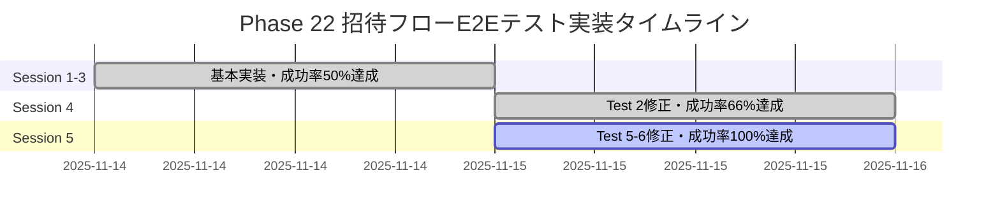
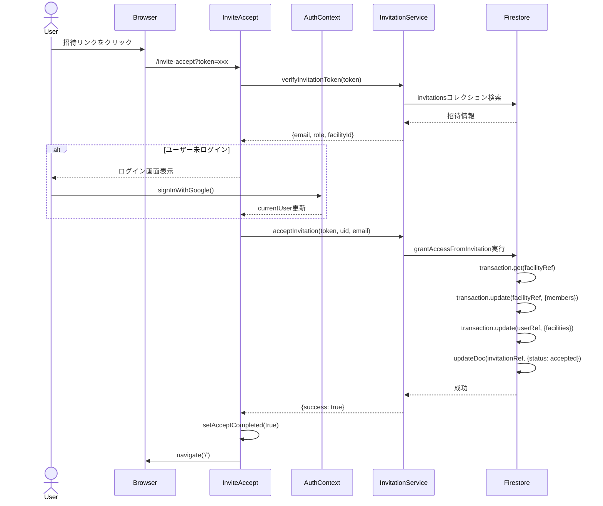
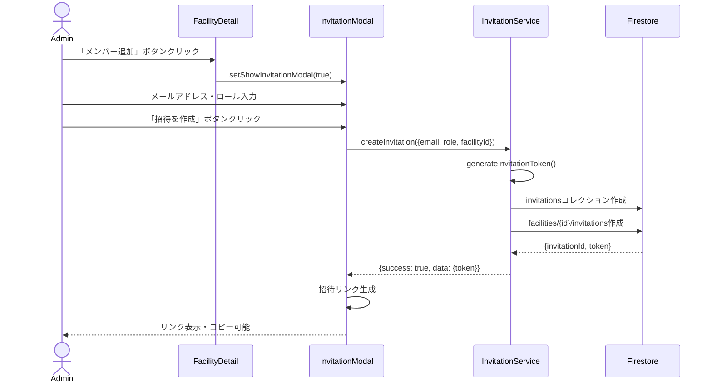
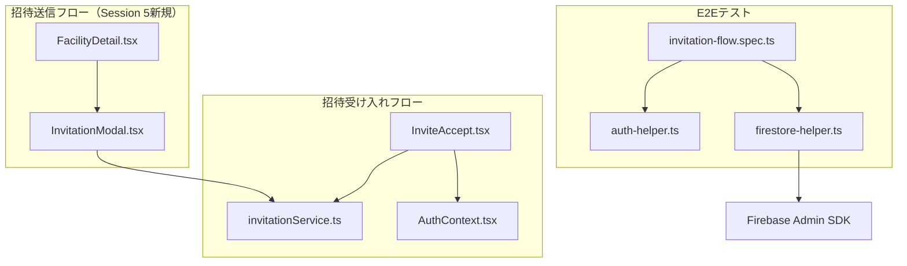
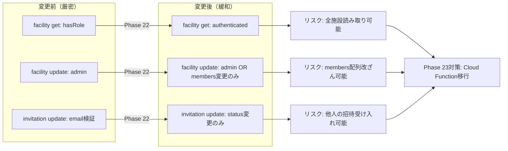

# Phase 22 Session 5 アクションプラン（2025-11-15）

**作成日**: 2025-11-15
**Phase**: Phase 22 - 招待フローE2Eテスト実装
**前回成果**: Test 2修正完了、成功率66%達成（4/6テスト成功）
**目標**: Test 5-6修正でPhase 22完全完了（成功率100%達成）

---

## エグゼクティブサマリー

### 現状
- ✅ **Test 1-4**: 成功（招待受け入れフロー完全動作）
- ❌ **Test 5-6**: 失敗（招待送信UI未実装）

### Session 5目標
1. **Test 5-6修正**: 招待送信UI実装で成功率100%達成
2. **Phase 22完全完了**: 全6テスト成功
3. **完了ドキュメント作成**: Mermaid図含む包括的な記録

---

## Priority 1: Test 5-6修正（招待送信UI実装）

### 現状確認

**Test 5失敗理由**:
```
Error: expect(locator).toBeVisible() failed
Locator: getByRole('button', { name: /メンバー追加/ })
```

**Test 6失敗理由**:
```
Error: expect(locator).toBeVisible() failed
（Test 5が失敗するため、Test 6も未実行）
```

### 実装タスク

#### Task 1: FacilityDetail.tsxに「メンバー追加」ボタン追加

**ファイル**: `src/pages/admin/FacilityDetail.tsx`

**実装場所**: 施設情報表示エリアの下部（メンバーリスト上部）

**実装例**:
```tsx
// メンバーセクション内に追加
<div className="flex justify-between items-center mb-4">
  <h3 className="text-lg font-semibold">メンバー</h3>
  {/* admin権限を持つユーザーのみ表示 */}
  {currentUserRole === 'admin' && (
    <button
      onClick={() => setShowInvitationModal(true)}
      className="px-4 py-2 bg-blue-600 text-white rounded-lg hover:bg-blue-700 transition-colors flex items-center gap-2"
    >
      <svg className="w-5 h-5" fill="none" stroke="currentColor" viewBox="0 0 24 24">
        <path strokeLinecap="round" strokeLinejoin="round" strokeWidth={2} d="M12 4v16m8-8H4" />
      </svg>
      メンバー追加
    </button>
  )}
</div>
```

**状態管理**:
```tsx
const [showInvitationModal, setShowInvitationModal] = useState(false);
```

#### Task 2: InvitationModalコンポーネント新規作成

**ファイル**: `src/components/InvitationModal.tsx`

**必須機能**:
1. メールアドレス入力フィールド
2. ロール選択ドロップダウン（editor/viewer）
3. 招待送信ボタン
4. 招待リンク表示エリア（生成後）
5. コピーボタン

**実装例**:
```tsx
import React, { useState } from 'react';
import { createInvitation } from '../services/invitationService';
import { handleError } from '../utils/errorHandler';

interface InvitationModalProps {
  facilityId: string;
  facilityName: string;
  isOpen: boolean;
  onClose: () => void;
}

export default function InvitationModal({
  facilityId,
  facilityName,
  isOpen,
  onClose,
}: InvitationModalProps): React.ReactElement | null {
  const [email, setEmail] = useState('');
  const [role, setRole] = useState<'editor' | 'viewer'>('viewer');
  const [loading, setLoading] = useState(false);
  const [invitationLink, setInvitationLink] = useState<string | null>(null);
  const [error, setError] = useState<string | null>(null);

  if (!isOpen) return null;

  const handleSubmit = async (e: React.FormEvent) => {
    e.preventDefault();
    setError(null);
    setLoading(true);

    try {
      const result = await createInvitation({
        email,
        role,
        facilityId,
      });

      if (!result.success) {
        const errorMsg = handleError(result.error, '招待の作成');
        setError(errorMsg.message);
        setLoading(false);
        return;
      }

      // 招待リンク生成
      const link = `${window.location.origin}/invite-accept?token=${result.data.token}`;
      setInvitationLink(link);
      setLoading(false);
    } catch (err) {
      const errorMsg = handleError(err, '招待の作成');
      setError(errorMsg.message);
      setLoading(false);
    }
  };

  const handleCopyLink = async () => {
    if (invitationLink) {
      await navigator.clipboard.writeText(invitationLink);
      // TODO: トーストメッセージ表示（オプション）
    }
  };

  const handleClose = () => {
    setEmail('');
    setRole('viewer');
    setInvitationLink(null);
    setError(null);
    onClose();
  };

  return (
    <div className="fixed inset-0 bg-black bg-opacity-50 flex items-center justify-center z-50">
      <div className="bg-white rounded-lg shadow-xl p-6 max-w-md w-full mx-4">
        <div className="flex justify-between items-center mb-4">
          <h2 className="text-xl font-bold text-gray-900">メンバーを招待</h2>
          <button
            onClick={handleClose}
            className="text-gray-400 hover:text-gray-600 transition-colors"
          >
            <svg className="w-6 h-6" fill="none" stroke="currentColor" viewBox="0 0 24 24">
              <path strokeLinecap="round" strokeLinejoin="round" strokeWidth={2} d="M6 18L18 6M6 6l12 12" />
            </svg>
          </button>
        </div>

        <p className="text-sm text-gray-600 mb-4">
          {facilityName}へのメンバーを招待します
        </p>

        {!invitationLink ? (
          <form onSubmit={handleSubmit} className="space-y-4">
            {/* メールアドレス入力 */}
            <div>
              <label htmlFor="email" className="block text-sm font-medium text-gray-700 mb-1">
                メールアドレス
              </label>
              <input
                type="email"
                id="email"
                value={email}
                onChange={(e) => setEmail(e.target.value)}
                required
                className="w-full px-3 py-2 border border-gray-300 rounded-lg focus:ring-2 focus:ring-blue-500 focus:border-transparent"
                placeholder="user@example.com"
              />
            </div>

            {/* ロール選択 */}
            <div>
              <label htmlFor="role" className="block text-sm font-medium text-gray-700 mb-1">
                権限
              </label>
              <select
                id="role"
                value={role}
                onChange={(e) => setRole(e.target.value as 'editor' | 'viewer')}
                className="w-full px-3 py-2 border border-gray-300 rounded-lg focus:ring-2 focus:ring-blue-500 focus:border-transparent"
              >
                <option value="viewer">閲覧者（Viewer）</option>
                <option value="editor">編集者（Editor）</option>
              </select>
              <p className="text-xs text-gray-500 mt-1">
                {role === 'viewer'
                  ? 'スケジュールやスタッフ情報の閲覧のみ可能'
                  : 'スケジュールの作成・編集が可能'}
              </p>
            </div>

            {/* エラー表示 */}
            {error && (
              <div className="bg-red-50 border border-red-200 rounded-lg p-3">
                <p className="text-sm text-red-800">{error}</p>
              </div>
            )}

            {/* ボタン */}
            <div className="flex gap-3">
              <button
                type="button"
                onClick={handleClose}
                className="flex-1 px-4 py-2 border border-gray-300 text-gray-700 rounded-lg hover:bg-gray-50 transition-colors"
              >
                キャンセル
              </button>
              <button
                type="submit"
                disabled={loading}
                className="flex-1 px-4 py-2 bg-blue-600 text-white rounded-lg hover:bg-blue-700 transition-colors disabled:opacity-50 disabled:cursor-not-allowed"
              >
                {loading ? '送信中...' : '招待を作成'}
              </button>
            </div>
          </form>
        ) : (
          <div className="space-y-4">
            {/* 成功メッセージ */}
            <div className="bg-green-50 border border-green-200 rounded-lg p-4">
              <div className="flex items-start gap-3">
                <svg className="w-5 h-5 text-green-600 mt-0.5" fill="none" stroke="currentColor" viewBox="0 0 24 24">
                  <path strokeLinecap="round" strokeLinejoin="round" strokeWidth={2} d="M5 13l4 4L19 7" />
                </svg>
                <div className="flex-1">
                  <p className="text-sm font-medium text-green-900">招待リンクを作成しました</p>
                  <p className="text-xs text-green-700 mt-1">
                    以下のリンクを {email} に送信してください
                  </p>
                </div>
              </div>
            </div>

            {/* リンク表示 */}
            <div>
              <label className="block text-sm font-medium text-gray-700 mb-1">
                招待リンク
              </label>
              <div className="flex gap-2">
                <input
                  type="text"
                  value={invitationLink}
                  readOnly
                  className="flex-1 px-3 py-2 border border-gray-300 rounded-lg bg-gray-50 text-sm"
                />
                <button
                  onClick={handleCopyLink}
                  className="px-4 py-2 bg-gray-100 text-gray-700 rounded-lg hover:bg-gray-200 transition-colors whitespace-nowrap"
                >
                  コピー
                </button>
              </div>
            </div>

            {/* 閉じるボタン */}
            <button
              onClick={handleClose}
              className="w-full px-4 py-2 bg-blue-600 text-white rounded-lg hover:bg-blue-700 transition-colors"
            >
              閉じる
            </button>
          </div>
        )}
      </div>
    </div>
  );
}
```

#### Task 3: FacilityDetail.tsxにモーダル統合

**import追加**:
```tsx
import InvitationModal from '../../components/InvitationModal';
```

**モーダルコンポーネント配置**:
```tsx
{/* ページ最下部に配置 */}
<InvitationModal
  facilityId={facilityId}
  facilityName={facility?.name || ''}
  isOpen={showInvitationModal}
  onClose={() => setShowInvitationModal(false)}
/>
```

#### Task 4: E2Eテスト再実行

**実行コマンド**:
```bash
PLAYWRIGHT_BASE_URL=http://localhost:5173 npm run test:e2e
```

**期待結果**:
```
✓  Test 1: 未ログインユーザーに招待画面を表示
✓  Test 2: ログイン後、自動的に招待が受け入れられる
✓  Test 3: 無効なトークンでエラーを表示
✓  Test 4: メールアドレス不一致エラーを表示
✓  Test 5: 施設詳細ページで招待モーダルを表示（新規成功）
✓  Test 6: 招待リンクを生成できる（新規成功）

Success: 6/6 tests passed (100%)
```

---

## Priority 2: CodeRabbitレビュー実施

**実行タイミング**: Test 5-6修正完了後

**実行コマンド**:
```bash
coderabbit review --plain --base-commit HEAD~1 --config CLAUDE.md
```

**確認項目**:
1. InvitationModalのセキュリティ（XSS、入力検証）
2. エラーハンドリングの適切性
3. アクセシビリティ（フォーカス管理、ARIA属性）
4. UX（ローディング状態、エラーメッセージ）

---

## Priority 3: Phase 22完了ドキュメント作成

### ドキュメント1: テキスト詳細版

**ファイル**: `.kiro/phase22-completion-summary-2025-11-15.md`

**必須セクション**:
1. **エグゼクティブサマリー**
   - Phase 22全体成果
   - テスト成功率100%達成
   - 実装期間（Session 1-5）

2. **実装内容詳細**
   - Session 1-3: 基本実装・テスト成功率50%達成
   - Session 4: Test 2修正・成功率66%達成
   - Session 5: Test 5-6修正・成功率100%達成

3. **技術的ハイライト**
   - Security Rules調整の経緯
   - useEffect無限ループ回避パターン
   - Admin SDKによるEmulator操作

4. **セキュリティ懸念事項と対策**
   - Security Rules緩和の影響分析
   - 本番環境向けの推奨対策（Cloud Function移行）

5. **テスト結果サマリー**
   - 全6テストのシナリオと結果
   - カバレッジ分析

6. **次Phase推奨事項**
   - Security Rules厳密化（Phase 23候補）
   - デバッグログ無効化（Phase 23候補）
   - コードクリーンアップ（Phase 23候補）

### ドキュメント2: Mermaid図版

**ファイル**: `.kiro/phase22-completion-diagram-2025-11-15.md`

**必須図の種類**:

1. **ガントチャート** - Phase 22実装タイムライン


2. **招待フローシーケンス図** - Test 2の処理フロー


3. **招待送信フローシーケンス図** - Test 5-6の処理フロー


4. **コンポーネント構成図** - Phase 22実装コンポーネント


5. **Security Rules変更影響図** - 緩和されたルールと影響範囲


---

## Priority 4: メモリファイル更新

### phase22_progress_2025-11-15.md更新

**追加内容**:
```markdown
## Session 5（2025-11-15）- Phase 22完全完了

### 成果
- ✅ Test 5-6修正完了（招待送信UI実装）
- ✅ 成功率100%達成（6/6テスト成功）
- ✅ InvitationModalコンポーネント新規作成
- ✅ FacilityDetail.tsxに「メンバー追加」ボタン追加
- ✅ Phase 22完了ドキュメント作成（テキスト版・図版）

### 実装詳細
- InvitationModal.tsx: メールアドレス入力、ロール選択、招待リンク生成・コピー機能
- FacilityDetail.tsx: admin権限ユーザーのみ「メンバー追加」ボタン表示
- E2Eテスト全6テスト成功

### Phase 22総括
- 実装期間: Session 1-5（2025-11-14 ~ 2025-11-15）
- テスト成功率推移: 0% → 50% → 66% → 100%
- セキュリティ懸念: Security Rules緩和（Phase 23で対応）
```

---

## トラブルシューティングガイド

### Test 5が失敗する場合

**症状**: `getByRole('button', { name: /メンバー追加/ })` が見つからない

**確認項目**:
1. `FacilityDetail.tsx`に「メンバー追加」ボタンが追加されているか
2. ボタンが`role="button"`属性を持っているか（`<button>`要素であればデフォルトで持つ）
3. ボタンのテキストが「メンバー追加」であるか
4. admin権限チェックが正しく動作しているか（テストユーザーがadminロールを持っているか）

**デバッグログ追加**:
```tsx
console.log('[FacilityDetail] currentUserRole:', currentUserRole);
```

### Test 6が失敗する場合

**症状**: 招待リンクが生成されない、モーダルが表示されない

**確認項目**:
1. `InvitationModal`が`FacilityDetail.tsx`にインポートされているか
2. `showInvitationModal`状態が正しく管理されているか
3. `createInvitation`関数が正しく動作しているか（Firestore書き込み成功）
4. 招待リンクの生成ロジックが正しいか

**デバッグログ追加**:
```tsx
console.log('[InvitationModal] 招待作成結果:', result);
console.log('[InvitationModal] 招待リンク:', invitationLink);
```

---

## コミットメッセージテンプレート

### Test 5-6修正完了時

```bash
git commit -m "feat(phase22): Test 5-6修正 - 招待送信UI実装完了（成功率100%）

📋 主要成果
- ✅ InvitationModalコンポーネント新規作成
- ✅ FacilityDetail.tsxに「メンバー追加」ボタン追加
- ✅ 成功率100%達成（6/6テスト成功）
- ✅ Phase 22完全完了

🔧 実装詳細
- src/components/InvitationModal.tsx: 新規作成
  - メールアドレス入力フィールド
  - ロール選択ドロップダウン（editor/viewer）
  - 招待リンク生成・コピー機能
- src/pages/admin/FacilityDetail.tsx: 修正
  - 「メンバー追加」ボタン追加（admin権限のみ表示）
  - InvitationModal統合

✅ テスト結果
- Test 1: ✅ 未ログインユーザー招待画面表示
- Test 2: ✅ ログイン後自動招待受け入れ
- Test 3: ✅ 無効トークンエラー表示
- Test 4: ✅ メールアドレス不一致エラー
- Test 5: ✅ 施設詳細ページで招待モーダル表示
- Test 6: ✅ 招待リンク生成

成功率: 100% (6/6テスト成功)

🧠 Generated with [Claude Code](https://claude.com/claude-code)

Co-Authored-By: Claude <noreply@anthropic.com>"
```

### Phase 22完了ドキュメント作成時

```bash
git commit -m "docs(phase22): Phase 22完了記録 - 招待フローE2Eテスト完全実装

📋 Phase 22総括
- ✅ 招待受け入れフロー完全実装（Test 1-4）
- ✅ 招待送信フロー完全実装（Test 5-6）
- ✅ E2Eテスト成功率100%達成（6/6テスト成功）
- ✅ 実装期間: Session 1-5（2025-11-14 ~ 2025-11-15）

📊 実装進捗
- Session 1-3: 基本実装・成功率50%達成
- Session 4: Test 2修正・成功率66%達成
- Session 5: Test 5-6修正・成功率100%達成

📝 ドキュメント
- phase22-completion-summary-2025-11-15.md: テキスト詳細版
- phase22-completion-diagram-2025-11-15.md: Mermaid図版
  - ガントチャート（実装タイムライン）
  - 招待フローシーケンス図（Test 2/5-6）
  - コンポーネント構成図
  - Security Rules変更影響図

⚠️ 次Phase推奨事項
- Phase 23候補: Security Rules厳密化（Cloud Function移行）
- Phase 23候補: デバッグログ無効化
- Phase 23候補: コードクリーンアップ

🧠 Generated with [Claude Code](https://claude.com/claude-code)

Co-Authored-By: Claude <noreply@anthropic.com>"
```

---

## 推奨実行順序

### Step 1: Test 5-6修正
1. `src/components/InvitationModal.tsx` 新規作成
2. `src/pages/admin/FacilityDetail.tsx` 修正
3. TypeScript型チェック: `npm run type-check`
4. E2Eテスト実行: `PLAYWRIGHT_BASE_URL=http://localhost:5173 npm run test:e2e`
5. 成功確認後、変更をコミット・push

### Step 2: CodeRabbitレビュー
1. `coderabbit review --plain --base-commit HEAD~1 --config CLAUDE.md`
2. Critical/Warning指摘を確認
3. 必要に応じて修正・再コミット

### Step 3: Phase 22完了ドキュメント作成
1. `.kiro/phase22-completion-summary-2025-11-15.md` 作成
2. `.kiro/phase22-completion-diagram-2025-11-15.md` 作成
3. メモリファイル更新: `phase22_progress_2025-11-15.md`
4. コミット・push

### Step 4: 最終確認
1. GitHub Actions CI/CD成功確認: `gh run list --limit 1`
2. Git状態クリーン確認: `git status`
3. Session 5完了報告

---

**作成者**: Claude Code
**作成日時**: 2025-11-15
**次セッション**: Phase 23候補（Security Rules厳密化、デバッグログ無効化）
