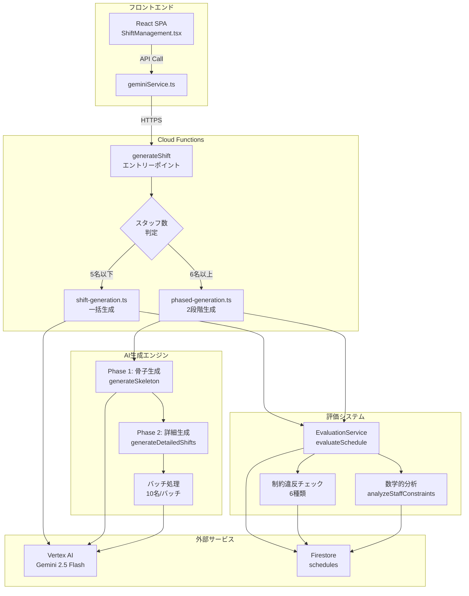
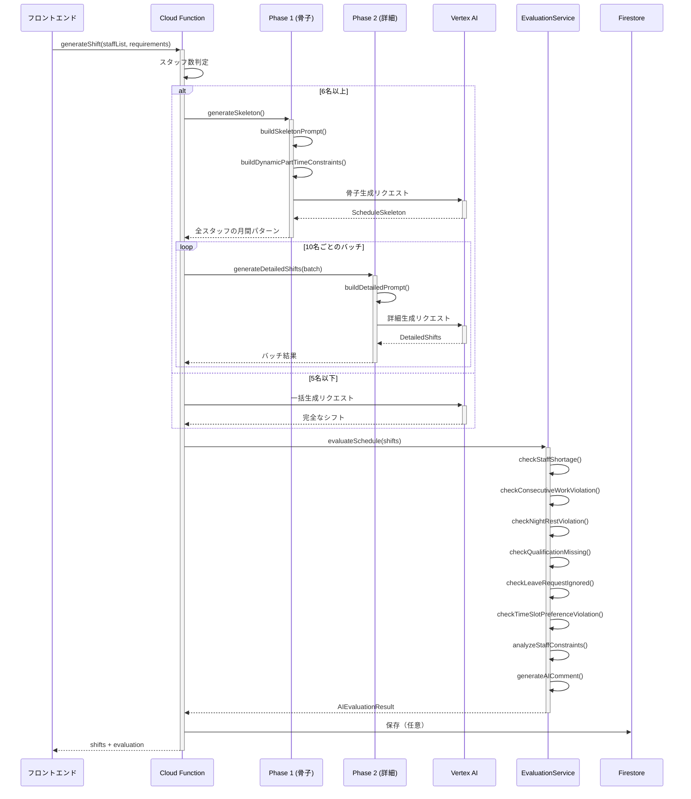
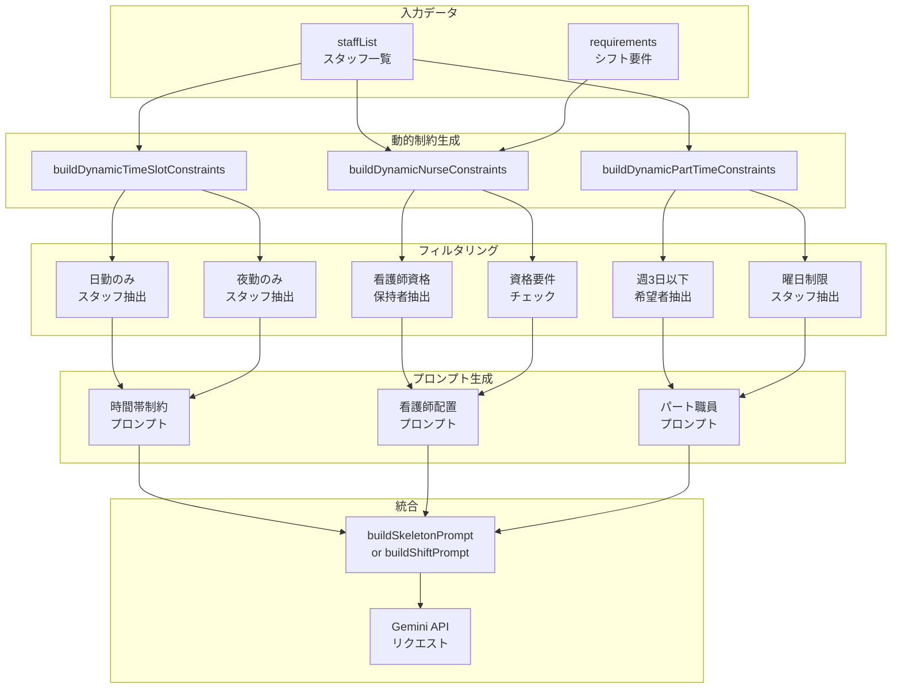
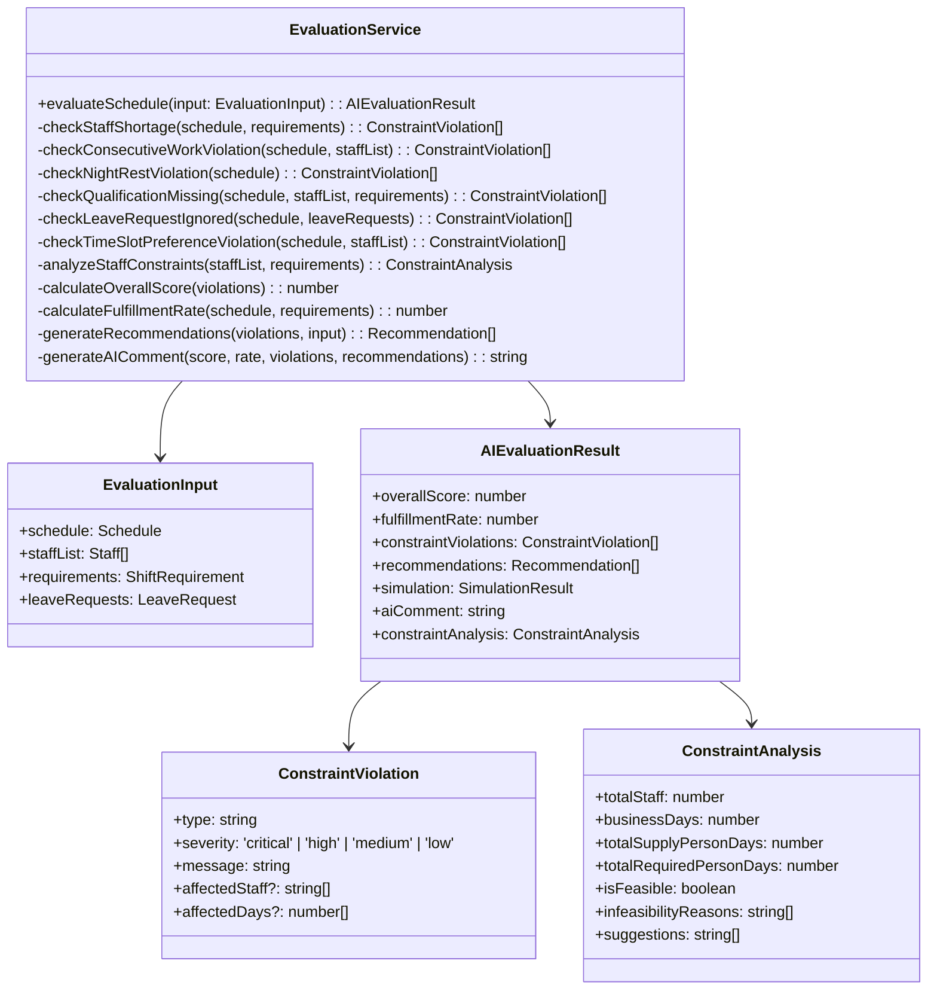
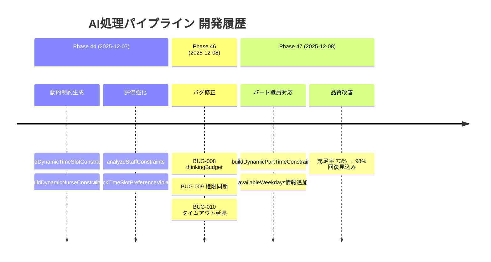
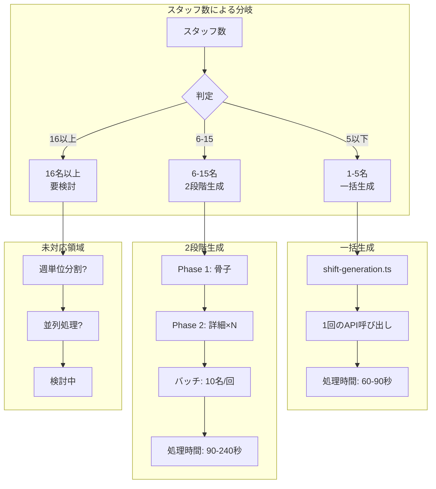
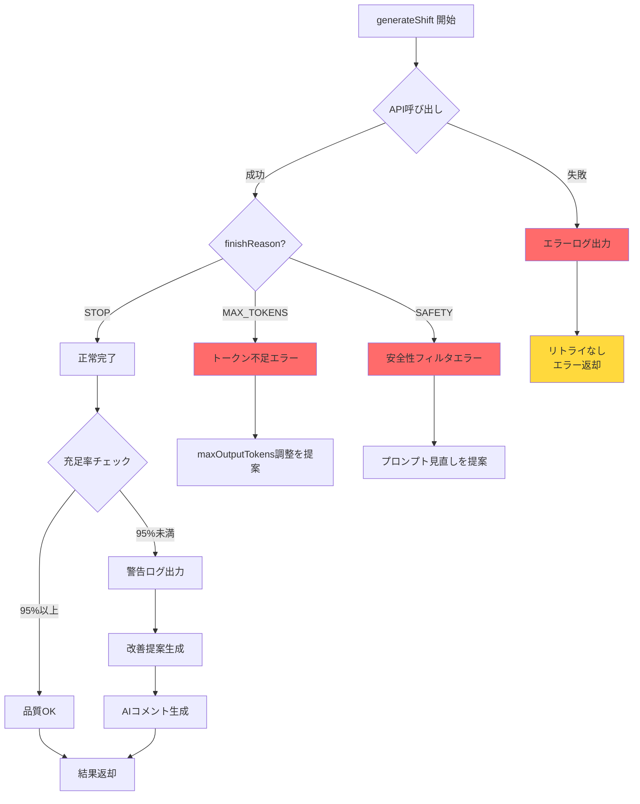
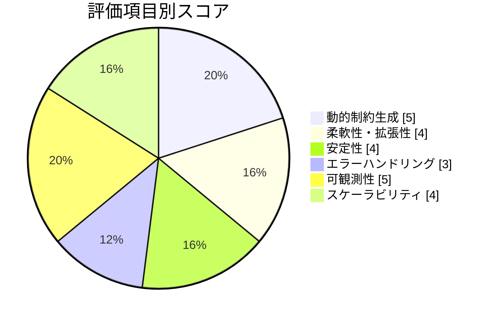

# AI処理パイプライン アーキテクチャ図

**作成日**: 2025-12-08
**関連ドキュメント**: [ai-production-quality-review-2025-12-08.md](./ai-production-quality-review-2025-12-08.md)

---

## 1. 全体アーキテクチャ

---

## 2. 2段階生成パイプライン詳細

---

## 3. 動的制約生成フロー

---

## 4. 評価システムの構成

---

## 5. タイムライン（開発履歴）

---

## 6. スケーラビリティ対応

---

## 7. エラーハンドリングフロー

---

## 8. 品質評価サマリー

---

**作成者**: Claude Opus 4.5
**最終更新**: 2025-12-08
