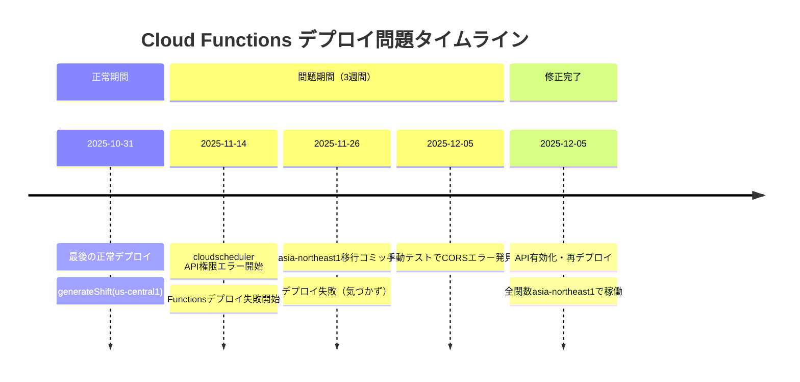
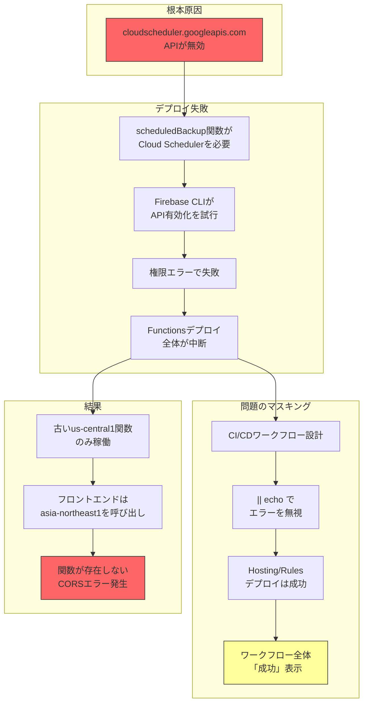
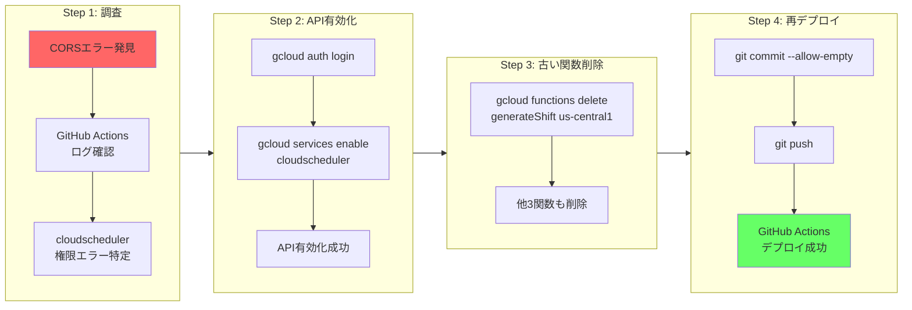
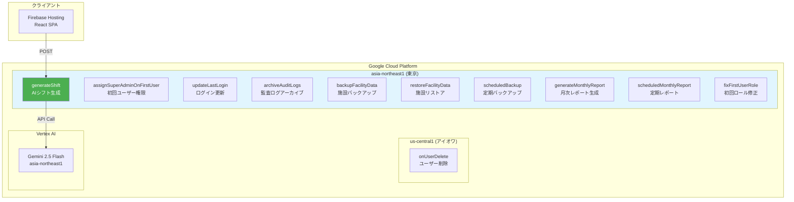
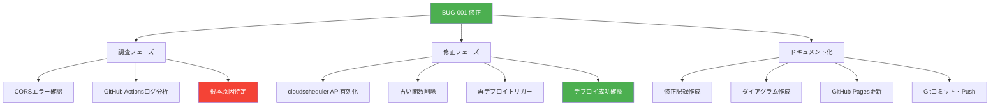
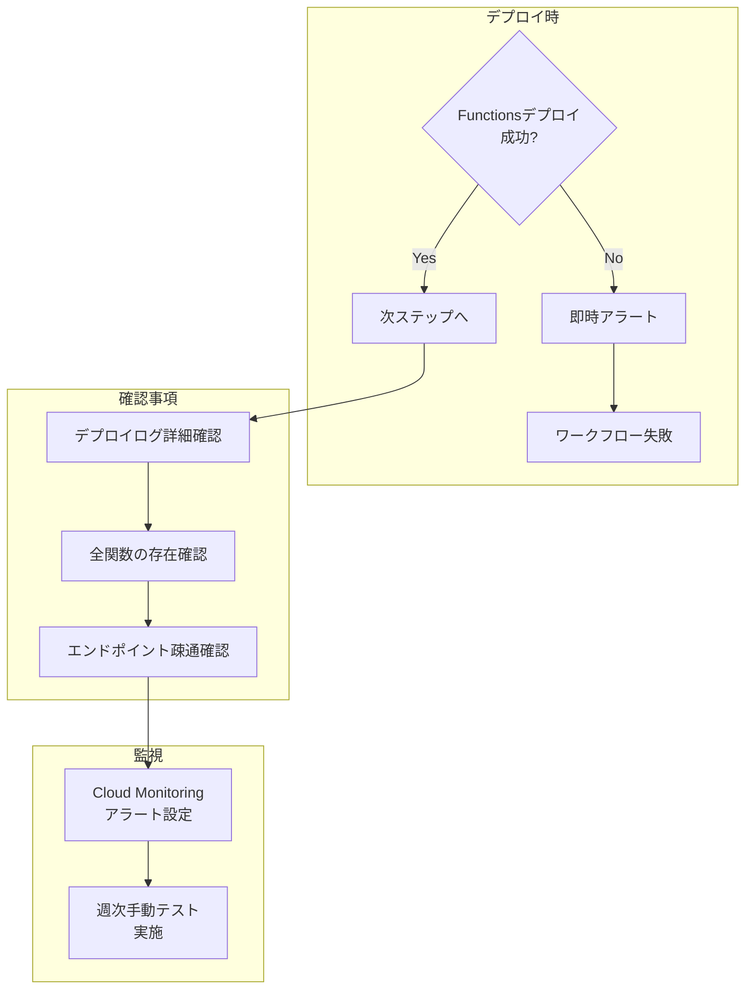

# BUG-001: CORSエラー修正 - ダイアグラム集

**更新日**: 2025-12-05

---

## 1. 問題発生タイムライン

## 2. 問題の因果関係図

## 3. 修正作業フロー

## 4. Cloud Functions リージョン構成（修正後）

## 5. WBS（作業分解図）

## 6. ガントチャート

```mermaid
gantt
    title BUG-001 修正作業タイムライン
    dateFormat HH:mm
    axisFormat %H:%M

    section 調査
    CORSエラー発見           :done, a1, 00:00, 10min
    既存ドキュメント確認     :done, a2, after a1, 15min
    GitHub Actionsログ分析   :done, a3, after a2, 20min
    根本原因特定             :done, a4, after a3, 10min

    section 修正
    gcloud認証               :done, b1, after a4, 5min
    cloudscheduler API有効化 :done, b2, after b1, 2min
    古い関数削除             :done, b3, after b2, 5min
    再デプロイトリガー       :done, b4, after b3, 2min
    デプロイ完了待ち         :done, b5, after b4, 5min

    section ドキュメント化
    修正記録作成             :active, c1, after b5, 15min
    ダイアグラム作成         :active, c2, after c1, 20min
    GitHub Pages更新         :c3, after c2, 15min
    Gitコミット・Push        :c4, after c3, 5min
```

## 7. 再発防止チェックリスト

---

## 関連ドキュメント

- [修正記録（詳細）](bugfix-cors-cloud-functions-2025-12-05.md)
- [手動テストチェックリスト](../docs/manual-test-checklist.md)
