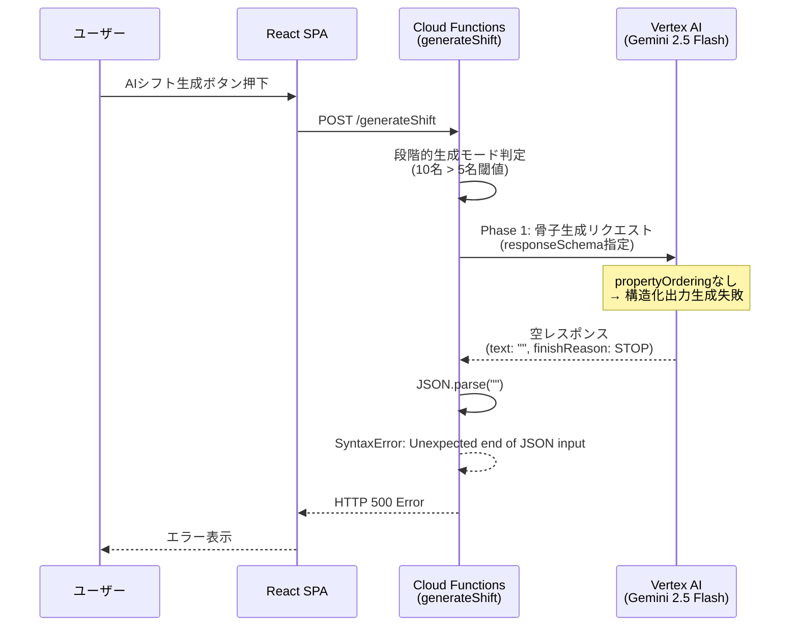
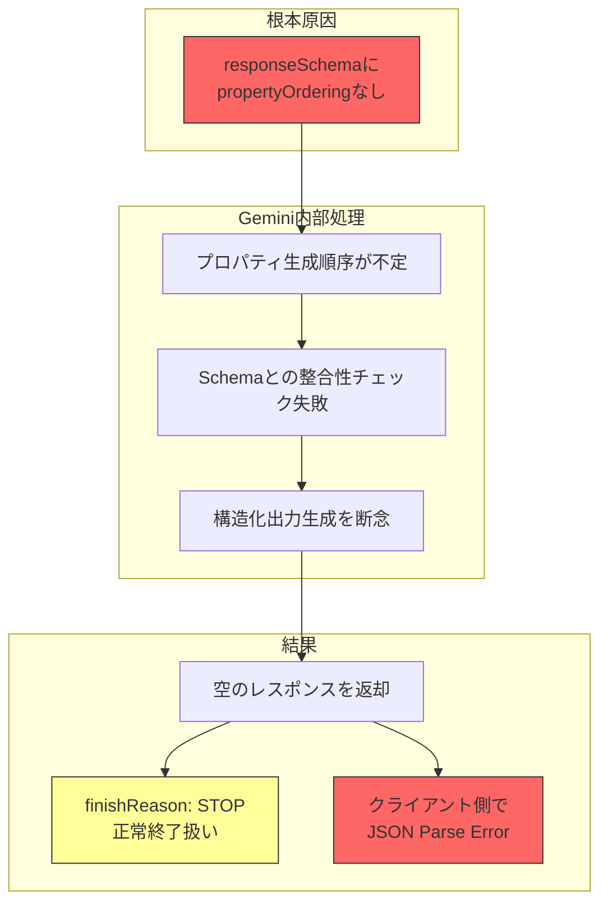
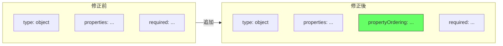
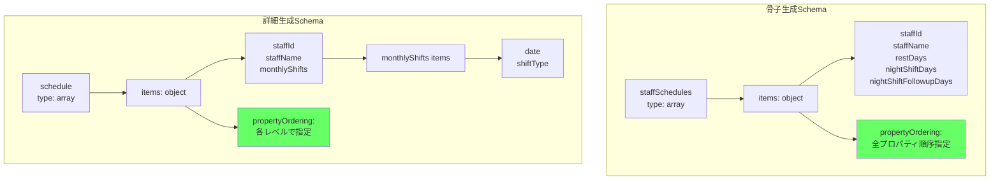
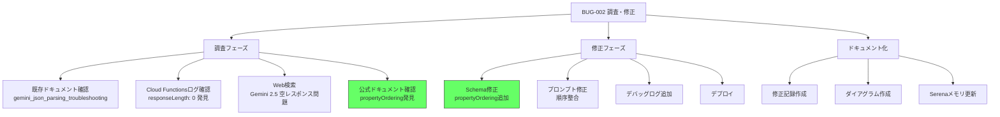
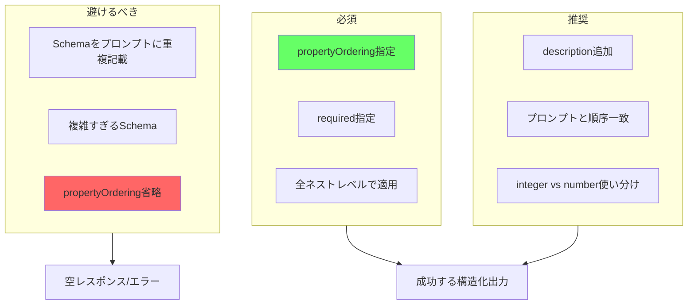

# BUG-002: Gemini空レスポンス修正 - ダイアグラム集

**更新日**: 2025-12-05

---

## 1. 問題発生フロー



## 2. 根本原因の因果関係図



## 3. 修正内容



## 4. Schema構造（修正後）



## 5. 調査プロセス（WBS）



## 6. BUG-001 → BUG-002 の関連

```mermaid
timeline
    title バグ発見・修正タイムライン（2025-12-05）

    section BUG-001
        07:00 : MT-001実行開始
              : CORSエラー発見
        07:05 : cloudscheduler API有効化
        07:10 : 古い関数削除・再デプロイ
        07:15 : CORS修正完了

    section BUG-002
        07:09 : AIシフト生成テスト
              : JSON Parse Error発見
        07:30 : Cloud Functionsログ確認
              : responseLength: 0 発見
        08:00 : Web検索・原因特定
              : propertyOrdering欠如
        08:30 : 修正実装・デプロイ
```

## 7. Gemini 2.5 Structured Output ベストプラクティス



---

## 関連ドキュメント

- [修正記録（詳細）](bugfix-gemini-empty-response-2025-12-05.md)
- [BUG-001修正記録](bugfix-cors-cloud-functions-2025-12-05.md)
- [手動テストチェックリスト](../docs/manual-test-checklist.md)
