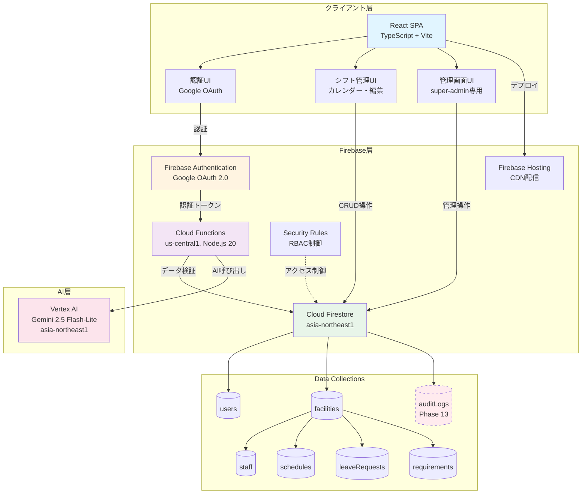
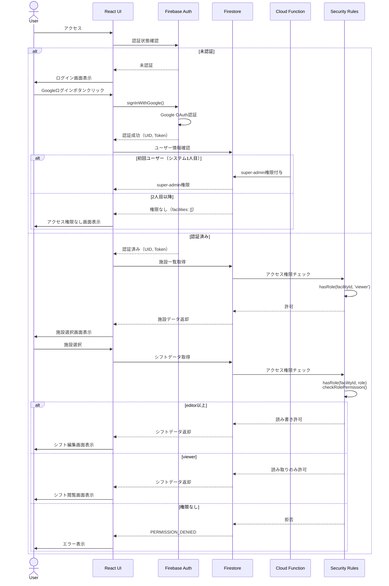
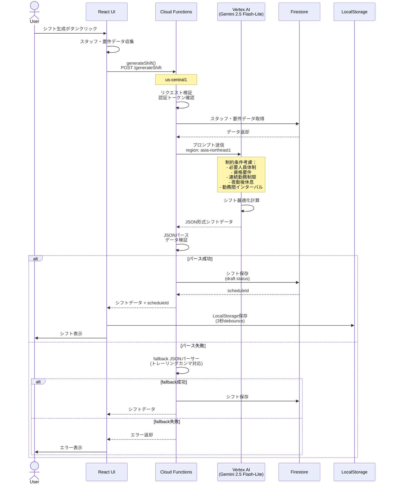
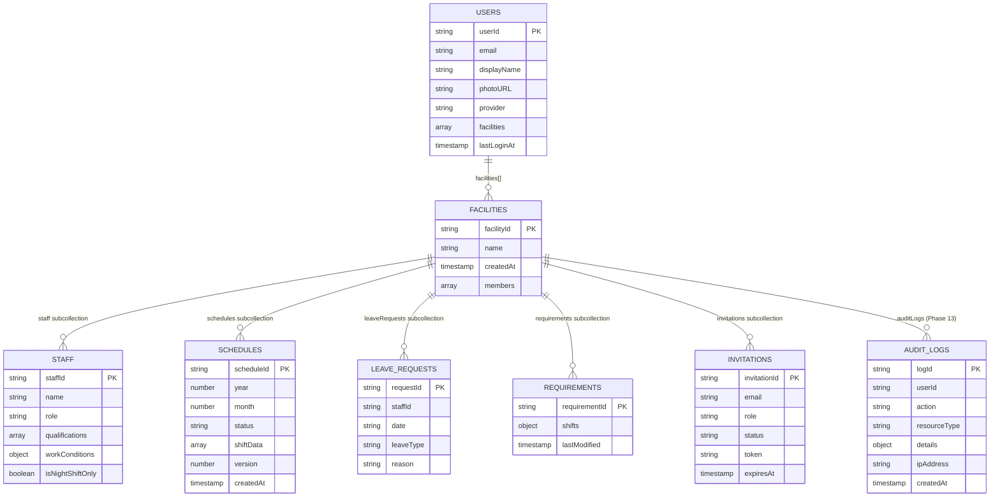
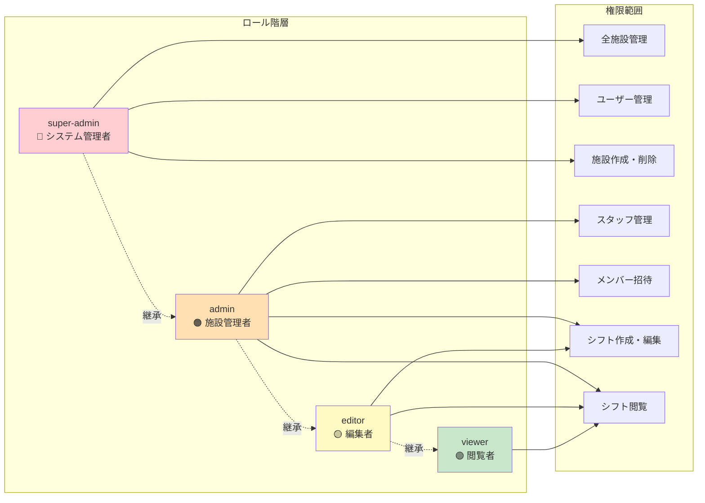
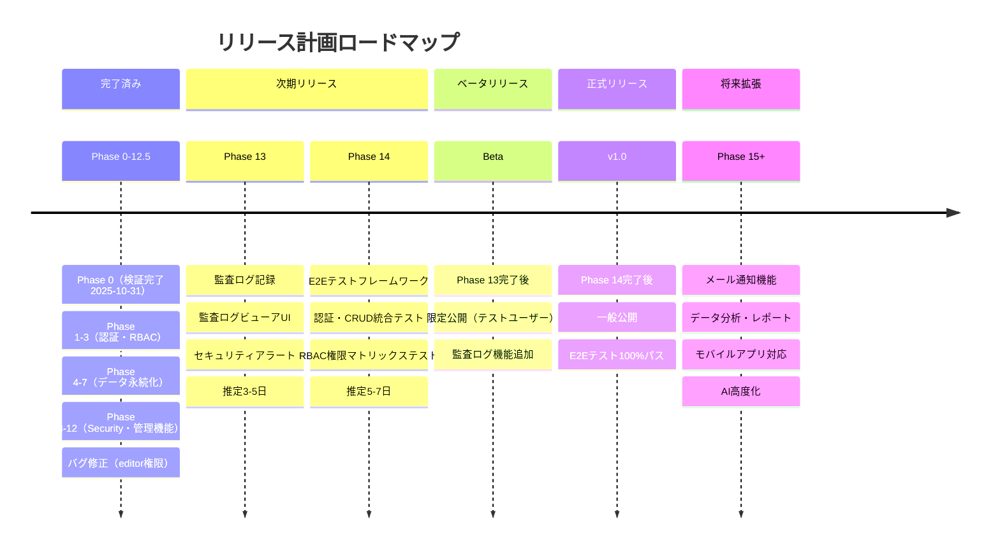
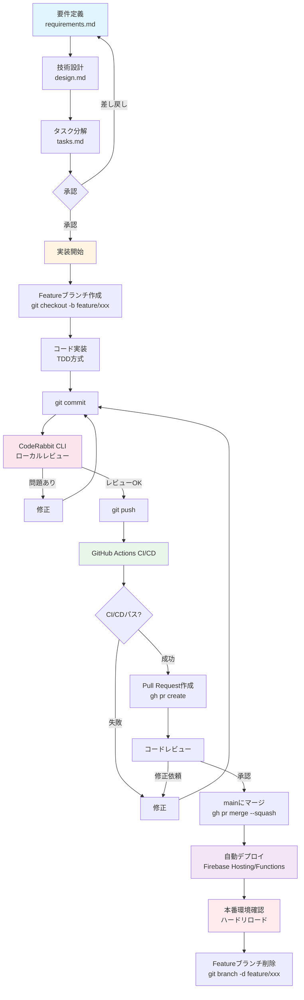
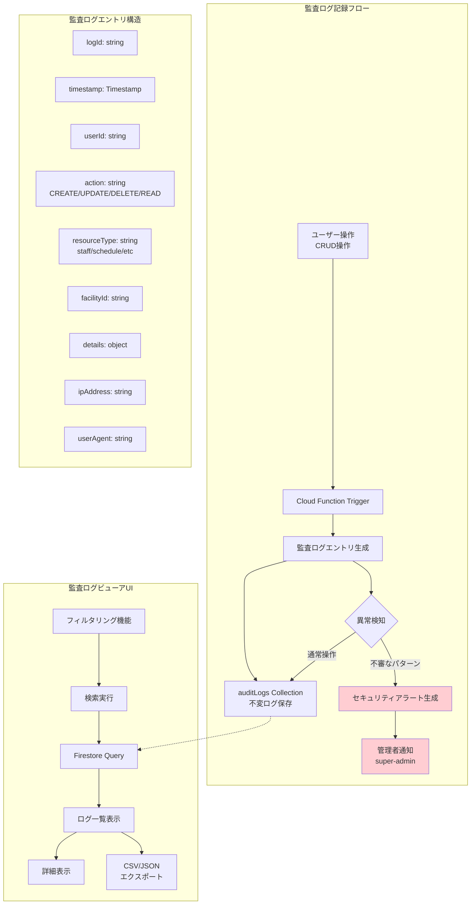
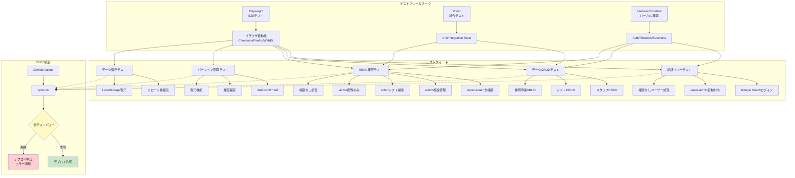
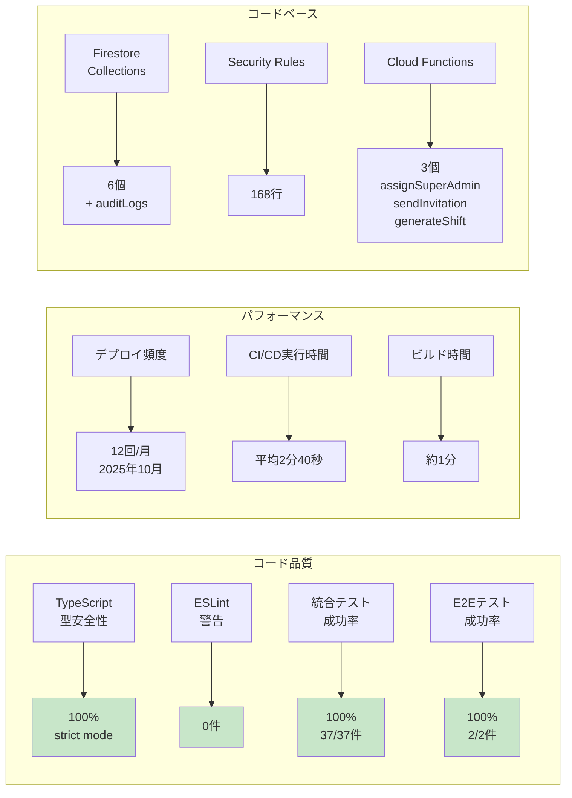

# 開発状況ダイアグラム

**更新日**: 2025年10月31日
**プロジェクト**: AIシフト自動作成システム (ai-care-shift-scheduler)

---

## 📊 Phase実装状況（ガントチャート）

```mermaid
gantt
    title Phase実装進捗状況
    dateFormat YYYY-MM-DD
    section Phase 0-6
    Phase 0: デモ環境整備           :done, p0, 2025-10-23, 2025-10-31
    Phase 1: 認証基盤               :done, p1, 2025-10-23, 2025-10-24
    Phase 2: ユーザー登録           :done, p2, 2025-10-24, 2025-10-25
    Phase 3: RBAC                   :done, p3, 2025-10-25, 2025-10-26
    Phase 4: スタッフ永続化         :done, p4, 2025-10-26, 2025-10-26
    Phase 5: シフト永続化           :done, p5, 2025-10-26, 2025-10-27
    Phase 6: バージョン管理         :done, p6, 2025-10-27, 2025-10-27

    section Phase 7-12
    Phase 7: 休暇・要件永続化       :done, p7, 2025-10-27, 2025-10-27
    Phase 8: Security Rules         :done, p8, 2025-10-27, 2025-10-27
    Phase 9: データ復元             :done, p9, 2025-10-27, 2025-10-28
    Phase 10: 管理画面              :done, p10, 2025-10-28, 2025-10-28
    Phase 11: ユーザー招待          :done, p11, 2025-10-28, 2025-10-28
    Phase 12: エラーハンドリング    :done, p12, 2025-10-28, 2025-10-28
    Phase 12.5: リファクタリング    :done, p125, 2025-10-28, 2025-10-28

    section 今後の予定
    Phase 13: 監査ログ              :active, p13, 2025-11-01, 5d
    Phase 14: E2Eテスト             :p14, after p13, 7d
    Phase 15: メール通知            :p15, after p14, 3d
    Phase 16: データ分析            :p16, after p15, 5d
```

---

## 🏗️ システムアーキテクチャ



---

## 🔐 認証・アクセス制御フロー



---

## 🤖 AIシフト生成フロー



---

## 📦 データモデル（Firestore Collections）



---

## 🎯 RBAC権限マトリックス



---

## 🚀 リリース計画タイムライン



---

## 🔄 開発ワークフロー



---

## 📊 Phase 13: 監査ログ詳細設計



---

## 📊 Phase 14: E2Eテスト構成



---

## 📈 開発メトリクス推移



---

**作成日**: 2025年10月31日
**詳細レポート**: [development-status-2025-10-31.md](./development-status-2025-10-31.md)
