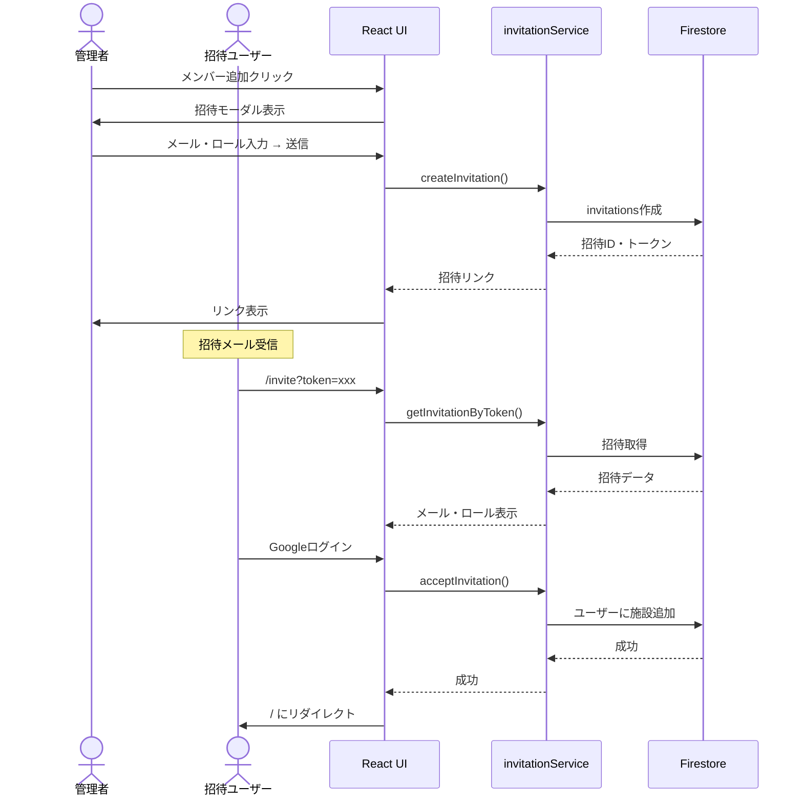
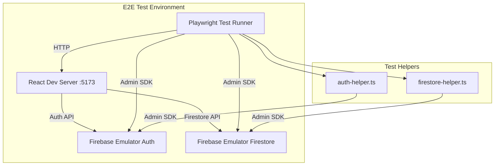

# 次セッション推奨アクションプラン（2025-11-15作成）

**作成日**: 2025-11-15
**対象**: Phase 22 招待フローE2Eテスト完全完了
**現在の進捗**: 50%（6テスト中3テスト成功）
**目標**: 100%（6テスト全成功）

---

## 📋 前提条件チェックリスト

次のセッション開始前に確認すべき事項：

- [ ] Firebase Emulator起動済み（`npm run emulators`）
- [ ] 開発サーバー起動済み（`npm run dev`）
- [ ] Git working tree clean
- [ ] `.kiro/project-status-summary-2025-11-15.md` を読んで現状把握

---

## 🎯 優先度付きタスク

### 🔴 Priority 1: Test 2修正（リダイレクト処理実装）

**目標**: ログイン後の自動招待受け入れフローを完成させる
**所要時間**: 30-45分
**成功率向上**: 50% → 66%

#### タスク詳細

##### Task 1-1: InviteAccept.tsx実装確認

```bash
# ファイル確認
cat src/pages/InviteAccept.tsx
```

**確認ポイント**:
- 招待受け入れ処理後の`navigate('/')`呼び出しがあるか
- エラーハンドリングが適切か
- ローディング状態管理が正しいか

##### Task 1-2: リダイレクト処理実装

**実装パターン例**:

```typescript
// src/pages/InviteAccept.tsx
import { useNavigate } from 'react-router-dom';

const handleAcceptInvitation = async () => {
  try {
    setLoading(true);

    // 招待受け入れ処理
    await acceptInvitation(token);

    // ✅ ホームにリダイレクト
    navigate('/');

  } catch (error) {
    console.error('Invitation acceptance failed:', error);
    setError('招待の受け入れに失敗しました');
  } finally {
    setLoading(false);
  }
};
```

**確認事項**:
- `useNavigate()` フックが正しく使用されているか
- 成功時に`navigate('/')`が呼ばれるか
- エラー時にリダイレクトされないか

##### Task 1-3: E2Eテスト再実行

```bash
# Test 2のみ実行
PLAYWRIGHT_BASE_URL=http://localhost:5173 npm run test:e2e -- e2e/invitation-flow.spec.ts:60 --reporter=list
```

**期待結果**: ✅ Test 2成功

##### Task 1-4: CodeRabbitレビュー

```bash
git add src/pages/InviteAccept.tsx
git commit -m "fix(phase22): Test 2修正 - 招待受け入れ後のリダイレクト処理実装"
coderabbit review --plain --base-commit HEAD~1 --config CLAUDE.md
```

**レビューポイント**:
- リダイレクトロジックの安全性
- エラーハンドリングの適切性
- ユーザー体験の向上

##### Task 1-5: 全テスト再実行（確認）

```bash
PLAYWRIGHT_BASE_URL=http://localhost:5173 npm run test:e2e -- e2e/invitation-flow.spec.ts --reporter=list
```

**期待結果**: 4 passed / 2 failed（Test 1-4成功、Test 5-6失敗）

---

### 🟠 Priority 2: Test 5-6修正（招待送信UI実装）

**目標**: 管理者による招待送信機能を完成させる
**所要時間**: 60-90分
**成功率向上**: 66% → 100%

#### タスク詳細

##### Task 2-1: FacilityDetail.tsx実装確認

```bash
# ファイル確認
cat src/pages/admin/FacilityDetail.tsx
```

**確認ポイント**:
- 「+ メンバー追加」ボタンが存在するか
- 招待モーダルコンポーネントが実装されているか
- 招待送信ロジックが存在するか

##### Task 2-2: 「メンバー追加」ボタン実装

**実装パターン例**:

```typescript
// src/pages/admin/FacilityDetail.tsx
import { useState } from 'react';

function FacilityDetail() {
  const [isInviteModalOpen, setIsInviteModalOpen] = useState(false);

  return (
    <div>
      {/* 既存のコンテンツ */}

      {/* メンバー追加ボタン */}
      <button
        onClick={() => setIsInviteModalOpen(true)}
        className="btn btn-primary"
        role="button"
        aria-label="メンバー追加"
      >
        + メンバー追加
      </button>

      {/* 招待モーダル */}
      {isInviteModalOpen && (
        <InvitationModal
          facilityId={facilityId}
          onClose={() => setIsInviteModalOpen(false)}
        />
      )}
    </div>
  );
}
```

**実装チェックリスト**:
- [ ] ボタンのaria-labelが「メンバー追加」を含む
- [ ] ボタンクリックでモーダルが開く
- [ ] モーダルが閉じられる

##### Task 2-3: InvitationModalコンポーネント作成

**新規ファイル**: `src/components/InvitationModal.tsx`

**実装パターン例**:

```typescript
import { useState } from 'react';
import { createInvitation } from '../services/invitationService';

interface InvitationModalProps {
  facilityId: string;
  onClose: () => void;
}

export function InvitationModal({ facilityId, onClose }: InvitationModalProps) {
  const [email, setEmail] = useState('');
  const [role, setRole] = useState<'admin' | 'editor' | 'viewer'>('editor');
  const [invitationLink, setInvitationLink] = useState('');
  const [loading, setLoading] = useState(false);

  const handleSendInvitation = async () => {
    try {
      setLoading(true);
      const result = await createInvitation({
        email,
        role,
        facilityId,
      });

      // 招待リンク生成
      const link = `${window.location.origin}/invite?token=${result.token}`;
      setInvitationLink(link);

    } catch (error) {
      console.error('Failed to send invitation:', error);
    } finally {
      setLoading(false);
    }
  };

  return (
    <div className="modal" role="dialog" aria-label="招待モーダル">
      <div className="modal-content">
        <h2>メンバーを招待</h2>

        {/* メールアドレス入力 */}
        <input
          type="email"
          placeholder="メールアドレス"
          value={email}
          onChange={(e) => setEmail(e.target.value)}
          aria-label="招待するメールアドレス"
        />

        {/* ロール選択 */}
        <select
          value={role}
          onChange={(e) => setRole(e.target.value as any)}
          aria-label="ロール"
        >
          <option value="viewer">閲覧者</option>
          <option value="editor">編集者</option>
          <option value="admin">管理者</option>
        </select>

        {/* 送信ボタン */}
        <button
          onClick={handleSendInvitation}
          disabled={loading || !email}
        >
          招待を送信
        </button>

        {/* 招待リンク表示 */}
        {invitationLink && (
          <div>
            <p>招待リンク:</p>
            <input
              type="text"
              value={invitationLink}
              readOnly
              aria-label="招待リンク"
            />
          </div>
        )}

        {/* 閉じるボタン */}
        <button onClick={onClose}>閉じる</button>
      </div>
    </div>
  );
}
```

**実装チェックリスト**:
- [ ] メールアドレス入力フィールド
- [ ] ロール選択ドロップダウン
- [ ] 招待送信ボタン
- [ ] 招待リンク表示エリア
- [ ] 閉じるボタン

##### Task 2-4: E2Eテスト再実行（Test 5-6）

```bash
# Test 5のみ実行
PLAYWRIGHT_BASE_URL=http://localhost:5173 npm run test:e2e -- e2e/invitation-flow.spec.ts:226 --reporter=list

# Test 6のみ実行
PLAYWRIGHT_BASE_URL=http://localhost:5173 npm run test:e2e -- e2e/invitation-flow.spec.ts:291 --reporter=list
```

**期待結果**: ✅ Test 5, 6成功

##### Task 2-5: CodeRabbitレビュー

```bash
git add src/pages/admin/FacilityDetail.tsx src/components/InvitationModal.tsx
git commit -m "feat(phase22): Test 5-6修正 - 招待送信UI実装"
coderabbit review --plain --base-commit HEAD~1 --config CLAUDE.md
```

##### Task 2-6: 全テスト再実行（最終確認）

```bash
PLAYWRIGHT_BASE_URL=http://localhost:5173 npm run test:e2e -- e2e/invitation-flow.spec.ts --reporter=list
```

**期待結果**: ✅ 6 passed（100%成功）

---

### 🟡 Priority 3: デバッグログ無効化

**目標**: 本番環境でのコンソールログを削減
**所要時間**: 15-20分

#### タスク詳細

##### Task 3-1: デバッグログ箇所特定

```bash
# デバッグログを検索
grep -r "console.log.*Debug" src/
grep -r "console.log.*Phase" src/
```

##### Task 3-2: 条件分岐追加

**修正パターン**:

```typescript
// Before
console.log('[Phase 21 Debug] AuthContext:', data);

// After
if (import.meta.env.MODE === 'development') {
  console.log('[Phase 21 Debug] AuthContext:', data);
}
```

**対象ファイル**:
- `src/contexts/AuthContext.tsx`
- `src/components/AdminProtectedRoute.tsx`
- その他デバッグログが含まれるファイル

##### Task 3-3: CodeRabbitレビュー

```bash
git add .
git commit -m "chore: 本番環境デバッグログ無効化"
coderabbit review --plain --base-commit HEAD~1 --config CLAUDE.md
```

---

### 🟢 Priority 4: Phase 22完了ドキュメント作成

**目標**: 完全な引き継ぎドキュメント作成
**所要時間**: 30-40分

#### タスク詳細

##### Task 4-1: テキストドキュメント作成

**ファイルパス**: `.kiro/specs/invitation-flow-e2e/phase22-completion-2025-11-XX.md`

**必須セクション**:
```markdown
# Phase 22完了報告（2025-11-XX）

## 概要
- Phase名: 招待フローE2Eテスト実装
- 期間: 2025-11-14 ～ 2025-11-XX
- 成功率: 100%（6/6テスト成功）

## 実施内容
### Test 1-4: 招待受け入れフロー
- [詳細]

### Test 5-6: 招待送信フロー
- [詳細]

## 技術的決定
- [リダイレクト処理の実装方針]
- [招待モーダルのUI設計]

## 学び・振り返り
- [E2Eテストのベストプラクティス]
- [Firebase Emulator活用のポイント]

## 残存課題
- なし（Phase 22完全完了）

## 関連コミット
- [コミットID]: [メッセージ]
```

##### Task 4-2: Mermaid図版作成

**ファイルパス**: `.kiro/specs/invitation-flow-e2e/phase22-architecture-diagram-2025-11-XX.md`

**必須図版**:

1. **招待フローシーケンス図**


2. **E2Eテスト構成図**


##### Task 4-3: メモリファイル更新

```bash
# メモリファイル作成
cat > .serena/phase22_completion_2025-11-XX.md << 'EOF'
# Phase 22完了記録

**完了日**: 2025-11-XX
**成功率**: 100%（6/6テスト成功）

## 主要成果
1. ログイン後の自動招待受け入れフロー実装
2. 管理者による招待送信UI実装
3. 全E2Eテスト成功

## 技術的ハイライト
- [リダイレクト処理]
- [招待モーダル実装]

## 次フェーズ
Phase 23以降は未定
EOF
```

---

## 📊 進捗追跡

### セッション開始時

```bash
# 現在の状態確認
git status
gh run list --limit 3
PLAYWRIGHT_BASE_URL=http://localhost:5173 npm run test:e2e -- e2e/invitation-flow.spec.ts --reporter=list
```

### 各タスク完了時

```bash
# タスク1完了後
git log --oneline -1
PLAYWRIGHT_BASE_URL=http://localhost:5173 npm run test:e2e -- e2e/invitation-flow.spec.ts:60 --reporter=list

# タスク2完了後
PLAYWRIGHT_BASE_URL=http://localhost:5173 npm run test:e2e -- e2e/invitation-flow.spec.ts --reporter=list
```

### セッション終了時

```bash
# 全テスト実行
PLAYWRIGHT_BASE_URL=http://localhost:5173 npm run test:e2e -- e2e/invitation-flow.spec.ts --reporter=list

# CI/CD確認
git push origin main
gh run list --limit 1
gh run watch
```

---

## 🚨 トラブルシューティング

### Test 2でリダイレクトが動作しない場合

**確認項目**:
1. `navigate('/')` が正しく呼ばれているか（console.log追加）
2. React Routerのバージョンが正しいか
3. エラーが発生していないか（try-catchで確認）

**デバッグコマンド**:
```bash
# ヘッドありモードで実行
PLAYWRIGHT_BASE_URL=http://localhost:5173 npm run test:e2e:headed -- e2e/invitation-flow.spec.ts:60
```

### Test 5-6でボタンが見つからない場合

**確認項目**:
1. ボタンのaria-labelが正しいか
2. 権限チェックで表示が制御されていないか
3. ページが完全に読み込まれているか

**デバッグコマンド**:
```bash
# UIモードで実行
PLAYWRIGHT_BASE_URL=http://localhost:5173 npm run test:e2e:ui -- e2e/invitation-flow.spec.ts:226
```

---

## 📝 コミットメッセージテンプレート

### Task 1完了時
```
fix(phase22): Test 2修正 - 招待受け入れ後のリダイレクト処理実装

- InviteAccept.tsxにnavigate('/')追加
- 成功時に自動的にホーム画面にリダイレクト
- エラーハンドリング強化

Test Result: 4/6 passed (66%)

🤖 Generated with [Claude Code](https://claude.com/claude-code)

Co-Authored-By: Claude <noreply@anthropic.com>
```

### Task 2完了時
```
feat(phase22): Test 5-6修正 - 招待送信UI実装

- FacilityDetail.tsxに「メンバー追加」ボタン追加
- InvitationModalコンポーネント新規作成
- 招待リンク生成機能実装

Test Result: 6/6 passed (100%)

🤖 Generated with [Claude Code](https://claude.com/claude-code)

Co-Authored-By: Claude <noreply@anthropic.com>
```

### Task 3完了時
```
chore: 本番環境デバッグログ無効化

- AuthContext.tsxのデバッグログを開発環境限定に
- AdminProtectedRoute.tsxのデバッグログを開発環境限定に
- import.meta.env.MODEで条件分岐

🤖 Generated with [Claude Code](https://claude.com/claude-code)

Co-Authored-By: Claude <noreply@anthropic.com>
```

### Task 4完了時
```
docs(phase22): Phase 22完了ドキュメント作成

- phase22-completion-2025-11-XX.md作成
- phase22-architecture-diagram-2025-11-XX.md作成（Mermaid図版）
- メモリファイル phase22_completion_2025-11-XX.md作成

Phase 22完全完了: 6/6テスト成功（100%）

🤖 Generated with [Claude Code](https://claude.com/claude-code)

Co-Authored-By: Claude <noreply@anthropic.com>
```

---

## ✅ 完了条件

以下すべてを満たしたらPhase 22完全完了：

- [ ] Test 1-6すべてが成功（6/6 passed）
- [ ] CodeRabbitレビューで重大な指摘なし
- [ ] GitHub Actions CI/CDが成功
- [ ] 本番環境デバッグログ無効化完了
- [ ] Phase 22完了ドキュメント作成完了
- [ ] Mermaid図版作成完了
- [ ] メモリファイル更新完了

---

## 📌 参考リンク

- [現状サマリー](.kiro/project-status-summary-2025-11-15.md)
- [Phase 22 Session 3サマリー](.serena/phase22_session3_summary_2025-11-15.md)
- [InviteAccept.tsx](../src/pages/InviteAccept.tsx)
- [FacilityDetail.tsx](../src/pages/admin/FacilityDetail.tsx)
- [invitation-flow.spec.ts](../e2e/invitation-flow.spec.ts)

---

**作成者**: Claude Code
**作成日時**: 2025-11-15
**想定セッション時間**: 2.5-3時間
**期待成果**: Phase 22完全完了（100%）
