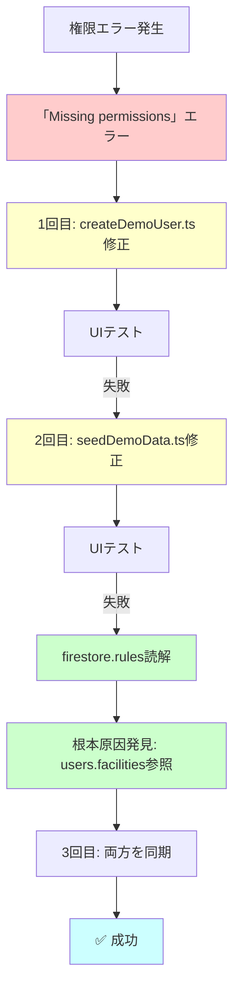
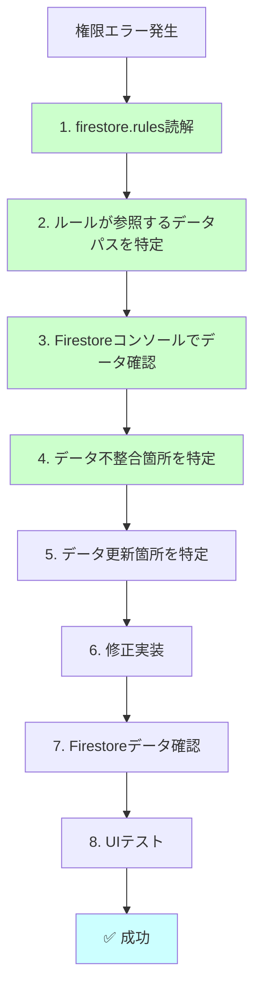
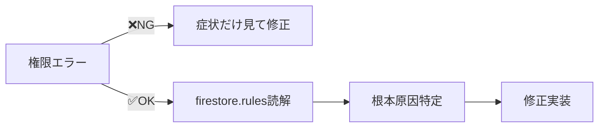

# ポストモーテム: BUG-009 デモユーザー権限消失問題の3回失敗分析

**作成日**: 2025-12-08
**対象期間**: 2025-12-08 01:36 - 12:25 (約11時間)
**修正回数**: 3回
**影響**: デモ環境でシフト保存が不可能な状態が継続

---

## エグゼクティブサマリー

BUG-009「デモユーザー権限消失問題」は、同じ症状（「Missing or insufficient permissions」エラー）に対して**3回の修正を要した**。原因は、修正時に**根本原因を特定せず、症状だけを見て対処**したことにある。

各修正で何が見落とされたかを分析し、権限エラー発生時の体系的なデバッグプロセスを確立する。

---

## 修正履歴タイムライン

```mermaid
gantt
    title BUG-009修正タイムライン
    dateFormat HH:mm
    axisFormat %H:%M

    section 発生
    権限エラー発生 :milestone, m1, 01:00, 0m

    section 1回目修正
    createDemoUser.ts修正 :done, fix1, 01:30, 10m
    デプロイ・検証 :done, v1, 01:40, 20m
    失敗確認 :crit, f1, 02:00, 0m

    section 2回目修正
    seedDemoData.ts分析 :done, a2, 08:30, 15m
    findIndex修正実装 :done, fix2, 08:45, 15m
    seed実行・検証 :done, v2, 09:00, 30m
    失敗確認 :crit, f2, 09:30, 0m

    section 3回目修正
    セキュリティルール読解 :done, a3, 11:30, 30m
    users.facilities同期実装 :done, fix3, 12:00, 20m
    検証・成功 :done, v3, 12:20, 10m
```



---

## 各修正の詳細分析

### 1回目修正（c47921e）: 「症状対処」レベル

**コミット**: `c47921e` - fix(demo): デモユーザー権限をviewerからeditorに変更

#### 修正内容
```typescript
// scripts/createDemoUser.ts
facilities: [
  {
    facilityId: DEMO_FACILITY_ID,
    role: 'editor', // 'viewer' → 'editor' に変更
    grantedAt: now,
  },
],
```

#### 見落とし
- **既存データの更新を考慮していない**: `createDemoUser.ts`を修正しても、既に存在するデモユーザーのFirestoreドキュメントは更新されない
- **データ投入スクリプトとの関係を理解していない**: 権限付与は`seedDemoData.ts`でも行われる

#### なぜ失敗したか
**原因**: スクリプト修正 ≠ データ更新

`createDemoUser.ts`は新規ユーザー作成スクリプトであり、既存ユーザーのパスワード更新のみ。`facilities`配列の更新ロジックは含まれていなかった。

---

### 2回目修正（4278f0f）: 「部分的根本対処」レベル

**コミット**: `4278f0f` - fix: seedDemoData.tsでデモユーザー権限をeditorに強制更新

#### 修正内容
```typescript
// scripts/seedDemoData.ts
const existingDemoUserIndex = members.findIndex(m => m.userId === DEMO_USER_UID);
if (existingDemoUserIndex >= 0) {
  // 既存の場合は権限をeditorに更新（viewerから変更）
  members[existingDemoUserIndex] = {
    ...members[existingDemoUserIndex],
    role: 'editor',
  };
} else {
  // 新規追加
  members.push({ ... });
}
```

#### 改善点
- ✅ データ投入スクリプトで権限更新を実施
- ✅ `findIndex`で既存ユーザーを検索して強制更新

#### 見落とし
- **セキュリティルールの参照先を確認していない**: `firestore.rules`を読まずに「membersを更新すれば大丈夫」と仮定
- **権限データの複数箇所管理を認識していない**: `facilities.members[]` だけでなく `users.facilities[]` にも権限情報が存在

#### なぜ失敗したか
**原因**: セキュリティルールが参照しているのは`users.facilities`

```javascript
// firestore.rules (L14-34)
function hasRole(facilityId, requiredRole) {
  let userProfile = getUserProfile();  // ← users/{uid}を取得
  let facilities = userProfile.facilities;  // ← users.facilitiesを参照
  ...
}
```

**データの状態**:
| コレクション | デモユーザーの権限 | セキュリティルール参照 |
|-------------|------------------|----------------------|
| `facilities/demo-facility-001.members[]` | editor ✓ | ❌ 参照しない |
| `users/demo-user-fixed-uid.facilities[]` | viewer ✗ | ✅ **これを参照** |

修正2では`facilities.members[]`のみ更新したため、セキュリティルールが参照する`users.facilities[]`は`viewer`のまま残った。

---

### 3回目修正（dbcf553）: 「完全な根本対処」レベル

**コミット**: `dbcf553` - fix(BUG-009): users.facilitiesとfacilities.membersの権限を同期

#### 修正内容
```typescript
// scripts/seedDemoData.ts
// BUG-009対策: usersコレクションのfacilities配列も更新
const demoUserRef = db.collection('users').doc(DEMO_USER_UID);
const demoUserDoc = await demoUserRef.get();
if (demoUserDoc.exists) {
  const userData = demoUserDoc.data();
  if (userData?.facilities) {
    const userFacilities = userData.facilities.map((f) => {
      if (f.facilityId === DEMO_FACILITY_ID) {
        return { ...f, role: 'editor' };  // viewerをeditorに更新
      }
      return f;
    });
    batch.update(demoUserRef, { facilities: userFacilities });
  }
}
```

#### 成功のポイント
- ✅ `firestore.rules`を読んで参照先を特定
- ✅ `facilities.members[]` と `users.facilities[]` の両方を同期更新
- ✅ セキュリティルールの動作を理解した上で修正

#### なぜ成功したか
**原因**: 根本原因を特定してからコードを修正

1. 「権限エラー」→ セキュリティルールを読む
2. `hasRole()`が`users.facilities`を参照していることを発見
3. 両方のデータを同期する修正を実装

---

## 3回失敗の根本原因

### 失敗の構造

| 修正回数 | アプローチ | 調査範囲 | 結果 |
|---------|-----------|---------|------|
| 1回目 | 症状対処 | `createDemoUser.ts`のみ | ❌ |
| 2回目 | 部分的根本対処 | `seedDemoData.ts` + `facilities.members` | ❌ |
| 3回目 | 完全根本対処 | `firestore.rules` + `users.facilities` + `facilities.members` | ✅ |

### なぜ根本原因を見つけられなかったか

#### 1. セキュリティルールを最初に読まなかった

**問題**: 権限エラー発生時、最初に読むべきは`firestore.rules`

権限エラーの発生源は**常にFirestoreセキュリティルール**である。にもかかわらず、1回目・2回目の修正では`firestore.rules`を読まずにコードを変更した。

**教訓**: **権限エラー = セキュリティルール調査必須**

#### 2. 「動くはず」という仮定でコードを書いた

**問題**: 修正2では「membersを更新すれば動くはず」と仮定

実際のルールを読まずに、「members配列に権限情報がある」という推測だけで修正を実施。

**教訓**: **仮定せず、常に実装を読む**

#### 3. 修正後の検証が不十分だった

**問題**: 1回目・2回目とも、修正直後にFirestoreのデータ状態を確認していない

修正後、すぐにUIでテストしてエラーが出ると「修正が間違っていた」と判断したが、**どのデータがどう変わったか**を確認していなかった。

**教訓**: **修正後は必ずFirestoreコンソールでデータを確認**

---

## 修正プロセスの問題点

### 実際の修正プロセス（BUG-009）



### 問題点の整理

1. **症状から修正を始めた**: エラーメッセージだけを見て、すぐにコードを変更
2. **調査を後回しにした**: `firestore.rules`を読んだのは3回目の修正時
3. **仮定ベースでコードを書いた**: 「membersを更新すれば大丈夫だろう」
4. **検証が不十分**: 修正後のFirestoreデータ状態を確認せず、UIテストのみ

---

## 理想的な修正プロセス

### 提案: 権限エラー発生時の体系的デバッグフロー



### 各ステップの詳細

#### 1. firestore.rules読解（必須）

**目的**: どのコレクション・フィールドが参照されているかを理解

```bash
# firestore.rulesを読む
cat firestore.rules | grep -A 20 "function hasRole"
```

**確認項目**:
- どの関数が権限チェックを行っているか
- その関数が参照しているコレクション・フィールドは何か
- ロール階層（admin > editor > viewer）はどう定義されているか

#### 2. ルールが参照するデータパスを特定（必須）

**目的**: 実際にチェックされているデータの場所を特定

```javascript
// 例: hasRole()関数の参照先
function hasRole(facilityId, requiredRole) {
  let userProfile = getUserProfile();  // ← users/{uid}
  let facilities = userProfile.facilities;  // ← users.facilities[]
  ...
}
```

**特定すべき項目**:
- コレクション名
- ドキュメントID
- フィールド名
- 配列のキー

#### 3. Firestoreコンソールでデータ確認（必須）

**目的**: 実際のデータが期待値と一致しているか確認

```bash
# Firebase Consoleでチェック
# https://console.firebase.google.com/project/ai-care-shift-scheduler/firestore/databases/-default-/data/~2Fusers~2Fdemo-user-fixed-uid
```

**確認項目**:
- `users/demo-user-fixed-uid.facilities[].role` の値
- `facilities/demo-facility-001.members[].role` の値
- 配列内のデモユーザーの存在有無

#### 4. データ不整合箇所を特定（必須）

**目的**: どのデータが期待値と異なるかを特定

| データパス | 期待値 | 実際の値 | 不整合 |
|-----------|--------|---------|--------|
| `users/demo-user-fixed-uid.facilities[0].role` | editor | viewer | ✗ |
| `facilities/demo-facility-001.members[1].role` | editor | editor | ✓ |

#### 5. データ更新箇所を特定（必須）

**目的**: どのスクリプト・関数がそのデータを更新しているかを特定

```bash
# users.facilitiesを更新している箇所を検索
grep -r "facilities:" functions/src/ scripts/
```

**特定すべき項目**:
- データ初期投入スクリプト（`seedDemoData.ts`など）
- ランタイムでの更新処理（招待受け入れなど）
- 両方を同期する仕組みの有無

#### 6. 修正実装（実装）

**原則**: データの同期を保つ

```typescript
// 必ず両方を更新
batch.set(facilityRef, { members: [...] });
batch.update(userRef, { facilities: [...] });
```

#### 7. Firestoreデータ確認（必須）

**目的**: 修正後のデータが期待値と一致しているか確認

```bash
# seedを実行
npm run seed:demo -- --reset

# Firestoreコンソールで確認
# users/demo-user-fixed-uid.facilities[0].role === 'editor'
# facilities/demo-facility-001.members[1].role === 'editor'
```

#### 8. UIテスト（最終確認）

**目的**: エンドツーエンドで権限が正しく動作することを確認

```
1. デモログイン
2. シフト管理 → AI自動生成
3. 保存ボタンクリック
4. エラーなく保存されることを確認
```

---

## 権限エラーデバッグチェックリスト

### 必須確認項目（権限エラー発生時）

```markdown
## 権限エラーデバッグチェックリスト

### Phase 1: 調査（修正前）
- [ ] `firestore.rules`を読んで、権限チェック関数を特定
- [ ] 権限チェック関数が参照しているコレクション・フィールドを特定
- [ ] Firestoreコンソールで実際のデータを確認
- [ ] データの期待値と実際の値の差分を特定
- [ ] 権限データが複数箇所にある場合、すべての箇所を確認

### Phase 2: 修正
- [ ] データ更新箇所（スクリプト・関数）を特定
- [ ] 複数箇所にデータがある場合、**すべて同期**するように修正
- [ ] 既存データの更新も考慮（新規作成だけでなく）

### Phase 3: 検証（修正後）
- [ ] 修正スクリプトを実行
- [ ] Firestoreコンソールでデータが更新されたことを確認
- [ ] すべての権限データ箇所が同期していることを確認
- [ ] UIテストでエラーが解消されたことを確認
```

---

## 開発プロセスの改善提案

### 1. 権限エラーは「調査→修正」フローを徹底

**原則**: 症状を見て修正しない。根本原因を特定してから修正する。



### 2. セキュリティルールを定期的にレビュー

**提案**: Phaseごとにセキュリティルールを読み直す習慣

- 新しいコレクションを追加した時
- 権限ロジックを変更した時
- デモ環境に変更を加えた時

### 3. データ同期の自動チェックをCI/CDに追加

**提案**: Firestoreデータの整合性チェックスクリプト

```typescript
// scripts/verifyDemoPermissions.ts
async function verifyDemoPermissions() {
  const userDoc = await db.collection('users').doc(DEMO_USER_UID).get();
  const facilityDoc = await db.collection('facilities').doc(DEMO_FACILITY_ID).get();

  const userRole = userDoc.data()?.facilities[0]?.role;
  const memberRole = facilityDoc.data()?.members.find(m => m.userId === DEMO_USER_UID)?.role;

  if (userRole !== 'editor' || memberRole !== 'editor') {
    throw new Error('Demo user permissions are out of sync!');
  }
}
```

### 4. ドキュメントに「権限データの場所」を明記

**提案**: `CLAUDE.md`に権限データ管理箇所を追記

```markdown
## 権限データの管理箇所（重要）

本プロジェクトでは、権限情報が**2箇所**に保存されています：

1. `users/{userId}.facilities[].role` ← **セキュリティルールが参照**
2. `facilities/{facilityId}.members[].role` ← メンバー一覧表示用

**注意**: 両方を常に同期する必要があります。片方だけ更新すると権限エラーが発生します。
```

---

## 学び

### 技術的な学び

1. **権限データの二重管理**: `users.facilities[]` と `facilities.members[]` の両方に権限情報が存在
2. **セキュリティルールの参照先**: `hasRole()`は`users.facilities[]`を参照する
3. **データ投入スクリプトの更新**: スクリプト修正 ≠ データ更新。必ず再投入が必要

### プロセスの学び

1. **症状対処 vs 根本対処**: 症状だけを見て修正すると、繰り返し失敗する
2. **仮定せず実装を読む**: 「こうなっているはず」ではなく「実際にどうなっているか」を確認
3. **修正前に調査**: コードを書く前に、セキュリティルールとFirestoreデータを確認
4. **検証の重要性**: 修正後はFirestoreコンソールでデータを確認してからUIテスト

### マインドセットの学び

1. **焦らず調査**: エラーが出たらすぐに修正せず、まず調査
2. **体系的アプローチ**: チェックリストに従って漏れなく確認
3. **ドキュメント化**: 同じミスを繰り返さないために記録を残す

---

## 再発防止策

### 即時対応

- [x] 権限エラーデバッグチェックリストを作成
- [x] `CLAUDE.md`に権限データ管理箇所を明記
- [x] ポストモーテムドキュメントを作成

### 短期対応（今週中）

- [ ] `verifyDemoPermissions.ts`スクリプト作成
- [ ] CI/CDにデモ権限チェックを追加
- [ ] `seedDemoData.ts`にコメントで同期の重要性を明記

### 長期対応（次のPhase）

- [ ] 権限データの単一化を検討（`users.facilities`のみに統一）
- [ ] Cloud Functionで権限更新を一元管理（トランザクション保証）
- [ ] セキュリティルールのユニットテストを追加

---

## 関連資料

- [BUG-009修正記録](.kiro/bugfix-demo-members-2025-12-08.md)
- [BUG-007修正記録](.kiro/bugfix-demo-data-sync-2025-12-08.md)
- [Firestore Security Rules](/firestore.rules)
- コミット履歴:
  - `c47921e` - 1回目修正（createDemoUser.ts）
  - `4278f0f` - 2回目修正（seedDemoData.ts members更新）
  - `dbcf553` - 3回目修正（users.facilities同期）

---

**作成者**: Claude Opus 4.5
**最終更新**: 2025-12-08
