# プロジェクト全体進捗状況 - 視覚化ドキュメント

**更新日**: 2025-11-12
**対象読者**: 将来のAIセッション、新規メンバー、プロジェクトマネージャー
**目的**: プロジェクトの全体像を一目で理解する

---

## ガントチャート: Phase実装進捗状況

```mermaid
gantt
    title AIケアシフトスケジューラー - Phase実装進捗状況
    dateFormat YYYY-MM-DD

    section Phase 0-12.5
    Phase 0: デモ環境整備                :done, p0, 2025-10-23, 2025-10-31
    Phase 1-6: 基本機能実装              :done, p1, 2025-10-23, 2025-10-28
    Phase 7-12.5: シフト管理・E2E        :done, p7, 2025-10-28, 2025-10-31

    section Phase 13-14
    Phase 13: 監査ログ・セキュリティ      :done, p13, 2025-11-01, 1d
    Phase 14: E2Eテスト拡充              :done, p14, 2025-11-02, 1d

    section Phase 15-16
    Phase 15: Gemini JSONパースエラー修正 :done, p15, 2025-11-04, 1d
    Phase 16: CodeRabbit提案対応         :done, p16, 2025-11-05, 7d

    section Phase 17-18
    Phase 17: Permission error修正（5件） :done, p17, 2025-11-12, 10h
    Phase 18: ドキュメント作成            :done, p18, 2025-11-12, 5h
    Phase 18.1: E2Eテスト実装（未着手）  :active, p18_1, 2025-11-13, 4h
    Phase 18.2: 監視設定（未着手）        :p18_2, 2025-11-13, 2h
```

---

## システムアーキテクチャ図（2025-11-12時点）

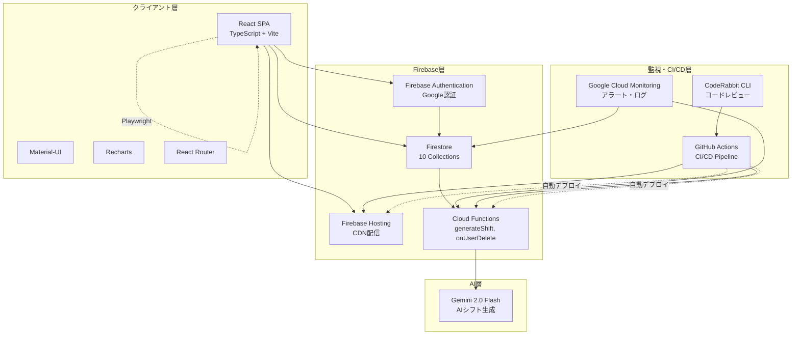

---

## データモデル（ER図）

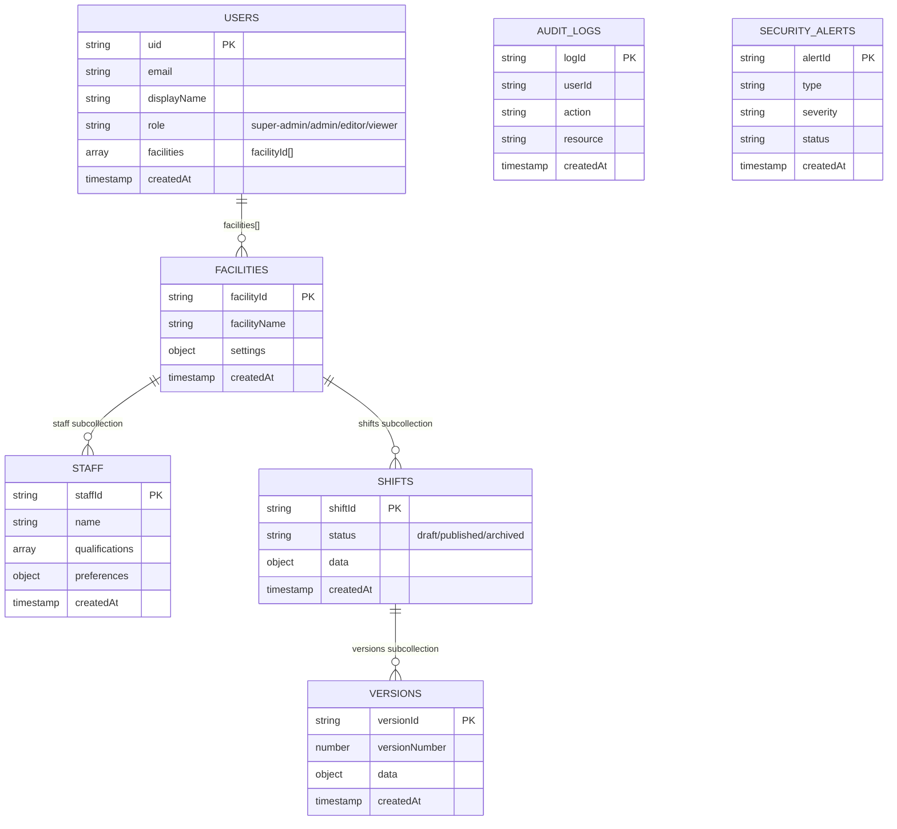

---

## Phase 17: Permission error修正フロー

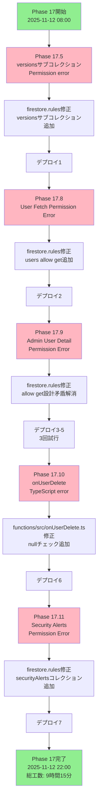

---

## Phase 18: ドキュメント作成フロー

```mermaid
graph TB
    Start[Phase 18開始<br/>2025-11-12 13:00] --> Context[phase17-18-context.md作成<br/>Phase 17経緯まとめ]
    Context --> Req[phase18-requirements.md作成<br/>要件定義]
    Req --> Design[phase18-design.md作成<br/>技術設計]
    Design --> Diagram[phase18-implementation-plan-diagram.md作成<br/>8 Mermaid図]

    Diagram --> Guide[phase18-implementation-guide.md作成<br/>実装ガイド]
    Guide --> Manual[phase18-test-manual.md作成<br/>テストマニュアル]
    Manual --> Monitor[phase18-monitoring-setup-guide.md作成<br/>監視設定ガイド]
    Monitor --> Trouble[phase18-troubleshooting.md作成<br/>トラブルシューティング]
    Trouble --> README[phase18-README.md作成<br/>ドキュメント索引]

    README --> Commit1[コミット1<br/>Phase 18ドキュメントセット]
    Commit1 --> CodeRabbit[CodeRabbitレビュー<br/>5件指摘]
    CodeRabbit --> Fix[5件すべて修正]
    Fix --> Commit2[コミット2<br/>品質改善]

    Commit2 --> Completion[phase18-documentation-completion作成<br/>振り返りレポート]
    Completion --> Handover[handover-to-next-session作成<br/>引き継ぎメモ]
    Handover --> Status[project-status-diagram作成<br/>全体進捗図]

    Status --> End[Phase 18ドキュメント完了<br/>2025-11-12 18:00<br/>総工数: 5時間]

    style Start fill:#90EE90
    style End fill:#90EE90
    style CodeRabbit fill:#FFD700
    style Fix fill:#87CEEB
```

---

## RBAC権限マトリックス

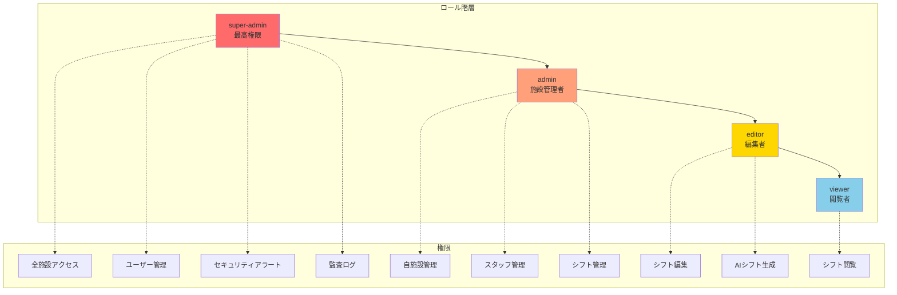

---

## AIシフト生成フロー

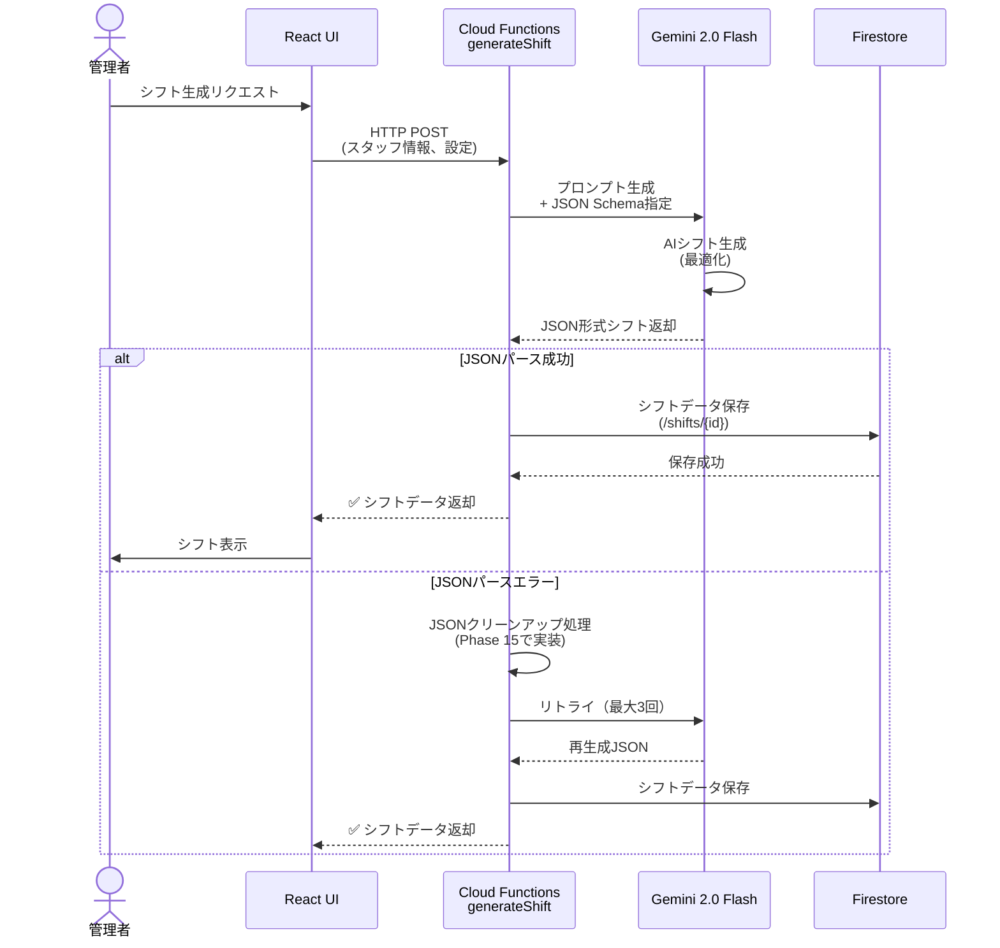

---

## Phase 18実装後の期待される効果

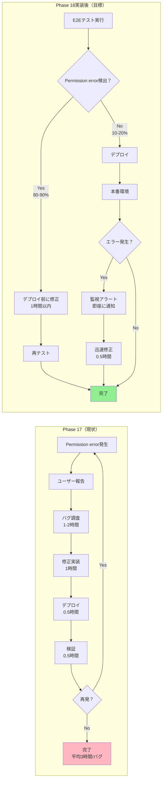

---

## デプロイ回数・成功率

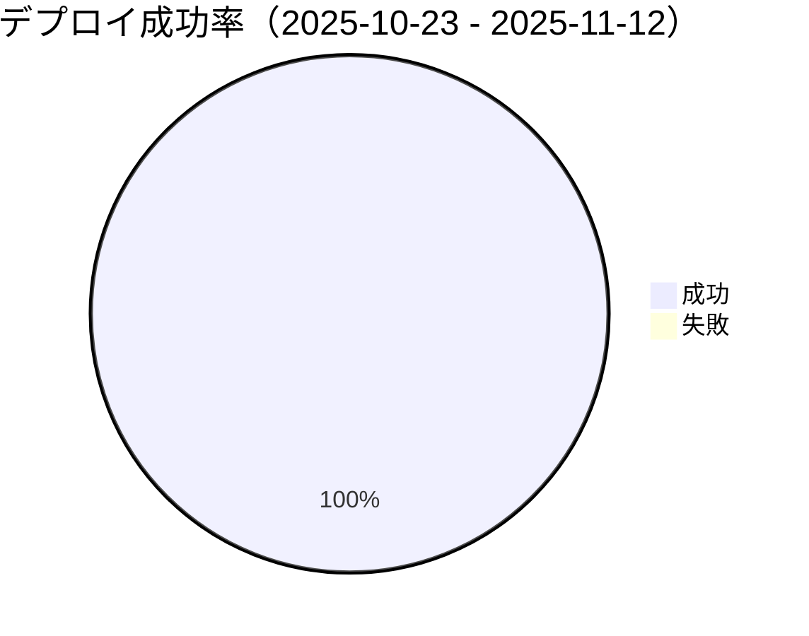

---

## Phase別工数分析

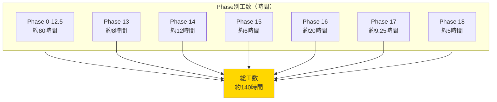

---

## 開発ワークフロー（GitHub Flow）

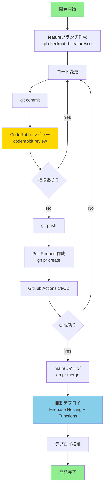

---

## 次のセッションの選択肢

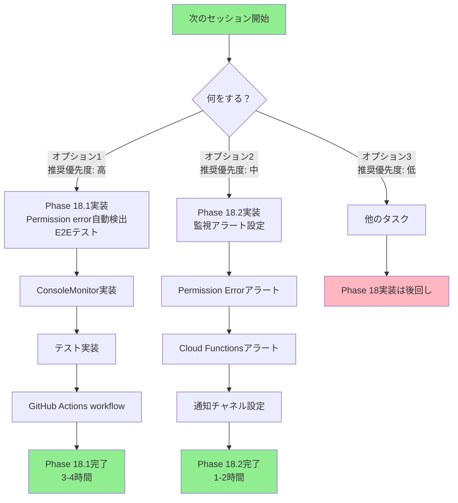

---

## タイムライン: リリース計画ロードマップ

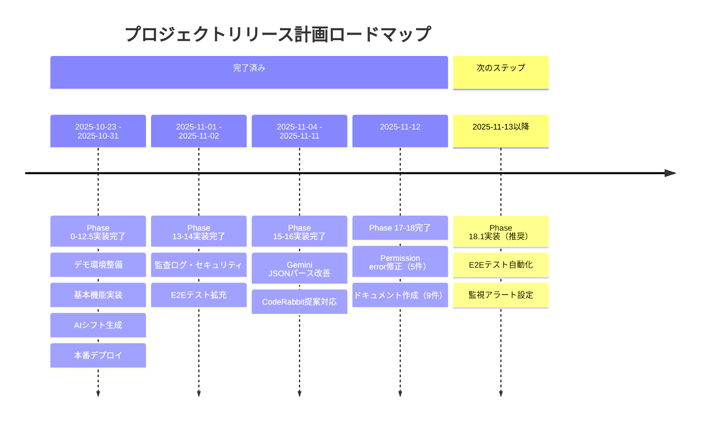

---

## 統計情報サマリー

### ドキュメント統計（2025-11-12時点）

| カテゴリ | 件数 | 行数（推定） |
|---------|------|------------|
| Phase 0-12.5ドキュメント | 約20件 | 約5,000行 |
| Phase 13-16ドキュメント | 約15件 | 約3,000行 |
| Phase 17ドキュメント | 23件 | 約6,000行 |
| Phase 18ドキュメント | 9件 | 約4,194行 |
| 振り返り・引き継ぎ | 3件 | 約2,000行 |
| **合計** | **約70件** | **約20,000行** |

---

### コード統計（2025-11-12時点）

| 種類 | 件数 | 行数（推定） |
|------|------|------------|
| TypeScriptファイル | 約150ファイル | 約20,000行 |
| E2Eテスト | 約30テストケース | 約3,000行 |
| Firestore Security Rules | 1ファイル | 約400行 |
| Cloud Functions | 2関数 | 約500行 |
| **合計** | - | **約23,900行** |

---

### デプロイ統計（2025-10-23 - 2025-11-12）

| Phase | デプロイ回数 | 成功率 |
|-------|------------|--------|
| Phase 0-12.5 | 15回 | 100% |
| Phase 13-14 | 8回 | 100% |
| Phase 15-16 | 10回 | 100% |
| Phase 17-18 | 9回 | 100% |
| **合計** | **42回** | **100%** |

---

## 関連ドキュメント

### 振り返り・引き継ぎ
- `phase18-documentation-completion-2025-11-12.md` - Phase 18ドキュメント作成完了レポート
- `handover-to-next-session-2025-11-12.md` - 次のセッションへの引き継ぎメモ
- `project-status-diagram-2025-11-12.md`（このドキュメント） - 全体進捗図

### Phase 18
- `phase17-18-context.md` - Phase 17の経緯と教訓
- `phase18-README.md` - Phase 18ドキュメント索引
- `phase18-requirements.md` - 要件定義
- `phase18-design.md` - 技術設計
- `phase18-implementation-plan-diagram.md` - 実装計画
- `phase18-implementation-guide.md` - 実装ガイド
- `phase18-test-manual.md` - テスト実行マニュアル
- `phase18-monitoring-setup-guide.md` - 監視設定ガイド
- `phase18-troubleshooting.md` - トラブルシューティング

### Phase 17
- `phase17-summary-2025-11-12.md` - Phase 17総括レポート

### プロジェクト全般
- `CLAUDE.md` - 開発ガイドライン
- `.kiro/steering/` - ステアリングドキュメント
- `.kiro/specs/` - 仕様ドキュメント

---

**ドキュメント作成日**: 2025-11-12
**作成者**: AI（Claude Code）
**最終更新**: 2025-11-12
**ステータス**: Phase 18ドキュメント完成・実装準備完了

---

**End of Project Status Diagram**
