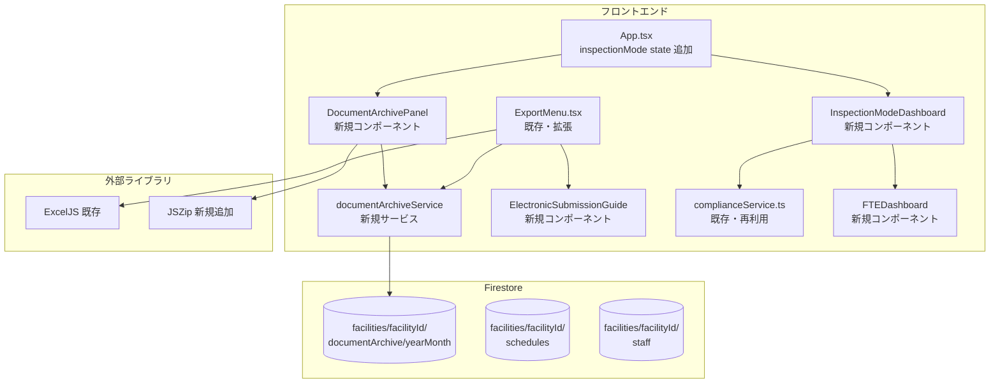
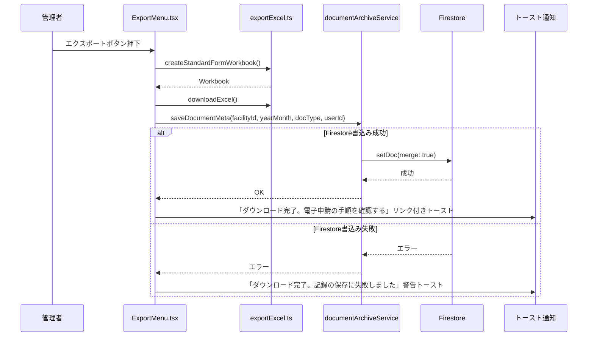
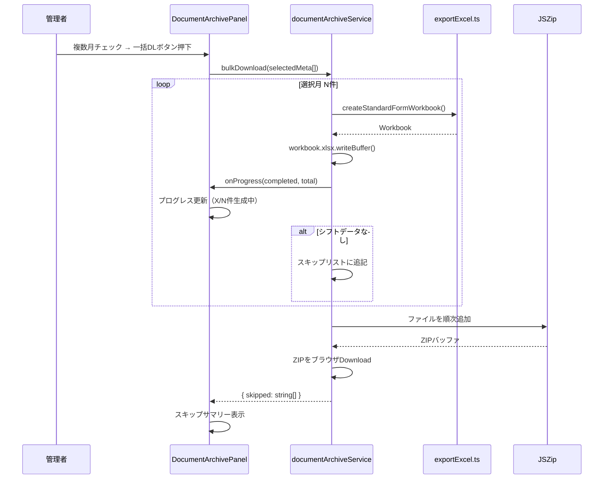
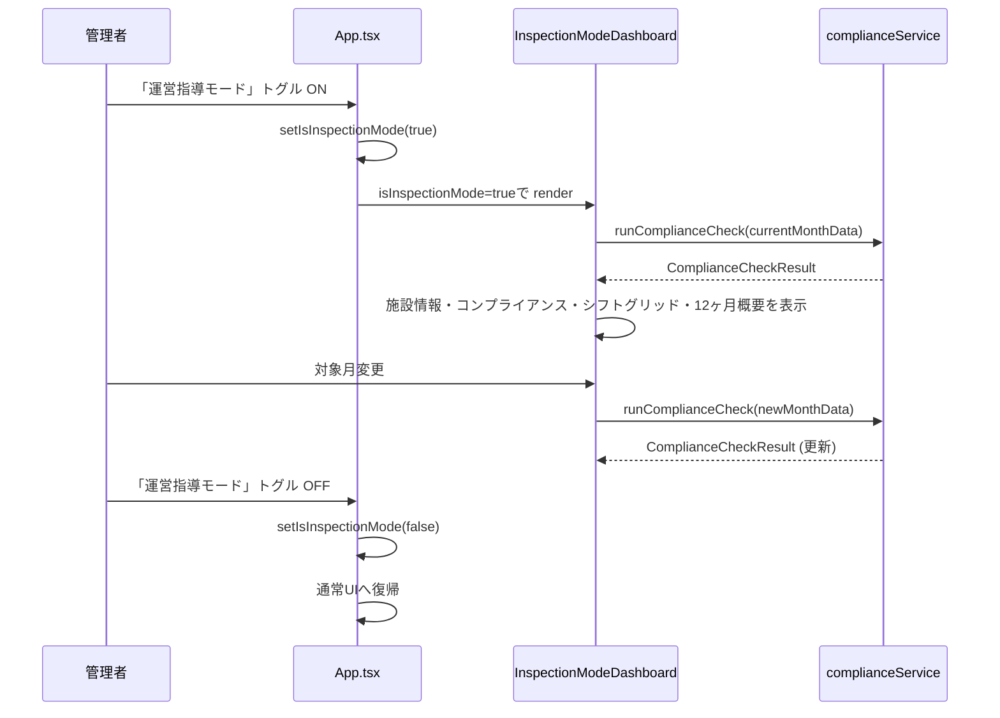
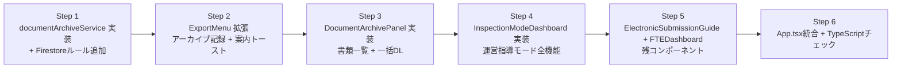

# Technical Design: Phase 61 行政対応UI（administrative-compliance-ui）

**作成日**: 2026-02-19
**仕様バージョン**: requirements-generated
**設計分類**: Extension（既存Phase 25機能の拡張）

---

## Overview

### Purpose
本機能は、介護事業所の行政対応（運営指導・監査）を支援するための3つのサブ機能を追加する。
既存の Excel エクスポート機能（Phase 25実装済み）に書類アーカイブ記録機能を組み込み、
運営指導当日にワンクリックで実績・コンプライアンス情報を提示できる専用ダッシュボードを提供する。

### Users
- **施設管理者（admin ロール）**: 書類アーカイブ管理・運営指導モード・電子申請フロー案内の全機能
- **一般スタッフ（member/editor/viewer ロール）**: 本機能にアクセス不可

### Impact
既存の `ExportMenu.tsx`（ExcelエクスポートUI）と `App.tsx` のタブ/アコーディオン構造を拡張し、
`documentArchive` Firestore コレクション（新規）を追加する。
既存の `complianceService.ts` と `exportExcel.ts` は直接再利用する。

### Goals
- 過去の提出書類をFirestoreメタデータで管理し、月別に即時取得できる
- 運営指導当日に実績シフト・コンプライアンス状態を全画面で提示できる
- 電子申請の提出手順をUI内で案内し、外部調査の手間をゼロにする

### Non-Goals
- 実Excelファイルのクラウドストレージ保存（メタデータのみFirestore管理）
- Cloud Functions への機能追加（フロントエンド完結）
- GビズIDポータルへのAPI連携（手順案内のみ）
- staff/editor/viewer ロールへの機能提供

---

## Architecture

### Existing Architecture Analysis

現行アーキテクチャのうち本機能に関わる部分:

- **`src/utils/exportExcel.ts`**: `createStandardFormWorkbook()` / `createActualVsPlanWorkbook()` / `downloadExcel()` がエクスポートされている。エクスポート完了後のフックを追加する形で統合する
- **`src/services/complianceService.ts`**: `runComplianceCheck()` / `calculateFullTimeEquivalent()` が既に実装済み。運営指導モードではこれを直接呼び出す
- **`src/components/ExportMenu.tsx`**: Excelエクスポートのエントリーポイント。エクスポート完了後に `saveDocumentMeta()` を呼び出す変更を加える
- **`App.tsx`**: `schedule`, `staffList`, `shiftSettings`, `selectedFacilityId` などのグローバルstateを保持。運営指導モードのトグルstateをここに追加する
- **Firestore**: `facilities/{facilityId}/schedules/{scheduleId}` が既存。`documentArchive` サブコレクションを新規追加する

### High-Level Architecture



### Technology Alignment

既存スタックを完全継続:
- **React 19 + TypeScript 5.8**: 新規コンポーネントも既存パターン準拠
- **Tailwind CSS 3.x**: カスタムカラー (`care-primary`, `care-secondary`) を継続使用
- **Firestore (asia-northeast1)**: 新コレクション `documentArchive` を追加
- **Firebase Authentication**: 既存 `useAuth()` / `admin` ロールチェックを流用

**新規依存関係**:
| ライブラリ | 用途 | 導入理由 |
|------------|------|----------|
| `jszip` | 複数Excelの一括ZIP圧縮 | ExcelJSはZIPをネイティブ生成できないため |

### Key Design Decisions

**Decision 1: Firestoreドキュメント設計（年月×書類種別の保存方式）**
- **Context**: 1ヶ月に最大2種類（standard_form / actual_vs_plan）の書類が存在する
- **Alternatives**:
  - A: `documentArchive/{yearMonth}_{docType}` を複合キーにする
  - B: `documentArchive/{yearMonth}` に全書類種別をマップで持つ
- **Selected Approach**: B を採用。`yearMonth`をドキュメントIDとし、`documents` フィールドに `{ standard_form: {...}, actual_vs_plan: {...} }` を格納
- **Rationale**: 月単位のリスト取得（1クエリ）と書類種別の上書き更新（フィールドへのmerge）が最もシンプルに実現できる
- **Trade-offs**: 書類種別を増やす場合はフィールドを追加するだけでよい（後方互換性高）

**Decision 2: 一括DLのZIP生成方式（クライアントサイド vs サーバーサイド）**
- **Context**: 複数月のExcelを一括ダウンロードしたい
- **Alternatives**:
  - A: Cloud FunctionsでZIPを生成してURLを返す
  - B: ブラウザ上でExcelを順次生成しJSZipで圧縮する
- **Selected Approach**: B を採用。クライアントサイドJSZip
- **Rationale**: Cloud Functions追加は不要、既存`createStandardFormWorkbook()`を再利用でき、Firestoreの読み取りコストも最小。件数が少数（最大12件程度）のため速度も問題なし
- **Trade-offs**: ブラウザのメモリ消費が若干増えるが、12ヶ月分程度なら実用上問題なし

**Decision 3: 運営指導モードの状態管理**
- **Context**: 通常UIと運営指導ダッシュボードを切り替える
- **Alternatives**:
  - A: URLルーティングで別ページ
  - B: `App.tsx`のstateでコンディショナルレンダリング
- **Selected Approach**: B を採用。`isInspectionMode` boolean stateをApp.tsxに追加
- **Rationale**: 既存のルーター構成への変更を最小化。既存stateへの参照がそのまま運営指導モードでも使用できる
- **Trade-offs**: ルーティングによる直接URLアクセスは不可（運営指導の起動がUIトグルのみ）。これはビジネス要件上問題なし

---

## System Flows

### Excel エクスポート → 書類アーカイブ記録フロー



### 複数月一括ダウンロードフロー



### 運営指導モード切替フロー



---

## Requirements Traceability

| 要件 | 概要 | コンポーネント | インターフェース |
|------|------|---------------|-----------------|
| 1.1 | Excelエクスポート時にFirestoreへメタ記録 | ExportMenu (拡張), documentArchiveService | `saveDocumentMeta()` |
| 1.2 | 記録失敗時もDL継続、エラートースト | documentArchiveService | try-catch + toast |
| 1.3 | 同月同種別は上書き更新 | documentArchiveService | `setDoc(merge:true)` |
| 1.4-1.5 | 書類アーカイブタブ・年月降順一覧 | DocumentArchivePanel | `getDocumentArchives()` |
| 1.6 | 再ダウンロードボタン | DocumentArchivePanel | `reDownloadDocument()` |
| 2.1-2.2 | チェックボックス・一括DLボタン | DocumentArchivePanel | `bulkDownload()` |
| 2.3-2.5 | ZIP生成・プログレス・スキップ | documentArchiveService | `bulkDownloadDocuments()` |
| 3.1-3.2 | 運営指導モードトグル・全画面ダッシュ | App.tsx, InspectionModeDashboard | `isInspectionMode` state |
| 3.3 | 12ヶ月月別概要テーブル | InspectionModeDashboard | `getMonthlyOverview()` |
| 3.4 | コンプライアンス色分け | InspectionModeDashboard | `ComplianceCheckResult` 参照 |
| 3.5-3.6 | トグルOFF・月変更リアルタイム更新 | App.tsx, InspectionModeDashboard | state + useEffect |
| 4.1-4.3 | FTEダッシュボード・色分け・不足値 | FTEDashboard | `FullTimeEquivalentEntry` 参照 |
| 4.4 | 印刷ボタン（window.print） | InspectionModeDashboard | `window.print()` |
| 5.1-5.5 | 電子申請フロー案内モーダル・4ステップ・印刷 | ElectronicSubmissionGuide | toast link + modal |
| 6.1-6.4 | facilityId スコープ・認証チェック・admin限定 | documentArchiveService, コンポーネント | Firestore rules |

---

## Components and Interfaces

### Services層

#### documentArchiveService

**Primary Responsibility**: 書類アーカイブのFirestore CRUD と一括ダウンロード処理

**Dependencies**:
- Inbound: `ExportMenu`, `DocumentArchivePanel`
- Outbound: Firestore `documentArchive`, `schedules` コレクション
- External: `jszip`, `exportExcel.ts`

**Service Interface**:
```typescript
type DocType = 'standard_form' | 'actual_vs_plan';

interface DocumentMeta {
  createdAt: Timestamp;
  createdBy: string; // userId
  facilityName: string;
}

interface DocumentArchiveRecord {
  yearMonth: string;          // "YYYY-MM"
  standard_form?: DocumentMeta;
  actual_vs_plan?: DocumentMeta;
}

interface BulkDownloadProgress {
  completed: number;
  total: number;
}

interface BulkDownloadResult {
  skipped: Array<{ yearMonth: string; reason: string }>;
}

interface DocumentArchiveService {
  saveDocumentMeta(
    facilityId: string,
    yearMonth: string,
    docType: DocType,
    userId: string,
    facilityName: string
  ): Promise<void>;

  getDocumentArchives(
    facilityId: string
  ): Promise<DocumentArchiveRecord[]>;

  reDownloadDocument(
    facilityId: string,
    yearMonth: string,
    docType: DocType
  ): Promise<void>;

  bulkDownloadDocuments(
    facilityId: string,
    selections: Array<{ yearMonth: string; docType: DocType }>,
    facilityName: string,
    onProgress: (progress: BulkDownloadProgress) => void
  ): Promise<BulkDownloadResult>;
}
```

**Preconditions**:
- `facilityId`: 認証ユーザーが所属する施設のID（呼び出し元が保証）
- `yearMonth`: "YYYY-MM" フォーマット

**Postconditions**:
- `saveDocumentMeta`: `facilities/{facilityId}/documentArchive/{yearMonth}` に setDoc(merge: true) で記録。失敗時は例外をスロー
- `bulkDownloadDocuments`: シフトデータが存在しない月はスキップし、結果に記録

### UI コンポーネント層

#### DocumentArchivePanel

**Primary Responsibility**: 書類アーカイブ一覧の表示・チェックボックス選択・一括DL操作

**Props Interface**:
```typescript
interface DocumentArchivePanelProps {
  facilityId: string;
  facilityName: string;
  staffList: Staff[];
  shiftSettings: FacilityShiftSettings;
  standardWeeklyHours: number;
  isAdmin: boolean;
}
```

**State**:
- `archives: DocumentArchiveRecord[]` - Firestoreから取得したアーカイブ一覧
- `selected: Set<string>` - チェック中の `${yearMonth}_${docType}` キー
- `isLoading: boolean`
- `downloadProgress: BulkDownloadProgress | null`
- `downloadResult: BulkDownloadResult | null` - スキップサマリー表示用

#### InspectionModeDashboard

**Primary Responsibility**: 運営指導専用ダッシュボード（全画面表示）

**Props Interface**:
```typescript
interface InspectionModeDashboardProps {
  facilityId: string;
  facilityName: string;
  selectedYearMonth: string;   // App.tsx の selectedMonth をバインド
  staffList: Staff[];
  shiftSettings: FacilityShiftSettings;
  standardWeeklyHours: number;
  onMonthChange: (yearMonth: string) => void;
  onExit: () => void;
}
```

**Sections**（表示順）:
1. **施設情報サマリー**: 施設名・対象月・常勤換算合計値
2. **コンプライアンスチェック結果**: `runComplianceCheck()` の結果を色分け表示
3. **当月実績シフト一覧**: スタッフ×日付グリッド（実績シフトタイプ表示）
4. **過去12ヶ月月別概要テーブル**: `documentArchive` + `schedules` から集計

**State**:
- `complianceResult: ComplianceCheckResult | null`
- `monthlyOverview: MonthlyOverviewRow[]`
- `isPrinting: boolean`

#### FTEDashboard

**Primary Responsibility**: 職種別常勤換算値の表示・法定基準との比較

**Props Interface**:
```typescript
interface FTEDashboardProps {
  fteEntries: FullTimeEquivalentEntry[];
  legalThresholds: Record<Role, number>; // 事業所設定の法定基準値
}
```

**表示ロジック**: `FullTimeEquivalentEntry.fullTimeEquivalent >= threshold` → 緑、下回る → 赤 + 不足値

#### ElectronicSubmissionGuide

**Primary Responsibility**: 電子申請フロー案内モーダル（4ステップ表示・印刷）

**Props Interface**:
```typescript
interface ElectronicSubmissionGuideProps {
  isOpen: boolean;
  onClose: () => void;
}
```

**4ステップ定数**:
```
Step1: ダウンロードしたExcelファイルを確認する
Step2: GビズIDでログイン（介護サービス情報公表システム or 各都道府県電子申請システム）
Step3: 「変更届出」または「加算届出」フォームを選択してExcelをアップロード
Step4: 受付番号を控えて提出完了
```

**印刷**: `window.print()` + 印刷用 CSS で `@media print { .no-print { display: none; } }`

---

## Data Models

### Firestore Physical Data Model

#### 新規コレクション: `documentArchive`

**パス**: `facilities/{facilityId}/documentArchive/{yearMonth}`

```typescript
// Firestoreドキュメント構造
interface DocumentArchiveDocument {
  yearMonth: string;           // "2026-01" （ドキュメントIDと同値）
  standard_form?: {
    createdAt: FirebaseFirestore.Timestamp;
    createdBy: string;         // Firebase Auth UID
    facilityName: string;
  };
  actual_vs_plan?: {
    createdAt: FirebaseFirestore.Timestamp;
    createdBy: string;
    facilityName: string;
  };
}
```

**書込み方式**: `setDoc(ref, { [docType]: { createdAt, createdBy, facilityName } }, { merge: true })`
これにより同月同種別は上書き、他のdocTypeフィールドは保持される。

#### 新規インデックス

`documentArchive` コレクションへの複合インデックスは不要（yearMonth降順は単フィールドで対応可能）。
一覧取得は `orderBy('yearMonth', 'desc')` のみ。

### App.tsx State 拡張

```typescript
// 追加するstate（既存のstate群に追記）
const [isInspectionMode, setIsInspectionMode] = useState<boolean>(false);
```

### 月別概要テーブル行型

```typescript
interface MonthlyOverviewRow {
  yearMonth: string;           // "YYYY-MM"
  fteTotal: number;            // 常勤換算合計
  isStaffingAdequate: boolean; // 人員配置充足（true=○ / false=×）
  hasDocumentArchive: boolean; // 書類アーカイブ有無
}
```

---

## Error Handling

### Error Strategy

| エラー種別 | 発生箇所 | 対処 |
|-----------|---------|------|
| Firestoreへの書込み失敗 | `saveDocumentMeta()` | ダウンロード継続・警告トースト（Req 1.2） |
| 一括DL中のExcel生成失敗 | `bulkDownloadDocuments()` | 当該月をスキップ・スキップサマリーへ追記 |
| シフトデータ未存在 | 再DL・一括DL時 | 当該月をスキップ・サマリーへ追記（Req 2.5） |
| 認証エラー | サービス呼び出し時 | Firestore Security Rules が拒否 → ログイン画面へリダイレクト（既存 `ProtectedRoute` で処理済み） |
| complianceService 計算エラー | 運営指導モード表示時 | エラー状態UIを表示、トースト通知 |

### トースト仕様

| ケース | トーストタイプ | メッセージ |
|--------|-------------|-----------|
| エクスポート + アーカイブ記録成功 | success | 「ダウンロード完了。[電子申請の手順を確認する]（リンク）」 |
| エクスポート成功 + 記録失敗 | warning | 「ダウンロード完了。書類アーカイブへの記録に失敗しました」 |
| 一括DL完了（スキップあり） | info | 「ZIP生成完了。X月はデータなしのためスキップしました」 |

---

## Testing Strategy

### Unit Tests

- `documentArchiveService.saveDocumentMeta()`: Firestoreへの `setDoc(merge:true)` 呼び出し検証
- `documentArchiveService.bulkDownloadDocuments()`: シフトデータなし月のスキップ検証、プログレスコールバック検証
- `FTEDashboard`: 法定基準値以上→緑/以下→赤の色分けロジック
- `ElectronicSubmissionGuide`: 4ステップの表示、`window.print()` 呼び出し検証

### Integration Tests

- ExportMenu → saveDocumentMeta → Firestore（モック）の書込みが正しいパスに行われるか
- DocumentArchivePanel: `getDocumentArchives()` の結果を年月降順で表示するか
- InspectionModeDashboard: 月変更時に `runComplianceCheck()` が再実行されるか

### E2E Tests

- 管理者ロールで「書類アーカイブ」タブにアクセスできる
- 一般スタッフロールで「書類アーカイブ」タブが非表示
- 運営指導モードトグルON→全画面ダッシュボード表示、OFF→通常UI復帰
- Excelエクスポート後にトーストに「電子申請の手順を確認する」リンクが表示される

---

## Security Considerations

### Firestore Security Rules 追加

```javascript
// documentArchive コレクション
match /facilities/{facilityId}/documentArchive/{yearMonth} {
  allow read: if isAdminOfFacility(facilityId);
  allow write: if isAdminOfFacility(facilityId);
}
```

`isAdminOfFacility()` 関数は既存の `facilities/{facilityId}` ルールで定義済みのものを流用。

### アクセス制御
- `DocumentArchivePanel` と `InspectionModeDashboard` の表示: `userRole === 'admin'` の場合のみ（App.tsxのroleチェックで制御）
- `documentArchiveService` の全メソッド: Firestore Security Rules で `admin` ロール以外は403

### データスコープ
- 全クエリは `facilities/{認証ユーザー所属facilityId}` 配下のみ
- `facilityId` は `useAuth()` フックから取得し、外部入力を使用しない

---

## Performance & Scalability

### 一括DL時の最適化
- 最大12ヶ月分のExcel生成（1ファイル約50-200KB）で合計最大2.4MB程度、ブラウザメモリ内で処理可能
- 各ファイル生成を逐次（sequential）で処理し、UIのプログレスバーを更新

### Firestore クエリ最適化
- `documentArchive` は `orderBy('yearMonth', 'desc').limit(24)` で過去2年分を上限とする
- 12ヶ月概要テーブルのデータ取得: `schedules` は `targetMonth >= 12ヶ月前` でフィルタ（1クエリ）

---

## Migration Strategy

### 段階的リリース



### ロールバックトリガー
- TypeScriptビルドエラーが発生した場合は当該Stepを即時ロールバック
- `documentArchive` コレクションへの書込みはdownloadをブロックしないため、Firestore障害時もExcelDLは継続される（安全）
