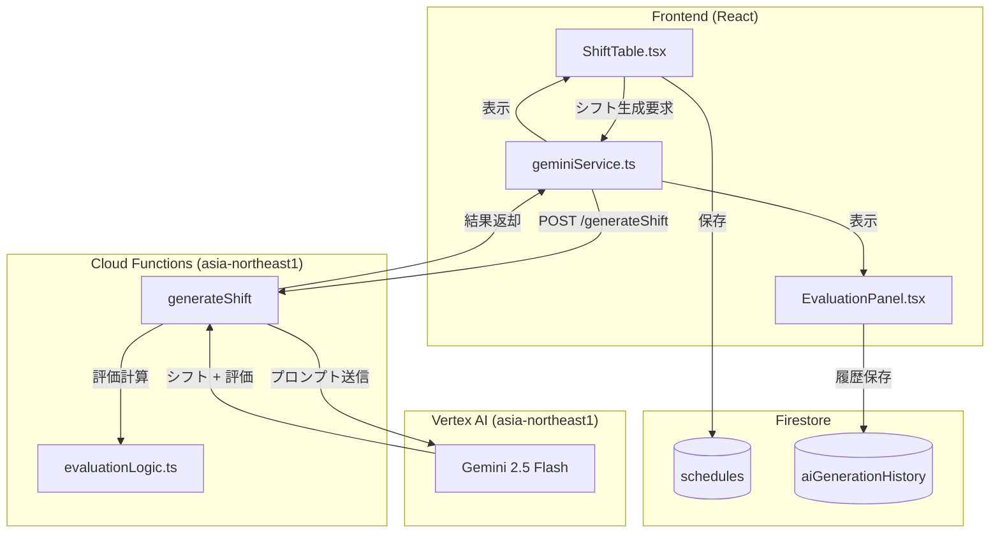
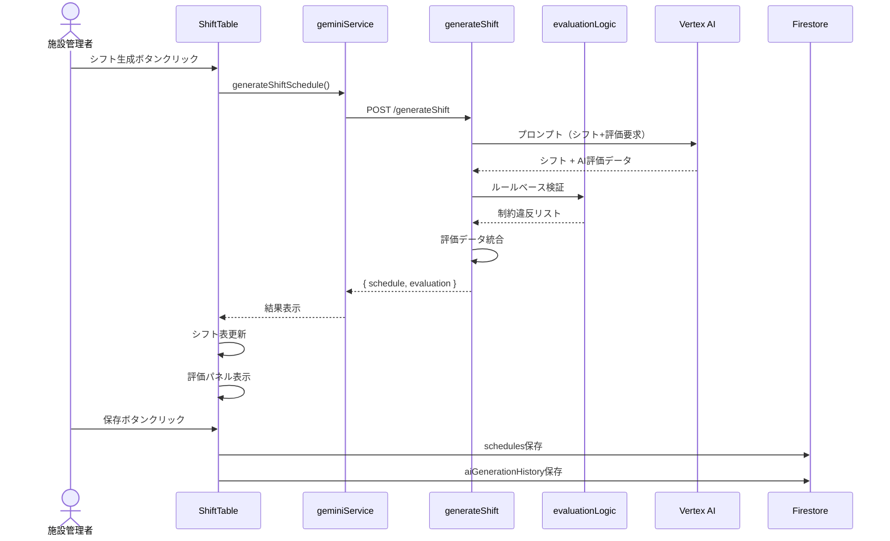
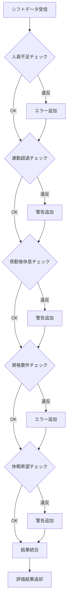

# Phase 40: AI評価・フィードバック機能 - 技術設計書

**作成日**: 2025-11-26
**仕様ID**: ai-evaluation-feedback
**Phase**: 40
**ステータス**: 設計中

---

## Overview

### Purpose
本機能は、AIシフト生成の結果に対する**評価・フィードバック機能**を提供する。施設管理者がAI生成結果を迅速に把握し、問題点の検出・改善提案の確認を通じて、シフトの品質向上を支援する。

### Users
- **施設管理者**: シフト作成責任者 - 生成結果の評価確認、改善提案の検討
- **スタッフ**: 生成結果の公平性確認

### Impact
現在のシフト生成機能（`generateShift` Cloud Function）を拡張し、評価データを同時に生成・返却する。既存のスケジュール保存フローに評価データ保存を追加。

### Goals
- AI生成結果の品質を定量的に評価（総合スコア、充足率）
- 制約違反を自動検出し、重要度別に警告表示
- 具体的な改善提案を自動生成
- シミュレーション情報（残業予測、負荷バランス）を提供

### Non-Goals
- リアルタイム最適化（生成後の自動修正は範囲外）
- 他施設との比較分析
- 機械学習による過去データからの学習

---

## Architecture

### Existing Architecture Analysis

現在のAIシフト生成アーキテクチャ：

1. **Cloud Functions (`generateShift`)**: Vertex AI経由でGemini 2.5 Flashを呼び出し、シフトスケジュールを生成
2. **フロントエンド (`geminiService.ts`)**: Cloud Functionsを呼び出し、結果を受け取る
3. **Firestore**: スケジュールデータを `schedules` コレクションに保存

**保持すべきパターン**:
- Cloud Functions経由のVertex AI呼び出し（APIキー非公開）
- Cloud Functions: `asia-northeast1`（東京）、Vertex AI: `asia-northeast1`（東京）
- 日本国内データ処理完結（セキュリティ要件適合）
- 段階的生成（5名以下：一括、6名以上：骨子→詳細バッチ）

### High-Level Architecture



### Technology Alignment

| 技術 | 用途 | 既存/新規 |
|------|------|-----------|
| React 19 | 評価UI表示 | 既存 |
| TypeScript | 型定義 | 既存 |
| Cloud Functions (Gen 2) | 評価ロジック実行 | 既存拡張 |
| Vertex AI (Gemini 2.5 Flash) | 改善提案生成 | 既存拡張 |
| Firestore | 評価履歴保存 | 既存拡張 |
| TailwindCSS | 評価UI スタイリング | 既存 |

---

## Key Design Decisions

### Decision 1: 評価計算のタイミング

**Context**: 評価をどのタイミングで行うか（生成時 vs 生成後）

**Alternatives**:
1. **生成時に同時計算**: Cloud Functions内でシフト生成と評価を同時実行
2. **生成後に別途計算**: フロントエンドで評価を計算
3. **別Cloud Functionで計算**: 評価専用エンドポイントを追加

**Selected Approach**: **生成時に同時計算**

**Rationale**:
- Geminiへのプロンプトに評価指示を追加し、シフトと同時に評価データを取得
- 追加のAPI呼び出しが不要（コスト・レイテンシ削減）
- 一貫性のある評価結果（同じコンテキストで生成）

**Trade-offs**:
- ✅ 追加レイテンシなし
- ✅ Geminiの理解に基づく高品質な評価
- ⚠️ 出力トークン数が増加（約1.5倍）
- ⚠️ スキーマ変更が必要

### Decision 2: 制約違反検出の実装方式

**Context**: 制約違反をどこで検出するか

**Alternatives**:
1. **Geminiに検出させる**: プロンプトに制約チェック指示を追加
2. **Cloud Functions内でルールベース検出**: TypeScriptでロジック実装
3. **ハイブリッド**: 基本ルールはTypeScript、複雑な判断はGemini

**Selected Approach**: **ハイブリッド**

**Rationale**:
- 明確なルール（人員不足、連勤超過）はTypeScriptで高速・確実に検出
- 複雑な判断（公平性、最適配置提案）はGeminiの自然言語理解を活用
- 検出漏れを防ぎつつ、柔軟な改善提案を実現

**Trade-offs**:
- ✅ 確実な制約違反検出
- ✅ 柔軟な改善提案
- ⚠️ 実装が二重化
- ⚠️ ルールの重複管理が必要

### Decision 3: 評価UIの表示方式

**Context**: 評価結果をどのようにUIに表示するか

**Alternatives**:
1. **モーダルダイアログ**: 生成完了時にモーダルで表示
2. **サイドパネル**: 常時表示の折りたたみパネル
3. **タブ切り替え**: シフト表とは別タブで表示

**Selected Approach**: **サイドパネル（折りたたみ式）**

**Rationale**:
- シフト表を見ながら評価を確認できる
- デフォルトはサマリーのみ表示（コンパクト）
- 展開で詳細を確認可能
- モバイル対応が容易

**Trade-offs**:
- ✅ シフト表との同時閲覧
- ✅ 操作の流れが自然
- ⚠️ 画面スペースの消費
- ⚠️ レスポンシブ対応が必要

---

## System Flows

### シフト生成・評価フロー



### 制約違反検出フロー



---

## Components and Interfaces

### Backend Layer

#### EvaluationLogic

**Responsibility & Boundaries**
- **Primary Responsibility**: シフトデータに対する制約違反検出と評価スコア計算
- **Domain Boundary**: AI評価ドメイン
- **Data Ownership**: 評価結果データ（`AIEvaluationResult`）

**Dependencies**
- **Inbound**: `generateShift` Cloud Function
- **Outbound**: なし
- **External**: なし

**Service Interface**

```typescript
// functions/src/evaluation/evaluationLogic.ts

interface EvaluationInput {
  schedule: StaffSchedule[];
  staffList: Staff[];
  requirements: ShiftRequirement;
  leaveRequests: LeaveRequest;
}

interface EvaluationService {
  /**
   * シフトスケジュールを評価し、制約違反と改善提案を生成
   */
  evaluateSchedule(input: EvaluationInput): AIEvaluationResult;

  /**
   * 人員不足を検出
   */
  checkStaffShortage(
    schedule: StaffSchedule[],
    requirements: ShiftRequirement
  ): ConstraintViolation[];

  /**
   * 連続勤務超過を検出
   */
  checkConsecutiveWorkViolation(
    schedule: StaffSchedule[],
    staffList: Staff[]
  ): ConstraintViolation[];

  /**
   * 夜勤後休息不足を検出
   */
  checkNightRestViolation(schedule: StaffSchedule[]): ConstraintViolation[];

  /**
   * 資格要件未充足を検出
   */
  checkQualificationMissing(
    schedule: StaffSchedule[],
    staffList: Staff[],
    requirements: ShiftRequirement
  ): ConstraintViolation[];

  /**
   * 休暇希望未反映を検出
   */
  checkLeaveRequestIgnored(
    schedule: StaffSchedule[],
    leaveRequests: LeaveRequest
  ): ConstraintViolation[];

  /**
   * 総合スコアを計算
   */
  calculateOverallScore(violations: ConstraintViolation[]): number;

  /**
   * 充足率を計算
   */
  calculateFulfillmentRate(
    schedule: StaffSchedule[],
    requirements: ShiftRequirement
  ): number;
}
```

#### generateShift (拡張)

**Responsibility & Boundaries**
- **Primary Responsibility**: AIシフト生成 + 評価データ生成
- **Domain Boundary**: シフト生成ドメイン（評価機能追加）

**API Contract (拡張)**

| Method | Endpoint | Request | Response | Errors |
|--------|----------|---------|----------|--------|
| POST | /generateShift | `{staffList, requirements, leaveRequests}` | `{success, schedule, evaluation, metadata}` | 400, 413, 500 |

**Response Schema (拡張)**

```typescript
interface GenerateShiftResponse {
  success: boolean;
  schedule: StaffSchedule[];
  evaluation: AIEvaluationResult; // 新規追加
  metadata: {
    generatedAt: string;
    model: string;
    tokensUsed: number;
  };
}
```

### Frontend Layer

#### EvaluationPanel

**Responsibility & Boundaries**
- **Primary Responsibility**: 評価結果の表示
- **Domain Boundary**: UI表示

**Contract Definition**

```typescript
// src/components/EvaluationPanel.tsx

interface EvaluationPanelProps {
  evaluation: AIEvaluationResult | null;
  isExpanded: boolean;
  onToggleExpand: () => void;
  onSaveHistory?: () => void;
}
```

**State Management**
- **State Model**: 展開/折りたたみ状態
- **Persistence**: 親コンポーネントで管理

#### geminiService (拡張)

**Contract Definition**

```typescript
// services/geminiService.ts

interface GenerateShiftResult {
  schedule: StaffSchedule[];
  evaluation: AIEvaluationResult;
}

/**
 * シフト生成（評価データ付き）
 */
export const generateShiftSchedule = async (
  staffList: Staff[],
  requirements: ShiftRequirement,
  leaveRequests: LeaveRequest
): Promise<GenerateShiftResult>;
```

---

## Data Models

### AIEvaluationResult

```typescript
// types.ts に追加

/**
 * 制約違反タイプ
 */
type ConstraintViolationType =
  | 'staffShortage'        // 人員不足
  | 'consecutiveWork'      // 連勤超過
  | 'nightRestViolation'   // 夜勤後休息不足
  | 'qualificationMissing' // 資格要件未充足
  | 'leaveRequestIgnored'; // 休暇希望未反映

/**
 * 制約違反
 */
interface ConstraintViolation {
  type: ConstraintViolationType;
  severity: 'error' | 'warning';
  description: string;
  affectedStaff?: string[];   // スタッフID
  affectedDates?: string[];   // YYYY-MM-DD
  suggestion?: string;        // 簡易改善提案
}

/**
 * 改善提案
 */
interface Recommendation {
  priority: 'high' | 'medium' | 'low';
  category: string;           // 'staffing', 'workload', 'fairness'
  description: string;
  action: string;             // 具体的なアクション
}

/**
 * シミュレーション結果
 */
interface SimulationResult {
  estimatedOvertimeHours: number;   // 予想残業時間（月間合計）
  workloadBalance: 'good' | 'fair' | 'poor';  // 負荷バランス
  paidLeaveUsageRate: number;       // 有給消化率予測 (0-100)
  risks: string[];                  // リスク要因
}

/**
 * AI評価結果
 */
interface AIEvaluationResult {
  overallScore: number;           // 0-100
  fulfillmentRate: number;        // 0-100（充足率%）
  constraintViolations: ConstraintViolation[];
  recommendations: Recommendation[];
  simulation: SimulationResult;
  generatedAt: Timestamp;
}
```

### Firestore Collection

```
/facilities/{facilityId}/aiGenerationHistory/{historyId}
  ├─ id: string
  ├─ targetMonth: string           // YYYY-MM
  ├─ schedule: StaffSchedule[]     // 生成されたシフト
  ├─ evaluation: AIEvaluationResult // 評価結果
  ├─ generatedBy: string           // ユーザーID
  ├─ createdAt: Timestamp
```

---

## Error Handling

### Error Categories and Responses

| カテゴリ | エラー | 対応 |
|---------|--------|------|
| **User Errors (4xx)** | 不正な入力データ | 具体的なバリデーションエラーメッセージ |
| **System Errors (5xx)** | Vertex AI障害 | フォールバック（評価なしで返却） |
| **Business Logic Errors** | 評価計算エラー | デフォルト評価値で返却 |

### Fallback Strategy

```typescript
// 評価生成に失敗した場合のフォールバック
const DEFAULT_EVALUATION: AIEvaluationResult = {
  overallScore: -1,  // 未評価を示す
  fulfillmentRate: -1,
  constraintViolations: [],
  recommendations: [{
    priority: 'medium',
    category: 'system',
    description: '評価データの生成に失敗しました',
    action: '手動でシフトを確認してください',
  }],
  simulation: {
    estimatedOvertimeHours: 0,
    workloadBalance: 'fair',
    paidLeaveUsageRate: 0,
    risks: ['評価データが利用できません'],
  },
  generatedAt: Timestamp.now(),
};
```

---

## Testing Strategy

### Unit Tests

| テスト対象 | 内容 |
|-----------|------|
| `checkStaffShortage` | 人員不足検出の正確性 |
| `checkConsecutiveWorkViolation` | 連勤超過検出（境界値テスト含む） |
| `checkNightRestViolation` | 夜勤後休息パターン検出 |
| `calculateOverallScore` | スコア計算ロジック |
| `calculateFulfillmentRate` | 充足率計算 |

### Integration Tests

| テスト対象 | 内容 |
|-----------|------|
| `generateShift` + 評価 | エンドツーエンドの評価生成 |
| Firestore保存 | 評価履歴の保存・取得 |
| フォールバック | 評価失敗時の正常動作 |

### E2E Tests

| テスト対象 | 内容 |
|-----------|------|
| 評価パネル表示 | 生成後に評価が表示される |
| 折りたたみ動作 | 展開/折りたたみが正常動作 |
| 履歴保存 | 評価履歴が保存される |

---

## Security Considerations

### データ保護
- 評価データはスケジュールと同じセキュリティルールに従う
- 施設IDによるアクセス制御

### 入力バリデーション
- 評価リクエストの入力サイズ制限（既存と同様）
- 不正な評価パラメータのサニタイズ

---

## Performance & Scalability

### Target Metrics

| 指標 | 目標値 |
|------|--------|
| 評価生成時間 | シフト生成と同時（追加0ms） |
| UI表示時間 | < 100ms |
| 評価履歴取得 | < 500ms |

### Optimization

- 評価計算は軽量なルールベース（O(n)以下）
- Firestoreクエリにインデックス追加
- 評価UIは遅延ロード（初期表示はサマリーのみ）

---

## Migration Strategy

### Phase 1: バックエンド拡張
1. `evaluationLogic.ts` 新規作成
2. `generateShift` レスポンスに `evaluation` 追加
3. 既存クライアントとの後方互換性維持（`evaluation` はオプショナル）

### Phase 2: フロントエンド対応
1. `geminiService.ts` 拡張
2. `EvaluationPanel.tsx` 新規作成
3. `ShiftTable.tsx` に評価パネル統合

### Phase 3: 履歴機能
1. Firestoreコレクション作成
2. 履歴保存・取得機能実装

### Rollback Triggers
- 評価生成がシフト生成を5秒以上遅延させる場合
- 評価エラー率が10%を超える場合

---

## Implementation Phases

| サブフェーズ | 内容 | ファイル | 工数目安 |
|-------------|------|----------|----------|
| 40.1 | 型定義・スキーマ拡張 | `types.ts`, `functions/src/types.ts` | 0.5日 |
| 40.2 | 評価ロジック実装 | `functions/src/evaluation/evaluationLogic.ts` | 1日 |
| 40.3 | generateShift拡張 | `functions/src/shift-generation.ts` | 1日 |
| 40.4 | フロントエンドサービス拡張 | `services/geminiService.ts` | 0.5日 |
| 40.5 | 評価UI実装 | `src/components/EvaluationPanel.tsx` | 1.5日 |
| 40.6 | シフト表統合 | `src/components/ShiftTable.tsx` | 0.5日 |
| 40.7 | Firestore履歴機能 | `src/services/evaluationHistoryService.ts` | 0.5日 |
| 40.8 | テスト・デバッグ | `functions/__tests__/`, `e2e/` | 1日 |

**合計**: 6.5日

---

## Related Documents

- [要件定義書](./requirements.md)
- [タスク一覧](./tasks.md)（作成予定）
- [Phase 13-17: AI統合](../ai-shift-integration-test/)

---

## Approval

- [ ] 設計レビュー完了
- [ ] ステークホルダー承認
