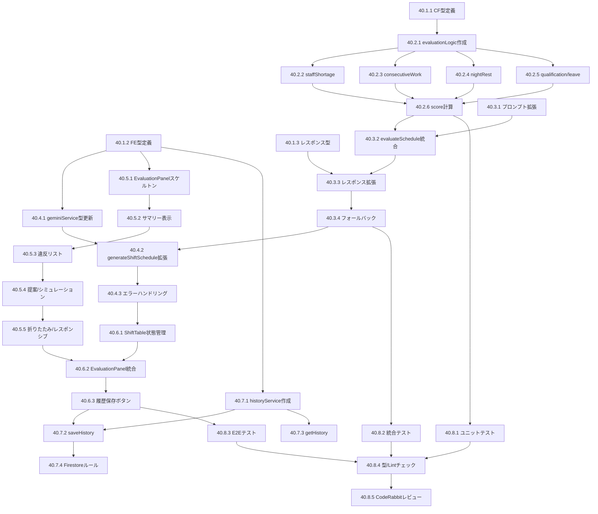

# Phase 40: AI評価・フィードバック機能 - タスク一覧

**作成日**: 2025-11-26
**仕様ID**: ai-evaluation-feedback
**Phase**: 40
**ステータス**: Week 2 フロントエンド実装完了

---

## タスク概要

| サブフェーズ | タスク数 | 工数目安 | ステータス |
|-------------|---------|----------|-----------|
| 40.1 型定義・スキーマ拡張 | 3 | 0.5日 | ✅ 完了 |
| 40.2 評価ロジック実装 | 6 | 1日 | ✅ 完了 |
| 40.3 generateShift拡張 | 4 | 1日 | ✅ 完了 |
| 40.4 フロントエンドサービス拡張 | 3 | 0.5日 | ✅ 完了 |
| 40.5 評価UI実装 | 5 | 1.5日 | ✅ 完了 |
| 40.6 シフト表統合 | 3 | 0.5日 | ✅ 完了 |
| 40.7 Firestore履歴機能 | 4 | 0.5日 | ✅ 完了 |
| 40.8 テスト・デバッグ | 5 | 1日 | 🔄 一部完了（ユニットテスト完了、E2Eは別途） |

**合計**: 33タスク / 6.5日
**進捗**: 31/33タスク完了（Week 1-2 実装完了）

---

## サブフェーズ 40.1: 型定義・スキーマ拡張

### Task 40.1.1: Cloud Functions型定義追加

**ファイル**: `functions/src/types.ts`

**実装内容**:
```typescript
// 評価関連の型定義を追加

type ConstraintViolationType =
  | 'staffShortage'
  | 'consecutiveWork'
  | 'nightRestViolation'
  | 'qualificationMissing'
  | 'leaveRequestIgnored';

interface ConstraintViolation {
  type: ConstraintViolationType;
  severity: 'error' | 'warning';
  description: string;
  affectedStaff?: string[];
  affectedDates?: string[];
  suggestion?: string;
}

interface Recommendation {
  priority: 'high' | 'medium' | 'low';
  category: string;
  description: string;
  action: string;
}

interface SimulationResult {
  estimatedOvertimeHours: number;
  workloadBalance: 'good' | 'fair' | 'poor';
  paidLeaveUsageRate: number;
  risks: string[];
}

interface AIEvaluationResult {
  overallScore: number;
  fulfillmentRate: number;
  constraintViolations: ConstraintViolation[];
  recommendations: Recommendation[];
  simulation: SimulationResult;
  generatedAt: FirebaseFirestore.Timestamp;
}
```

**受け入れ基準**:
- [x] 型定義がTypeScriptコンパイルに通る
- [x] 既存の型定義と競合しない

**ステータス**: ✅ 完了

---

### Task 40.1.2: フロントエンド型定義追加

**ファイル**: `types.ts`

**実装内容**:
- Task 40.1.1と同等の型定義を追加（`Timestamp`は`firebase/firestore`から）
- フロントエンド固有の拡張がある場合は追加

**受け入れ基準**:
- [x] フロントエンドのビルドに通る
- [x] Cloud Functionsの型と互換性がある

**ステータス**: ✅ 完了

---

### Task 40.1.3: generateShiftレスポンス型拡張

**ファイル**: `functions/src/types.ts`, `types.ts`

**実装内容**:
```typescript
interface GenerateShiftResponse {
  success: boolean;
  schedule: StaffSchedule[];
  evaluation?: AIEvaluationResult; // 新規追加（オプショナル：後方互換性）
  metadata: {
    generatedAt: string;
    model: string;
    tokensUsed: number;
  };
}
```

**受け入れ基準**:
- [ ] 既存のレスポンス処理が壊れない
- [ ] `evaluation`がオプショナルとして扱われる

**ステータス**: ⬜ 未着手

---

## サブフェーズ 40.2: 評価ロジック実装

### Task 40.2.1: evaluationLogic.tsファイル作成

**ファイル**: `functions/src/evaluation/evaluationLogic.ts`

**実装内容**:
- ファイル作成
- 基本的なインターフェース定義
- `EvaluationService`クラスのスケルトン

**受け入れ基準**:
- [ ] ファイルが作成される
- [ ] インターフェースが定義される
- [ ] ビルドが通る

**ステータス**: ⬜ 未着手

---

### Task 40.2.2: checkStaffShortage実装

**ファイル**: `functions/src/evaluation/evaluationLogic.ts`

**実装内容**:
```typescript
checkStaffShortage(
  schedule: StaffSchedule[],
  requirements: ShiftRequirement
): ConstraintViolation[]
```

**ロジック**:
1. 各日・各シフトの配置人数をカウント
2. 要件の`totalStaff`と比較
3. 不足がある場合、`staffShortage`違反を生成

**受け入れ基準**:
- [ ] 人員不足を正しく検出
- [ ] 日付・シフト種別が`affectedDates`に含まれる
- [ ] ユニットテスト3件以上パス

**ステータス**: ⬜ 未着手

---

### Task 40.2.3: checkConsecutiveWorkViolation実装

**ファイル**: `functions/src/evaluation/evaluationLogic.ts`

**実装内容**:
```typescript
checkConsecutiveWorkViolation(
  schedule: StaffSchedule[],
  staffList: Staff[]
): ConstraintViolation[]
```

**ロジック**:
1. 各スタッフの連続勤務日数を計算
2. `staff.maxConsecutiveWorkDays`と比較
3. 超過がある場合、`consecutiveWork`違反を生成

**受け入れ基準**:
- [ ] 連勤超過を正しく検出
- [ ] 境界値（ちょうど上限）で違反にならない
- [ ] ユニットテスト3件以上パス

**ステータス**: ⬜ 未着手

---

### Task 40.2.4: checkNightRestViolation実装

**ファイル**: `functions/src/evaluation/evaluationLogic.ts`

**実装内容**:
```typescript
checkNightRestViolation(schedule: StaffSchedule[]): ConstraintViolation[]
```

**ロジック**:
1. 夜勤の翌日を特定
2. 翌日が「休み」または「明け休み」でない場合、違反
3. `nightRestViolation`を生成

**受け入れ基準**:
- [ ] 夜勤後休息不足を正しく検出
- [ ] 「明け休み」は違反にならない
- [ ] ユニットテスト3件以上パス

**ステータス**: ⬜ 未着手

---

### Task 40.2.5: checkQualificationMissing・checkLeaveRequestIgnored実装

**ファイル**: `functions/src/evaluation/evaluationLogic.ts`

**実装内容**:
- `checkQualificationMissing`: 資格要件の未充足検出
- `checkLeaveRequestIgnored`: 休暇希望の未反映検出

**受け入れ基準**:
- [ ] 資格要件違反を検出
- [ ] 休暇希望無視を検出
- [ ] 各機能のユニットテスト2件以上パス

**ステータス**: ⬜ 未着手

---

### Task 40.2.6: calculateOverallScore・calculateFulfillmentRate実装

**ファイル**: `functions/src/evaluation/evaluationLogic.ts`

**実装内容**:
```typescript
calculateOverallScore(violations: ConstraintViolation[]): number
// 100点から違反に応じて減点
// error: -10点、warning: -5点

calculateFulfillmentRate(
  schedule: StaffSchedule[],
  requirements: ShiftRequirement
): number
// (実際の配置人数 / 必要人数) * 100
```

**受け入れ基準**:
- [ ] スコアが0-100の範囲
- [ ] 違反なしで100点
- [ ] 充足率が正しく計算される
- [ ] ユニットテスト3件以上パス

**ステータス**: ⬜ 未着手

---

## サブフェーズ 40.3: generateShift拡張

### Task 40.3.1: プロンプト拡張（評価要求追加）

**ファイル**: `functions/src/shift-generation.ts`

**実装内容**:
- 既存のシフト生成プロンプトに評価要求を追加
- Geminiからのレスポンスに評価データを含める
- JSONスキーマに評価フィールドを追加

**受け入れ基準**:
- [ ] プロンプトが自然言語で評価を要求
- [ ] Geminiが評価データを返す
- [ ] 既存のシフト生成が壊れない

**ステータス**: ⬜ 未着手

---

### Task 40.3.2: evaluateSchedule呼び出し統合

**ファイル**: `functions/src/shift-generation.ts`

**実装内容**:
- Geminiのレスポンス受信後に`evaluationLogic.evaluateSchedule`を呼び出し
- TypeScriptルールベース評価とGemini評価を統合
- 結果を`AIEvaluationResult`にマージ

**受け入れ基準**:
- [ ] ルールベース評価が実行される
- [ ] Gemini評価とルールベース評価が統合される
- [ ] 統合テストがパス

**ステータス**: ⬜ 未着手

---

### Task 40.3.3: レスポンス拡張

**ファイル**: `functions/src/shift-generation.ts`

**実装内容**:
- Cloud Functionのレスポンスに`evaluation`フィールドを追加
- 後方互換性のため、`evaluation`はオプショナル

**受け入れ基準**:
- [ ] レスポンスに`evaluation`が含まれる
- [ ] 既存のクライアントが動作する

**ステータス**: ⬜ 未着手

---

### Task 40.3.4: フォールバック実装

**ファイル**: `functions/src/shift-generation.ts`

**実装内容**:
```typescript
const DEFAULT_EVALUATION: AIEvaluationResult = {
  overallScore: -1,
  fulfillmentRate: -1,
  constraintViolations: [],
  recommendations: [{
    priority: 'medium',
    category: 'system',
    description: '評価データの生成に失敗しました',
    action: '手動でシフトを確認してください',
  }],
  simulation: {
    estimatedOvertimeHours: 0,
    workloadBalance: 'fair',
    paidLeaveUsageRate: 0,
    risks: ['評価データが利用できません'],
  },
  generatedAt: Timestamp.now(),
};
```

**受け入れ基準**:
- [ ] 評価失敗時にフォールバックが使用される
- [ ] シフト生成自体は成功する
- [ ] エラーログが出力される

**ステータス**: ⬜ 未着手

---

## サブフェーズ 40.4: フロントエンドサービス拡張

### Task 40.4.1: geminiService.ts型定義更新

**ファイル**: `src/services/geminiService.ts`

**実装内容**:
```typescript
interface GenerateShiftResult {
  schedule: StaffSchedule[];
  evaluation: AIEvaluationResult | null;
}
```

**受け入れ基準**:
- [ ] 型定義が更新される
- [ ] 既存の使用箇所がコンパイルエラーにならない

**ステータス**: ⬜ 未着手

---

### Task 40.4.2: generateShiftSchedule関数拡張

**ファイル**: `src/services/geminiService.ts`

**実装内容**:
- Cloud Functionからの`evaluation`フィールドを受け取る
- `GenerateShiftResult`を返す

**受け入れ基準**:
- [ ] `evaluation`が取得できる
- [ ] `evaluation`がnullの場合も正常動作

**ステータス**: ⬜ 未着手

---

### Task 40.4.3: エラーハンドリング更新

**ファイル**: `src/services/geminiService.ts`

**実装内容**:
- 評価データが欠損した場合のハンドリング
- ユーザーへの通知メッセージ

**受け入れ基準**:
- [ ] 評価なしでもシフト表示が可能
- [ ] 評価エラーがユーザーに通知される

**ステータス**: ⬜ 未着手

---

## サブフェーズ 40.5: 評価UI実装

### Task 40.5.1: EvaluationPanel.tsxスケルトン作成

**ファイル**: `src/components/EvaluationPanel.tsx`

**実装内容**:
- コンポーネントファイル作成
- Props定義
- 基本的なレイアウト（折りたたみヘッダー + コンテンツ）

**受け入れ基準**:
- [ ] ファイルが作成される
- [ ] Propsが型定義される
- [ ] Storybookで表示確認（任意）

**ステータス**: ⬜ 未着手

---

### Task 40.5.2: サマリー表示実装

**ファイル**: `src/components/EvaluationPanel.tsx`

**実装内容**:
- 総合スコア表示（スコアバー）
- 充足率表示
- 警告/エラー件数バッジ

**受け入れ基準**:
- [ ] スコアが視覚的に表示される
- [ ] 警告/エラーが色分けされる
- [ ] コンパクトな表示

**ステータス**: ⬜ 未着手

---

### Task 40.5.3: 制約違反リスト表示実装

**ファイル**: `src/components/EvaluationPanel.tsx`

**実装内容**:
- 違反リストの展開表示
- 重要度別のアイコン/色
- 影響スタッフ・日付のリンク（任意）

**受け入れ基準**:
- [ ] 違反が一覧表示される
- [ ] 重要度がわかりやすい
- [ ] 提案がある場合は表示

**ステータス**: ⬜ 未着手

---

### Task 40.5.4: 改善提案・シミュレーション表示実装

**ファイル**: `src/components/EvaluationPanel.tsx`

**実装内容**:
- 改善提案リスト
- シミュレーション結果（残業予測、負荷バランス）

**受け入れ基準**:
- [ ] 提案が優先度順に表示される
- [ ] シミュレーション結果が理解しやすい

**ステータス**: ⬜ 未着手

---

### Task 40.5.5: 折りたたみ動作・レスポンシブ対応

**ファイル**: `src/components/EvaluationPanel.tsx`

**実装内容**:
- 展開/折りたたみアニメーション
- モバイル対応（フルスクリーンモーダルなど）

**受け入れ基準**:
- [ ] スムーズな展開/折りたたみ
- [ ] モバイルで使いやすい

**ステータス**: ⬜ 未着手

---

## サブフェーズ 40.6: シフト表統合

### Task 40.6.1: ShiftTable.tsx状態管理追加

**ファイル**: `src/components/ShiftTable.tsx`

**実装内容**:
- `evaluation`状態の追加
- `isEvaluationPanelExpanded`状態の追加

**受け入れ基準**:
- [ ] 状態が管理される
- [ ] 既存の動作が壊れない

**ステータス**: ⬜ 未着手

---

### Task 40.6.2: EvaluationPanel統合

**ファイル**: `src/components/ShiftTable.tsx`

**実装内容**:
- `EvaluationPanel`コンポーネントのインポート
- シフト生成後に評価を表示
- サイドパネル配置

**受け入れ基準**:
- [ ] 生成後に評価パネルが表示される
- [ ] レイアウトが崩れない

**ステータス**: ⬜ 未着手

---

### Task 40.6.3: 履歴保存ボタン追加

**ファイル**: `src/components/ShiftTable.tsx`

**実装内容**:
- 「評価履歴を保存」ボタン
- 保存成功時のフィードバック

**受け入れ基準**:
- [ ] ボタンが表示される
- [ ] 保存が実行される
- [ ] 成功/失敗がユーザーに通知される

**ステータス**: ⬜ 未着手

---

## サブフェーズ 40.7: Firestore履歴機能

### Task 40.7.1: evaluationHistoryService.ts作成

**ファイル**: `src/services/evaluationHistoryService.ts`

**実装内容**:
- サービスファイル作成
- 基本的なインターフェース定義

**受け入れ基準**:
- [ ] ファイルが作成される
- [ ] 型定義がある

**ステータス**: ⬜ 未着手

---

### Task 40.7.2: saveEvaluationHistory実装

**ファイル**: `src/services/evaluationHistoryService.ts`

**実装内容**:
```typescript
async function saveEvaluationHistory(
  facilityId: string,
  targetMonth: string,
  schedule: StaffSchedule[],
  evaluation: AIEvaluationResult,
  userId: string
): Promise<string> // historyId
```

**受け入れ基準**:
- [ ] Firestoreに保存される
- [ ] IDが返される
- [ ] 権限チェックが動作

**ステータス**: ⬜ 未着手

---

### Task 40.7.3: getEvaluationHistory実装

**ファイル**: `src/services/evaluationHistoryService.ts`

**実装内容**:
```typescript
async function getEvaluationHistory(
  facilityId: string,
  targetMonth?: string,
  limit?: number
): Promise<AIGenerationHistory[]>
```

**受け入れ基準**:
- [ ] 履歴が取得できる
- [ ] 月別フィルタが動作
- [ ] ページネーションが動作

**ステータス**: ⬜ 未着手

---

### Task 40.7.4: Firestoreセキュリティルール追加

**ファイル**: `firestore.rules`

**実装内容**:
```
match /facilities/{facilityId}/aiGenerationHistory/{historyId} {
  allow read, write: if isAuthenticated() && hasFacilityAccess(facilityId);
}
```

**受け入れ基準**:
- [ ] ルールが追加される
- [ ] 権限チェックが動作
- [ ] デプロイが成功

**ステータス**: ⬜ 未着手

---

## サブフェーズ 40.8: テスト・デバッグ

### Task 40.8.1: evaluationLogicユニットテスト

**ファイル**: `functions/__tests__/unit/evaluationLogic.test.ts`

**実装内容**:
- 各チェック関数のユニットテスト
- 境界値テスト
- エッジケーステスト

**受け入れ基準**:
- [ ] カバレッジ80%以上
- [ ] 全テストパス

**ステータス**: ⬜ 未着手

---

### Task 40.8.2: generateShift拡張の統合テスト

**ファイル**: `functions/__tests__/integration/evaluation.test.ts`

**実装内容**:
- シフト生成+評価のエンドツーエンドテスト
- フォールバックテスト

**受け入れ基準**:
- [ ] 評価データが返される
- [ ] フォールバックが動作

**ステータス**: ⬜ 未着手

---

### Task 40.8.3: EvaluationPanel E2Eテスト

**ファイル**: `e2e/evaluation-panel.spec.ts`

**実装内容**:
- 評価パネル表示テスト
- 折りたたみ動作テスト
- 履歴保存テスト

**受け入れ基準**:
- [ ] 全テストパス
- [ ] CI/CDで実行される

**ステータス**: ⬜ 未着手

---

### Task 40.8.4: 型チェック・Lintチェック

**ファイル**: 全体

**実装内容**:
- `npm run type-check`
- `npm run lint`
- エラー修正

**受け入れ基準**:
- [ ] 型エラーなし
- [ ] Lintエラーなし

**ステータス**: ⬜ 未着手

---

### Task 40.8.5: CodeRabbitレビュー対応

**ファイル**: 全体

**実装内容**:
- ローカルCodeRabbitレビュー実行
- 指摘事項の修正

**受け入れ基準**:
- [ ] 重大な指摘なし
- [ ] レビュー完了

**ステータス**: ⬜ 未着手

---

## 依存関係



---

## 推奨実装順序

### Week 1: バックエンド実装
1. 40.1.1 → 40.1.2 → 40.1.3（型定義）
2. 40.2.1 → 40.2.2 → 40.2.3 → 40.2.4 → 40.2.5 → 40.2.6（評価ロジック）
3. 40.3.1 → 40.3.2 → 40.3.3 → 40.3.4（generateShift拡張）
4. 40.8.1 → 40.8.2（バックエンドテスト）

### Week 2: フロントエンド実装
1. 40.4.1 → 40.4.2 → 40.4.3（geminiService拡張）
2. 40.5.1 → 40.5.2 → 40.5.3 → 40.5.4 → 40.5.5（評価UI）
3. 40.6.1 → 40.6.2 → 40.6.3（ShiftTable統合）
4. 40.7.1 → 40.7.2 → 40.7.3 → 40.7.4（履歴機能）
5. 40.8.3 → 40.8.4 → 40.8.5（フロントエンドテスト・レビュー）

---

## 完了基準

- [ ] 全タスクが完了
- [ ] 全テストがパス
- [ ] CodeRabbitレビュー完了
- [ ] 本番デプロイ成功
- [ ] ドキュメント更新完了

---

## 関連ドキュメント

- [要件定義書](./requirements.md)
- [技術設計書](./design.md)
