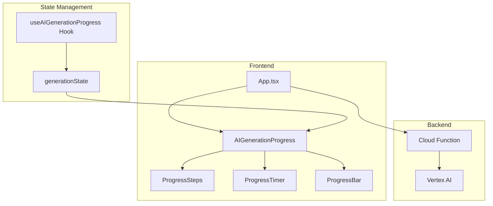
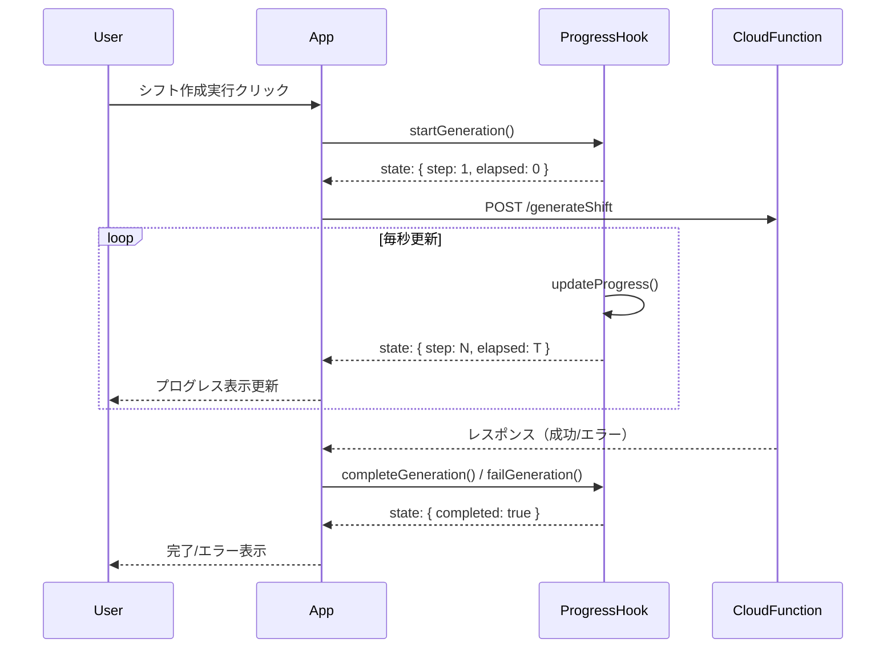
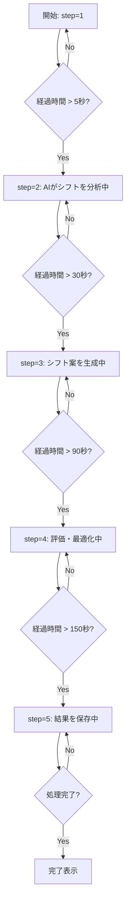
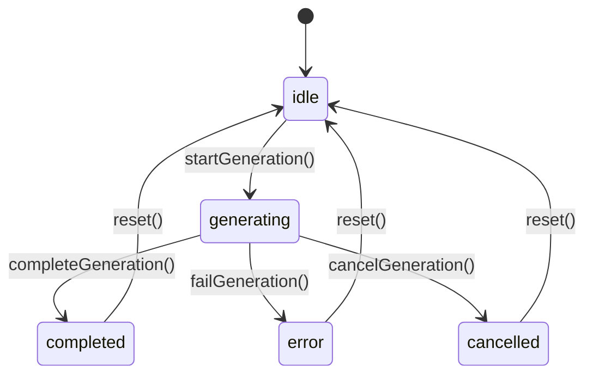
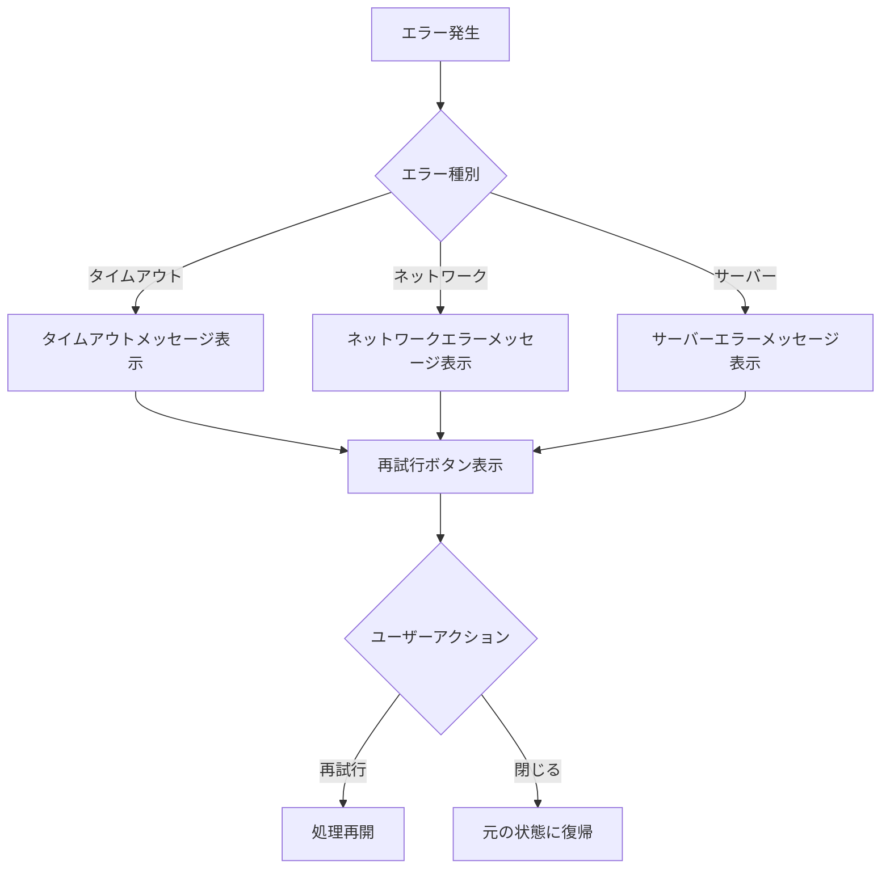

# Technical Design Document

## Overview

**Purpose**: この機能は、AIシフト生成処理（約2〜3分）の待ち時間中に、ユーザーに進行状況を視覚的に表示し、処理が正常に進行していることを明示することで、ユーザー体験を向上させます。

**Users**: 施設管理者および事業所責任者がAIシフト生成機能を利用する際に、この進行状況表示を活用します。

**Impact**: 現在の単純なローディング表示を、段階的なステップ表示、経過時間、予測時間を含むリッチなプログレスインジケーターに置き換えます。

### Goals

- ユーザーにAI処理の進行状況を明確に伝達する
- 処理が正常に進行していることを視覚的に確認できるようにする
- 待ち時間の不安を軽減し、離脱率を低減する
- 既存のCloud Functionアーキテクチャを変更せずに実装する

### Non-Goals

- Cloud Functionからのリアルタイム進行状況の取得（将来検討）
- Firestoreを使用したリアルタイム更新（将来検討）
- Server-Sent Eventsの導入（将来検討）
- バックエンド側の処理時間最適化

---

## Architecture

### 既存アーキテクチャ分析

現在の実装:
- `App.tsx`: `isLoading`, `generatingSchedule` stateでローディング状態を管理
- `services/geminiService.ts`: Cloud Functionへの単一HTTP POSTリクエスト（タイムアウト180秒）
- Cloud Function: Vertex AI Gemini 2.5 Flashを呼び出し（タイムアウト300秒）

**制約**: Cloud Functionは単一のHTTP POST/レスポンス方式のため、途中経過をリアルタイムで返すことはできない。

### High-Level Architecture



### Technology Alignment

**既存パターンの維持**:
- React Functional Components + TypeScript
- TailwindCSSによるスタイリング
- 既存のButtonコンポーネント（Phase 42で統一済み）

**新規導入**:
- カスタムフック `useAIGenerationProgress` による状態管理
- 時間ベースの疑似プログレス計算ロジック

---

## Key Design Decisions

### Decision 1: クライアントサイド疑似プログレス

**Context**: Cloud Functionは単一HTTP POST/レスポンス方式のため、途中経過を返せない

**Alternatives**:
1. Firestoreリアルタイム更新: Cloud FunctionがFirestoreに書き込み、フロントエンドがリッスン
2. Server-Sent Events: ストリーミングでイベント送信
3. クライアントサイド疑似プログレス: 時間ベースで推定表示

**Selected Approach**: クライアントサイド疑似プログレス

**Rationale**:
- 既存のCloud Function実装を変更不要
- 迅速な実装・デプロイが可能
- ユーザー体験の大幅な改善を実現

**Trade-offs**:
- 実際の処理進捗とは一致しない（推定値）
- 処理が早く終わった場合、ステップが一気に進む可能性

### Decision 2: 5段階ステップ表示

**Context**: ユーザーに処理の進行を具体的に伝えたい

**Alternatives**:
1. 単純なスピナーのみ
2. パーセント表示のみ
3. 段階的なステップ表示

**Selected Approach**: 5段階のステップ表示

**Rationale**:
- 処理が何をしているかをユーザーに伝達できる
- 各ステップに適切な時間配分を設定可能
- 完了したステップにチェックマークを表示することで進捗を明示

**Trade-offs**:
- 実際の処理フェーズとは対応しない（疑似的）
- ステップ数が多すぎると煩雑になる

---

## System Flows

### AI生成プログレスフロー



### ステップ進行ロジック



---

## Components and Interfaces

### Presentation Layer

#### AIGenerationProgress

**Responsibility & Boundaries**
- **Primary Responsibility**: AI生成処理の進行状況をユーザーに表示する
- **Domain Boundary**: UIプレゼンテーション層
- **Data Ownership**: 表示状態のみ（実際の状態はフックが管理）

**Dependencies**
- **Inbound**: App.tsx
- **Outbound**: ProgressSteps, ProgressTimer, ProgressBar, Button

**Contract Definition**

```typescript
interface AIGenerationProgressProps {
  isVisible: boolean;
  state: GenerationProgressState;
  onCancel: () => void;
}

interface GenerationProgressState {
  status: 'idle' | 'generating' | 'completed' | 'error' | 'cancelled';
  currentStep: number;
  elapsedSeconds: number;
  estimatedTotalSeconds: number;
  errorMessage?: string;
}
```

#### ProgressSteps

**Responsibility**: 5段階のステップを表示し、現在のステップをハイライト

```typescript
interface ProgressStepsProps {
  currentStep: number;
  steps: StepDefinition[];
}

interface StepDefinition {
  id: number;
  label: string;
  description: string;
}
```

#### ProgressTimer

**Responsibility**: 経過時間と予測時間を表示

```typescript
interface ProgressTimerProps {
  elapsedSeconds: number;
  estimatedTotalSeconds: number;
}
```

### State Management Layer

#### useAIGenerationProgress Hook

**Responsibility & Boundaries**
- **Primary Responsibility**: AI生成処理の進行状態を管理し、時間ベースで疑似プログレスを計算
- **Domain Boundary**: 状態管理ロジック

**Contract Definition**

```typescript
interface UseAIGenerationProgressReturn {
  state: GenerationProgressState;
  startGeneration: () => void;
  completeGeneration: () => void;
  failGeneration: (errorMessage: string) => void;
  cancelGeneration: () => void;
  reset: () => void;
}

function useAIGenerationProgress(
  estimatedTotalSeconds?: number
): UseAIGenerationProgressReturn;
```

**State Transitions**



---

## Data Models

### GenerationProgressState

```typescript
interface GenerationProgressState {
  status: GenerationStatus;
  currentStep: number;
  elapsedSeconds: number;
  estimatedTotalSeconds: number;
  errorMessage?: string;
}

type GenerationStatus = 'idle' | 'generating' | 'completed' | 'error' | 'cancelled';
```

### StepDefinition

```typescript
interface StepDefinition {
  id: number;
  label: string;
  description: string;
  startTimeSeconds: number;
}

const GENERATION_STEPS: StepDefinition[] = [
  { id: 1, label: 'リクエスト送信中', description: 'サーバーにリクエストを送信しています...', startTimeSeconds: 0 },
  { id: 2, label: 'AIがシフトを分析中', description: 'スタッフ情報と制約条件を分析しています...', startTimeSeconds: 5 },
  { id: 3, label: 'シフト案を生成中', description: 'AIがシフト案を生成しています...', startTimeSeconds: 30 },
  { id: 4, label: '評価・最適化中', description: '生成されたシフトを評価・最適化しています...', startTimeSeconds: 90 },
  { id: 5, label: '結果を保存中', description: 'シフトデータを保存しています...', startTimeSeconds: 150 },
];
```

---

## Error Handling

### Error Categories

| カテゴリ | 状況 | 対応 |
|---------|------|------|
| ネットワークエラー | 接続失敗、タイムアウト | エラーメッセージ表示、再試行ボタン |
| サーバーエラー | Cloud Function 500エラー | エラーメッセージ表示、再試行ボタン |
| キャンセル | ユーザーによる中断 | キャンセル確認、元の状態に復帰 |

### Error Flow



---

## Testing Strategy

### Unit Tests

1. `useAIGenerationProgress` フック
   - 初期状態の検証
   - `startGeneration()` 呼び出し後の状態遷移
   - 時間経過によるステップ進行
   - `completeGeneration()` / `failGeneration()` の動作

2. `AIGenerationProgress` コンポーネント
   - 各状態での表示内容
   - キャンセルボタンの動作
   - アクセシビリティ属性の検証

3. `ProgressSteps` コンポーネント
   - 現在のステップのハイライト
   - 完了ステップのチェックマーク表示

### Integration Tests

1. App.tsx統合
   - シフト作成実行からプログレス表示開始まで
   - 処理完了時のプログレス非表示
   - エラー時の表示

---

## Requirements Traceability

| 要件 | 概要 | コンポーネント | フロー |
|------|------|---------------|--------|
| 1.1 | プログレスインジケーター表示 | AIGenerationProgress | AI生成プログレスフロー |
| 1.2 | 段階的ステップ表示 | ProgressSteps | ステップ進行ロジック |
| 2.1 | 5段階ステップ定義 | GENERATION_STEPS定数 | - |
| 2.2 | 現在ステップのハイライト | ProgressSteps | - |
| 2.3 | 完了チェックマーク | ProgressSteps | - |
| 3.1 | 予測時間表示 | ProgressTimer | - |
| 3.2 | 経過時間表示 | ProgressTimer | - |
| 4.1 | アニメーション表示 | ProgressBar | - |
| 5.1-5.4 | ボタン無効化・復帰 | App.tsx（既存） | - |
| 6.1-6.4 | キャンセル機能 | AIGenerationProgress | Error Flow |

---

## File Structure

```
src/
├── components/
│   └── AIGenerationProgress/
│       ├── AIGenerationProgress.tsx    # メインコンポーネント
│       ├── ProgressSteps.tsx           # ステップ表示
│       ├── ProgressTimer.tsx           # 時間表示
│       ├── ProgressBar.tsx             # プログレスバー
│       └── index.ts                    # エクスポート
├── hooks/
│   └── useAIGenerationProgress.ts      # カスタムフック
└── constants/
    └── generationSteps.ts              # ステップ定義

# 変更対象
App.tsx                                  # プログレス統合
```

---

## Non-Functional Requirements

### パフォーマンス
- プログレス更新は1秒間隔（requestAnimationFrameまたはsetInterval）
- UI遅延は50ms以内

### アクセシビリティ
- `aria-live="polite"` でスクリーンリーダー対応
- `aria-valuenow`, `aria-valuemin`, `aria-valuemax` でプログレスバーの状態を伝達
- 適切なフォーカス管理

### レスポンシブ
- モバイル・タブレットで適切に表示
- 小画面ではステップ説明を省略表示
