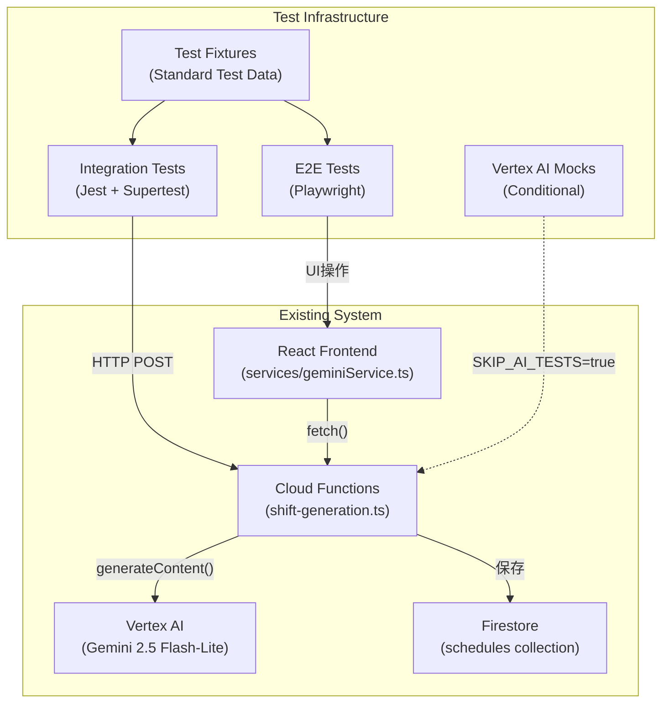
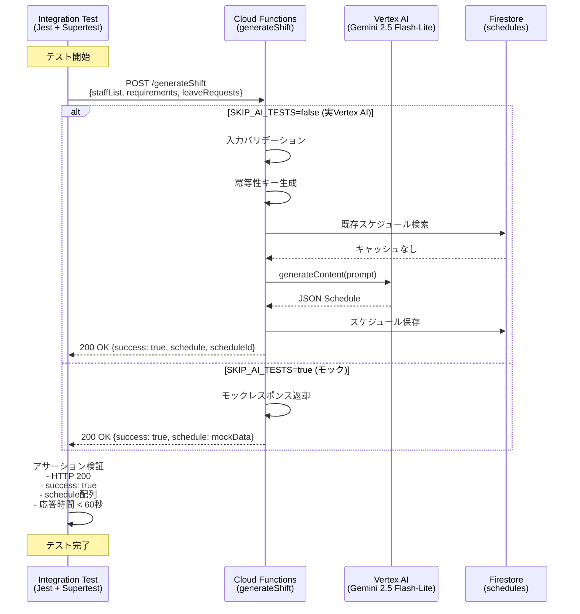
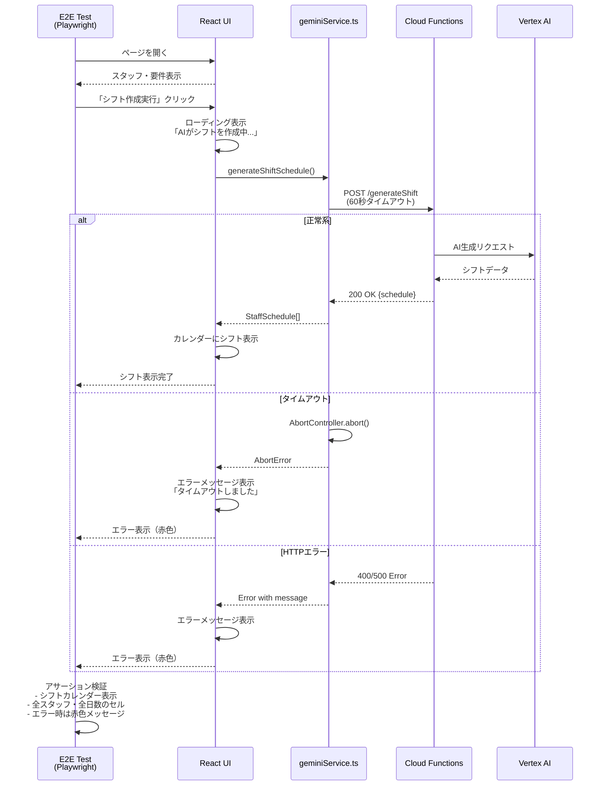
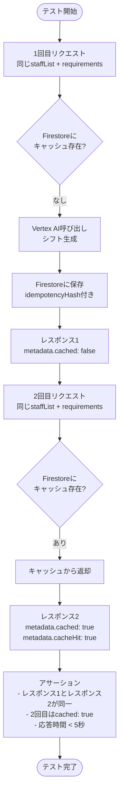
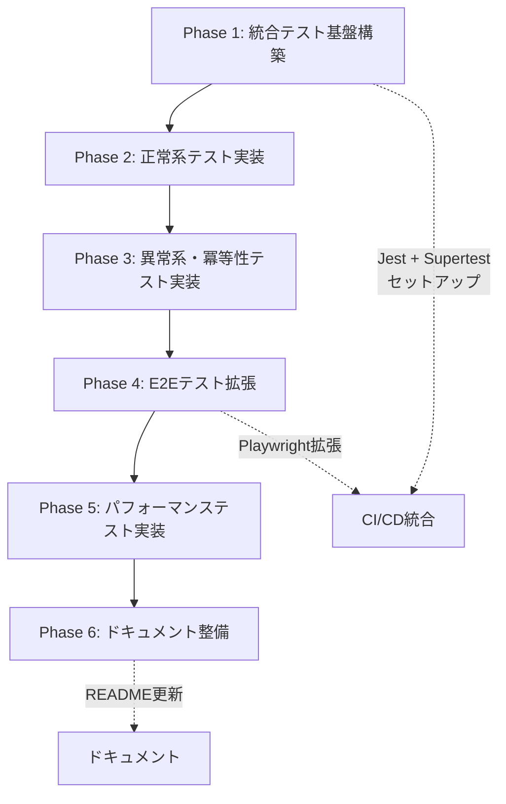

# Technical Design: AI Shift Integration Test

## Overview

本機能は、既にデプロイ済みのAIシフト自動生成システム（Cloud Functions + Vertex AI Gemini 2.5 Flash-Lite）の動作を、TDD（テスト駆動開発）アプローチで包括的に検証します。統合テストとE2Eテストを通じて、AI生成機能が要件通りに動作し、本番環境で安定稼働することを保証します。

**目的**: 既存のAIシフト生成機能が、実際のVertex AI呼び出しを含めて正しく動作することを検証する自動テストスイートを構築する。

**ユーザー**: 開発者、QAエンジニア、DevOpsエンジニアが、本番環境へのデプロイ前後にシステムの健全性を確認するために利用します。

**影響**: 既存システムに新規テストコードを追加します。実装コードの変更は最小限に留め、テストカバレッジを大幅に向上させます。

### Goals

- Cloud Functions統合テストフレームワークの構築（Jest + Supertest）
- AI シフト生成APIの正常系・異常系テストの実装
- 冪等性（キャッシュ機能）の動作検証
- パフォーマンステストの実装（5/20/50名スタッフ）
- E2Eテストの拡張（実際のUI経由でのAI生成テスト）
- CI/CD環境でのコスト最適化（モック使用）

### Non-Goals

- 既存実装コードの大規模な変更やリファクタリング
- Vertex AI APIの詳細な振る舞いテスト（Googleの責任範囲）
- 新しいAI機能の追加
- 本番環境でのCI/CD自動テスト実行（コスト考慮）

## Architecture

### Existing Architecture Analysis

本プロジェクトは既に以下のアーキテクチャで実装・デプロイ済みです：

**現在のアーキテクチャパターン**:
- **フロントエンド**: React 19 + TypeScript + Vite（SPAパターン）
- **バックエンド**: Cloud Functions Gen 2（サーバーレス）
- **AI統合**: Vertex AI SDK経由でGemini 2.5 Flash-Lite呼び出し
- **データ永続化**: Firestore（スケジュール保存）
- **セキュリティ**: APIキー非公開（Cloud Functions経由）、CORS有効化

**既存ドメイン境界**:
- `services/geminiService.ts`: フロントエンドからのCloud Functions呼び出し層
- `functions/src/shift-generation.ts`: バックエンドAIシフト生成ロジック
- `e2e/`: 既存E2Eテスト（Playwright）

**保持すべき統合ポイント**:
- Cloud Functions URL: `https://us-central1-ai-care-shift-scheduler.cloudfunctions.net/generateShift`
- Firestore コレクション: `schedules`
- 既存の型定義: `types.ts` および `functions/src/types.ts`

**対処する技術的負債**:
- テストカバレッジ不足: 現在、Cloud Functions統合テストが存在しない
- AI動作未検証: デプロイ後、実際のVertex AI呼び出しが成功するかの自動検証なし
- パフォーマンス未測定: 応答時間の計測と検証が未実装

### High-Level Architecture



**アーキテクチャ統合**:
- **既存パターンの保持**: サーバーレスアーキテクチャ、Firestoreデータモデルは変更なし
- **新規コンポーネントの追加理由**:
  - 統合テスト: Cloud Functions APIの動作を直接検証するため必須
  - テストフィクスチャ: 一貫性のあるテストデータで再現性を確保
  - モック: CI/CD環境でのコスト削減とテスト高速化
- **技術スタック整合性**: Node.js 20、TypeScript 5.x、既存ツールチェーンを再利用
- **Steering準拠**: structure.md の `__tests__/` ディレクトリ構造、tech.md のCI/CD戦略に準拠

### Technology Alignment

本機能は既存の技術スタックに整合するテストインフラを構築します。

**既存技術スタックとの整合**:
- **フロントエンド**: React 19 + TypeScript 5.8 + Vite 6（変更なし）
- **バックエンド**: Cloud Functions Gen 2 + Node.js 20（変更なし）
- **E2Eテスト**: Playwright（既存、拡張のみ）
- **新規追加**: Jest 29.x（Cloud Functions統合テスト用）

**新規依存関係の導入**:
- `jest`: Node.js向け標準テストフレームワーク
- `ts-jest`: TypeScript対応Jestプリセット
- `supertest`: HTTP APIテスト用ライブラリ
- `@types/jest`, `@types/supertest`: 型定義

**既存パターンからの逸脱**:
- なし。すべて既存の技術選定方針（TypeScript、Node.js 20、GCP）に準拠。

### Key Design Decisions

#### Decision 1: Jest + Supertestによる統合テスト

**Decision**: Cloud Functions統合テストにJest + Supertestを使用する。

**Context**:
- Cloud Functionsは既にデプロイ済みで、APIエンドポイントが公開されている
- 統合テストでは、実際のHTTPリクエストを送信してレスポンスを検証する必要がある
- Node.js環境でのテストフレームワーク選定が求められる

**Alternatives**:
1. **Mocha + Chai**: 柔軟性が高いが、設定が複雑
2. **Vitest**: Viteエコシステムに最適化されているが、Cloud Functions（Node.js）環境との互換性が不透明
3. **Jest + Supertest**: Node.js標準、TypeScript対応、HTTP APIテストに最適

**Selected Approach**: Jest 29.x + Supertest + ts-jest
- Jestでテストスイートとアサーションを記述
- Supertestで実際のCloud Functions URLにHTTPリクエストを送信
- ts-jestでTypeScriptコードを直接実行
- CI/CD環境では`SKIP_AI_TESTS`環境変数でモック切り替え

**Rationale**:
- **業界標準**: Node.jsエコシステムで最も広く使用されているテストフレームワーク
- **TypeScript対応**: ts-jestで追加設定なしで動作
- **HTTP テスト**: SupertestがExpress/Cloud Functions APIのテストに最適化
- **モック機能**: jest.mockで条件付きモック実装が容易
- **学習コスト低**: 既存チームメンバーのJest経験を活用可能

**Trade-offs**:
- **得るもの**: 成熟したエコシステム、豊富なドキュメント、CI/CD統合の容易さ
- **失うもの**: Vite環境との統一性（フロントエンドはVitest、バックエンドはJest）

#### Decision 2: 条件付きVertex AIモック戦略

**Decision**: 環境変数`SKIP_AI_TESTS`に基づき、Vertex AI呼び出しをモックするかを切り替える。

**Context**:
- Vertex AI APIの呼び出しにはコストがかかる（入力・出力トークン課金）
- CI/CD環境での自動テスト実行時に、毎回実際のAI呼び出しを行うとコストが膨大
- 一方、本番環境での動作確認には実際のVertex AI統合が必須

**Alternatives**:
1. **常にモック**: コストゼロだが、実際のAI統合を検証できない
2. **常に実Vertex AI**: 完全な統合検証だが、CI/CDコストが高額
3. **条件付きモック**: 環境変数で切り替え、ローカル/手動テストでは実API使用

**Selected Approach**: 環境変数による条件付きモック
```typescript
// 疑似コード
if (process.env.SKIP_AI_TESTS === 'true') {
  // モックレスポンスを返す
  return mockVertexAIResponse;
} else {
  // 実際のVertex AI呼び出し
  return await vertexAI.generateContent(...);
}
```

**Rationale**:
- **コスト最適化**: CI/CD環境では常にモックを使用し、Vertex AIコストをゼロに
- **実環境検証**: ローカル開発環境や手動テストでは実際のAI呼び出しで動作確認
- **柔軟性**: デプロイ前の最終確認では`SKIP_AI_TESTS=false`で実行可能
- **CI/CD高速化**: モック使用時はテスト実行時間が大幅短縮（60秒 → 1秒）

**Trade-offs**:
- **得るもの**: CI/CDコスト削減、テスト高速化、本番同等環境での検証オプション
- **失うもの**: CI/CDでの完全な統合検証（手動テストフローが必要）

**Implementation Note**: モックはVertex AI SDKではなく、Cloud Functions内部でレスポンスを返すロジックを挿入することで実現します。これにより、APIキー設定なしでCI/CD実行が可能になります。

#### Decision 3: テストデータの集約とフィクスチャパターン

**Decision**: すべてのテストで使用する標準データを`functions/__tests__/fixtures/test-data.ts`に集約する。

**Context**:
- 統合テストとE2Eテストで同じテストデータを使用する必要がある
- テストデータの変更時に、複数のテストファイルを修正するのは非効率
- 一貫性のあるテストデータで再現性のあるテスト結果を保証したい

**Selected Approach**: Fixture Pattern
```typescript
// functions/__tests__/fixtures/test-data.ts
export const STANDARD_STAFF_LIST: Staff[] = [ /* 5名の標準スタッフ */ ];
export const STANDARD_REQUIREMENTS: ShiftRequirement = { /* 標準要件 */ };
export const STANDARD_LEAVE_REQUESTS: LeaveRequest = { /* サンプル休暇 */ };
export const MOCK_VERTEX_AI_RESPONSE = { /* モックレスポンス */ };
```

**Rationale**:
- **DRY原則**: テストデータの重複排除
- **保守性向上**: データ変更時の修正箇所が1ファイルに集約
- **一貫性保証**: すべてのテストで同じベースラインデータを使用
- **可読性向上**: テストコード内にデータ定義が埋もれない

**Trade-offs**:
- **得るもの**: 保守性、一貫性、可読性
- **失うもの**: テストケース特有のデータをその場で定義する柔軟性（ただし、フィクスチャをベースに部分的に変更可能）

## System Flows

### Integration Test Flow



### E2E Test Flow (AI Shift Generation)



### Idempotency Test Flow (Cache Hit)



## Requirements Traceability

| Requirement | Summary | Components | Interfaces | Flows |
|-------------|---------|------------|------------|-------|
| 1.1-1.4 | 統合テストフレームワーク構築 | IntegrationTestSuite | JestConfig, TestRunner | - |
| 2.1-2.8 | AIシフト生成API正常系テスト | ShiftGenerationTest | POST /generateShift | Integration Test Flow |
| 3.1-3.8 | 入力バリデーションテスト | ValidationTest | POST /generateShift (400/413) | - |
| 4.1-4.7 | 冪等性検証 | IdempotencyTest | Firestore Cache | Idempotency Test Flow |
| 5.1-5.7 | エラーハンドリングとタイムアウト | ErrorHandlingTest | Frontend + Backend | E2E Test Flow (エラー系) |
| 6.1-6.9 | E2Eテスト実装 | AIShiftE2ETest | Playwright + UI | E2E Test Flow |
| 7.1-7.6 | パフォーマンステスト | PerformanceTest | POST /generateShift (時間計測) | - |
| 8.1-8.5 | ドキュメント | TestingGuide.md, Troubleshooting.md | - | - |
| 9.1-9.6 | テストデータとモック | TestFixtures, VertexAIMock | test-data.ts | - |

## Components and Interfaces

### Test Infrastructure

#### IntegrationTestSuite

**Responsibility & Boundaries**
- **Primary Responsibility**: Cloud Functions統合テストの実行基盤を提供する
- **Domain Boundary**: テストドメイン（既存システムには影響なし）
- **Data Ownership**: テスト結果、テストレポート
- **Transaction Boundary**: テストケース単位（各テストは独立）

**Dependencies**
- **Inbound**: CI/CDパイプライン（GitHub Actions）、開発者のローカル環境
- **Outbound**: Cloud Functions APIエンドポイント、Jest実行環境
- **External**:
  - Jest 29.x: テストフレームワーク（公式ドキュメント: https://jestjs.io/）
  - Supertest: HTTP APIテスト（公式ドキュメント: https://github.com/ladjs/supertest）
  - ts-jest: TypeScript変換（公式ドキュメント: https://kulshekhar.github.io/ts-jest/）

**Contract Definition**

**Service Interface**:
```typescript
// functions/__tests__/integration/shift-generation.test.ts

interface IntegrationTestSuite {
  // 正常系テスト
  testSuccessfulShiftGeneration(staffCount: number): Promise<void>;

  // バリデーションテスト
  testInputValidation(invalidInput: Partial<ShiftRequest>): Promise<void>;

  // 冪等性テスト
  testIdempotency(request: ShiftRequest): Promise<void>;

  // パフォーマンステスト
  testPerformance(staffCount: number, maxDuration: number): Promise<void>;
}

interface ShiftRequest {
  staffList: Staff[];
  requirements: ShiftRequirement;
  leaveRequests: LeaveRequest;
}
```

- **Preconditions**:
  - Cloud Functions が us-central1 にデプロイ済み
  - 環境変数 `CLOUD_FUNCTION_URL` または `GCP_PROJECT_ID` が設定済み
  - `SKIP_AI_TESTS` が設定されている場合はモックモード
- **Postconditions**:
  - テスト結果がJUnit XML形式でエクスポートされる
  - すべてのアサーションがパス、または詳細なエラーレポート
- **Invariants**:
  - 各テストケースは独立して実行可能
  - テスト実行順序に依存しない

**API Contract**:

| Method | Endpoint | Request | Response | Errors |
|--------|----------|---------|----------|--------|
| POST | /generateShift | `{staffList: Staff[], requirements: ShiftRequirement, leaveRequests: LeaveRequest}` | `{success: true, schedule: StaffSchedule[], scheduleId: string, metadata: {...}}` | 400 (バリデーションエラー), 413 (リクエスト過大), 500 (サーバーエラー) |

**詳細スキーマ**:
```typescript
// リクエスト
interface GenerateShiftRequest {
  staffList: Staff[];           // 1-200名のスタッフ
  requirements: ShiftRequirement; // targetMonth必須
  leaveRequests: LeaveRequest;  // 最大500エントリ
}

// レスポンス（成功）
interface GenerateShiftResponse {
  success: true;
  schedule: StaffSchedule[];    // 全スタッフの月間スケジュール
  scheduleId: string;           // Firestore Document ID
  metadata: {
    generatedAt?: string;       // ISO 8601形式
    model: string;              // "gemini-2.5-flash-lite"
    tokensUsed: number;         // 使用トークン数
    cached?: boolean;           // キャッシュヒットの場合true
    cacheHit?: boolean;         // 冪等性キーマッチの場合true
  };
}

// レスポンス（エラー）
interface GenerateShiftErrorResponse {
  success: false;
  error: string;                // エラーメッセージ（スタックトレースなし）
}
```

**State Management**: テストスイート自体はステートレス。各テストケースは独立。

**Integration Strategy**:
- **Modification Approach**: 既存コードは変更せず、新規テストコードのみ追加
- **Backward Compatibility**: 既存のCloud Functions APIインターフェースを変更しない
- **Migration Path**: 段階的にテストケースを追加。最初に正常系、次に異常系、最後にパフォーマンステスト

---

#### E2ETestSuite (Playwright)

**Responsibility & Boundaries**
- **Primary Responsibility**: ユーザーシナリオ全体（UIからAI生成まで）をブラウザ上で検証
- **Domain Boundary**: フロントエンドUIテストドメイン
- **Data Ownership**: E2Eテスト結果、スクリーンショット、動画
- **Transaction Boundary**: ユーザーシナリオ単位（ページ読み込み → シフト生成 → 結果表示）

**Dependencies**
- **Inbound**: CI/CDパイプライン、開発者のローカル環境
- **Outbound**: React UI（ブラウザ）、Cloud Functions（間接的）
- **External**:
  - Playwright: E2Eテストフレームワーク（公式ドキュメント: https://playwright.dev/）
  - Chromium: テスト実行ブラウザ

**Contract Definition**

**Service Interface**:
```typescript
// e2e/ai-shift-generation.spec.ts

interface E2ETestSuite {
  // UI操作テスト
  testAIShiftGenerationUI(): Promise<void>;

  // ローディング表示テスト
  testLoadingIndicator(): Promise<void>;

  // エラー表示テスト
  testErrorDisplay(errorType: 'timeout' | 'network' | 'http'): Promise<void>;

  // シフト表示テスト
  testShiftCalendarDisplay(): Promise<void>;
}
```

- **Preconditions**:
  - 本番環境（https://ai-care-shift-scheduler.web.app）または開発サーバーが起動
  - Playwrightブラウザがインストール済み
  - CI環境では`CI=true`でスキップ（コスト削減）
- **Postconditions**:
  - テストレポート生成（HTML形式）
  - 失敗時はスクリーンショット・動画保存
- **Invariants**:
  - 各テストはブラウザの新規コンテキストで実行
  - テスト間でブラウザ状態を共有しない

**Event Contract**:
- **Published Events**: なし（E2Eテストはイベント購読者）
- **Subscribed Events**: UI イベント（ボタンクリック、フォーム送信）
- **Ordering**: テストステップは順序依存（ページ読み込み → 操作 → アサーション）
- **Delivery**: ブラウザイベントループ経由（Playwright制御）

**Integration Strategy**:
- **Modification Approach**: 既存E2Eテスト（e2e/shift-creation.spec.ts）を参考に、新規テストファイル追加
- **Backward Compatibility**: 既存E2Eテストは維持、新規テストは独立
- **Migration Path**: e2e/ai-shift-generation.spec.ts を新規作成、既存テストと並行実行

---

#### TestFixtures

**Responsibility & Boundaries**
- **Primary Responsibility**: 統合テスト・E2Eテストで使用する標準テストデータの提供
- **Domain Boundary**: テストデータドメイン
- **Data Ownership**: フィクスチャデータ（スタッフリスト、要件、モックレスポンス）
- **Transaction Boundary**: なし（静的データ）

**Dependencies**
- **Inbound**: IntegrationTestSuite, E2ETestSuite
- **Outbound**: なし（純粋なデータ提供）
- **External**: なし

**Contract Definition**

**Service Interface**:
```typescript
// functions/__tests__/fixtures/test-data.ts

export interface TestFixtures {
  STANDARD_STAFF_LIST: Staff[];           // 5名の標準スタッフ
  LARGE_STAFF_LIST: Staff[];              // 20名のスタッフ（パフォーマンステスト用）
  EXTRA_LARGE_STAFF_LIST: Staff[];        // 50名のスタッフ（パフォーマンステスト用）
  STANDARD_REQUIREMENTS: ShiftRequirement; // 4つの時間帯の標準要件
  STANDARD_LEAVE_REQUESTS: LeaveRequest;  // サンプル休暇申請
  MOCK_VERTEX_AI_RESPONSE: any;           // モックレスポンス
}

// 実装例
export const STANDARD_STAFF_LIST: Staff[] = [
  {
    id: 'test-staff-001',
    name: 'テスト太郎',
    role: '介護職員',
    qualifications: ['介護福祉士', '普通自動車免許'],
    isNightShiftOnly: false,
    unavailableDates: [],
    weeklyWorkCount: { hope: 5, must: 4 },
    maxConsecutiveWorkDays: 5,
    availableWeekdays: [0, 1, 2, 3, 4, 5, 6],
    timeSlotPreference: '指定なし',
  },
  // ... 残り4名
];

export const STANDARD_REQUIREMENTS: ShiftRequirement = {
  targetMonth: '2025-11',
  timeSlots: [
    { name: '早番', start: '07:00', end: '16:00', restHours: 1 },
    { name: '日勤', start: '09:00', end: '18:00', restHours: 1 },
    { name: '遅番', start: '11:00', end: '20:00', restHours: 1 },
    { name: '夜勤', start: '17:00', end: '09:00', restHours: 2 },
  ],
  requirements: {
    早番: { totalStaff: 2, requiredQualifications: [{ qualification: '普通自動車免許', count: 1 }], requiredRoles: [] },
    日勤: { totalStaff: 3, requiredQualifications: [], requiredRoles: [{ role: '看護職員', count: 1 }] },
    遅番: { totalStaff: 2, requiredQualifications: [{ qualification: '普通自動車免許', count: 1 }], requiredRoles: [] },
    夜勤: { totalStaff: 1, requiredQualifications: [], requiredRoles: [{ role: '介護職員', count: 1 }] },
  },
};

export const MOCK_VERTEX_AI_RESPONSE = {
  schedule: [
    {
      staffId: 'test-staff-001',
      staffName: 'テスト太郎',
      monthlyShifts: [
        { date: '2025-11-01', shiftType: '早番' },
        { date: '2025-11-02', shiftType: '日勤' },
        // ... 30日分
      ],
    },
    // ... 残りのスタッフ
  ],
};
```

- **Preconditions**: なし（静的データ）
- **Postconditions**: 一貫性のあるテストデータを提供
- **Invariants**: フィクスチャデータは不変、テスト実行中に変更されない

**Integration Strategy**:
- **Modification Approach**: 新規ファイル作成（functions/__tests__/fixtures/test-data.ts）
- **Backward Compatibility**: 既存コードへの影響なし
- **Migration Path**: 段階的にフィクスチャを拡充（5名 → 20名 → 50名）

---

#### VertexAIMock (Conditional)

**Responsibility & Boundaries**
- **Primary Responsibility**: CI/CD環境でVertex AI呼び出しをモックレスポンスに置き換える
- **Domain Boundary**: テストモックドメイン
- **Data Ownership**: モックレスポンスデータ
- **Transaction Boundary**: Cloud Functions関数スコープ

**Dependencies**
- **Inbound**: Cloud Functions (functions/src/shift-generation.ts)
- **Outbound**: TestFixtures (MOCK_VERTEX_AI_RESPONSE)
- **External**: なし（モックのため外部依存なし）

**Contract Definition**

**Service Interface**:
```typescript
// functions/src/shift-generation.ts 内に実装

/**
 * 環境変数に基づきVertex AI呼び出しをモック
 */
async function generateContentWithMock(
  model: GenerativeModel,
  prompt: string
): Promise<GenerateContentResult> {
  if (process.env.SKIP_AI_TESTS === 'true') {
    console.log('🧪 モックモード: Vertex AI呼び出しをスキップ');
    return {
      response: {
        candidates: [
          {
            content: {
              parts: [{ text: JSON.stringify(MOCK_VERTEX_AI_RESPONSE) }],
            },
          },
        ],
        usageMetadata: { totalTokenCount: 0 },
      },
    } as GenerateContentResult;
  } else {
    // 実際のVertex AI呼び出し
    return await model.generateContent({
      contents: [{ role: 'user', parts: [{ text: prompt }] }],
      generationConfig: { /* ... */ },
    });
  }
}
```

- **Preconditions**: `process.env.SKIP_AI_TESTS` が設定されている場合にモック有効化
- **Postconditions**: 実APIと同じレスポンス形式を返す
- **Invariants**: モックレスポンスは実APIレスポンススキーマに準拠

**State Management**: ステートレス（関数スコープ内で完結）

**Integration Strategy**:
- **Modification Approach**: 既存のCloud Functionsコードに条件分岐を挿入（最小限の変更）
- **Backward Compatibility**: `SKIP_AI_TESTS`未設定時は既存挙動と完全一致
- **Migration Path**:
  1. モックロジック実装
  2. CI/CD環境で`SKIP_AI_TESTS=true`設定
  3. 手動テスト時は環境変数を設定しない

## Data Models

### Test Data Model

テストデータは既存のドメインモデル（`types.ts`, `functions/src/types.ts`）を再利用します。新規の型定義は不要です。

**既存型の再利用**:
```typescript
// 既存型（types.ts）
interface Staff {
  id: string;
  name: string;
  role: StaffRole;
  qualifications: Qualification[];
  isNightShiftOnly: boolean;
  unavailableDates: string[];
  weeklyWorkCount: { hope: number; must: number };
  maxConsecutiveWorkDays: number;
  availableWeekdays: number[];
  timeSlotPreference: string;
}

interface ShiftRequirement {
  targetMonth: string;
  timeSlots: TimeSlot[];
  requirements: { [shiftName: string]: Requirement };
}

interface LeaveRequest {
  [staffId: string]: { [date: string]: LeaveType };
}

interface StaffSchedule {
  staffId: string;
  staffName: string;
  monthlyShifts: { date: string; shiftType: ShiftType }[];
}
```

**テスト用拡張型**（新規）:
```typescript
// functions/__tests__/fixtures/test-data.ts

/**
 * テストケースのメタデータ
 */
export interface TestCase {
  name: string;              // テストケース名
  description: string;       // 説明
  input: {
    staffList: Staff[];
    requirements: ShiftRequirement;
    leaveRequests: LeaveRequest;
  };
  expected: {
    httpStatus: number;      // 期待HTTPステータス
    success: boolean;        // success フィールド
    hasSchedule?: boolean;   // scheduleフィールドの有無
    errorPattern?: RegExp;   // エラーメッセージのパターン
  };
}

/**
 * パフォーマンステストの結果
 */
export interface PerformanceResult {
  staffCount: number;        // スタッフ数
  duration: number;          // 応答時間（ミリ秒）
  success: boolean;          // 成功/失敗
  cached: boolean;           // キャッシュヒットの有無
}
```

**データ契約の一貫性**:
- 統合テストとE2Eテストで同じフィクスチャデータを使用
- 実環境のデータスキーマと完全一致
- バリデーションルールも実装と同一（MAX_STAFF_COUNT=200, MAX_REQUEST_SIZE=200KB）

## Error Handling

### Error Strategy

テストコードにおけるエラーハンドリングは、実装コードのエラーを**検証**することが目的です。

**エラー検証パターン**:
1. **バリデーションエラー（400）**: `expect(response.status).toBe(400)` で検証
2. **サーバーエラー（500）**: `expect(response.status).toBe(500)` で検証
3. **タイムアウトエラー**: Playwrightの`page.waitForSelector()`でタイムアウト検証
4. **ネットワークエラー**: モックネットワーク障害で検証

### Error Categories and Responses

**User Errors (4xx)**:
- **Invalid Input (400)**: バリデーション失敗（空配列、未定義フィールド）
  - テスト: `expect(response.body.error).toMatch(/staffList is required/)`
- **Request Too Large (413)**: リクエストサイズ超過
  - テスト: `expect(response.body.error).toMatch(/Request too large/)`

**System Errors (5xx)**:
- **Vertex AI Failure (500)**: AI生成エラー
  - テスト: Vertex AIをモックしてエラーレスポンスを返す
- **Firestore Error (500)**: データベース障害
  - テスト: Firestoreモックでエラーをシミュレート

**Business Logic Errors**:
- **Timeout (AbortError)**: 60秒タイムアウト
  - E2Eテスト: `await expect(page.getByText(/タイムアウト/)).toBeVisible()`
- **Constraint Violation**: シフト制約違反（AIが制約を満たせない場合）
  - 統合テスト: レスポンスのエラーメッセージを検証

### Monitoring

テスト実行結果は以下の形式で記録されます：

**CI/CD環境**:
- **JUnit XMLレポート**: GitHub Actionsで自動生成
- **HTMLレポート**: Playwrightテストレポート（失敗時にアーティファクトとしてアップロード）
- **Cloud Logging**: Cloud Functions実行ログ（本番環境）

**ローカル環境**:
- **コンソール出力**: Jestのデフォルト出力
- **Playwright UIモード**: `npm run test:ui`で対話的にテスト実行

## Testing Strategy

### Unit Tests

Cloud Functions内部のユーティリティ関数（プロンプト生成、バリデーション）の単体テスト。

**テスト対象**:
- `buildShiftPrompt()`: プロンプト生成ロジック
- `sanitizeForPrompt()`: プロンプトインジェクション対策
- `formatWeekdays()`, `formatLeaveRequests()`: フォーマッター関数

**テストケース例**:
```typescript
describe('sanitizeForPrompt', () => {
  it('改行を削除する', () => {
    expect(sanitizeForPrompt('テスト\n太郎')).toBe('テスト 太郎');
  });

  it('特殊文字をエスケープする', () => {
    expect(sanitizeForPrompt('テスト{太郎}')).toBe('テスト太郎');
  });

  it('200文字で切り捨てる', () => {
    const longText = 'a'.repeat(300);
    expect(sanitizeForPrompt(longText)).toHaveLength(200);
  });
});
```

### Integration Tests

Cloud Functions APIエンドポイントの統合テスト。

**正常系テストケース**:
1. 5名スタッフでシフト生成成功（HTTP 200, success: true, schedule配列）
2. レスポンスに`scheduleId`が含まれる
3. レスポンスに`metadata.tokensUsed`が含まれる
4. 応答時間が60秒以内

**異常系テストケース**:
1. 空のstaffListでHTTP 400エラー
2. 未定義のrequirementsでHTTP 400エラー
3. 201名のスタッフでHTTP 400エラー（上限超過）
4. 200KB超のリクエストでHTTP 413エラー

**冪等性テストケース**:
1. 同じ入力で2回リクエスト → 2回目は`cached: true`
2. 同じ入力でも異なる`leaveRequests` → キャッシュ未使用

**パフォーマンステストケース**:
1. 5名スタッフ: 応答時間 < 15秒
2. 20名スタッフ: 応答時間 < 30秒
3. 50名スタッフ: 応答時間 < 60秒
4. キャッシュヒット: 応答時間 < 5秒

### E2E Tests

ユーザーシナリオ全体のE2Eテスト。

**正常系シナリオ**:
1. 本番環境を開く
2. 「シフト作成実行」ボタンをクリック
3. ローディング表示を確認（「AIがシフトを作成中...」）
4. シフトカレンダーにシフトが表示される
5. 全スタッフ・全日数分のセルが存在する

**異常系シナリオ（タイムアウト）**:
1. タイムアウトを強制的にトリガー（モック）
2. エラーメッセージ「タイムアウトしました」が赤色で表示される

**異常系シナリオ（HTTPエラー）**:
1. Cloud Functionsが400/500エラーを返す（モック）
2. エラーメッセージが赤色で表示される

**CI/CD環境での実行**:
- `CI=true`の場合、AIシフト生成E2Eテストはスキップ（コスト削減）
- 代わりに、デモシフト生成テストのみ実行

### Performance/Load Tests

**パフォーマンステスト**:
- 5名/20名/50名スタッフでの応答時間計測
- キャッシュヒット時の応答時間計測
- コールドスタート時の初回応答時間計測（+5秒許容）

**負荷テストは含まない**:
- 本プロジェクトはMVPのため、大規模な負荷テストは将来実装
- Cloud Functionsの自動スケーリングに依存

## Security Considerations

**テスト環境のセキュリティ**:

1. **APIキー保護**:
   - テストコード内にAPIキーを埋め込まない
   - CI/CD環境ではGitHub Secretsから環境変数を注入
   - ローカル環境では`.env.local`（Git無視）から読み込み

2. **本番環境への影響最小化**:
   - テストデータは`test-`プレフィックス付きID
   - Firestoreのテスト用コレクション（`schedules`に混在するが、ID識別可能）
   - 将来的には専用テスト環境構築を検討

3. **認証なし運用（現状）**:
   - MVPでは認証機能なし（ADR-003準拠）
   - テストも認証なしで実行
   - Phase 2でFirebase Authentication導入時にテストも更新

4. **プロンプトインジェクションテスト**:
   - `sanitizeForPrompt()`関数の単体テスト
   - 悪意あるプロンプト注入を試みるテストケース（改行、特殊文字）

## Performance & Scalability

**パフォーマンス目標**:

| スタッフ数 | 目標応答時間 | 測定方法 |
|-----------|-------------|----------|
| 5名 | < 15秒 | 統合テストで計測 |
| 20名 | < 30秒 | 統合テストで計測 |
| 50名 | < 60秒 | 統合テストで計測 |
| キャッシュヒット | < 5秒 | 冪等性テストで計測 |

**測定戦略**:
```typescript
const startTime = Date.now();
const response = await request(CLOUD_FUNCTION_URL)
  .post('/generateShift')
  .send(payload);
const duration = Date.now() - startTime;

expect(duration).toBeLessThan(15000); // 15秒以内
```

**スケーラビリティ**:
- Cloud Functionsは自動スケーリング（max 10インスタンス）
- テストでは同時実行数を制限（Jestのワーカー数: 1）
- 将来的には負荷テストツール（k6, Artillery）導入を検討

## Migration Strategy

本機能は既存システムへの新規テストコード追加のため、マイグレーションは不要です。

**段階的テスト追加フロー**:



**フェーズ詳細**:

1. **Phase 1**: Jestセットアップ、テストフィクスチャ作成
2. **Phase 2**: 5名スタッフでの正常系テスト実装、Firestore保存検証
3. **Phase 3**: バリデーションエラーテスト、冪等性テスト、タイムアウトテスト
4. **Phase 4**: E2Eテスト（e2e/ai-shift-generation.spec.ts）新規作成
5. **Phase 5**: パフォーマンステスト（20名、50名スタッフ）
6. **Phase 6**: README更新、トラブルシューティングガイド作成

**ロールバック戦略**:
- テストコードは実装コードに影響しないため、ロールバック不要
- テスト失敗時はCI/CDパイプラインが停止（既存挙動）
- Phase 2以降は、前フェーズのテストが全てパスしていることを前提

**検証チェックポイント**:
- [ ] Phase 1: `npm run test:integration`でJest実行成功
- [ ] Phase 2: 正常系テスト全てパス、Firestoreにスケジュール保存確認
- [ ] Phase 3: 異常系テスト全てパス、エラーメッセージ検証
- [ ] Phase 4: E2Eテスト全てパス、本番環境でシフト表示確認
- [ ] Phase 5: パフォーマンステスト全てパス、応答時間目標達成
- [ ] Phase 6: ドキュメント査読完了
