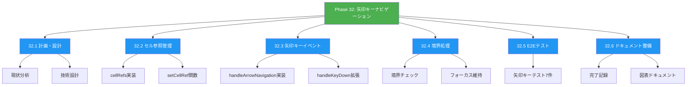
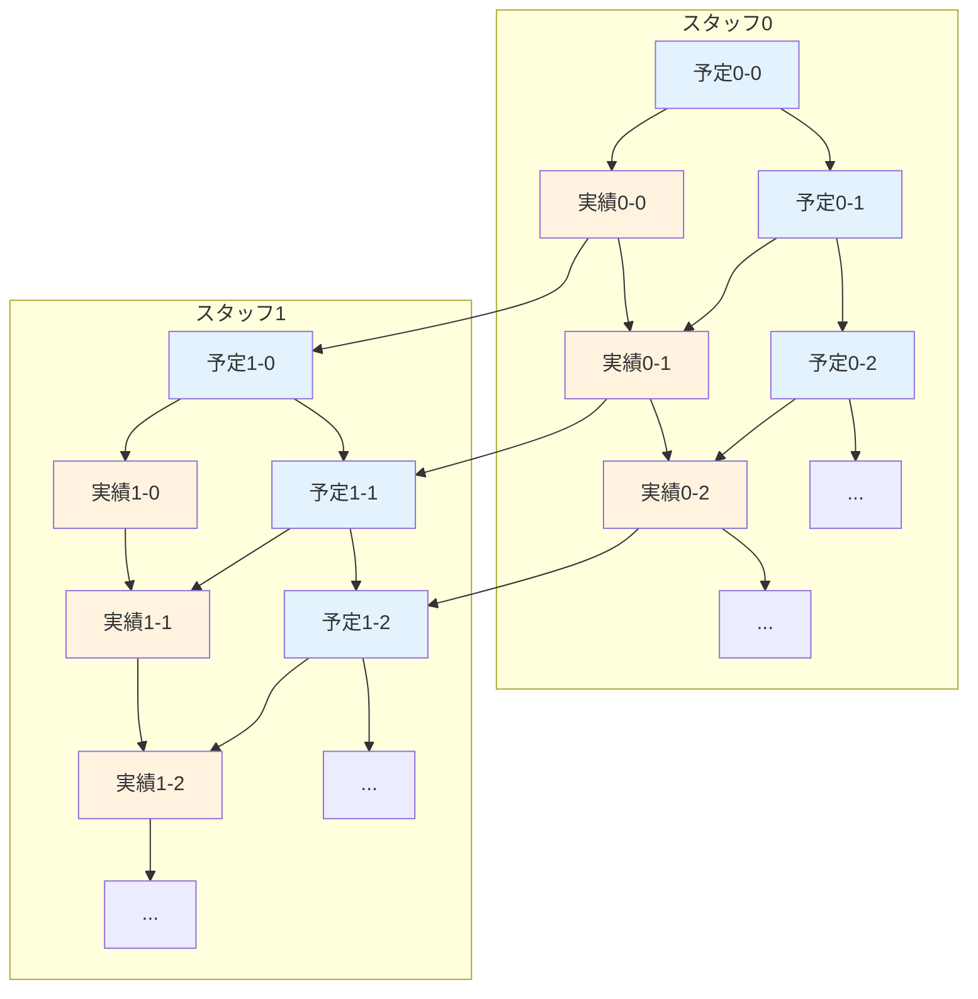
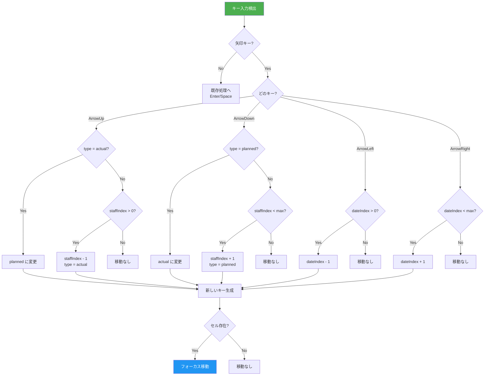
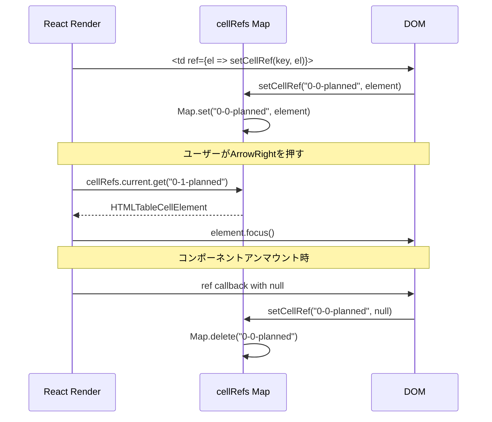
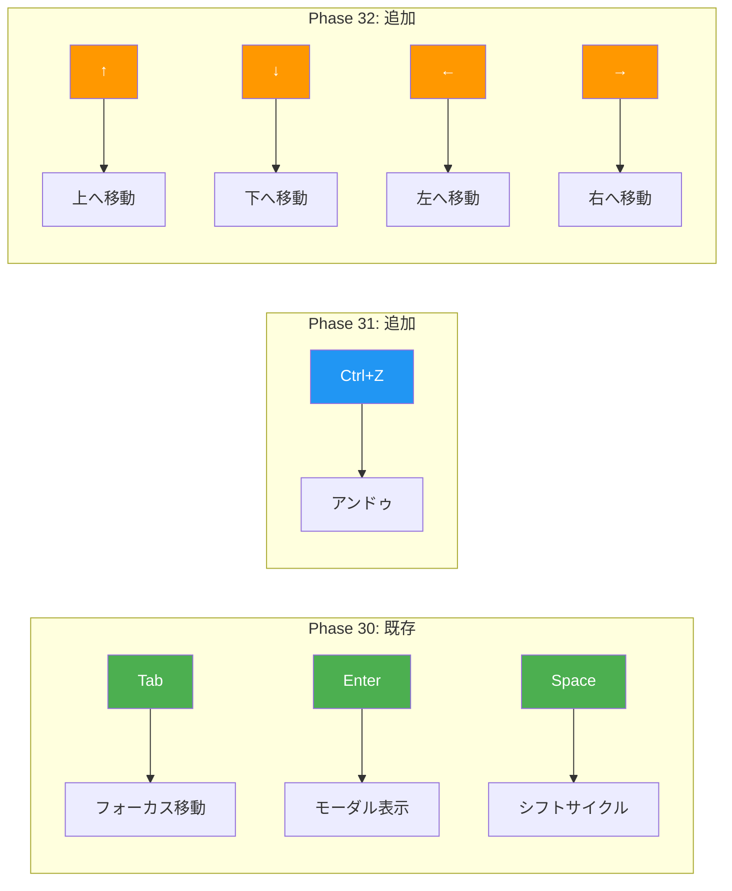
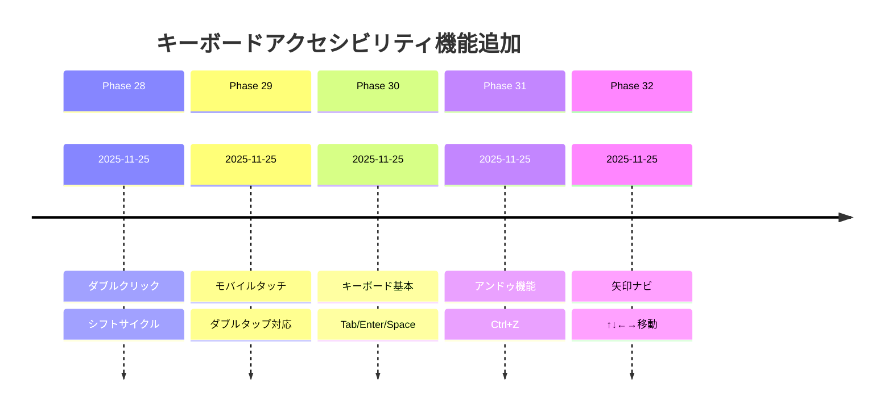
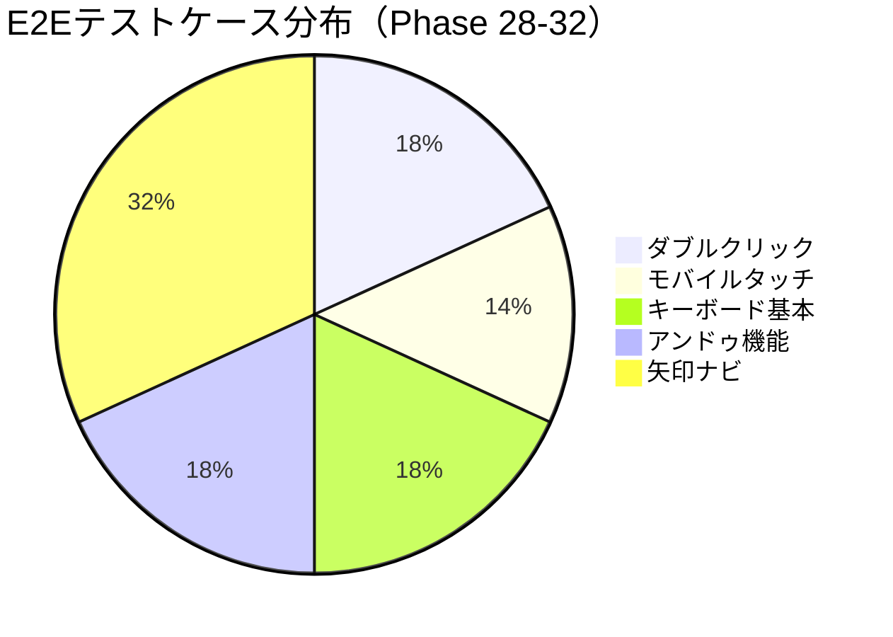

# Phase 32: 矢印キーナビゲーション - 図表ドキュメント

**作成日**: 2025-11-25
**仕様ID**: arrow-key-navigation
**Phase**: 32

---

## WBS（作業分解図）

---

## ガントチャート

```mermaid
gantt
    title Phase 32 実装スケジュール
    dateFormat HH:mm
    axisFormat %H:%M

    section 計画・設計
    現状分析           :done, a1, 00:00, 5m
    技術設計           :done, a2, after a1, 10m

    section セル参照管理
    cellRefs実装       :done, b1, after a2, 10m
    setCellRef関数     :done, b2, after b1, 5m

    section 矢印キーイベント
    handleArrowNavigation :done, c1, after b2, 15m
    handleKeyDown拡張     :done, c2, after c1, 10m

    section 境界処理
    境界チェック       :done, d1, after c2, 10m

    section E2Eテスト
    矢印キーテスト7件  :done, e1, after d1, 15m

    section 完了処理
    ドキュメント整備   :done, f1, after e1, 10m
    Git push           :active, f2, after f1, 5m
```

---

## グリッドナビゲーション構造

---

## 矢印キー動作フローチャート

---

## セル参照管理シーケンス

---

## キーボード操作マトリックス

---

## Phase 28-32 キーボードアクセシビリティ進捗

---

## テストカバレッジ

---

## 関連ドキュメント

- [Phase 32完了記録](./phase32-completion-2025-11-25.md)
- [Phase 32計画](./phase32-plan-2025-11-25.md)
- [Phase 31図表](../undo-functionality/phase31-diagrams-2025-11-25.md)
