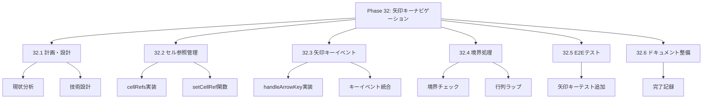

# Phase 32: 矢印キーナビゲーション

**作成日**: 2025-11-25
**仕様ID**: arrow-key-navigation
**Phase**: 32
**ステータス**: ✅ 完了

---

## エグゼクティブサマリー

シフトテーブルのセル間を矢印キー（↑↓←→）で移動できるようにします。Tab移動に加えて、直感的なグリッドナビゲーションを提供します。

### 目標

- [ ] 矢印キーでセル間移動
- [ ] 境界でのラップ動作
- [ ] フォーカス可視化の維持
- [ ] 既存のキーボード操作との共存

---

## 技術設計

### 1. グリッドセル参照管理

**useRefでセル参照を管理:**
```typescript
// セル参照のマップ: `${staffIndex}-${dateIndex}-${type}` => HTMLElement
const cellRefs = useRef<Map<string, HTMLTableCellElement>>(new Map());

const setCellRef = (key: string, el: HTMLTableCellElement | null) => {
  if (el) {
    cellRefs.current.set(key, el);
  } else {
    cellRefs.current.delete(key);
  }
};
```

### 2. 矢印キーイベント処理

**対応キー:**
| キー | アクション |
|------|-----------|
| ↑ (ArrowUp) | 上のセルへ移動 |
| ↓ (ArrowDown) | 下のセルへ移動 |
| ← (ArrowLeft) | 左のセルへ移動 |
| → (ArrowRight) | 右のセルへ移動 |

**実装:**
```typescript
const handleArrowKey = (e: React.KeyboardEvent, currentKey: string) => {
  const [staffIdx, dateIdx, type] = currentKey.split('-');
  let newKey: string | null = null;

  switch (e.key) {
    case 'ArrowUp':
      newKey = `${parseInt(staffIdx) - 1}-${dateIdx}-${type}`;
      break;
    case 'ArrowDown':
      newKey = `${parseInt(staffIdx) + 1}-${dateIdx}-${type}`;
      break;
    case 'ArrowLeft':
      newKey = `${staffIdx}-${parseInt(dateIdx) - 1}-${type}`;
      break;
    case 'ArrowRight':
      newKey = `${staffIdx}-${parseInt(dateIdx) + 1}-${type}`;
      break;
  }

  if (newKey && cellRefs.current.has(newKey)) {
    e.preventDefault();
    cellRefs.current.get(newKey)?.focus();
  }
};
```

---

## WBS（作業分解図）



---

## ガントチャート

```mermaid
gantt
    title Phase 32 実装スケジュール
    dateFormat HH:mm
    axisFormat %H:%M

    section 計画・設計
    現状分析           :done, a1, 00:00, 5m
    技術設計           :done, a2, after a1, 10m

    section セル参照管理
    cellRefs実装       :b1, after a2, 10m
    setCellRef関数     :b2, after b1, 5m

    section 矢印キーイベント
    handleArrowKey     :c1, after b2, 15m
    キーイベント統合   :c2, after c1, 10m

    section 境界処理
    境界チェック       :d1, after c2, 10m

    section E2Eテスト
    矢印キーテスト     :e1, after d1, 15m

    section 完了処理
    ドキュメント整備   :f1, after e1, 10m
    Git push           :f2, after f1, 5m
```



---

## 成功基準

- [ ] 矢印キーでセル間移動
- [ ] 境界での適切な動作
- [ ] 既存機能との競合なし
- [ ] TypeScriptエラーなし
- [ ] E2Eテスト通過

---

## 関連ドキュメント

- [Phase 31完了記録](../undo-functionality/phase31-completion-2025-11-25.md)
- [Phase 30完了記録](../keyboard-accessibility/phase30-completion-2025-11-25.md)
- [ShiftTable.tsx](../../../components/ShiftTable.tsx)
