# 全体進捗状況図解：Phase 0-16完了（Mermaid版）

**更新日**: 2025-11-02
**仕様ID**: auth-data-persistence
**ステータス**: Phase 0-16 完了（100%）

このドキュメントは [overall-progress-2025-11-02.md](./overall-progress-2025-11-02.md) の視覚的補完資料です。

---

## 1. Phase実装タイムライン（ガントチャート）

```mermaid
gantt
    title Phase 0-16実装タイムライン（2025-10-23 ～ 2025-11-02）
    dateFormat YYYY-MM-DD

    section Phase 0-3
    Phase 0: デモ環境整備                    :done, p0, 2025-10-23, 2025-10-31
    Phase 1: 認証基盤の構築                  :done, p1, 2025-10-23, 2025-10-24
    Phase 2: ユーザー登録とアクセス権限管理   :done, p2, 2025-10-23, 2025-10-24
    Phase 3: 事業所管理とRBAC               :done, p3, 2025-10-23, 2025-10-24

    section Phase 4-7
    Phase 4: データ永続化 - スタッフ情報      :done, p4, 2025-10-24, 2025-10-25
    Phase 5: データ永続化 - シフトデータ      :done, p5, 2025-10-24, 2025-10-25
    Phase 6: シフトのバージョン管理機能       :done, p6, 2025-10-25, 2025-10-26
    Phase 7: 休暇申請と要件設定の永続化       :done, p7, 2025-10-25, 2025-10-26

    section Phase 8-10
    Phase 8: Firestore Security Rules実装   :done, p8, 2025-10-25, 2025-10-25
    Phase 9: データ復元とリロード対応         :done, p9, 2025-10-26, 2025-10-26
    Phase 10: 管理画面（super-admin専用）    :done, p10, 2025-10-26, 2025-10-27

    section Phase 11-12.5
    Phase 11: ユーザー招待機能（admin権限）  :done, p11, 2025-10-27, 2025-10-27
    Phase 12: エラーハンドリングとフィードバック :done, p12, 2025-10-27, 2025-10-27
    Phase 12.5: コード重複削除リファクタリング :done, p125, 2025-10-27, 2025-10-27

    section Phase 13-16
    Phase 13: 監査ログとコンプライアンス      :done, p13, 2025-10-31, 2025-11-01
    Phase 14: 統合テストとE2Eテスト          :done, p14, 2025-11-01, 2025-11-02
    Phase 15: TypeScript型安全性の向上       :done, p15, 2025-11-01, 2025-11-01
    Phase 16: 本番環境確認と改善             :done, p16, 2025-11-02, 2025-11-02
```

---

## 2. 開発ワークフロー（フローチャート）

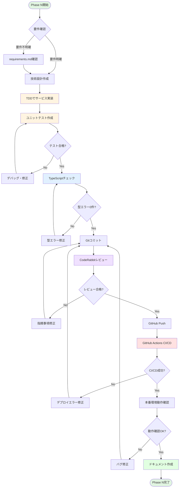

---

## 3. Phase 0-16構造とマイルストーン（マインドマップ）

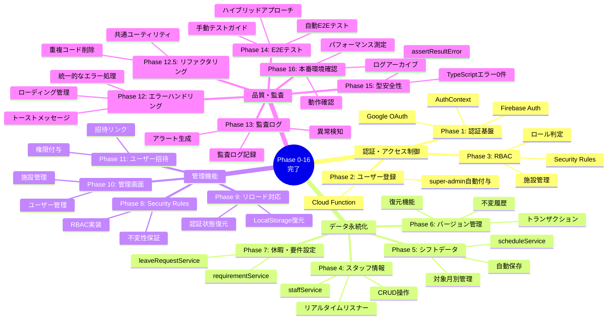

---

## 4. リリース計画ロードマップ（タイムライン）

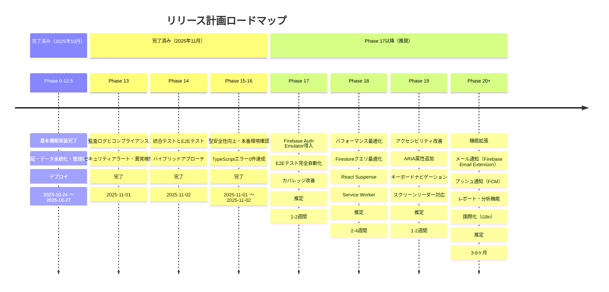

---

## 5. システムアーキテクチャ（技術スタック）

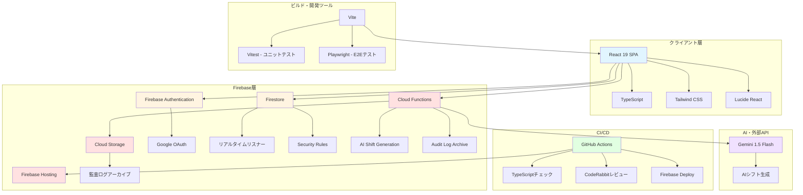

---

## 6. 品質メトリクスダッシュボード

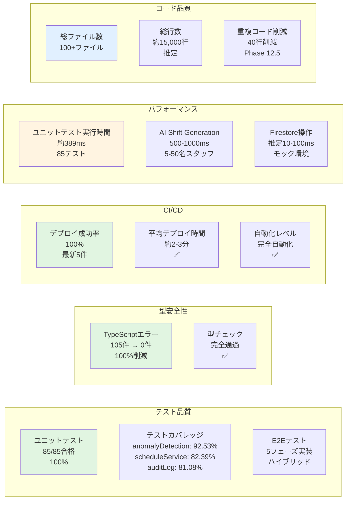

---

## 7. Phase完了状況マトリックス

```mermaid
graph TB
    subgraph "Phase 0-3: 基盤構築"
        P0[Phase 0<br/>デモ環境整備<br/>✅ 完了]
        P1[Phase 1<br/>認証基盤<br/>✅ 完了]
        P2[Phase 2<br/>ユーザー登録<br/>✅ 完了]
        P3[Phase 3<br/>事業所管理とRBAC<br/>✅ 完了]
    end

    subgraph "Phase 4-7: データ永続化"
        P4[Phase 4<br/>スタッフ情報<br/>✅ 完了]
        P5[Phase 5<br/>シフトデータ<br/>✅ 完了]
        P6[Phase 6<br/>バージョン管理<br/>✅ 完了]
        P7[Phase 7<br/>休暇・要件設定<br/>✅ 完了]
    end

    subgraph "Phase 8-11: 管理機能"
        P8[Phase 8<br/>Security Rules<br/>✅ 完了]
        P9[Phase 9<br/>リロード対応<br/>✅ 完了]
        P10[Phase 10<br/>管理画面<br/>✅ 完了]
        P11[Phase 11<br/>ユーザー招待<br/>✅ 完了]
    end

    subgraph "Phase 12-16: 品質・監査"
        P12[Phase 12<br/>エラーハンドリング<br/>✅ 完了]
        P125[Phase 12.5<br/>リファクタリング<br/>✅ 完了]
        P13[Phase 13<br/>監査ログ<br/>✅ 完了]
        P14[Phase 14<br/>E2Eテスト<br/>✅ 完了]
        P15[Phase 15<br/>型安全性<br/>✅ 完了]
        P16[Phase 16<br/>本番環境確認<br/>✅ 完了]
    end

    P0 --> P1
    P1 --> P2
    P2 --> P3
    P3 --> P4
    P4 --> P5
    P5 --> P6
    P6 --> P7
    P7 --> P8
    P8 --> P9
    P9 --> P10
    P10 --> P11
    P11 --> P12
    P12 --> P125
    P125 --> P13
    P13 --> P14
    P14 --> P15
    P15 --> P16

    style P0 fill:#e1f5e1
    style P1 fill:#e1f5e1
    style P2 fill:#e1f5e1
    style P3 fill:#e1f5e1
    style P4 fill:#e1f5e1
    style P5 fill:#e1f5e1
    style P6 fill:#e1f5e1
    style P7 fill:#e1f5e1
    style P8 fill:#e1f5e1
    style P9 fill:#e1f5e1
    style P10 fill:#e1f5e1
    style P11 fill:#e1f5e1
    style P12 fill:#e1f5e1
    style P125 fill:#e1f5e1
    style P13 fill:#e1f5e1
    style P14 fill:#e1f5e1
    style P15 fill:#e1f5e1
    style P16 fill:#e1f5e1
```

---

## 8. データモデル概要（ER図）

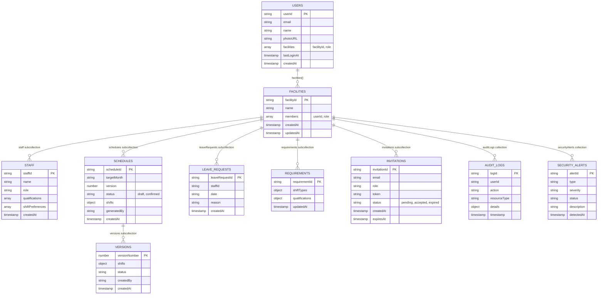

---

## 9. セキュリティとアクセス制御フロー（シーケンス図）

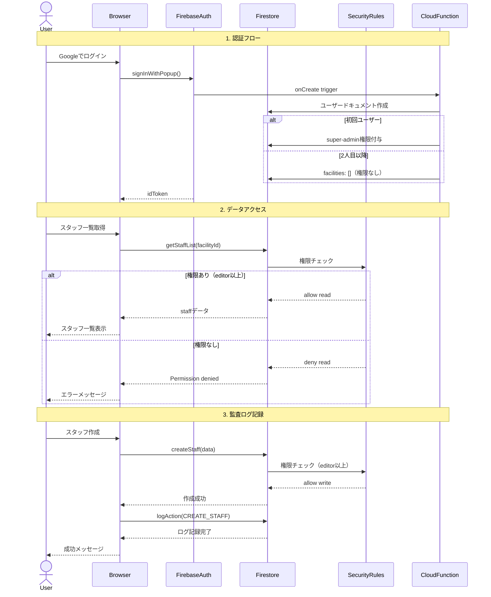

---

## 10. Phase 14 E2Eテスト実装状況（マトリックス）

```mermaid
graph TB
    subgraph "Phase 14.1: 認証フロー"
        E141[手動テストガイド<br/>Google OAuth認証<br/>✅ 完了]
        E142[自動E2Eテスト<br/>ログアウト機能<br/>✅ 完了]
    end

    subgraph "Phase 14.2: データCRUD"
        E143[手動テストガイド<br/>スタッフ・シフトCRUD<br/>✅ 完了]
        E144[自動E2Eテスト<br/>UI要素表示<br/>✅ 完了]
    end

    subgraph "Phase 14.3: RBAC権限"
        E145[手動テストガイド<br/>ロール別権限チェック<br/>✅ 完了]
        E146[自動E2Eテスト<br/>Forbiddenページ<br/>✅ 完了]
    end

    subgraph "Phase 14.4: バージョン管理"
        E147[手動テストガイド<br/>確定・復元操作<br/>✅ 完了]
        E148[自動E2Eテスト<br/>UI要素表示<br/>✅ 完了]
    end

    subgraph "Phase 14.5: データ復元"
        E149[手動テストガイド<br/>リロード操作<br/>✅ 完了]
        E1410[自動E2Eテスト<br/>UI要素表示<br/>✅ 完了]
    end

    E141 --> E142
    E143 --> E144
    E145 --> E146
    E147 --> E148
    E149 --> E1410

    style E141 fill:#fff4e1
    style E142 fill:#e1f5e1
    style E143 fill:#fff4e1
    style E144 fill:#e1f5e1
    style E145 fill:#fff4e1
    style E146 fill:#e1f5e1
    style E147 fill:#fff4e1
    style E148 fill:#e1f5e1
    style E149 fill:#fff4e1
    style E1410 fill:#e1f5e1
```

---

## 11. Phase 15 TypeScript型エラー削減進捗

```mermaid
graph LR
    subgraph "Phase 15開始"
        Start[TypeScriptエラー<br/>105件]
    end

    subgraph "Phase 15.1"
        P151[assertResultError<br/>型ガード追加<br/>-59件]
    end

    subgraph "Phase 15.2"
        P152[ButtonProps<br/>型定義修正<br/>-9件]
    end

    subgraph "Phase 15.3"
        P153[JSX.Element<br/>→ React.ReactElement<br/>-11件]
    end

    subgraph "Phase 15.4"
        P154[readonly プロパティ<br/>Object.defineProperty<br/>-11件]
    end

    subgraph "Phase 15.5-15.6"
        P155[招待ロール型マッピング<br/>エラーコード修正<br/>-2件]
    end

    subgraph "Phase 15完了"
        End[TypeScriptエラー<br/>0件<br/>✅ 100%削減]
    end

    Start --> P151
    P151 --> P152
    P152 --> P153
    P153 --> P154
    P154 --> P155
    P155 --> End

    style Start fill:#ffe1e1
    style P151 fill:#fff4e1
    style P152 fill:#fff4e1
    style P153 fill:#fff4e1
    style P154 fill:#fff4e1
    style P155 fill:#fff4e1
    style End fill:#e1f5e1
```

---

## 12. Phase 16 パフォーマンス改善

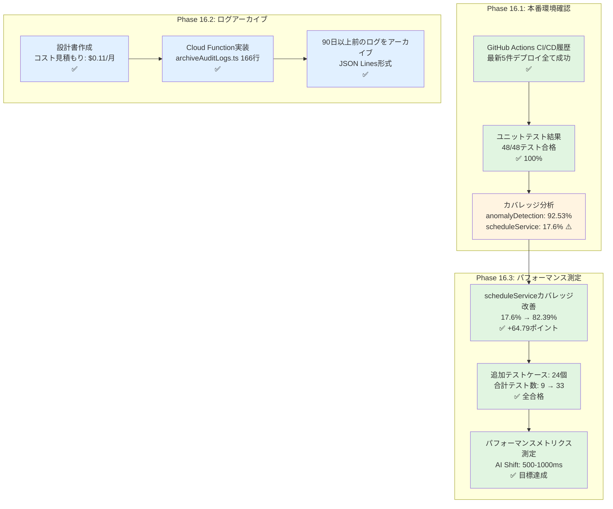

---

## まとめ

このドキュメントは、Phase 0-16の全体進捗状況を視覚的に表現したものです。

**主要図表**:
1. ガントチャート - 実装タイムライン
2. フローチャート - 開発ワークフロー
3. マインドマップ - Phase構造と関係性
4. タイムライン - リリース計画
5. システムアーキテクチャ図 - 技術スタック
6. メトリクスダッシュボード - 品質指標
7. Phase完了状況マトリックス - 全Phase概観
8. ER図 - データモデル概要
9. シーケンス図 - セキュリティフロー
10. E2Eテスト実装状況 - Phase 14詳細
11. TypeScript型エラー削減進捗 - Phase 15詳細
12. パフォーマンス改善 - Phase 16詳細

詳細な説明は [overall-progress-2025-11-02.md](./overall-progress-2025-11-02.md) を参照してください。
