# Phase 18: E2Eテストの拡充と監視の強化 - 実装計画（図解版）

**作成日**: 2025-11-12
**仕様ID**: auth-data-persistence
**Phase**: 18
**目的**: 振り返り・引き継ぎ用の視覚化ドキュメント

---

## 目次

1. [Phase 18実装タイムライン](#phase-18実装タイムライン)
2. [実装フロー](#実装フロー)
3. [Permission error検出の仕組み](#permission-error検出の仕組み)
4. [Phase 18アーキテクチャ](#phase-18アーキテクチャ)
5. [テスト実行フロー](#テスト実行フロー)
6. [監視アラートフロー](#監視アラートフロー)
7. [Phase 17-18の関係](#phase-17-18の関係)

---

## Phase 18実装タイムライン

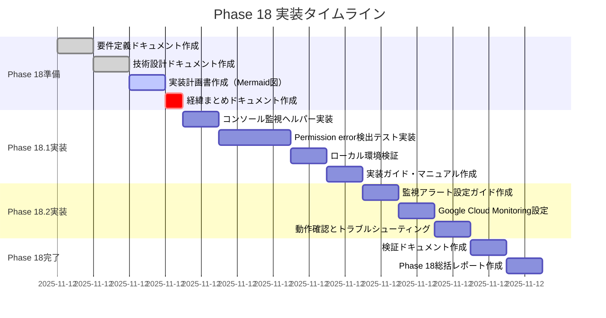

**推定総工数**: 約13時間
- Phase 18準備: 3.5時間
- Phase 18.1実装: 5時間
- Phase 18.2実装: 3時間
- Phase 18完了: 2時間

---

## 実装フロー

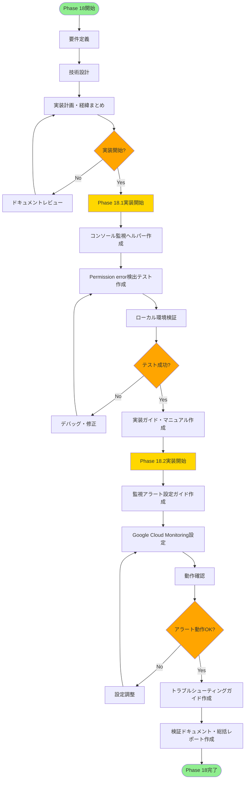

---

## Permission error検出の仕組み

### シーケンス図: Permission error検出フロー

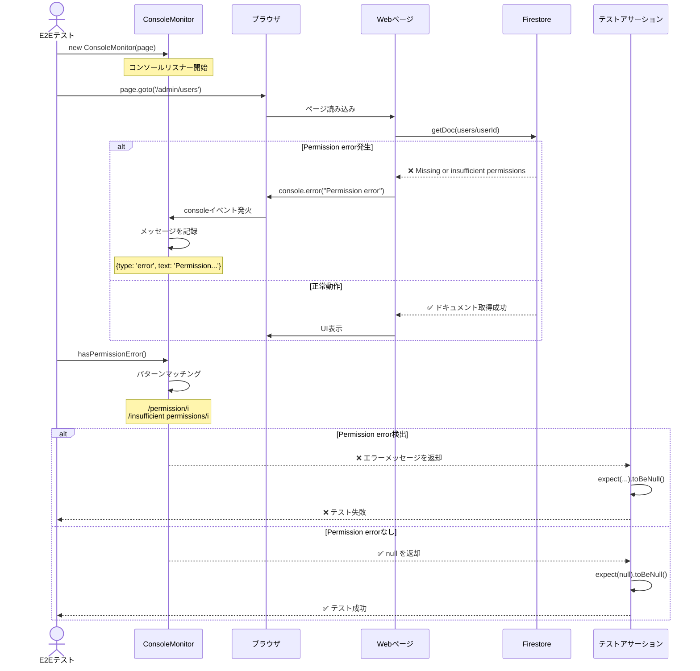

### データフロー図

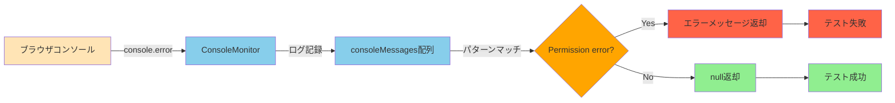

---

## Phase 18アーキテクチャ

### システム全体構成

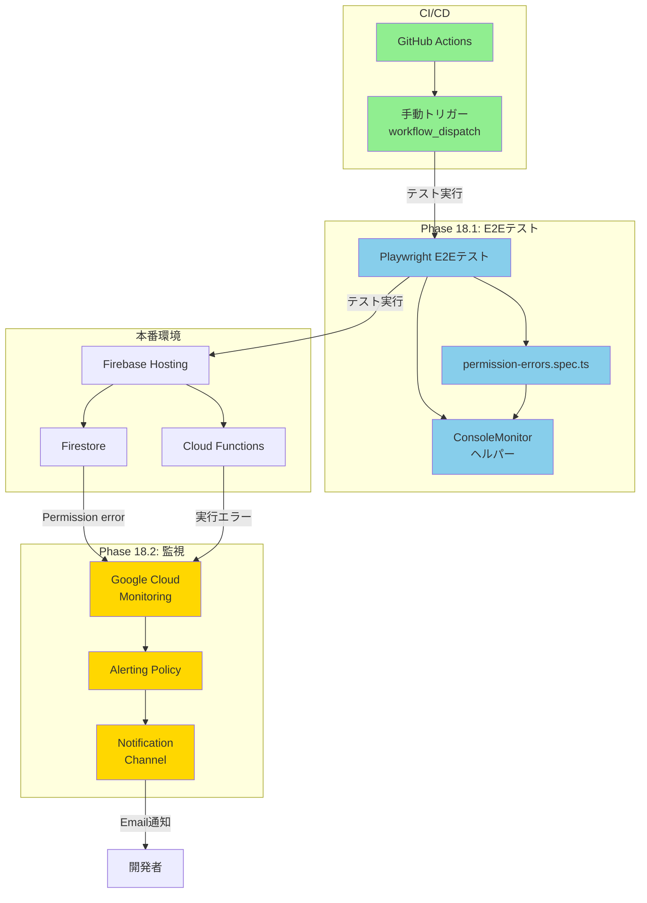

### ファイル構成

```mermaid
graph TD
    Root[プロジェクトルート]

    Root --> E2E[e2e/]
    Root --> Kiro[.kiro/specs/auth-data-persistence/]
    Root --> GH[.github/workflows/]

    E2E --> Helper[helpers/console-monitor.ts<br/>🆕 Phase 18.1]
    E2E --> Test[permission-errors.spec.ts<br/>🆕 Phase 18.1]
    E2E --> Existing[既存テストファイル群]

    Kiro --> Req[phase18-requirements.md<br/>✅ 作成済み]
    Kiro --> Design[phase18-design.md<br/>✅ 作成済み]
    Kiro --> Plan[phase18-implementation-plan-diagram.md<br/>🔄 作成中]
    Kiro --> Context[phase17-18-context.md<br/>📝 次に作成]
    Kiro --> ImplGuide[phase18-implementation-guide.md<br/>📝 Phase 18.1後に作成]
    Kiro --> TestManual[phase18-test-manual.md<br/>📝 Phase 18.1後に作成]
    Kiro --> Monitor[phase18-monitoring-setup-guide.md<br/>📝 Phase 18.2で作成]
    Kiro --> Trouble[phase18-troubleshooting.md<br/>📝 Phase 18.2後に作成]
    Kiro --> Verify[phase18-verification.md<br/>📝 最後に作成]

    GH --> Workflow[e2e-permission-check.yml<br/>🆕 Phase 18.1]

    style Helper fill:#FFD700
    style Test fill:#FFD700
    style Workflow fill:#FFD700
    style Plan fill:#87CEEB
    style Context fill:#FFA07A
    style ImplGuide fill:#FFA07A
    style TestManual fill:#FFA07A
    style Monitor fill:#FFA07A
    style Trouble fill:#FFA07A
    style Verify fill:#FFA07A
```

---

## テスト実行フロー

### ローカル環境でのテスト実行

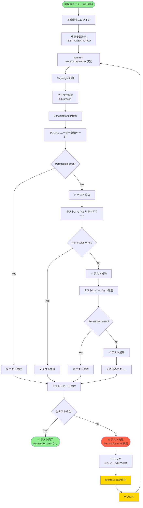

### CI/CD（GitHub Actions）でのテスト実行

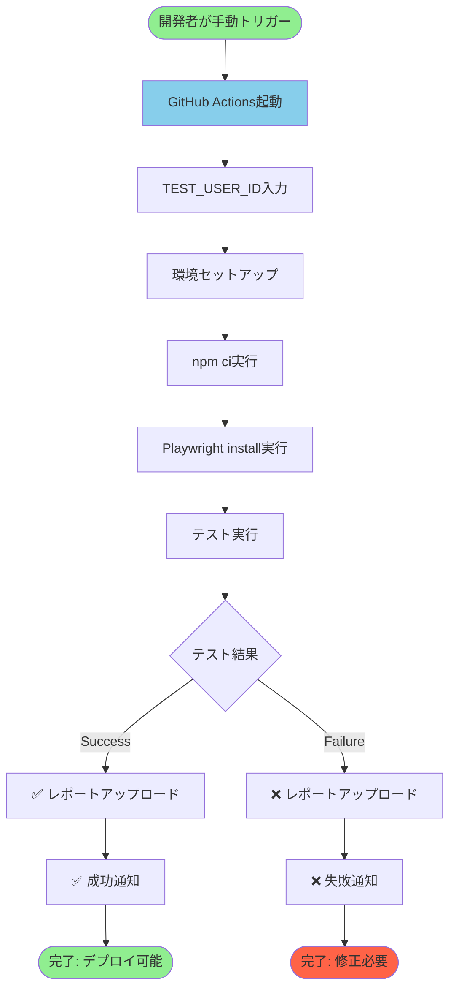

---

## 監視アラートフロー

### Permission error検出と通知

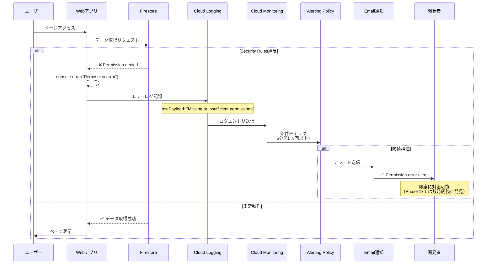

### 監視システムの階層構造

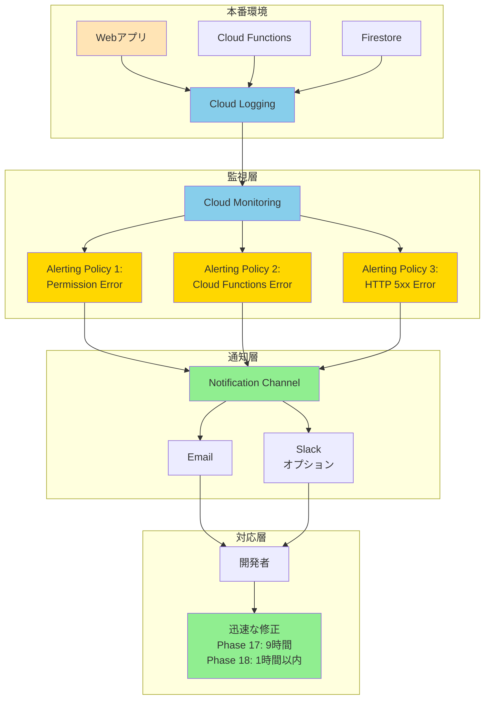

---

## Phase 17-18の関係

### Phase 17で発見された問題とPhase 18の解決策

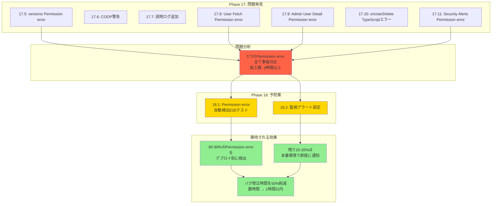

### タイムライン: Phase 0 → Phase 18

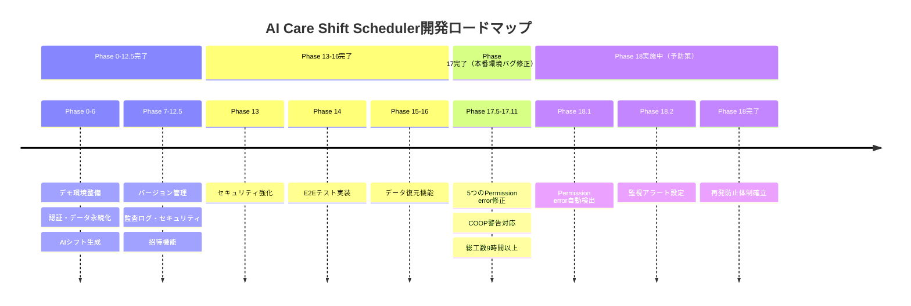

---

## ドキュメント相互参照

### Phase 18関連ドキュメント構成

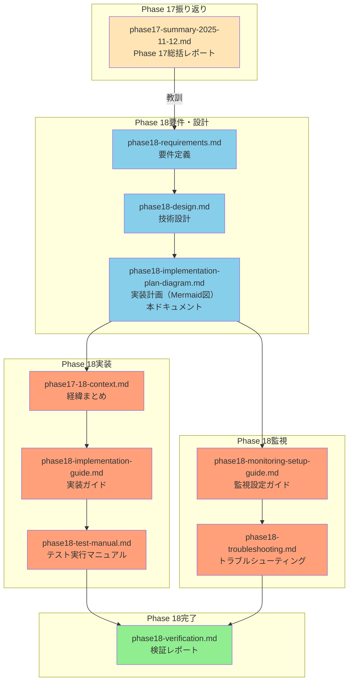

**参照の流れ**:
1. **Phase 17総括** → なぜPhase 18が必要か理解
2. **要件定義** → 何を実現するか理解
3. **技術設計** → どのように実装するか理解
4. **実装計画（本ドキュメント）** → 全体像とタイムラインを視覚的に理解
5. **経緯まとめ** → Phase 17-18の詳細な背景を理解
6. **実装ガイド** → 実際の実装手順を理解
7. **テスト実行マニュアル** → テストの実行方法を理解
8. **監視設定ガイド** → 監視の設定方法を理解
9. **トラブルシューティング** → 問題発生時の対処法を理解
10. **検証レポート** → Phase 18完了確認

---

## 次のステップ

### 今すぐ作成すべきドキュメント

**優先度1（最高）**:
1. ✅ `phase18-implementation-plan-diagram.md` - 本ドキュメント（作成中）
2. 📝 `phase17-18-context.md` - Phase 17-18の経緯まとめ（次に作成）

**優先度2（高）**:
3. 📝 `phase18-implementation-guide.md` - 実装ガイド（Phase 18.1実装時）
4. 📝 `phase18-test-manual.md` - テスト実行マニュアル（Phase 18.1実装時）

**優先度3（中）**:
5. 📝 `phase18-monitoring-setup-guide.md` - 監視設定ガイド（Phase 18.2実装時）
6. 📝 `phase18-troubleshooting.md` - トラブルシューティング（Phase 18.2実装時）

**優先度4（完了時）**:
7. 📝 `phase18-verification.md` - 検証レポート（Phase 18完了時）

### 実装開始前のチェックリスト

- ✅ Phase 18要件定義完了
- ✅ Phase 18技術設計完了
- 🔄 Phase 18実装計画（Mermaid図）作成中
- ⏳ Phase 17-18経緯まとめ作成待ち
- ⏳ 実装ガイド・マニュアル作成待ち

---

**ドキュメント作成日**: 2025-11-12
**作成者**: AI（Claude Code）
**ステータス**: Phase 18実装計画（視覚化）完了
**次のステップ**: Phase 17-18経緯まとめドキュメント作成

---

## 補足: Mermaid図の見方

### ガントチャート
- **緑色のバー**: 完了済みのタスク
- **黄色のバー**: 実行中のタスク
- **赤色のバー**: 重要タスク（crit）

### フローチャート
- **緑色の楕円**: 開始/終了ポイント
- **黄色の長方形**: 重要なフェーズ
- **オレンジ色の菱形**: 判断ポイント

### シーケンス図
- **上から下**: 時系列の流れ
- **矢印**: メッセージの送受信
- **破線の矢印**: 返り値

### グラフ
- **青色**: データ処理・監視系
- **黄色**: 重要な処理
- **緑色**: 成功状態
- **赤色**: エラー状態
