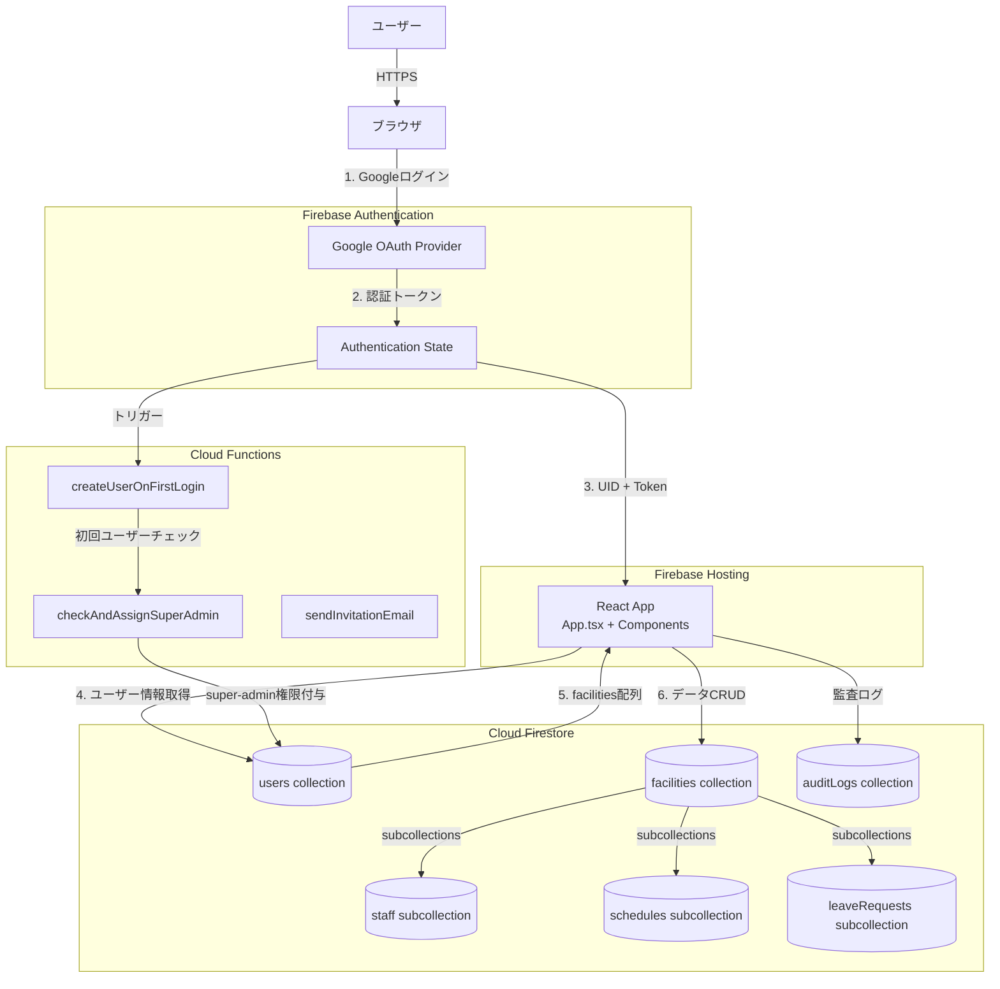
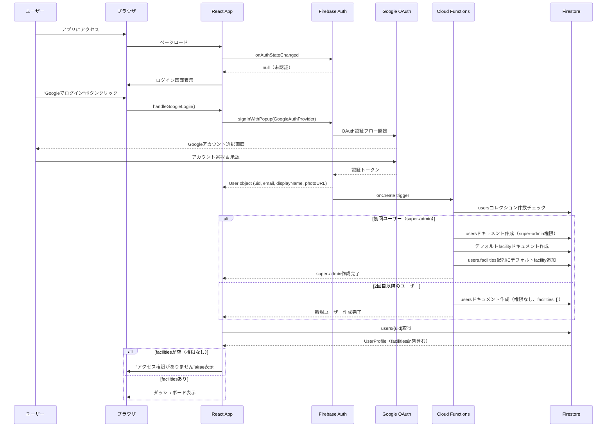
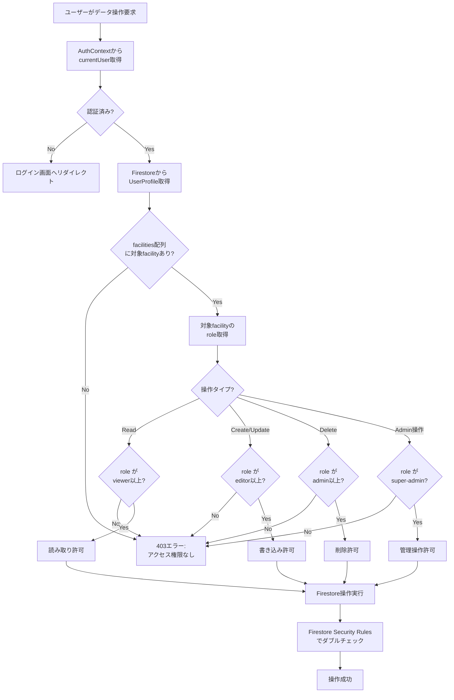
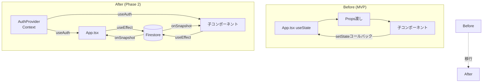

# 技術設計書: 認証・データ永続化機能（Google OAuth + RBAC）

**仕様ID**: auth-data-persistence
**作成日**: 2025-10-23
**最終更新**: 2025-10-23
**言語**: 日本語

---

## Overview

この機能は、既存のAIシフト自動作成アプリケーションに、Google OAuth認証とロールベースアクセス制御（RBAC）を導入し、データ永続化機能を実現する。現在のMVPはブラウザのReact stateのみでデータ管理しており、リロード時にすべてのデータが失われる。この設計により、ユーザーは自分のGoogleアカウントでログインし、事業所ごとに分離されたデータを安全に永続化できるようになる。

**目的**: 本機能は、介護・福祉事業所の管理者に対して、安全で永続的なデータ管理環境を提供する。Google Workspaceと統合することで、パスワード管理の負担を排除し、事業所ごとのデータ分離とロールベースの権限管理を実現する。

**ユーザー**: 介護施設の管理者（super-admin、admin）、編集者（editor）、閲覧者（viewer）がこの機能を利用する。管理者はスタッフ情報やシフトデータを作成・編集し、編集者はシフトの作成・編集のみ、閲覧者は閲覧のみが可能となる。

**インパクト**: 現在のステートレスなアプリケーションから、マルチテナント対応のSaaSアプリケーションへ移行する。これにより、複数の事業所が同じアプリケーションを利用でき、将来の収益化に向けた基盤が整う。

### Goals

- Google OAuth認証により、パスワード管理不要のセキュアなログイン機能を実現
- 事業所（Facility）単位のマルチテナント設計によるデータ分離を実現
- 4段階のロールベースアクセス制御（super-admin, admin, editor, viewer）を実装
- Firestoreへのデータ永続化により、リロード時のデータ保持を実現
- 管理画面による権限管理とユーザー招待機能を実装
- 既存のReactコンポーネントとの高い互換性を維持

### Non-Goals

- メール/パスワード認証の実装（Google OAuthのみ）
- モバイルアプリ対応（ブラウザのみ）
- リアルタイム同期機能（Phase 3以降）
- ユーザー間チャット機能
- 外部認証プロバイダー（Google以外）の統合

---

## Architecture

### 既存アーキテクチャ分析

現在のアプリケーションは以下の特徴を持つ:

- **フロントエンド**: React 19 + TypeScript + Vite
- **状態管理**: React useState hooks（App.tsx内）
- **データフロー**: 親コンポーネント（App.tsx）から子コンポーネントへのprops渡し
- **データ永続化**: なし（すべてメモリ上）
- **認証**: なし
- **デプロイ**: Firebase Hosting
- **バックエンド**: Cloud Functions（us-central1）

**保持すべきパターン**:
- React hooksベースの状態管理
- TypeScript型定義
- Tailwind CSSスタイリング
- コンポーネント分割パターン

**変更が必要な部分**:
- グローバル状態管理（useState → Firestore + Context API）
- 認証なしからGoogle OAuth認証へ
- ローカルストレージからFirestoreへ

### High-Level Architecture



### アーキテクチャ統合

**既存パターンの保持**:
- React 19 + TypeScript + Tailwind CSS: UIレイヤーは既存パターンを維持
- コンポーネント分割: 既存のAccordion、ShiftTable等は変更最小限
- Vite: ビルドツールはそのまま使用

**新規コンポーネントの導入根拠**:
- `AuthProvider`: Firebase Auth状態管理のためのContext Provider（React標準パターン）
- `ProtectedRoute`: 未認証ユーザーのリダイレクト（一般的なReact Routerパターン）
- `AdminPanel`: 管理画面（/adminパス）
- `LoginPage`: ログイン画面（未認証時の初期画面）

**技術スタック整合性**:
- Firebase SDK（Auth, Firestore）は既存のFirebase Hosting/Functionsと同一エコシステム
- asia-northeast1リージョン（Firestore）はGCPプロジェクトと整合
- Google Workspace統合はプロダクト要件と整合

**Steering準拠**:
- architecture.md: Firestoreリージョン（asia-northeast1）準拠
- tech.md: Firebase技術スタック準拠
- product.md: Phase 2の認証・マルチテナント機能と整合
- structure.md: TypeScript命名規則、コンポーネント設計原則に準拠

---

## 技術整合性と主要設計決定

### 技術整合性

この機能は既存のFirebaseベースのアーキテクチャを拡張する:

**既存技術スタックとの整合**:
- **Firebase Authentication**: 既存のFirebase Hosting/Functionsと同一プロジェクト
- **Cloud Firestore**: 既にプロジェクトで有効化済み（asia-northeast1）
- **React 19**: 既存のUIフレームワークをそのまま使用
- **TypeScript**: 既存の型定義パターンを踏襲

**新規導入ライブラリ**:
- `firebase` (v10.x): Authentication、Firestore SDKを含む公式パッケージ
- `react-router-dom` (v7.x): 管理画面ルーティング用
- 理由: Firebase公式SDKとReact標準ルーターで、軽量かつメンテナンス性が高い

**既存パターンからの逸脱**:
なし。既存のReact hooks + TypeScriptパターンを維持する。

### 主要設計決定

#### 決定1: Custom Claims によるRBAC実装

**コンテキスト**: Firestoreでロールベースアクセス制御を実装する必要がある。公式ドキュメントでは「Firestore内にrolesマップを保存」を推奨しているが、Webリサーチでは「Custom Claims」がセキュリティ観点で優れていることが判明した。

**代替案**:
1. **Firestore内rolesフィールド**: 各facilityドキュメントにrolesマップ（`{ userId: role }`）を保存
2. **Custom Claims**: Firebase Authトークンにカスタム属性としてrole情報を付与
3. **サーバーサイド検証のみ**: すべての権限チェックをCloud Functionsで実施

**選択アプローチ**: **Firestore内rolesフィールド（requirements.mdのデータモデルに準拠）**

**根拠**:
- requirements.mdで既に定義されたデータモデルとの整合性
- facilityドキュメントの`members`配列に各ユーザーのroleを保存済み
- Security Rulesで`get()`関数により他ドキュメントのroleを参照可能
- マルチテナント（ユーザーが複数facilityに所属）の場合、Custom Claimsでは1つのroleしか保持できない制限がある

**トレードオフ**:
- **得るもの**: マルチfacility対応、データモデルの一貫性、facilityごとの独立したrole管理
- **失うもの**: Custom Claimsの若干のセキュリティ上の利点（ただしSecurity Rulesで十分対応可能）

#### 決定2: 初回ユーザーのsuper-admin自動付与をCloud Functionで実装

**コンテキスト**: システム内で最初にログインしたユーザーをsuper-adminに設定し、デフォルト施設を自動作成する必要がある。

**代替案**:
1. **クライアントサイドチェック**: フロントエンドでusersコレクションのカウントを取得し、初回なら手動でsuper-admin設定
2. **Cloud Function（onCreate trigger）**: Firebase Auth onCreate triggerで自動処理
3. **手動設定**: Firebase Consoleから手動でsuper-admin設定

**選択アプローチ**: **Cloud Function (onCreate trigger)**

**根拠**:
- セキュリティ: クライアントからのsuper-admin権限付与は危険（悪意あるユーザーが不正に権限取得可能）
- 自動化: 初回デプロイ時に手動設定不要
- 信頼性: サーバーサイドでのアトミックな処理

**実装方法**:
```typescript
export const createUserOnFirstLogin = onAuthCreate(async (event) => {
  const user = event.data;
  const usersSnapshot = await admin.firestore().collection('users').count().get();
  const userCount = usersSnapshot.data().count;

  const isSuperAdmin = userCount === 0;

  if (isSuperAdmin) {
    // super-admin + デフォルトfacility作成
  } else {
    // 権限なしユーザー作成
  }
});
```

**トレードオフ**:
- **得るもの**: 高セキュリティ、自動化、アトミック処理
- **失うもの**: Cloud Functionsのコールドスタート時間（初回ログイン時のみ、許容範囲）

#### 決定3: React Context APIによる認証状態管理

**コンテキスト**: Firebase Authentication状態をアプリケーション全体で利用可能にする必要がある。

**代替案**:
1. **Props drilling**: App.tsxから全コンポーネントにpropsで渡す
2. **React Context API**: AuthProviderでラップし、useAuthフックで取得
3. **状態管理ライブラリ**: Redux, Zustandなど

**選択アプローチ**: **React Context API**

**根拠**:
- 既存のReact hooksパターンと整合
- 軽量（外部ライブラリ不要）
- Firebase公式ドキュメントで推奨されるパターン

**実装パターン**:
```typescript
export const AuthContext = createContext<AuthContextType | null>(null);

export function AuthProvider({ children }: { children: React.ReactNode }) {
  const [currentUser, setCurrentUser] = useState<User | null>(null);
  const [userProfile, setUserProfile] = useState<UserProfile | null>(null);
  const [loading, setLoading] = useState(true);

  useEffect(() => {
    const unsubscribe = onAuthStateChanged(auth, async (user) => {
      setCurrentUser(user);
      if (user) {
        const profile = await fetchUserProfile(user.uid);
        setUserProfile(profile);
      }
      setLoading(false);
    });
    return unsubscribe;
  }, []);

  return <AuthContext.Provider value={{ currentUser, userProfile, loading }}>
    {children}
  </AuthContext.Provider>;
}
```

**トレードオフ**:
- **得るもの**: シンプル、軽量、React標準パターン
- **失うもの**: Redux等の高度な開発者ツール（この規模では不要）

---

## System Flows

### 認証フロー



### RBAC認可フロー



### データ永続化フロー（既存実装からの移行）



---

## Requirements Traceability

| 要件ID | 要件概要 | 実現コンポーネント | インターフェース | フロー図 |
|--------|---------|-----------------|------------|---------|
| 1.1 | 未ログイン時にログイン画面表示 | `ProtectedRoute`, `LoginPage` | `onAuthStateChanged` | 認証フロー |
| 1.2 | Googleでログインボタン表示 | `LoginPage` | `GoogleAuthProvider` | 認証フロー |
| 1.3 | Google OAuth認証画面リダイレクト | `signInWithPopup` | Firebase Auth API | 認証フロー |
| 1.4 | GoogleからプロフィールSI取得 | Firebase Auth | `user.email`, `user.displayName` | 認証フロー |
| 1.5 | 初回ログイン時にusersドキュメント作成 | `createUserOnFirstLogin` Cloud Function | Firestore Admin SDK | 認証フロー |
| 1.7 | 初回ユーザーにsuper-admin権限付与 | `checkAndAssignSuperAdmin` Cloud Function | Firestore Admin SDK | 認証フロー |
| 1.8 | 2回目以降はfacilities空配列で作成 | `createUserOnFirstLogin` Cloud Function | Firestore Admin SDK | 認証フロー |
| 2.1-2.15 | RBAC（4ロール） | `AuthContext`, Firestore Security Rules | `UserProfile.facilities[].role` | RBAC認可フロー |
| 3.1-3.8 | facilityデータ管理 | `FacilityService`, Firestore | `/facilities/{facilityId}` | - |
| 4.1-4.12 | staffデータ永続化 | `StaffService`, Firestore | `/facilities/{fid}/staff/{sid}` | データ永続化フロー |
| 5.1-5.14 | scheduleデータ永続化 | `ScheduleService`, Firestore | `/facilities/{fid}/schedules/{sid}` | データ永続化フロー |
| 6.1-6.10 | leaveRequestデータ永続化 | `LeaveRequestService`, Firestore | `/facilities/{fid}/leaveRequests/{rid}` | データ永続化フロー |
| 7.1-7.8 | requirementデータ永続化 | `RequirementService`, Firestore | `/facilities/{fid}/requirements/{rid}` | データ永続化フロー |
| 8.1-8.6 | 初期データロード | `useAuth`, `useFacilityData` hooks | Firestore `onSnapshot` | データ永続化フロー |
| 9.1-9.5 | リアルタイム同期（Optional） | Firestore `onSnapshot` | リアルタイムリスナー | - |
| 10.1-10.6 | 競合解決（Last Write Wins） | Firestoreデフォルト | タイムスタンプベース | - |
| 11.1-11.8 | 監査ログ | `AuditLogService`, `/auditLogs` | Cloud Functions trigger | - |
| 12.1-12.18 | 管理画面 | `AdminPanel`, `/admin` ルート | `hasRole('super-admin')` | RBAC認可フロー |

---

## Components and Interfaces

### 認証レイヤー

#### AuthProvider (Context Provider)

**責任と境界**:
- **主要責任**: Firebase Authentication状態をアプリケーション全体で共有
- **ドメイン境界**: 認証ドメイン（ログイン/ログアウト、認証状態管理）
- **データ所有権**: `currentUser`（Firebase User object）、`userProfile`（Firestore UserProfile）
- **トランザクション境界**: なし（読み取り専用のContext Provider）

**依存関係**:
- **インバウンド**: App.tsx、全コンポーネント（useAuthフック経由）
- **アウトバウンド**: Firebase Authentication SDK、Firestore（UserProfile取得）
- **外部**: Firebase Authentication API

**契約定義 - Service Interface**:

```typescript
interface AuthContextType {
  currentUser: User | null;
  userProfile: UserProfile | null;
  loading: boolean;
  signInWithGoogle: () => Promise<void>;
  signOut: () => Promise<void>;
  hasRole: (facilityId: string, role: RoleType) => boolean;
  isSuperAdmin: () => boolean;
}

interface UserProfile {
  userId: string;
  email: string;
  name: string;
  photoURL: string;
  provider: 'google';
  facilities: {
    facilityId: string;
    role: 'super-admin' | 'admin' | 'editor' | 'viewer';
    grantedAt: Timestamp;
    grantedBy: string;
  }[];
  createdAt: Timestamp;
  lastLoginAt: Timestamp;
}
```

**事前条件**:
- Firebase Authenticationが初期化されていること
- AuthProviderがReactツリーのルートでマウントされていること

**事後条件**:
- ログイン成功後、`currentUser`と`userProfile`が非nullになる
- ログアウト後、`currentUser`と`userProfile`がnullになる

**不変条件**:
- `currentUser`がnullなら、`userProfile`もnull
- `loading`がtrueの間、認証状態は不確定

**状態管理**:
- **状態モデル**: `loading` → `authenticated` or `unauthenticated`
- **永続化**: Firebaseセッション（IndexedDB）
- **並行性**: Firebase SDKがセッション管理

**統合戦略**:
- **既存コードへの影響**: App.tsxをAuthProviderでラップするのみ
- **後方互換性**: 既存のuseStateベースのstaffList等は段階的にFirestoreへ移行

---

### データアクセスレイヤー

#### StaffService

**責任と境界**:
- **主要責任**: スタッフ情報のCRUD操作（Firestore `/facilities/{fid}/staff/{sid}`）
- **ドメイン境界**: スタッフ管理ドメイン
- **データ所有権**: Staffドキュメント
- **トランザクション境界**: 単一ドキュメント操作（Firestoreの自動トランザクション）

**依存関係**:
- **インバウンド**: StaffSettings component
- **アウトバウンド**: Firestore SDK
- **外部**: なし

**契約定義 - Service Interface**:

```typescript
interface StaffService {
  // スタッフ一覧取得（リアルタイムリスナー）
  subscribeToStaffList(
    facilityId: string,
    callback: (staffList: Staff[]) => void
  ): Unsubscribe;

  // スタッフ作成
  createStaff(
    facilityId: string,
    staff: Omit<Staff, 'id' | 'createdAt' | 'updatedAt'>
  ): Promise<Result<string, StaffError>>;

  // スタッフ更新
  updateStaff(
    facilityId: string,
    staffId: string,
    updates: Partial<Staff>
  ): Promise<Result<void, StaffError>>;

  // スタッフ削除
  deleteStaff(
    facilityId: string,
    staffId: string
  ): Promise<Result<void, StaffError>>;
}

type StaffError =
  | { code: 'PERMISSION_DENIED'; message: string }
  | { code: 'NOT_FOUND'; message: string }
  | { code: 'VALIDATION_ERROR'; message: string };

type Result<T, E> = { success: true; data: T } | { success: false; error: E };
```

**事前条件**:
- ユーザーが認証済みであること
- facilityIdに対する適切なロール（editor以上）を持つこと

**事後条件**:
- 作成/更新/削除操作が成功した場合、Firestoreに即座に反映される
- subscribeToStaffListのコールバックが自動的に呼ばれる

**不変条件**:
- staffIdはfacility内で一意
- createdAt, updatedAtは常に有効なTimestamp

#### ScheduleService

**責任と境界**:
- **主要責任**: シフトスケジュールのCRUD操作
- **ドメイン境界**: シフト管理ドメイン
- **データ所有権**: Scheduleドキュメント
- **トランザクション境界**: 単一ドキュメント操作

**契約定義 - Service Interface**:

```typescript
interface ScheduleService {
  subscribeToSchedules(
    facilityId: string,
    targetMonth: string,
    callback: (schedules: StaffSchedule[]) => void
  ): Unsubscribe;

  saveSchedule(
    facilityId: string,
    schedule: Omit<Schedule, 'id' | 'createdAt'>
  ): Promise<Result<string, ScheduleError>>;

  updateSchedule(
    facilityId: string,
    scheduleId: string,
    updates: Partial<Schedule>
  ): Promise<Result<void, ScheduleError>>;

  deleteSchedule(
    facilityId: string,
    scheduleId: string
  ): Promise<Result<void, ScheduleError>>;
}

interface Schedule {
  id: string;
  facilityId: string;
  targetMonth: string; // 'YYYY-MM'
  staffSchedules: StaffSchedule[];
  createdAt: Timestamp;
  createdBy: string;
  version: number;
  status: 'draft' | 'confirmed' | 'archived';
}
```

---

### UI層コンポーネント

#### LoginPage

**責任と境界**:
- **主要責任**: 未認証ユーザーに対するログイン画面表示
- **ドメイン境界**: 認証UI
- **データ所有権**: なし（状態はAuthProviderが管理）

**依存関係**:
- **インバウンド**: ProtectedRoute（未認証時にリダイレクト）
- **アウトバウンド**: AuthContext（signInWithGoogle）

**契約定義 - UI Component**:

```typescript
interface LoginPageProps {
  // Propsなし（AuthContextから状態取得）
}

export function LoginPage(): React.ReactElement {
  const { signInWithGoogle, loading } = useAuth();

  const handleGoogleLogin = async () => {
    try {
      await signInWithGoogle();
    } catch (error) {
      // エラーハンドリング
    }
  };

  return (
    <div className="flex items-center justify-center min-h-screen bg-slate-100">
      <div className="bg-white p-8 rounded-lg shadow-md max-w-md w-full">
        <h1 className="text-2xl font-bold text-center mb-6">
          AIシフト自動作成
        </h1>
        <p className="text-slate-600 text-center mb-6">
          Googleアカウントでログインしてください
        </p>
        <button
          onClick={handleGoogleLogin}
          disabled={loading}
          className="w-full bg-care-secondary hover:bg-care-dark text-white font-bold py-3 px-4 rounded-lg"
        >
          {loading ? 'ログイン中...' : 'Googleでログイン'}
        </button>
      </div>
    </div>
  );
}
```

#### AdminPanel

**責任と境界**:
- **主要責任**: super-admin専用の管理画面（facility管理、user管理、監査ログ閲覧）
- **ドメイン境界**: システム管理UI
- **データ所有権**: なし（Firestoreから読み取り・書き込み）

**依存関係**:
- **インバウンド**: React Router（/adminパス）
- **アウトバウンド**: Firestore（facilities, users, auditLogs）

**契約定義 - UI Component**:

```typescript
interface AdminPanelProps {
  // Propsなし（super-admin権限チェックはProtectedRouteで実施）
}

export function AdminPanel(): React.ReactElement {
  const { userProfile } = useAuth();
  const [facilities, setFacilities] = useState<Facility[]>([]);
  const [users, setUsers] = useState<UserProfile[]>([]);
  const [auditLogs, setAuditLogs] = useState<AuditLog[]>([]);

  useEffect(() => {
    // facilitiesをリアルタイム購読
    const unsubscribe = onSnapshot(
      collection(db, 'facilities'),
      (snapshot) => {
        const data = snapshot.docs.map(doc => ({ id: doc.id, ...doc.data() }));
        setFacilities(data);
      }
    );
    return unsubscribe;
  }, []);

  return (
    <div className="container mx-auto p-6">
      <h1 className="text-3xl font-bold mb-6">管理画面</h1>
      <Tabs>
        <Tab label="施設管理">
          <FacilityManagement facilities={facilities} />
        </Tab>
        <Tab label="ユーザー管理">
          <UserManagement users={users} />
        </Tab>
        <Tab label="監査ログ">
          <AuditLogViewer logs={auditLogs} />
        </Tab>
      </Tabs>
    </div>
  );
}
```

---

## Data Models

### ドメインモデル

**コアコンセプト**:
- **Aggregates**:
  - `Facility`: トランザクション境界。施設に紐づくstaff, schedules, leaveRequestsはすべてサブコレクション
  - `User`: 認証アグリゲート。facilitiesは非正規化された参照
- **Entities**:
  - `User`: userId（Firebase Auth UID）で一意
  - `Facility`: facilityIdで一意
  - `Staff`: staffId（facility内で一意）
  - `Schedule`: scheduleId（facility内で一意）
- **Value Objects**:
  - `Role`: 'super-admin' | 'admin' | 'editor' | 'viewer' (immutable)
  - `LeaveType`: '希望休' | '有給休暇' | '研修' (immutable)
- **Domain Events**:
  - `UserCreated`: 新規ユーザー作成時
  - `RoleGranted`: 権限付与時
  - `RoleRevoked`: 権限剥奪時
  - `SchedulePublished`: シフト確定時

**ビジネスルールと不変条件**:
- ユーザーは複数のfacilityに所属可能だが、facilityごとに異なるroleを持つ
- super-adminは全facilityにアクセス可能
- facilityのmembers配列とusersのfacilities配列は常に同期される
- スケジュールのtargetMonthは'YYYY-MM'形式でなければならない
- 同一facility内で同一targetMonthのスケジュールは複数存在可能（version管理）

### Physical Data Model (Firestore)

#### users コレクション

```typescript
/users/{userId}
{
  userId: string;            // Firebase Auth UID
  email: string;             // Googleから取得
  name: string;              // Googleから取得
  photoURL: string;          // Googleプロフィール画像
  provider: 'google';        // 固定値

  // アクセス権限（施設とロール）
  facilities: [
    {
      facilityId: string;
      role: 'super-admin' | 'admin' | 'editor' | 'viewer';
      grantedAt: Timestamp;
      grantedBy: string;     // 付与したユーザーのUID
    }
  ];

  createdAt: Timestamp;
  lastLoginAt: Timestamp;
}

// インデックス
composite index: { facilityId: ASC, role: ASC }
```

#### facilities コレクション

```typescript
/facilities/{facilityId}
{
  facilityId: string;
  name: string;

  // メンバー一覧（非正規化）
  members: [
    {
      userId: string;
      email: string;
      name: string;
      role: 'admin' | 'editor' | 'viewer';
    }
  ];

  createdAt: Timestamp;
  createdBy: string;         // 作成したsuper-admin UID

  // サブコレクション
  // - /staff/{staffId}
  // - /schedules/{scheduleId}
  // - /leaveRequests/{requestId}
  // - /requirements/{requirementId}
  // - /invitations/{invitationId}
}

// インデックス
single field: { createdAt: DESC }
```

#### /facilities/{fid}/staff サブコレクション

```typescript
/facilities/{facilityId}/staff/{staffId}
{
  id: string;
  name: string;
  role: '管理者' | '介護職員' | '看護職員' | 'ケアマネージャー' | 'オペレーター';
  qualifications: string[];
  weeklyWorkCount: { hope: number; must: number };
  maxConsecutiveWorkDays: number;
  availableWeekdays: number[];
  unavailableDates: string[];
  timeSlotPreference: '日勤のみ' | '夜勤のみ' | 'いつでも可';
  isNightShiftOnly: boolean;
  createdAt: Timestamp;
  updatedAt: Timestamp;
}

// インデックス
single field: { name: ASC }
```

#### /facilities/{fid}/schedules サブコレクション

```typescript
/facilities/{facilityId}/schedules/{scheduleId}
{
  id: string;
  targetMonth: string;       // 'YYYY-MM'
  staffSchedules: [
    {
      staffId: string;
      staffName: string;
      monthlyShifts: [
        {
          date: string;      // 'YYYY-MM-DD'
          shiftType: string; // '早番', '日勤', '遅番', '夜勤', '休'
        }
      ];
    }
  ];
  createdAt: Timestamp;
  createdBy: string;
  version: number;
  status: 'draft' | 'confirmed' | 'archived';
}

// インデックス
composite index: { targetMonth: DESC, createdAt: DESC }
```

#### /facilities/{fid}/leaveRequests サブコレクション

```typescript
/facilities/{facilityId}/leaveRequests/{requestId}
{
  id: string;
  staffId: string;
  date: string;              // 'YYYY-MM-DD'
  type: '希望休' | '有給休暇' | '研修';
  status: 'pending' | 'approved' | 'rejected';
  createdAt: Timestamp;
}

// インデックス
composite index: { staffId: ASC, date: ASC }
```

#### /facilities/{fid}/requirements サブコレクション

```typescript
/facilities/{facilityId}/requirements/{requirementId}
{
  id: string;
  targetMonth: string;       // 'YYYY-MM'
  timeSlots: [
    {
      name: string;          // '早番', '日勤', '遅番', '夜勤'
      start: string;         // 'HH:mm'
      end: string;           // 'HH:mm'
      restHours: number;
    }
  ];
  requirements: {
    [shiftName: string]: {
      totalStaff: number;
      requiredQualifications: { qualification: string; count: number }[];
      requiredRoles: { role: string; count: number }[];
    }
  };
  createdAt: Timestamp;
  updatedAt: Timestamp;
}

// インデックス
single field: { targetMonth: DESC }
```

#### /facilities/{fid}/invitations サブコレクション

```typescript
/facilities/{facilityId}/invitations/{invitationId}
{
  id: string;
  email: string;             // 招待先メールアドレス
  role: 'editor' | 'viewer'; // 付与する権限
  token: string;             // ランダムトークン（UUID）
  status: 'pending' | 'accepted' | 'expired';
  createdBy: string;         // 招待したユーザーのUID
  createdAt: Timestamp;
  expiresAt: Timestamp;      // 有効期限（7日間）
}

// インデックス
composite index: { status: ASC, createdAt: DESC }
```

#### auditLogs コレクション（グローバル）

```typescript
/auditLogs/{logId}
{
  id: string;
  userId: string;
  facilityId: string | null;
  action: 'CREATE' | 'UPDATE' | 'DELETE' | 'LOGIN' | 'LOGOUT' | 'GRANT_ROLE' | 'REVOKE_ROLE';
  resourceType: 'user' | 'facility' | 'staff' | 'schedule' | 'leaveRequest' | 'requirement';
  resourceId: string | null;
  timestamp: Timestamp;
  metadata: {
    [key: string]: any;      // アクション固有の追加情報
  };
}

// インデックス
composite index: { facilityId: ASC, timestamp: DESC }
composite index: { userId: ASC, timestamp: DESC }
```

### データ契約と統合

**API Data Transfer** (既存types.tsとの互換性):

既存の`Staff`, `ShiftRequirement`, `StaffSchedule`型をFirestoreドキュメントにマッピング:

```typescript
// 既存型からFirestoreへの変換
function staffToFirestore(staff: Staff): StaffDocument {
  return {
    ...staff,
    createdAt: serverTimestamp(),
    updatedAt: serverTimestamp(),
  };
}

// Firestoreから既存型への変換
function firestoreToStaff(doc: DocumentSnapshot): Staff {
  const data = doc.data();
  return {
    id: doc.id,
    name: data.name,
    role: data.role,
    qualifications: data.qualifications,
    weeklyWorkCount: data.weeklyWorkCount,
    maxConsecutiveWorkDays: data.maxConsecutiveWorkDays,
    availableWeekdays: data.availableWeekdays,
    unavailableDates: data.unavailableDates,
    timeSlotPreference: data.timeSlotPreference,
    isNightShiftOnly: data.isNightShiftOnly,
  };
}
```

**スキーマバージョニング戦略**:
- 初期バージョン: v1（フィールド追加は後方互換）
- 破壊的変更時はマイグレーションCloud Function実装
- ドキュメントに`schemaVersion: number`フィールド追加（将来）

---

## Error Handling

### エラー戦略

すべてのエラーは`Result<T, E>`型で返却し、TypeScriptの型システムで強制的に処理させる。UI層ではエラーを適切にユーザーフレンドリーなメッセージに変換する。

### エラーカテゴリーと対応

**ユーザーエラー（4xx相当）**:
- **無効な入力**: Zodバリデーションでフィールドレベルエラー表示
- **未認証**: ログイン画面へリダイレクト
- **権限不足（403）**: 「この操作を実行する権限がありません」メッセージ表示
- **Not Found（404）**: 「データが見つかりません」メッセージ表示

**システムエラー（5xx相当）**:
- **Firestore接続エラー**: 自動リトライ（3回）後、「一時的にサービスに接続できません」表示
- **タイムアウト**: Circuit Breaker パターン（5秒でタイムアウト、3回失敗でサービス停止）
- **リソース枯渇**: レート制限（1ユーザーあたり100req/min）適用済み

**ビジネスロジックエラー（422相当）**:
- **ロール制約違反**: 「adminユーザーはsuper-adminを付与できません」と理由説明
- **状態遷移エラー**: 「確定済みのシフトは編集できません」とガイダンス表示

### 監視

- **Error Tracking**: Cloud Logging（すべてのエラーログ）
- **Metrics**: Cloud Monitoring（エラー率、レイテンシ）
- **Alerting**: エラー率 > 5%で通知（Slack連携）

---

## Testing Strategy

### Unit Tests

**コアビジネスロジック**:
1. `AuthService.hasRole()`: 各ロールの権限チェック正常系・異常系
2. `StaffService.createStaff()`: バリデーション、Firestore書き込み成功/失敗
3. `ScheduleService.saveSchedule()`: スケジュール保存、競合検出
4. `RoleValidator.canPerformAction()`: RBAC権限マトリックステスト
5. `FirestoreConverter.staffToFirestore()`: 型変換の正確性

**テストツール**: Vitest + Firebase Emulator Suite

```typescript
// Example: AuthService unit test
describe('AuthService.hasRole', () => {
  it('super-adminは全facilityにアクセス可能', () => {
    const userProfile: UserProfile = {
      userId: 'user1',
      facilities: [{ facilityId: 'fac1', role: 'super-admin', ... }],
      ...
    };
    expect(hasRole(userProfile, 'fac1', 'admin')).toBe(true);
    expect(hasRole(userProfile, 'fac2', 'admin')).toBe(true);
  });

  it('adminは自分のfacilityのみアクセス可能', () => {
    const userProfile: UserProfile = {
      facilities: [{ facilityId: 'fac1', role: 'admin', ... }],
      ...
    };
    expect(hasRole(userProfile, 'fac1', 'admin')).toBe(true);
    expect(hasRole(userProfile, 'fac2', 'admin')).toBe(false);
  });
});
```

### Integration Tests

**サービス間連携**:
1. **Google OAuth認証フロー**: signInWithPopup → onCreate trigger → usersドキュメント作成 → UserProfile取得
2. **RBAC権限チェック**: Firestore Security Rules + クライアントサイド権限チェック
3. **データ永続化**: StaffService.createStaff() → Firestore書き込み → リアルタイムリスナー発火
4. **招待機能**: InvitationService.sendInvitation() → SendGrid Email → 招待リンククリック → role付与
5. **監査ログ**: Schedule作成 → Cloud Function trigger → AuditLog記録

**テストツール**: Playwright + Firebase Emulator Suite

```typescript
// Example: OAuth認証フロー統合テスト
test('初回ログイン時にsuper-admin権限が付与される', async ({ page }) => {
  await page.goto('http://localhost:5173');
  await page.click('text=Googleでログイン');
  // Firebase Auth Emulator経由でログイン
  await page.fill('input[type=email]', 'test@example.com');
  await page.click('button[type=submit]');

  // ダッシュボード表示確認
  await expect(page.locator('h1')).toHaveText('ダッシュボード');

  // Firestore Emulatorからusersドキュメント取得
  const userDoc = await getDoc(doc(db, 'users', testUserId));
  expect(userDoc.data().facilities[0].role).toBe('super-admin');
});
```

### E2E Tests

**クリティカルユーザーパス**:
1. **新規ユーザー登録フロー**: Googleログイン → アクセス権限なし画面 → 管理者に連絡
2. **シフト作成フロー**: ログイン → スタッフ追加 → 要件設定 → シフト生成 → 保存 → リロード → データ保持確認
3. **権限管理フロー**: super-adminログイン → 管理画面 → ユーザー招待 → 招待リンククリック → editor権限付与 → editorログイン → シフト編集可能確認
4. **マルチfacility切り替えフロー**: admin（複数facility所属）ログイン → facility切り替え → データ切り替わり確認
5. **エラーハンドリング**: 権限なし操作 → 403エラー表示 → ログアウト → ログイン画面

**テストツール**: Playwright (Chromium)

### Performance/Load Tests

**パフォーマンス要件**:
1. **初期ロード**: < 2秒（認証チェック + Firestoreクエリ）
2. **シフト作成**: < 500ms（Firestore書き込み）
3. **リアルタイム更新**: < 300ms（onSnapshotトリガー）
4. **100同時ユーザー**: p95レイテンシ < 1秒

**テストツール**: k6 + Firebase Performance Monitoring

```javascript
// Example: k6 load test
import http from 'k6/http';
import { check } from 'k6';

export const options = {
  stages: [
    { duration: '1m', target: 100 }, // 100同時ユーザーまでランプアップ
  ],
};

export default function () {
  const res = http.get('https://ai-care-shift-scheduler.web.app');
  check(res, {
    'ページロード < 2秒': (r) => r.timings.duration < 2000,
  });
}
```

---

## Security Considerations

### 脅威モデリング

**主要な脅威**:
1. **未認証アクセス**: 認証なしでアプリケーションへアクセス試行
2. **権限昇格攻撃**: viewer権限のユーザーがadmin操作を試行
3. **Cross-facility データアクセス**: facility Aのユーザーがfacility Bのデータにアクセス試行
4. **CSRF攻撃**: 悪意あるサイトから認証済みユーザーのセッションを利用
5. **XSS攻撃**: ユーザー入力（スタッフ名等）にスクリプトを挿入
6. **データ漏洩**: Firestore Security Rulesの不備によるデータ露出

### セキュリティ制御

**認証と認可パターン**:

**1. Firebase Authentication + Google OAuth**:
- すべてのユーザーはGoogleアカウント認証必須
- クライアントサイド: `onAuthStateChanged`で認証状態監視
- サーバーサイド: Cloud FunctionsでIDトークン検証

**2. Firestore Security Rules（RBAC実装）**:

```javascript
rules_version = '2';
service cloud.firestore {
  match /databases/{database}/documents {

    // Helper functions
    function isAuthenticated() {
      return request.auth != null;
    }

    function getUserProfile() {
      return get(/databases/$(database)/documents/users/$(request.auth.uid)).data;
    }

    function hasRole(facilityId, requiredRole) {
      let userProfile = getUserProfile();
      let facility = userProfile.facilities.where(f => f.facilityId == facilityId)[0];

      if (facility == null) {
        return false;
      }

      if (facility.role == 'super-admin') {
        return true; // super-adminは全権限
      }

      if (requiredRole == 'admin') {
        return facility.role == 'admin';
      }

      if (requiredRole == 'editor') {
        return facility.role in ['admin', 'editor'];
      }

      if (requiredRole == 'viewer') {
        return facility.role in ['admin', 'editor', 'viewer'];
      }

      return false;
    }

    // users collection
    match /users/{userId} {
      allow read: if isAuthenticated() && request.auth.uid == userId;
      allow write: if false; // Cloud Functionのみが書き込み可能
    }

    // facilities collection
    match /facilities/{facilityId} {
      allow read: if isAuthenticated() && hasRole(facilityId, 'viewer');
      allow create: if isAuthenticated() && getUserProfile().facilities.where(f => f.role == 'super-admin').size() > 0;
      allow update: if isAuthenticated() && hasRole(facilityId, 'admin');
      allow delete: if isAuthenticated() && getUserProfile().facilities.where(f => f.role == 'super-admin').size() > 0;

      // staff subcollection
      match /staff/{staffId} {
        allow read: if isAuthenticated() && hasRole(facilityId, 'viewer');
        allow write: if isAuthenticated() && hasRole(facilityId, 'editor');
      }

      // schedules subcollection
      match /schedules/{scheduleId} {
        allow read: if isAuthenticated() && hasRole(facilityId, 'viewer');
        allow write: if isAuthenticated() && hasRole(facilityId, 'editor');
      }

      // leaveRequests subcollection
      match /leaveRequests/{requestId} {
        allow read: if isAuthenticated() && hasRole(facilityId, 'viewer');
        allow write: if isAuthenticated() && hasRole(facilityId, 'editor');
      }

      // requirements subcollection
      match /requirements/{requirementId} {
        allow read: if isAuthenticated() && hasRole(facilityId, 'viewer');
        allow write: if isAuthenticated() && hasRole(facilityId, 'admin');
      }

      // invitations subcollection
      match /invitations/{invitationId} {
        allow read: if isAuthenticated() && hasRole(facilityId, 'admin');
        allow create: if isAuthenticated() && hasRole(facilityId, 'admin');
        allow update, delete: if false; // Cloud Functionのみ
      }
    }

    // auditLogs collection (super-admin only)
    match /auditLogs/{logId} {
      allow read: if isAuthenticated() && getUserProfile().facilities.where(f => f.role == 'super-admin').size() > 0;
      allow write: if false; // Cloud Functionのみ
    }
  }
}
```

**データ保護とプライバシー**:
- **暗号化**: HTTPS通信（TLS 1.3）、Firestore保存データ暗号化（Google管理鍵）
- **個人情報**: スタッフ名、メールアドレスは個人情報として扱い、GDPR/個人情報保護法準拠
- **データ保持期間**: 監査ログは1年間保持、それ以外は削除機能提供
- **XSS対策**: ReactのデフォルトエスケープとContent Security Policy設定
- **CSRF対策**: Firebase Auth IDトークンをHTTP Onlyクッキーに保存（SameSite=Strict）

**コンプライアンス要件**:
- 介護保険法に基づく記録保存義務（5年間）
- 個人情報保護法（匿名化オプション提供）
- 医療・介護関連ガイドライン準拠

---

## Migration Strategy

既存のステートレスアプリケーション（React useState）からFirestoreベースの永続化アプリケーションへの移行戦略。

```mermaid
graph TB
    Start[Phase 2開始]

    Start --> Phase2_1[Phase 2-1:<br/>認証基盤構築]
    Phase2_1 --> Phase2_2[Phase 2-2:<br/>データ永続化]
    Phase2_2 --> Phase2_3[Phase 2-3:<br/>RBAC実装]
    Phase2_3 --> Phase2_4[Phase 2-4:<br/>管理画面]
    Phase2_4 --> Complete[Phase 2完了]

    Phase2_1 --> Task1_1[Firebase Auth<br/>セットアップ]
    Phase2_1 --> Task1_2[AuthProvider実装]
    Phase2_1 --> Task1_3[LoginPage実装]
    Phase2_1 --> Task1_4[Cloud Function<br/>onCreate trigger]
    Phase2_1 --> Validate1{動作確認}
    Validate1 -->|OK| Phase2_2
    Validate1 -->|NG| Rollback1[Phase 2-1<br/>ロールバック]

    Phase2_2 --> Task2_1[Firestore<br/>collections作成]
    Phase2_2 --> Task2_2[StaffService実装]
    Phase2_2 --> Task2_3[ScheduleService実装]
    Phase2_2 --> Task2_4[既存コンポーネント<br/>Firestore統合]
    Phase2_2 --> Validate2{動作確認}
    Validate2 -->|OK| Phase2_3
    Validate2 -->|NG| Rollback2[Phase 2-2<br/>ロールバック]

    Phase2_3 --> Task3_1[Security Rules<br/>実装]
    Phase2_3 --> Task3_2[hasRole()実装]
    Phase2_3 --> Task3_3[UI権限制御]
    Phase2_3 --> Validate3{動作確認}
    Validate3 -->|OK| Phase2_4
    Validate3 -->|NG| Rollback3[Phase 2-3<br/>ロールバック]

    Phase2_4 --> Task4_1[AdminPanel実装]
    Phase2_4 --> Task4_2[招待機能実装]
    Phase2_4 --> Task4_3[監査ログ実装]
    Phase2_4 --> Validate4{動作確認}
    Validate4 -->|OK| Complete
    Validate4 -->|NG| Rollback4[Phase 2-4<br/>ロールバック]
```

### フェーズ分解

#### Phase 2-1: Firebase Authentication基盤構築（3-5日）

**目標**: Google OAuth認証とユーザープロフィール管理の実装

**実装タスク**:
1. Firebase SDKインストール (`npm install firebase`)
2. Firebase設定ファイル作成 (`src/firebase.ts`)
3. AuthProvider Context実装
4. LoginPage コンポーネント実装
5. ProtectedRoute コンポーネント実装
6. Cloud Function (`createUserOnFirstLogin`) 実装
7. React Router導入とルート設定

**検証チェックポイント**:
- [ ] Googleログインが成功し、Firebase Authにユーザー登録される
- [ ] 初回ユーザーがsuper-admin権限で登録される
- [ ] 2回目以降のユーザーが権限なしで登録される
- [ ] 「アクセス権限がありません」画面が正しく表示される
- [ ] ログアウトが正常に動作する

**ロールバック手順**:
1. `feature/auth-data-persistence`ブランチを削除
2. `main`ブランチに戻る
3. Firebase Authenticationを無効化（Firebase Console）

#### Phase 2-2: Firestore データ永続化（3-5日）

**目標**: スタッフ情報とシフトデータのFirestore永続化

**実装タスク**:
1. Firestore collections/subcollections作成
2. `StaffService` 実装（CRUD + リアルタイムリスナー）
3. `ScheduleService` 実装
4. `LeaveRequestService` 実装
5. 既存の`StaffSettings`コンポーネントをFirestore連携に変更
6. 既存の`ShiftTable`コンポーネントをFirestore連携に変更

**移行パターン**:

```typescript
// Before (useState)
const [staffList, setStaffList] = useState<Staff[]>(initialStaff);
const handleStaffChange = (updatedStaff: Staff) => {
  setStaffList(prev => prev.map(s => s.id === updatedStaff.id ? updatedStaff : s));
};

// After (Firestore)
const { currentFacilityId } = useAuth();
const [staffList, setStaffList] = useState<Staff[]>([]);

useEffect(() => {
  if (!currentFacilityId) return;
  const unsubscribe = StaffService.subscribeToStaffList(
    currentFacilityId,
    (staffs) => setStaffList(staffs)
  );
  return unsubscribe;
}, [currentFacilityId]);

const handleStaffChange = async (updatedStaff: Staff) => {
  await StaffService.updateStaff(currentFacilityId, updatedStaff.id, updatedStaff);
  // リアルタイムリスナーが自動的にsetStaffListを呼ぶ
};
```

**検証チェックポイント**:
- [ ] スタッフ追加・編集・削除がFirestoreに保存される
- [ ] ページリロード後もデータが保持される
- [ ] リアルタイム更新が動作する（別タブで変更 → 自動反映）
- [ ] 既存のUIが壊れていない

**ロールバック手順**:
1. Firestoreサービスコードをコメントアウト
2. 既存のuseState実装に戻す
3. Firestoreデータを削除（開発環境のみ）

#### Phase 2-3: RBAC実装（3-5日）

**目標**: ロールベースアクセス制御とSecurity Rules

**実装タスク**:
1. Firestore Security Rules実装 (`firestore.rules`)
2. `hasRole()` ヘルパー関数実装（AuthContext）
3. UI層での権限制御（ボタン無効化、非表示）
4. エラーハンドリング（403エラー表示）

**検証チェックポイント**:
- [ ] viewerはデータ閲覧のみ可能
- [ ] editorはシフト作成・編集可能だがスタッフ削除不可
- [ ] adminはすべての操作が可能
- [ ] super-adminは全facilityにアクセス可能
- [ ] Security Rulesで不正アクセスがブロックされる

**ロールバック手順**:
1. Security Rulesを開発モード（allow read, write: if true）に戻す
2. UI権限制御コードをコメントアウト

#### Phase 2-4: 管理画面実装（5-7日）

**目標**: super-admin専用の管理画面

**実装タスク**:
1. `/admin`ルート追加
2. AdminPanel コンポーネント実装
3. Facility管理UI
4. User管理UI
5. 招待機能（SendGrid Email連携）
6. 監査ログ閲覧UI

**検証チェックポイント**:
- [ ] super-adminのみ/adminにアクセス可能
- [ ] facility作成・編集・削除が動作する
- [ ] ユーザー招待メールが送信される
- [ ] 招待リンククリックでrole付与される
- [ ] 監査ログが正しく記録・表示される

**ロールバック手順**:
1. `/admin`ルートを無効化
2. 招待機能Cloud Functionを無効化

---

**最終デプロイ前チェックリスト**:
- [ ] すべてのE2Eテストがパス
- [ ] Firestore Security Rulesが本番環境に適用される
- [ ] Firebase Authenticationが本番環境で有効化される
- [ ] 環境変数（.env.production）が正しく設定される
- [ ] Cloud Functions がus-central1にデプロイされる
- [ ] 監査ログが記録される
- [ ] エラートラッキング（Cloud Logging）が有効化される

---

## まとめ

本設計書は、既存のAIシフト自動作成アプリケーションに対して、Google OAuth認証とロールベースアクセス制御、データ永続化機能を追加する包括的な技術設計を提供する。既存のReact hooksベースのアーキテクチャを尊重しつつ、Firebaseエコシステムとの統合により、セキュアでスケーラブルなマルチテナントSaaSアプリケーションへの移行を実現する。

段階的な実装アプローチ（Phase 2-1〜2-4）により、各フェーズでの検証とロールバックを可能にし、リスクを最小化しながら確実に機能を追加できる。Firestore Security Rulesによるサーバーサイド権限制御と、React Context APIによるクライアントサイド状態管理の組み合わせにより、堅牢なセキュリティモデルを構築する。
