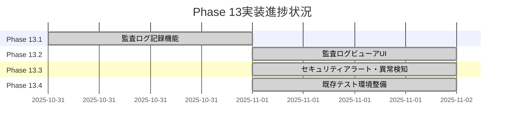
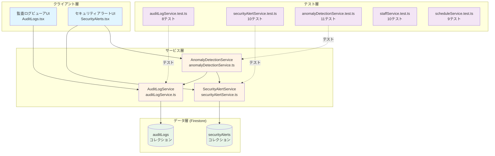
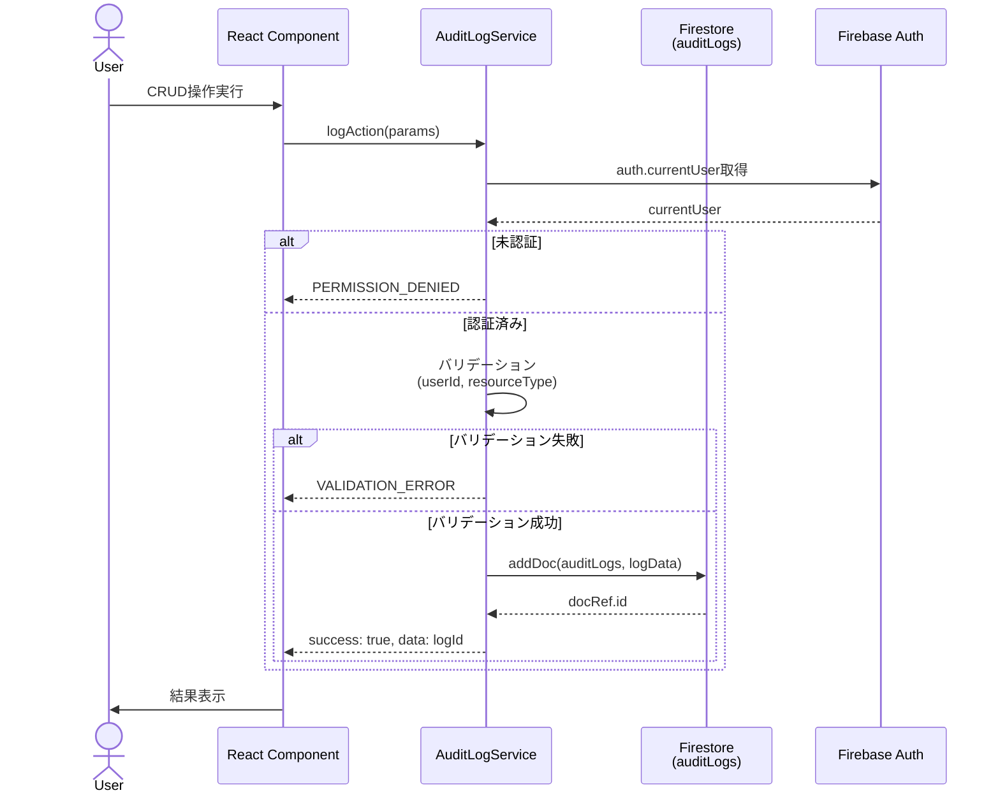
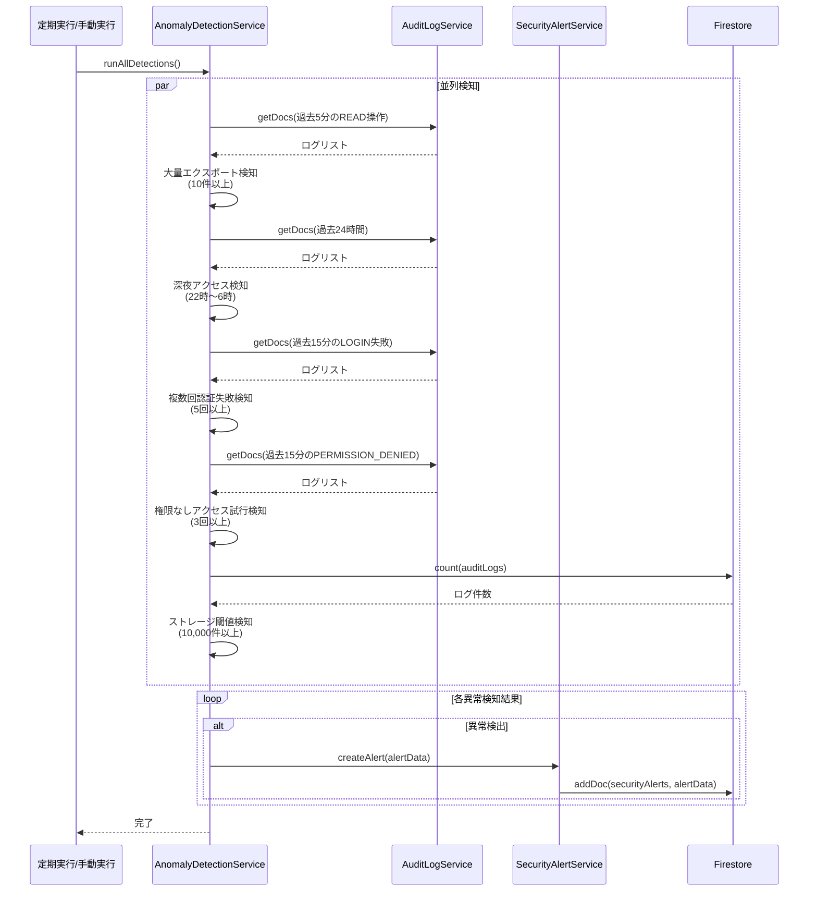
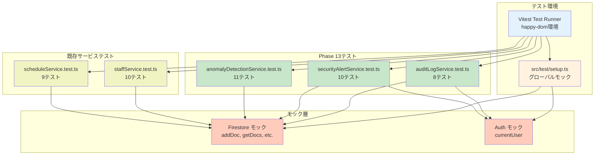
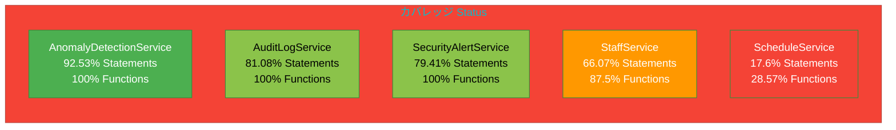
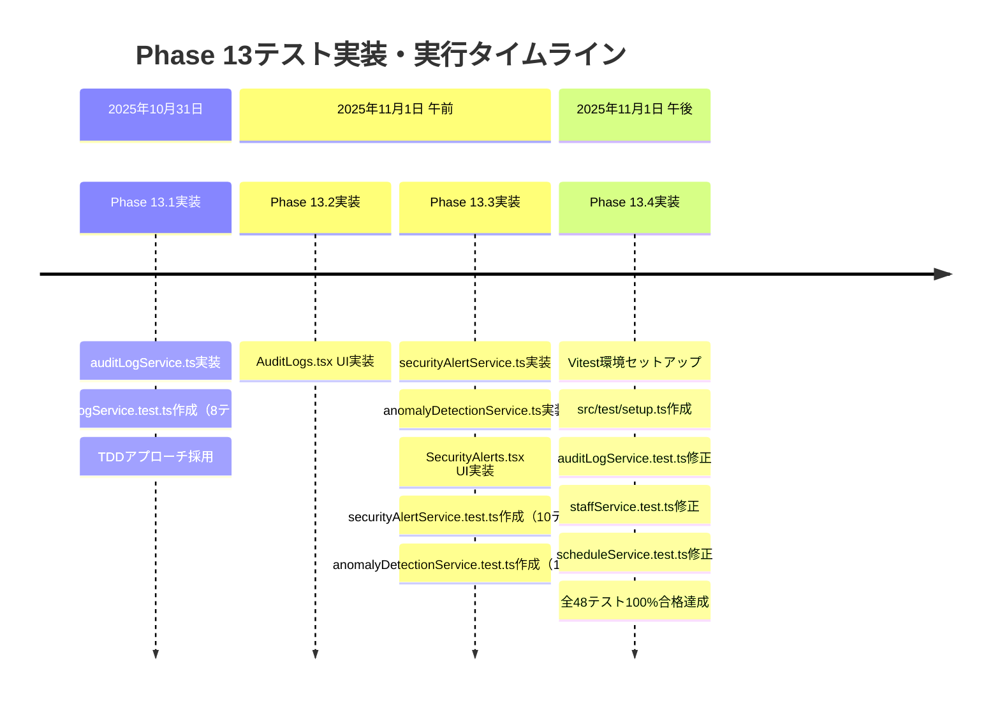
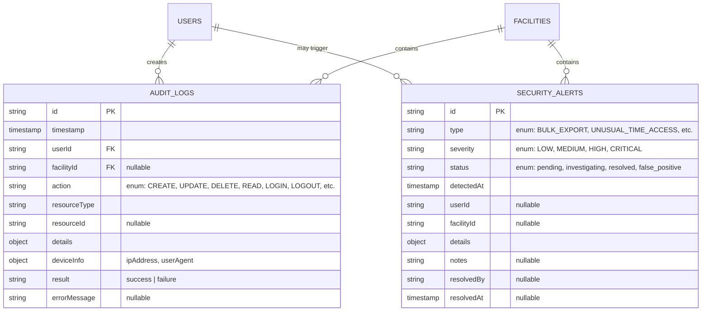
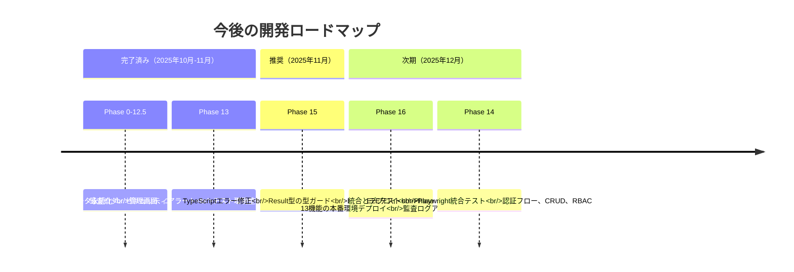

# Phase 13構造図：監査ログとコンプライアンス機能

**更新日**: 2025年11月1日
**仕様ID**: auth-data-persistence
**関連**: [phase13-completion-summary-2025-11-01.md](./phase13-completion-summary-2025-11-01.md)

---

## Phase 13実装進捗状況



---

## Phase 13アーキテクチャ図



---

## 監査ログ記録フロー（Phase 13.1）



---

## 異常検知フロー（Phase 13.3）



---

## テスト構造図



---

## カバレッジ状況（Phase 13サービス）



**凡例**:
- 🟢 緑: 80%以上（優秀）
- 🟡 オレンジ: 60-79%（良好）
- 🔴 赤: 60%未満（要改善）

---

## テスト実行結果タイムライン



---

## Phase 13データモデル（ER図）



---

## 今後の開発ロードマップ



---

## 技術スタック構成図（Phase 13追加分）

```mermaid
graph TB
    subgraph "Phase 13追加技術"
        TEST_ENV[Vitest + happy-dom<br/>高速ユニットテスト環境]
        MOCK[vi.mock()<br/>Firebaseモック]
        COVERAGE[V8 Coverage Provider<br/>90.2% Statements]
    end

    subgraph "既存技術"
        REACT[React 19.2.0]
        FIREBASE[Firebase 12.4.0]
        TYPESCRIPT[TypeScript 5.8.2]
        VITE[Vite 6.2.0]
    end

    TEST_ENV --> VITE
    MOCK --> FIREBASE
    COVERAGE --> TEST_ENV

    REACT --> VITE
    FIREBASE --> REACT
    TYPESCRIPT --> REACT

    style TEST_ENV fill:#4caf50,color:#fff
    style MOCK fill:#4caf50,color:#fff
    style COVERAGE fill:#4caf50,color:#fff
```

---

**Phase 13構造図作成日**: 2025年11月1日
**作成者**: Claude Code AI
**詳細サマリー**: [phase13-completion-summary-2025-11-01.md](./phase13-completion-summary-2025-11-01.md)
