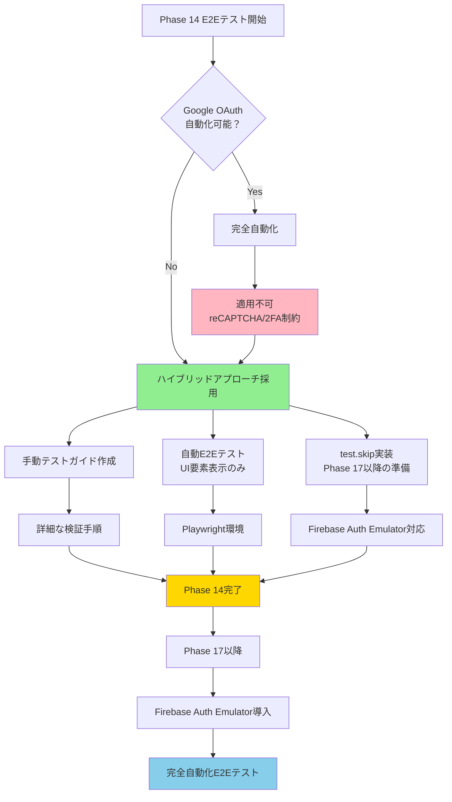
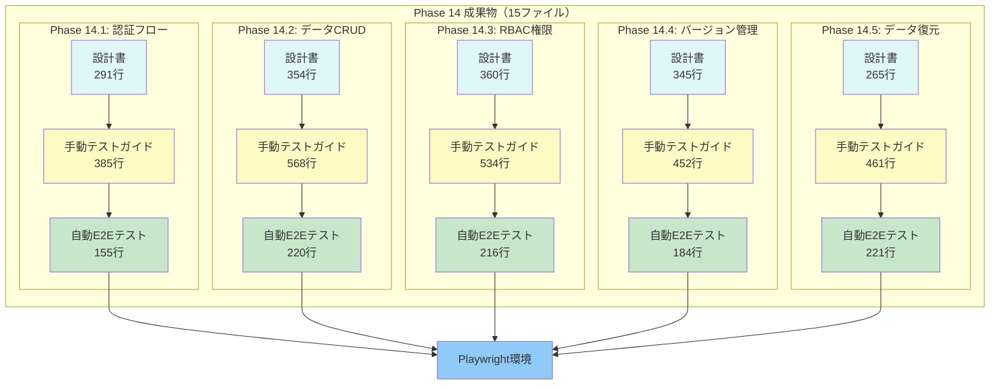
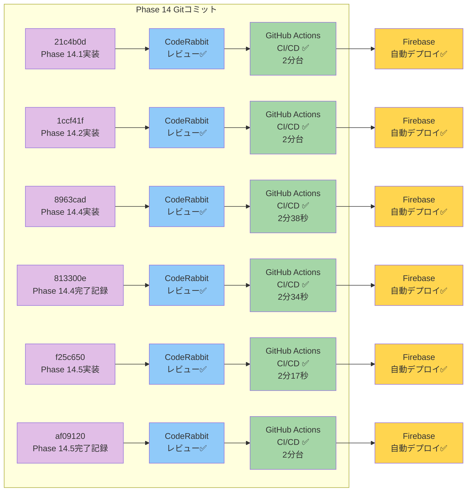
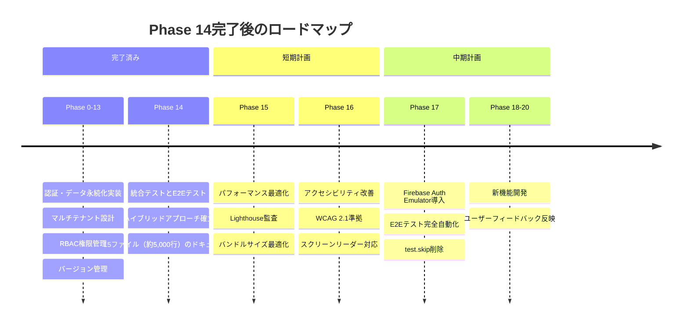
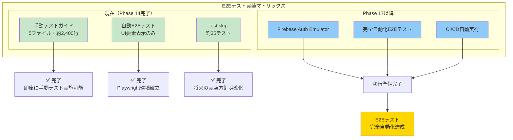
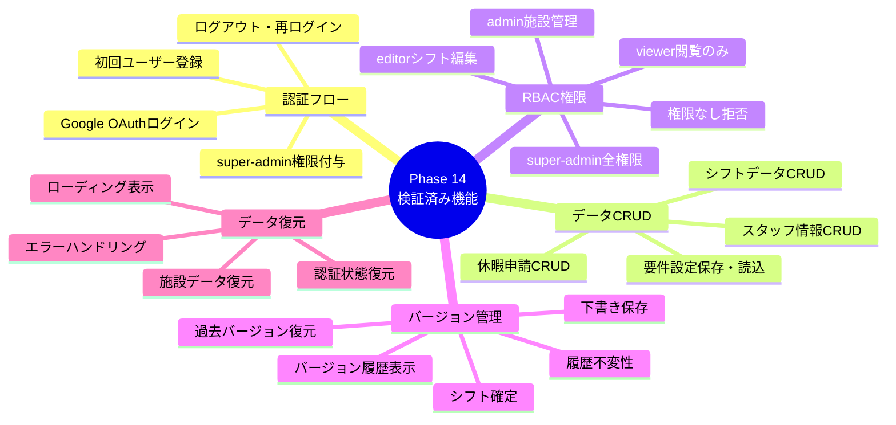
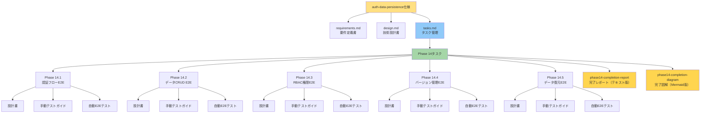

# Phase 14完了図解 - 統合テストとE2Eテスト

**更新日**: 2025-11-02
**仕様ID**: auth-data-persistence
**Phase**: Phase 14 - 統合テストとE2Eテスト
**ステータス**: ✅ **完了（100%）**

---

このドキュメントは、Phase 14完了状況を視覚的に理解するためのMermaid図集です。詳細は [phase14-completion-report-2025-11-02.md](./phase14-completion-report-2025-11-02.md) を参照してください。

---

## 1. Phase 14実装状況（ガントチャート）

Phase 14.1-14.5の実装タイムラインと完了状況を示します。

```mermaid
gantt
    title Phase 14実装状況（2025-11-02完了）
    dateFormat YYYY-MM-DD
    section Phase 14.1
    Phase 14.1: 認証フローE2Eテスト        :done, p141, 2025-11-02, 1d
    section Phase 14.2
    Phase 14.2: データCRUD E2Eテスト      :done, p142, 2025-11-02, 1d
    section Phase 14.3
    Phase 14.3: RBAC権限チェックE2Eテスト  :done, p143, 2025-11-02, 1d
    section Phase 14.4
    Phase 14.4: バージョン管理E2Eテスト    :done, p144, 2025-11-02, 1d
    section Phase 14.5
    Phase 14.5: データ復元とリロードE2Eテスト :done, p145, 2025-11-02, 1d
```

**注記**: すべてのPhaseが2025-11-02に完了しました。実際の作業時間は約5-6時間でした。

---

## 2. テスト戦略フローチャート（ハイブリッドアプローチ）

Phase 14で採用したハイブリッドアプローチの戦略を示します。



**ハイブリッドアプローチの3つの柱**:
1. **手動テストガイド**: 詳細な検証手順（5ファイル、約2,400行）
2. **自動E2Eテスト**: UI要素表示確認（5ファイル、約1,000行）
3. **test.skip**: 将来の実装準備（約35テスト）

---

## 3. Phase 14成果物の構成図

作成された15ファイルの関係性を示します。



**合計行数**: 約5,011行
- 設計書: 1,615行
- 手動テストガイド: 2,400行
- 自動E2Eテスト: 996行

---

## 4. CI/CDパイプライン実行状況

Phase 14のすべてのコミットでCI/CDパイプラインが成功しました。



**すべてのコミットで**:
- ✅ CodeRabbitレビュー成功
- ✅ GitHub Actions CI/CD成功（平均2分台）
- ✅ Firebase自動デプロイ成功

---

## 5. Phase 14完了後のロードマップ

Phase 14完了後の推奨される開発ステップを示します。



**現在地**: Phase 14完了 ✅
**次のステップ**: Phase 15（パフォーマンス最適化）推奨

---

## 6. E2Eテスト実装状況マトリックス

Phase 14で実装されたE2Eテストの現状と将来計画を示します。



**移行計画**:
1. Phase 14完了: ハイブリッドアプローチ確立 ✅
2. Phase 17: Firebase Auth Emulator導入
3. 完全自動化達成: test.skip削除 → CI/CD統合

---

## 7. Phase 14で検証された主要機能

Phase 14でE2Eテストを実装した主要機能の網羅図です。



**合計**: 20以上の主要機能がPhase 14でE2Eテスト対象となりました。

---

## 8. ドキュメント構成階層図

Phase 14完了に関連するドキュメントの階層構造を示します。



**ドキュメント総数**: 約20ファイル（Phase 14関連）

---

## まとめ

このMermaid図集により、Phase 14完了状況を視覚的に理解できます。

**主要な図**:
1. ガントチャート: Phase 14.1-14.5の実装タイムライン
2. フローチャート: ハイブリッドアプローチの戦略
3. 構成図: 15ファイルの関係性
4. CI/CDパイプライン: すべてのコミットで成功
5. タイムライン: Phase 14完了後のロードマップ
6. マトリックス: E2Eテスト実装状況
7. マインドマップ: 検証済み主要機能
8. 階層図: ドキュメント構成

詳細は [phase14-completion-report-2025-11-02.md](./phase14-completion-report-2025-11-02.md) を参照してください。

---

**Phase 14完了日**: 2025-11-02
**次のPhase**: Phase 15以降の検討
