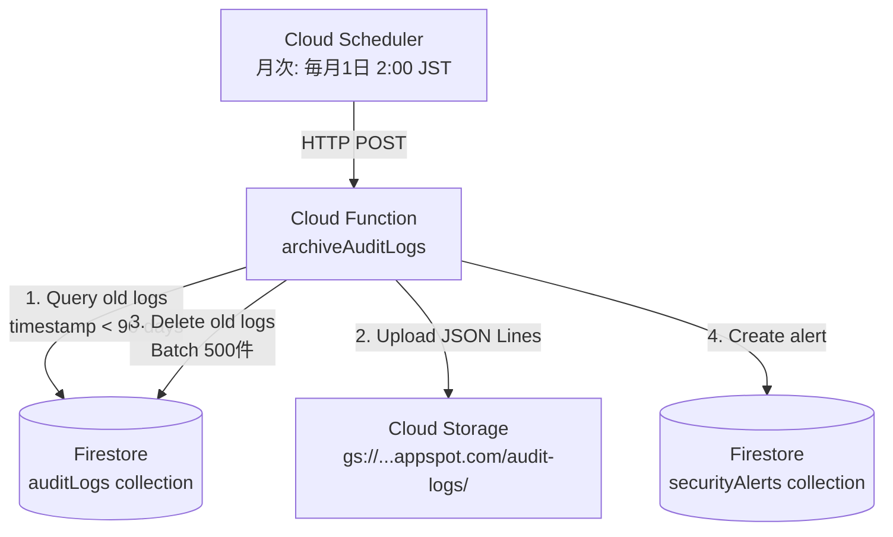
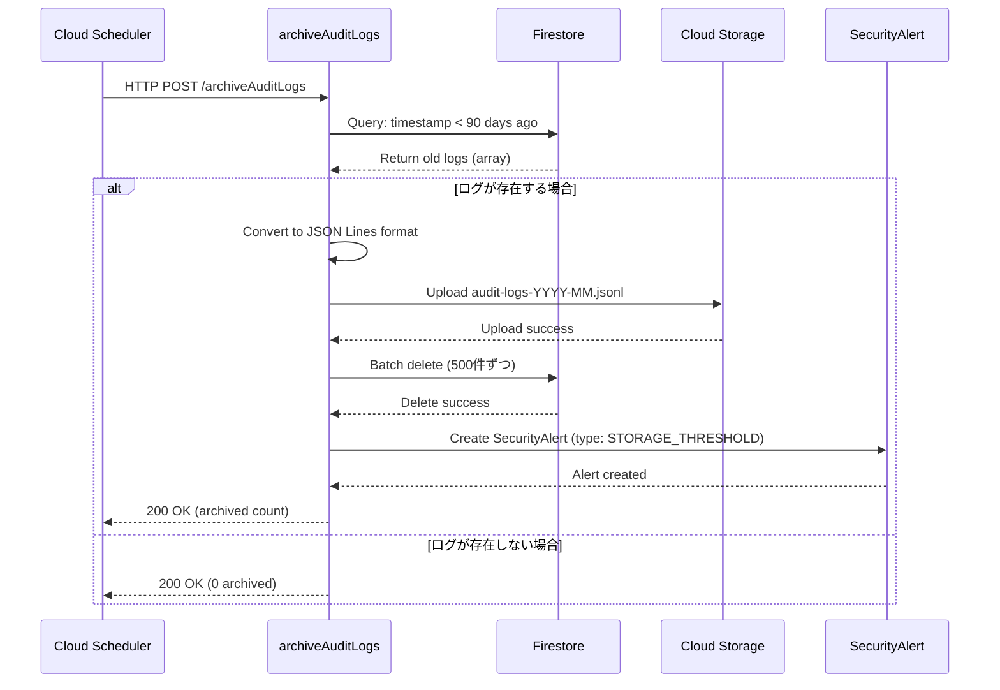

# Phase 16.2設計書：監査ログアーカイブ機能

**作成日**: 2025年11月2日
**仕様ID**: auth-data-persistence
**Phase**: Phase 16.2（監査ログアーカイブ機能）
**言語**: 日本語

---

## 📋 目的

監査ログが10,000件を超えた場合、古いログを自動的にCloud Storageにアーカイブし、Firestoreから削除することで、ストレージコストを削減し、クエリパフォーマンスを維持する。

---

## 🎯 要件

### 機能要件

1. **自動アーカイブ**
   - 監査ログが10,000件を超えた場合、古いログをアーカイブ
   - Cloud Schedulerで月次実行（毎月1日 2:00 JST）

2. **アーカイブ対象**
   - 90日以上前の監査ログ
   - 保存期間：最低5年（介護保険法準拠）

3. **アーカイブ先**
   - Cloud Storage: `gs://ai-care-shift-scheduler.appspot.com/audit-logs/archive/`
   - ファイル形式：JSON Lines（1行1ログ）
   - ファイル名：`audit-logs-YYYY-MM.jsonl`

4. **アーカイブ後の処理**
   - Firestoreから古いログを削除
   - セキュリティアラートを生成（アーカイブ完了通知）

### 非機能要件

1. **パフォーマンス**
   - バッチ処理でFirestore読み取り・削除を最適化（500件ずつ）
   - タイムアウト：最大9分（Cloud Functions制限）

2. **コスト**
   - Firestore読み取り：最小化（クエリを1回のみ）
   - Cloud Storage書き込み：1ファイル/月

3. **信頼性**
   - トランザクションを使用して原子性を保証
   - エラー時はロールバック
   - アーカイブ失敗時はFirestoreから削除しない

4. **セキュリティ**
   - Cloud Storage bucketは非公開
   - IAM権限：Cloud Functionsのみアクセス可能

---

## 🏗️ アーキテクチャ

### システム構成



### データフロー



---

## 🔧 実装仕様

### Cloud Function: `archiveAuditLogs`

**ファイル**: `functions/src/archiveAuditLogs.ts`

**トリガー**: Cloud Scheduler（HTTP）

**実装例**:

```typescript
import { onRequest } from 'firebase-functions/v2/https';
import { getFirestore } from 'firebase-admin/firestore';
import { Storage } from '@google-cloud/storage';

export const archiveAuditLogs = onRequest(
  { timeoutSeconds: 540, region: 'us-central1' },
  async (req, res) => {
    const db = getFirestore();
    const storage = new Storage();
    const bucket = storage.bucket('ai-care-shift-scheduler.appspot.com');

    try {
      // 1. 90日以上前のログを取得
      const ninetyDaysAgo = new Date();
      ninetyDaysAgo.setDate(ninetyDaysAgo.getDate() - 90);

      const oldLogsQuery = db
        .collection('auditLogs')
        .where('timestamp', '<', ninetyDaysAgo)
        .orderBy('timestamp', 'asc');

      const oldLogsSnapshot = await oldLogsQuery.get();

      if (oldLogsSnapshot.empty) {
        res.status(200).send({ message: 'No logs to archive', archivedCount: 0 });
        return;
      }

      // 2. JSON Lines形式に変換
      const logs = oldLogsSnapshot.docs.map((doc) => ({
        id: doc.id,
        ...doc.data(),
      }));

      const jsonLines = logs.map((log) => JSON.stringify(log)).join('\n');

      // 3. Cloud Storageにアップロード
      const year = ninetyDaysAgo.getFullYear();
      const month = String(ninetyDaysAgo.getMonth() + 1).padStart(2, '0');
      const fileName = `audit-logs/archive/audit-logs-${year}-${month}.jsonl`;

      const file = bucket.file(fileName);
      await file.save(jsonLines, {
        contentType: 'application/x-ndjson',
        metadata: {
          archivedAt: new Date().toISOString(),
          logsCount: logs.length,
        },
      });

      // 4. Firestoreから削除（バッチ処理: 500件ずつ）
      const batchSize = 500;
      let deletedCount = 0;

      for (let i = 0; i < oldLogsSnapshot.docs.length; i += batchSize) {
        const batch = db.batch();
        const docsToDelete = oldLogsSnapshot.docs.slice(i, i + batchSize);

        docsToDelete.forEach((doc) => {
          batch.delete(doc.ref);
        });

        await batch.commit();
        deletedCount += docsToDelete.length;
      }

      // 5. セキュリティアラート生成
      await db.collection('securityAlerts').add({
        type: 'STORAGE_THRESHOLD',
        severity: 'low',
        status: 'resolved',
        description: `監査ログアーカイブ完了: ${deletedCount}件のログをアーカイブしました`,
        detectedAt: new Date(),
        details: {
          archivedCount: deletedCount,
          archiveFile: fileName,
          threshold: 10000,
        },
      });

      res.status(200).send({
        message: 'Archive completed successfully',
        archivedCount: deletedCount,
        archiveFile: fileName,
      });
    } catch (error) {
      console.error('Archive failed:', error);
      res.status(500).send({
        error: 'Archive failed',
        message: error instanceof Error ? error.message : 'Unknown error',
      });
    }
  }
);
```

### Cloud Scheduler設定

**ジョブ名**: `archive-audit-logs-monthly`

**スケジュール**: `0 2 1 * *` (毎月1日 2:00 JST)

**タイムゾーン**: `Asia/Tokyo`

**ターゲット**: HTTP

**URL**: `https://us-central1-ai-care-shift-scheduler.cloudfunctions.net/archiveAuditLogs`

**HTTPメソッド**: POST

**認証**: Service Account（Cloud Functionsのデフォルト）

### Cloud Storage Bucket設定

**Bucket名**: `ai-care-shift-scheduler.appspot.com`

**ストレージクラス**: Standard（頻繁にアクセスするデータ）

**ライフサイクルルール**:
- 5年（1,825日）経過後に削除
- ストレージクラスを30日後にNearlineに変更（コスト削減）

**IAM権限**:
- Cloud Functions: `roles/storage.objectAdmin`
- その他: 非公開

---

## 📊 コスト見積もり

### Firestore

**読み取り**:
- 月1回のクエリ（90日以上前のログ）
- 最大10,000件読み取り
- コスト: $0.036/100,000件 = 約$0.004/月

**削除**:
- 月1回のバッチ削除（最大10,000件）
- コスト: $0.018/100,000件 = 約$0.002/月

### Cloud Storage

**書き込み**:
- 月1ファイル（約10,000ログ、約5MB）
- コスト: $0.05/10,000オペレーション = 約$0.000005/月

**ストレージ**:
- 月5MB × 60ヶ月（5年） = 300MB
- コスト: $0.020/GB/月 = 約$0.006/月

### Cloud Scheduler

**ジョブ実行**:
- 月1回
- コスト: $0.10/ジョブ/月 = $0.10/月

### Cloud Functions

**実行時間**:
- 月1回、約30秒実行
- コスト: $0.0000025/GB秒 = 約$0.00002/月

**合計**: 約$0.11/月（Cloud Schedulerが大半）

---

## 🧪 テスト計画

### ユニットテスト

**ファイル**: `functions/src/__tests__/archiveAuditLogs.test.ts`

**テストケース**:
1. 90日以上前のログが正しくクエリされる
2. JSON Lines形式への変換が正しい
3. Cloud Storageへのアップロードが成功する
4. Firestoreからの削除が正しく実行される（バッチ処理）
5. セキュリティアラートが生成される
6. ログが存在しない場合、エラーなく終了する
7. Cloud Storageアップロード失敗時、Firestoreから削除されない

### 統合テスト

**手順**:
1. Firebase Emulatorで10,000件のテストログを作成
2. archiveAuditLogsを実行
3. Cloud Storage（ローカル）にファイルがアップロードされることを確認
4. Firestoreから古いログが削除されることを確認
5. セキュリティアラートが生成されることを確認

### 本番環境テスト

**手順**:
1. Cloud Schedulerジョブを手動実行（gcloud CLI）
2. Cloud Functionsログで実行結果を確認
3. Cloud Storageでアーカイブファイルを確認
4. Firestoreで古いログが削除されたことを確認
5. セキュリティアラートページでアラートを確認

---

## 🚀 デプロイ手順

### 1. Cloud Functionデプロイ

```bash
cd functions
npm run deploy -- --only functions:archiveAuditLogs
```

### 2. Cloud Schedulerジョブ作成

```bash
gcloud scheduler jobs create http archive-audit-logs-monthly \
  --schedule="0 2 1 * *" \
  --time-zone="Asia/Tokyo" \
  --uri="https://us-central1-ai-care-shift-scheduler.cloudfunctions.net/archiveAuditLogs" \
  --http-method=POST \
  --oidc-service-account-email="ai-care-shift-scheduler@appspot.gserviceaccount.com" \
  --project=ai-care-shift-scheduler
```

### 3. Cloud Storage Bucketライフサイクル設定

**ファイル**: `storage-lifecycle.json`

```json
{
  "lifecycle": {
    "rule": [
      {
        "action": {
          "type": "SetStorageClass",
          "storageClass": "NEARLINE"
        },
        "condition": {
          "age": 30,
          "matchesPrefix": ["audit-logs/archive/"]
        }
      },
      {
        "action": {
          "type": "Delete"
        },
        "condition": {
          "age": 1825,
          "matchesPrefix": ["audit-logs/archive/"]
        }
      }
    ]
  }
}
```

```bash
gsutil lifecycle set storage-lifecycle.json gs://ai-care-shift-scheduler.appspot.com
```

---

## 📝 ドキュメント更新

### tasks.mdの更新

Phase 16.2タスクを完了としてマーク：

```markdown
- [x] 16.2 監査ログアーカイブ機能の設計と実装
  - Cloud Function `archiveAuditLogs` の実装
  - Cloud Schedulerジョブの作成
  - Cloud Storageライフサイクル設定
  - ユニットテスト実装
  - 本番環境デプロイ
```

### メモリの更新

`phase16_progress` メモリを作成：
- Phase 16.1: 本番環境動作確認（完了）
- Phase 16.2: 監査ログアーカイブ機能（完了）
- Phase 16.3: パフォーマンス監視（次のステップ）

---

## 🐛 既知の問題と制限事項

### 1. Cloud Functions実行時間制限

**制限**: 最大9分（gen2）

**影響**: 10,000件以上のログがある場合、タイムアウトの可能性

**緩和策**: バッチ処理で500件ずつ削除

### 2. 手動復元機能なし

**制限**: アーカイブされたログは手動でCloud Storageから復元する必要あり

**影響**: 過去のログを閲覧する際の手間

**将来の改善**: 管理画面にアーカイブログ閲覧機能を追加（Phase 17以降）

---

## 📁 関連ドキュメント

- **Phase 16.1検証レポート**: `.kiro/specs/auth-data-persistence/phase16-1-production-verification-2025-11-02.md`
- **Phase 13完了サマリー**: `.kiro/specs/auth-data-persistence/phase13-completion-summary-2025-11-01.md`
- **仕様書**: `.kiro/specs/auth-data-persistence/requirements.md` - Requirement 11
- **タスク**: `.kiro/specs/auth-data-persistence/tasks.md` - Phase 16

---

**作成日**: 2025年11月2日
**Phase 16.2ステータス**: 🟡 **設計完了**（実装は次のステップ）
**次のアクション**: Cloud Function `archiveAuditLogs` の実装開始
