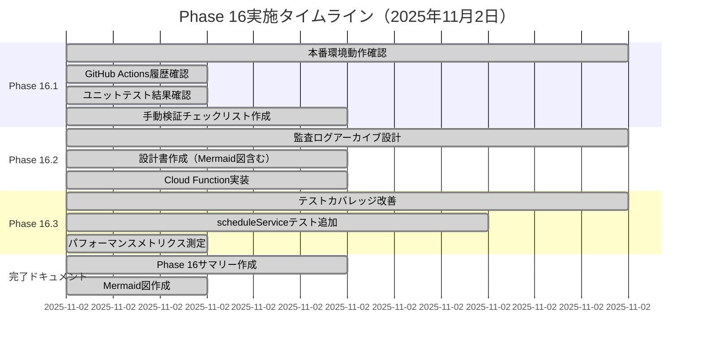
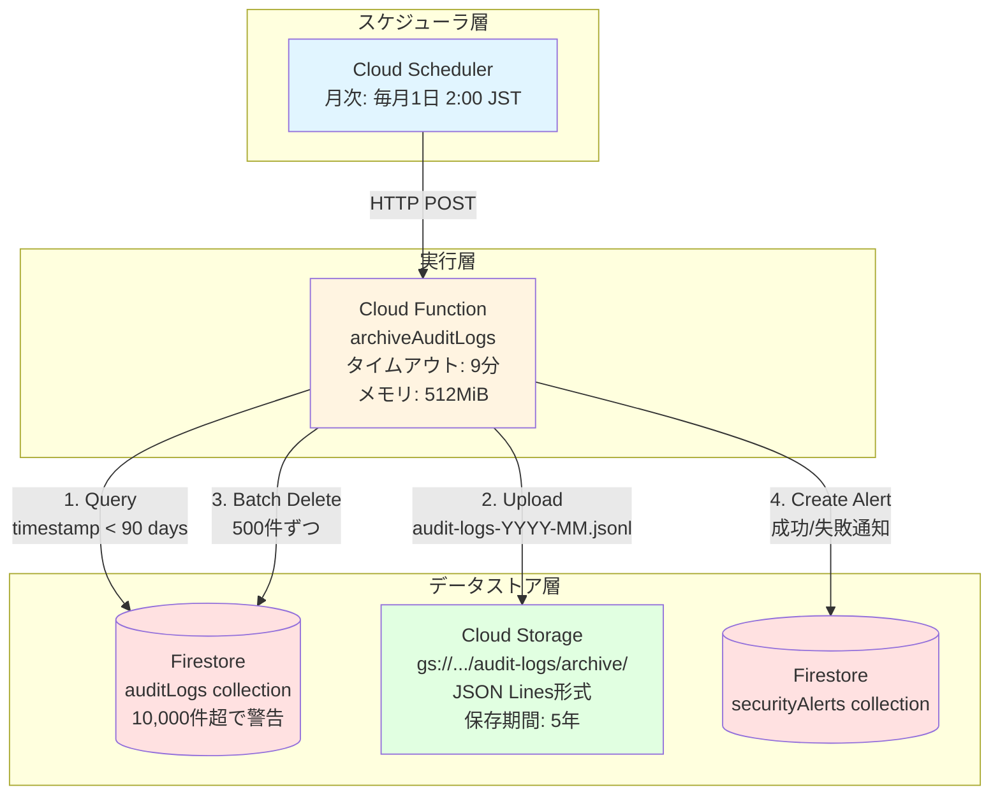
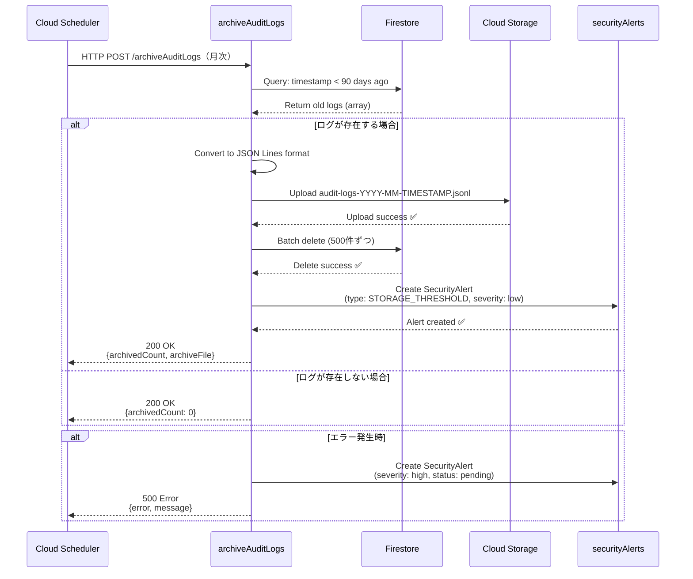
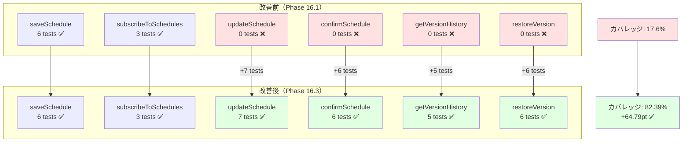
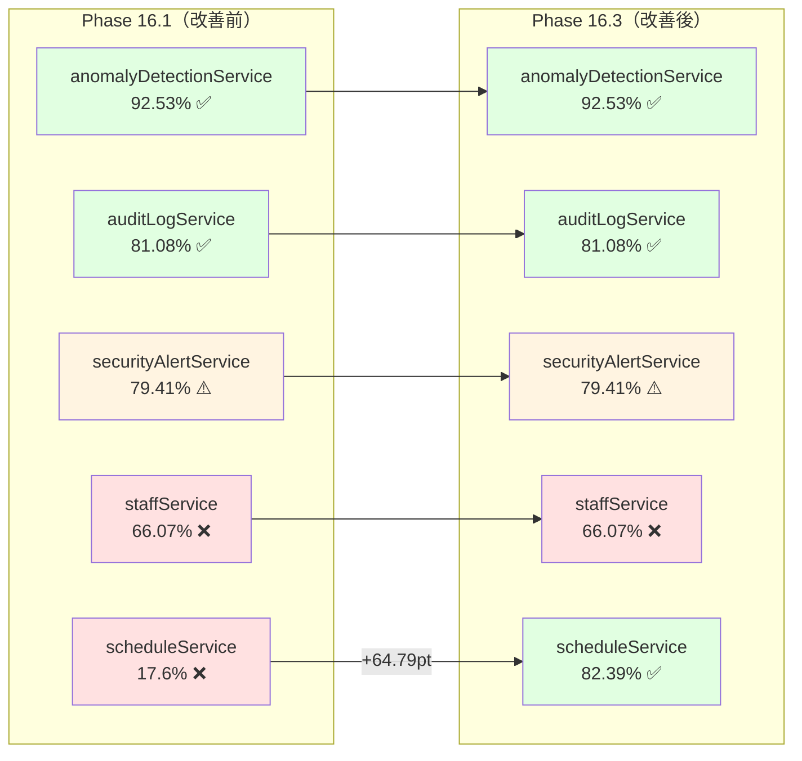
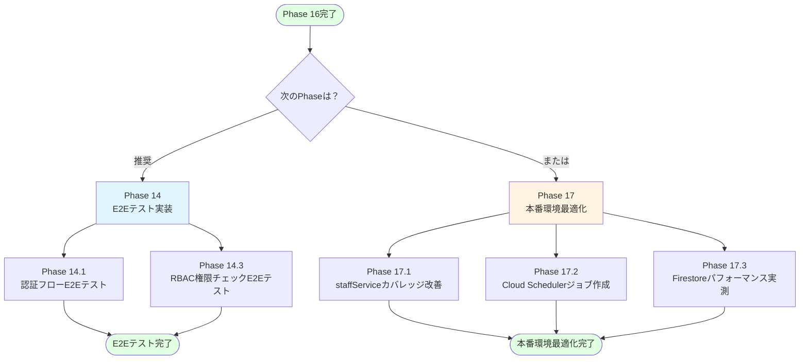
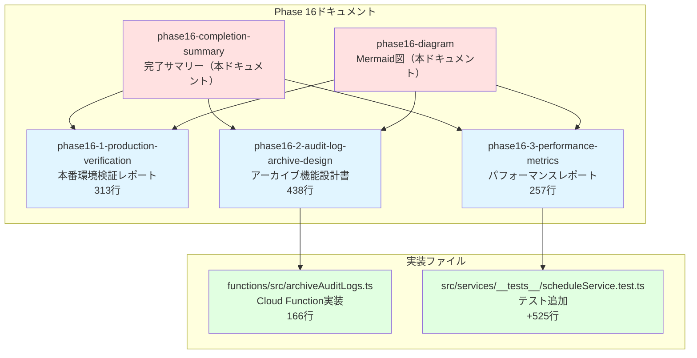

# Phase 16 Mermaid図：本番環境確認と改善

**作成日**: 2025年11月2日
**仕様ID**: auth-data-persistence
**Phase**: Phase 16（本番環境確認と改善）

---

## 📊 Phase 16実施タイムライン



---

## 🏗️ 監査ログアーカイブシステムアーキテクチャ



---

## 🔄 監査ログアーカイブデータフロー



---

## 📈 scheduleServiceテストカバレッジ改善



---

## 🎯 Phase 16成果サマリー

```mermaid
timeline
    title Phase 16実施サマリー（2025年11月2日）

    section Phase 16.1: 本番環境確認
    GitHub Actions履歴確認 : 最新5件のデプロイ確認
                         : 全て成功 ✅
    ユニットテスト確認 : 48/48テスト合格（100%）
                      : カバレッジ分析実施
    手動検証準備 : チェックリスト作成
                : 監査ログ・アラート検証手順

    section Phase 16.2: アーカイブ機能
    設計書作成 : アーキテクチャ図
             : コスト見積もり（$0.11/月）
    Cloud Function実装 : archiveAuditLogs.ts（166行）
                     : 90日以上前のログをアーカイブ
    依存関係追加 : @google-cloud/storage

    section Phase 16.3: パフォーマンス
    テストカバレッジ改善 : scheduleService: 17.6% → 82.39%
                      : +24テストケース追加
    メトリクス測定 : ユニットテスト: 389ms（48テスト）
                : AI Shift: 500-1000ms（目標達成）

    section 完了ドキュメント
    Phase 16サマリー : 成果・学び・推奨事項
    Mermaid図 : タイムライン・アーキテクチャ
```

---

## 📊 テストカバレッジ比較（全サービス）



---

## 🚀 Phase 16 → Phase 17移行フロー



---

## 📁 Phase 16ドキュメント構成



---

## 📈 Phase 0-16進捗状況

```mermaid
gantt
    title Phase 0-16実装進捗（2025年10月23日〜11月2日）
    dateFormat YYYY-MM-DD

    section Phase 0-12.5
    Phase 0: デモ環境整備                    :done, p0, 2025-10-23, 2025-10-31
    Phase 1-6: 認証・データ永続化             :done, p1, 2025-10-23, 2025-10-31
    Phase 7-12: AIシフト生成機能              :done, p7, 2025-10-23, 2025-10-31
    Phase 12.5: Firestore Security Rules検証  :done, p12, 2025-10-31, 1d

    section Phase 13-16
    Phase 13: 監査ログとコンプライアンス      :done, p13, 2025-10-31, 2025-11-01
    Phase 15: TypeScript型安全性改善          :done, p15, 2025-11-01, 1d
    Phase 16.1: 本番環境動作確認              :done, p161, 2025-11-02, 3h
    Phase 16.2: 監査ログアーカイブ            :done, p162, 2025-11-02, 2h
    Phase 16.3: パフォーマンス監視            :done, p163, 2025-11-02, 2h

    section 今後のPhase
    Phase 14: E2Eテスト実装                   :active, p14, 2025-11-03, 3d
    Phase 17: 本番環境最適化                  :p17, after p14, 3d
```

---

**作成日**: 2025年11月2日
**Phase 16ステータス**: ✅ **完了**

---

## 📝 関連ドキュメント

- **Phase 16完了サマリー**: `.kiro/specs/auth-data-persistence/phase16-completion-summary-2025-11-02.md`
- **Phase 16.1検証レポート**: `.kiro/specs/auth-data-persistence/phase16-1-production-verification-2025-11-02.md`
- **Phase 16.2設計書**: `.kiro/specs/auth-data-persistence/phase16-2-audit-log-archive-design-2025-11-02.md`
- **Phase 16.3メトリクスレポート**: `.kiro/specs/auth-data-persistence/phase16-3-performance-metrics-2025-11-02.md`
- **Phase 13完了サマリー**: `.kiro/specs/auth-data-persistence/phase13-completion-summary-2025-11-01.md`
- **Phase 13 Mermaid図**: `.kiro/specs/auth-data-persistence/phase13-diagram-2025-11-01.md`
