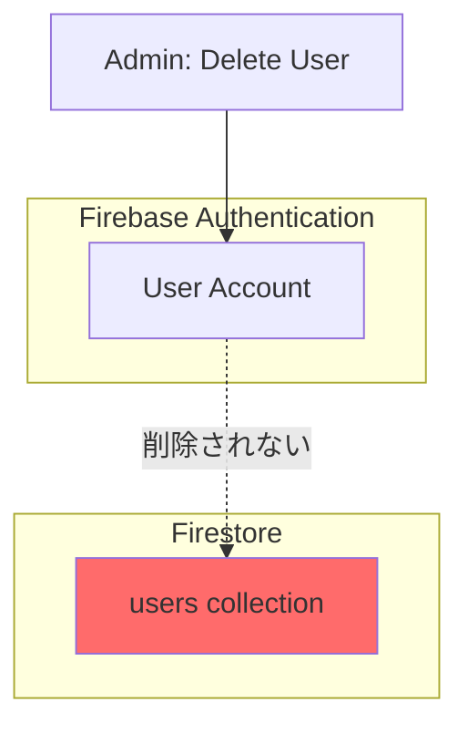
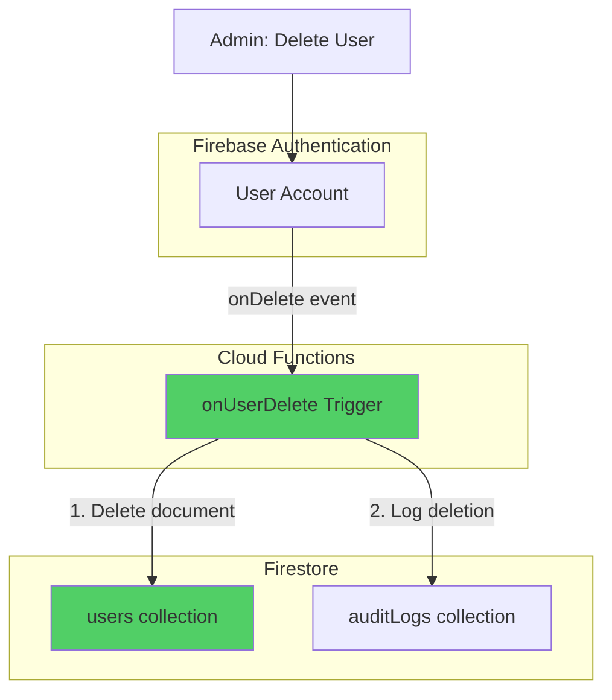

# Phase 17: ユーザー管理の不具合修正 - 技術設計

**更新日**: 2025-11-12
**仕様ID**: auth-data-persistence
**Phase**: 17
**種別**: バグ修正（重大）

---

## 目次

1. [アーキテクチャ概要](#アーキテクチャ概要)
2. [修正内容](#修正内容)
3. [コンポーネント設計](#コンポーネント設計)
4. [Cloud Function設計](#cloud-function設計)
5. [エラーハンドリング改善](#エラーハンドリング改善)
6. [クリーンアップスクリプト設計](#クリーンアップスクリプト設計)
7. [テスト戦略](#テスト戦略)
8. [デプロイ戦略](#デプロイ戦略)
9. [ロールバック計画](#ロールバック計画)

---

## アーキテクチャ概要

### 現状の問題



**問題**: Firebase Authenticationでユーザーを削除しても、Firestoreの`users` collectionは削除されない

### 修正後のアーキテクチャ



**解決**: Cloud Functionの`onDelete`トリガーで自動的にFirestoreドキュメントも削除

---

## 修正内容

### 修正1: AuthContext エラーハンドリング改善

**目的**: Permission errorを適切にハンドリングし、ユーザー体験を向上

**変更ファイル**: `src/contexts/AuthContext.tsx`

**変更箇所**: Line 98付近のユーザープロファイルフェッチ処理

### 修正2: Cloud Function - ユーザー削除トリガー

**目的**: Authentication削除時にFirestoreドキュメントを自動削除

**新規ファイル**: `functions/src/onUserDelete.ts`

### 修正3: 既存削除済みユーザーのクリーンアップ

**目的**: 過去に削除されたユーザーのFirestoreドキュメントを一括削除

**新規ファイル**: `scripts/cleanupDeletedUsers.ts`

---

## コンポーネント設計

### 1. AuthContext エラーハンドリング改善

#### 変更前

```typescript
// src/contexts/AuthContext.tsx Line 95-126
try {
  const userDoc = await getDoc(doc(db, 'users', user.uid));
  if (userDoc.exists()) {
    let profile = userDoc.data() as User;
    // ... 処理
  } else {
    setUserProfile(null);
    setSelectedFacilityId(null);
  }
} catch (error) {
  console.error('Failed to fetch user profile:', error);
  setUserProfile(null);
  setSelectedFacilityId(null);
}
```

#### 変更後

```typescript
// src/contexts/AuthContext.tsx Line 95-145（推定）
try {
  const userDoc = await getDoc(doc(db, 'users', user.uid));
  if (userDoc.exists()) {
    let profile = userDoc.data() as User;

    // 新規ユーザー（facilities が空）の場合、Cloud Function 完了を待機
    if (!profile.facilities || profile.facilities.length === 0) {
      const createdAt = profile.createdAt;
      const now = Date.now();
      const isRecentlyCreated = createdAt &&
        createdAt instanceof Timestamp &&
        (now - createdAt.toMillis()) < 30000; // 30秒以内

      if (isRecentlyCreated) {
        console.log('🔄 New user detected, waiting for Cloud Function to assign facilities...');
        const updatedProfile = await waitForFacilities(user.uid, 10);
        if (updatedProfile) {
          profile = updatedProfile;
        } else {
          // Cloud Function完了を待てなかった場合は警告を表示
          console.warn('⚠️ Cloud Function did not complete within timeout');
        }
      } else {
        // 作成から30秒以上経過している場合は、facilitiesが空でもエラーとみなす
        console.error('❌ User profile has no facilities and is not recently created');
      }
    }

    setUserProfile(profile);
    // ... 残りの処理
  } else {
    // ユーザードキュメントが存在しない場合
    console.warn('⚠️ User document does not exist for UID:', user.uid);
    console.warn('This may happen if:');
    console.warn('1. User just logged in and Cloud Function has not created the document yet');
    console.warn('2. User was deleted from Firestore but still exists in Authentication');

    setUserProfile(null);
    setSelectedFacilityId(null);
  }
} catch (error: any) {
  // エラーコードに応じた詳細ログ
  if (error.code === 'permission-denied') {
    console.error('❌ Permission denied when fetching user profile');
    console.error('Possible causes:');
    console.error('1. Security Rules not deployed correctly');
    console.error('2. User document does not exist (new user)');
    console.error('3. Authentication token not fully initialized');
    console.error('Error details:', error);
  } else {
    console.error('❌ Failed to fetch user profile:', error);
  }

  setUserProfile(null);
  setSelectedFacilityId(null);
}
```

**改善点**:
- エラー原因の詳細なログ記録
- Permission errorの分類
- ドキュメント不存在時の明確なメッセージ
- ユーザー体験の向上（エラー時でもクラッシュしない）

---

## Cloud Function設計

### onUserDelete トリガー

#### ファイル構成

```
functions/
├── src/
│   ├── index.ts                 # エントリーポイント（既存）
│   ├── onUserCreate.ts          # 既存のユーザー作成トリガー
│   └── onUserDelete.ts          # 🆕 新規：ユーザー削除トリガー
├── package.json
└── tsconfig.json
```

#### 実装: `functions/src/onUserDelete.ts`

```typescript
import * as functions from 'firebase-functions';
import * as admin from 'firebase-admin';

/**
 * Firebase Authentication ユーザー削除時に Firestore ドキュメントも削除
 *
 * このトリガーは以下を実行します：
 * 1. Firestore users collection からユーザードキュメントを削除
 * 2. 削除操作を監査ログに記録
 *
 * @param user - 削除されたユーザー情報
 */
export const onUserDelete = functions.auth.user().onDelete(async (user) => {
  const userId = user.uid;
  const userEmail = user.email || 'unknown';
  const db = admin.firestore();

  console.log(`🗑️ User deleted from Authentication: ${userId} (${userEmail})`);

  try {
    // 1. Firestore users collection からドキュメントを削除
    const userDocRef = db.collection('users').doc(userId);
    const userDoc = await userDocRef.get();

    if (!userDoc.exists) {
      console.warn(`⚠️ User document does not exist in Firestore: ${userId}`);
      // ドキュメントが存在しない場合も成功とみなす（冪等性）
    } else {
      // ドキュメント削除
      await userDocRef.delete();
      console.log(`✅ Successfully deleted Firestore document for user: ${userId}`);
    }

    // 2. 監査ログに記録（成功）
    await db.collection('auditLogs').add({
      userId: 'system', // システム操作として記録
      action: 'user_deleted',
      resourceType: 'user',
      resourceId: userId,
      metadata: {
        email: userEmail,
        deletedAt: admin.firestore.FieldValue.serverTimestamp(),
        documentExisted: userDoc.exists,
      },
      result: 'success',
      timestamp: admin.firestore.FieldValue.serverTimestamp(),
    });

    console.log(`📝 Audit log created for user deletion: ${userId}`);
  } catch (error) {
    console.error(`❌ Failed to delete Firestore document for user ${userId}:`, error);

    // 3. 監査ログに記録（失敗）
    try {
      await db.collection('auditLogs').add({
        userId: 'system',
        action: 'user_deleted',
        resourceType: 'user',
        resourceId: userId,
        metadata: {
          email: userEmail,
          error: (error as Error).message,
          errorStack: (error as Error).stack,
        },
        result: 'failure',
        timestamp: admin.firestore.FieldValue.serverTimestamp(),
      });
    } catch (logError) {
      console.error(`❌ Failed to create audit log for user deletion: ${logError}`);
    }

    // エラーを再スローして、Cloud Functionsのエラーログに記録
    throw error;
  }
});
```

#### エントリーポイントへの登録: `functions/src/index.ts`

```typescript
// 既存のインポート
import { onUserCreate } from './onUserCreate';
import { onUserDelete } from './onUserDelete'; // 🆕 追加

// 既存のエクスポート
export { onUserCreate };
export { onUserDelete }; // 🆕 追加
```

#### Cloud Function デプロイ設定

**firebase.json** (既存ファイル、変更不要):

```json
{
  "functions": [
    {
      "source": "functions",
      "codebase": "default",
      "ignore": [
        "node_modules",
        ".git",
        "firebase-debug.log",
        "firebase-debug.*.log"
      ],
      "predeploy": [
        "npm --prefix \"$RESOURCE_DIR\" run lint",
        "npm --prefix \"$RESOURCE_DIR\" run build"
      ]
    }
  ]
}
```

#### デプロイコマンド

```bash
# すべてのCloud Functionsをデプロイ
firebase deploy --only functions

# または、特定の関数のみデプロイ
firebase deploy --only functions:onUserDelete
```

---

## クリーンアップスクリプト設計

### 既存削除済みユーザーのクリーンアップ

#### 目的

過去にFirebase Authenticationで削除されたが、Firestoreに残っているユーザードキュメントを一括削除。

#### ファイル: `scripts/cleanupDeletedUsers.ts`

```typescript
/**
 * 削除済みユーザーのFirestoreドキュメントをクリーンアップ
 *
 * このスクリプトは以下を実行します：
 * 1. Firestore users collection のすべてのドキュメントを取得
 * 2. 各ユーザーがFirebase Authenticationに存在するか確認
 * 3. 存在しないユーザーのFirestoreドキュメントを削除
 * 4. 監査ログに記録
 *
 * 実行方法:
 *   npm run cleanup:deleted-users
 */

import * as admin from 'firebase-admin';

// 環境変数チェック（本番環境での誤実行防止）
if (process.env.NODE_ENV === 'production') {
  console.error('❌ This script cannot be run in production environment');
  console.error('Please run in development or staging environment');
  process.exit(1);
}

// Firebase Admin SDK初期化
admin.initializeApp({
  projectId: 'ai-care-shift-scheduler', // プロジェクトID
});

const db = admin.firestore();
const auth = admin.auth();

async function cleanupDeletedUsers() {
  console.log('🔍 Starting cleanup of deleted users...\n');

  try {
    // 1. Firestore users collection のすべてのドキュメントを取得
    const usersSnapshot = await db.collection('users').get();
    console.log(`📊 Total users in Firestore: ${usersSnapshot.size}\n`);

    let deletedCount = 0;
    let existsCount = 0;
    let errorCount = 0;

    // 2. 各ユーザーをチェック
    for (const userDoc of usersSnapshot.docs) {
      const userId = userDoc.id;
      const userData = userDoc.data();
      const userEmail = userData.email || 'unknown';

      try {
        // Firebase Authentication にユーザーが存在するか確認
        await auth.getUser(userId);

        // 存在する場合
        console.log(`✅ User ${userId} (${userEmail}) exists in Authentication`);
        existsCount++;
      } catch (error: any) {
        if (error.code === 'auth/user-not-found') {
          // Authentication に存在しないユーザー → Firestore から削除
          console.log(`🗑️  User ${userId} (${userEmail}) not found in Authentication`);
          console.log(`    Deleting Firestore document...`);

          // Firestore ドキュメント削除
          await db.collection('users').doc(userId).delete();

          // 監査ログに記録
          await db.collection('auditLogs').add({
            userId: 'system',
            action: 'cleanup_deleted_user',
            resourceType: 'user',
            resourceId: userId,
            metadata: {
              email: userEmail,
              cleanupReason: 'User not found in Authentication',
              cleanupAt: admin.firestore.FieldValue.serverTimestamp(),
            },
            result: 'success',
            timestamp: admin.firestore.FieldValue.serverTimestamp(),
          });

          console.log(`    ✅ Deleted successfully\n`);
          deletedCount++;
        } else {
          // その他のエラー
          console.error(`❌ Error checking user ${userId} (${userEmail}):`, error.message);
          errorCount++;
        }
      }
    }

    // 3. 結果サマリー
    console.log('\n' + '='.repeat(60));
    console.log('📊 Cleanup Summary:');
    console.log('='.repeat(60));
    console.log(`Total users checked:     ${usersSnapshot.size}`);
    console.log(`Users still valid:       ${existsCount}`);
    console.log(`Users deleted:           ${deletedCount}`);
    console.log(`Errors encountered:      ${errorCount}`);
    console.log('='.repeat(60) + '\n');

    if (deletedCount > 0) {
      console.log('✅ Cleanup completed successfully');
    } else {
      console.log('ℹ️  No deleted users found');
    }
  } catch (error) {
    console.error('❌ Failed to cleanup deleted users:', error);
    process.exit(1);
  }
}

// 確認プロンプト（安全策）
async function confirmExecution() {
  console.log('⚠️  WARNING: This script will delete Firestore documents for users that do not exist in Firebase Authentication.\n');
  console.log('Press Ctrl+C to cancel, or wait 5 seconds to continue...\n');

  // 5秒待機
  await new Promise((resolve) => setTimeout(resolve, 5000));

  console.log('Starting cleanup...\n');
}

// 実行
confirmExecution()
  .then(() => cleanupDeletedUsers())
  .then(() => {
    console.log('\n✅ Script completed');
    process.exit(0);
  })
  .catch((error) => {
    console.error('\n❌ Script failed:', error);
    process.exit(1);
  });
```

#### package.json スクリプト追加

```json
{
  "scripts": {
    "cleanup:deleted-users": "ts-node scripts/cleanupDeletedUsers.ts"
  }
}
```

#### 実行手順

```bash
# 1. 依存関係インストール（初回のみ）
npm install

# 2. Firebase Admin SDK認証設定
export GOOGLE_APPLICATION_CREDENTIALS="/path/to/service-account-key.json"

# 3. スクリプト実行
npm run cleanup:deleted-users
```

---

## テスト戦略

### 1. Unit Tests

#### AuthContext エラーハンドリング

**ファイル**: `src/contexts/__tests__/AuthContext.test.tsx`

```typescript
describe('AuthContext - Error Handling', () => {
  it('should handle permission-denied error gracefully', async () => {
    // Permission errorをモック
    const mockGetDoc = jest.fn().mockRejectedValue({
      code: 'permission-denied',
      message: 'Missing or insufficient permissions',
    });

    // AuthProviderをレンダリング
    // エラーがスローされず、userProfileがnullになることを確認
  });

  it('should handle non-existent user document', async () => {
    // ドキュメント不存在をモック
    const mockGetDoc = jest.fn().mockResolvedValue({
      exists: () => false,
    });

    // userProfileがnullになることを確認
  });
});
```

### 2. Integration Tests

#### Cloud Function - onUserDelete

**ファイル**: `functions/src/__tests__/onUserDelete.test.ts`

```typescript
describe('onUserDelete', () => {
  it('should delete Firestore document when user is deleted from Authentication', async () => {
    // テスト用ユーザーを作成
    const testUser = { uid: 'test-user-123', email: 'test@example.com' };

    // Firestoreにドキュメント作成
    await admin.firestore().collection('users').doc(testUser.uid).set({
      userId: testUser.uid,
      email: testUser.email,
    });

    // Cloud Function実行
    await onUserDelete(testUser);

    // Firestoreドキュメントが削除されたことを確認
    const doc = await admin.firestore().collection('users').doc(testUser.uid).get();
    expect(doc.exists).toBe(false);

    // 監査ログが作成されたことを確認
    const auditLogs = await admin.firestore()
      .collection('auditLogs')
      .where('action', '==', 'user_deleted')
      .where('resourceId', '==', testUser.uid)
      .get();
    expect(auditLogs.size).toBe(1);
  });

  it('should be idempotent when document does not exist', async () => {
    const testUser = { uid: 'non-existent-user', email: 'test@example.com' };

    // Cloud Function実行（ドキュメント不存在でもエラーにならないことを確認）
    await expect(onUserDelete(testUser)).resolves.not.toThrow();
  });
});
```

### 3. Manual Tests

#### シナリオ1: 新規ユーザー登録

1. 新規Googleアカウントでログイン
2. コンソールでエラーが出ないことを確認
3. ユーザープロファイルが正常に作成されることを確認

#### シナリオ2: ユーザー削除

1. super-adminとしてログイン
2. Firebase ConsoleでAuthenticationユーザーを削除
3. 数秒待機（Cloud Function実行）
4. ユーザー管理画面をリロード
5. **期待**: 削除したユーザーがリストから消えている
6. **期待**: 監査ログに削除操作が記録されている

#### シナリオ3: クリーンアップスクリプト

1. 過去に削除されたユーザーが残っている状態を確認
2. `npm run cleanup:deleted-users`を実行
3. **期待**: 削除済みユーザーのFirestoreドキュメントが削除される
4. **期待**: 監査ログにクリーンアップ操作が記録される

---

## デプロイ戦略

### フェーズ1: 即時対応（緊急修正）

**目的**: 本番環境の問題を即座に解決

**手順**:

```bash
# 1. AuthContext エラーハンドリング改善
git checkout -b bugfix/phase17-auth-error-handling
# src/contexts/AuthContext.tsx を修正
git add src/contexts/AuthContext.tsx
git commit -m "fix: improve error handling in AuthContext for permission errors"

# 2. CodeRabbitレビュー
coderabbit review --plain --base-commit HEAD~1 --config CLAUDE.md

# 3. Push & PR
git push origin bugfix/phase17-auth-error-handling
gh pr create --title "Fix: AuthContext エラーハンドリング改善" --body "Phase 17 - バグ修正"

# 4. マージ後、GitHub Actions自動デプロイ
```

**検証**: 本番環境でエラーが発生しないことを確認

### フェーズ2: クリーンアップスクリプト実行

**目的**: 既存の削除済みユーザーをクリーンアップ

**手順**:

```bash
# 1. ローカルで認証設定
export GOOGLE_APPLICATION_CREDENTIALS="/path/to/service-account-key.json"

# 2. スクリプト実行（開発環境で動作確認）
npm run cleanup:deleted-users

# 3. 本番環境でも実行（必要に応じて）
# ※ 注意: スクリプトは本番環境での実行を防ぐガードがあるため、一時的に解除が必要
```

**検証**: ユーザー管理画面で削除済みユーザーが消えたことを確認

### フェーズ3: Cloud Function デプロイ（恒久対応）

**目的**: 今後のユーザー削除時に自動的にFirestoreドキュメントも削除

**手順**:

```bash
# 1. Cloud Function実装
git checkout -b feature/phase17-on-user-delete
# functions/src/onUserDelete.ts を作成
# functions/src/index.ts を更新
git add functions/
git commit -m "feat: add onUserDelete Cloud Function for automatic Firestore cleanup"

# 2. CodeRabbitレビュー
coderabbit review --plain --base-commit HEAD~1 --config CLAUDE.md

# 3. Push & PR
git push origin feature/phase17-on-user-delete
gh pr create --title "Feature: onUserDelete Cloud Function" --body "Phase 17 - 恒久対応"

# 4. マージ後、GitHub Actions自動デプロイ
# GitHub Actions が firebase deploy --only functions を実行
```

**検証**: テストユーザーを削除して、Firestoreドキュメントも削除されることを確認

---

## ロールバック計画

### シナリオ1: AuthContext修正でエラーが増加

**症状**: 修正後、ログインできないユーザーが発生

**ロールバック手順**:

```bash
# 1. 前のコミットにリバート
git revert HEAD

# 2. Push
git push origin main

# 3. GitHub Actions自動デプロイ
```

**検証**: ロールバック後、元の動作に戻ることを確認

### シナリオ2: Cloud Functionでエラーが発生

**症状**: onUserDelete実行時にエラーが発生し、ユーザー削除が失敗

**ロールバック手順**:

```bash
# Cloud Functionを削除
firebase functions:delete onUserDelete

# または、以前のバージョンにロールバック
# Firebase Consoleから手動でロールバック
```

**代替策**: 手動でFirestoreドキュメントを削除

### シナリオ3: クリーンアップスクリプトで誤削除

**症状**: 誤って有効なユーザーのドキュメントを削除してしまった

**リカバリ手順**:

1. 監査ログから削除されたユーザー情報を取得
2. Firebase Authenticationにユーザーが存在することを確認
3. `createOrUpdateUser()`を手動実行してFirestoreドキュメントを再作成
4. Cloud Function `onUserCreate`を手動トリガー

**予防策**: スクリプト実行前にバックアップを作成

```bash
# Firestoreバックアップ（手動）
# Firebase Console → Firestore Database → Import/Export → Export
```

---

## 承認

この技術設計は以下の点を考慮して作成されました：

- ✅ バグの根本原因を解決
- ✅ データ整合性を保つ
- ✅ 監査ログに削除操作を記録
- ✅ エラーハンドリングを改善
- ✅ テスト戦略を明確化
- ✅ ロールバック計画を策定

---

## 次のステップ

1. ✅ この技術設計ドキュメントを承認
2. 📋 tasks.mdにPhase 17追加
3. 🛠️ Phase 17実装
4. ✅ Phase 17検証ドキュメント作成

---

## 関連ドキュメント

- `phase17-bug-analysis-2025-11-12.md` - バグ分析
- `firestore.rules` - Firestore Security Rules
- `src/contexts/AuthContext.tsx` - 認証コンテキスト
- `functions/src/onUserCreate.ts` - 既存のユーザー作成トリガー
