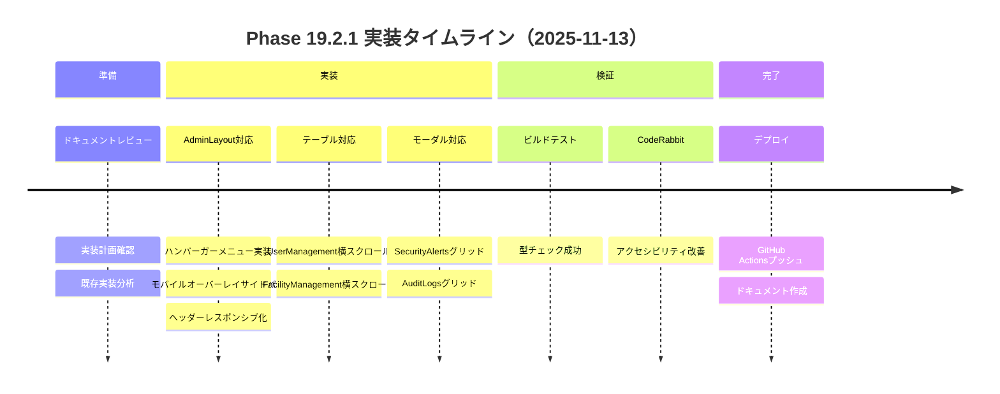
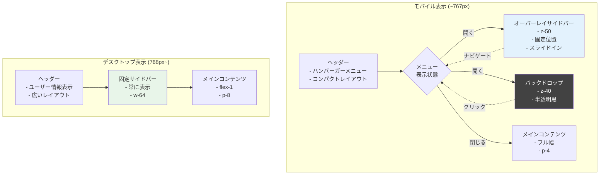
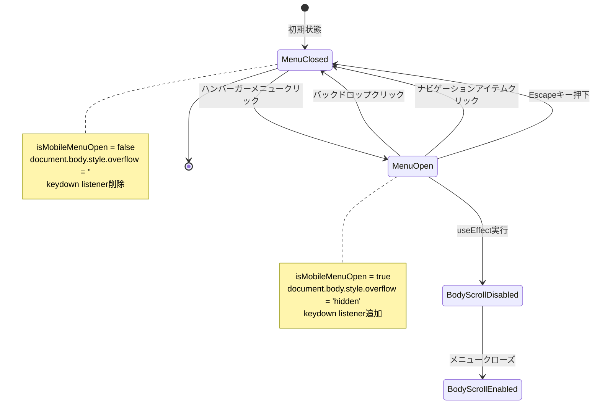
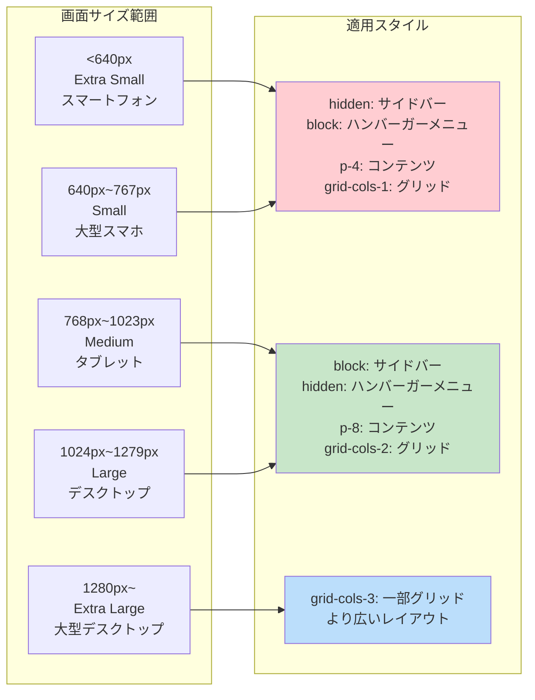
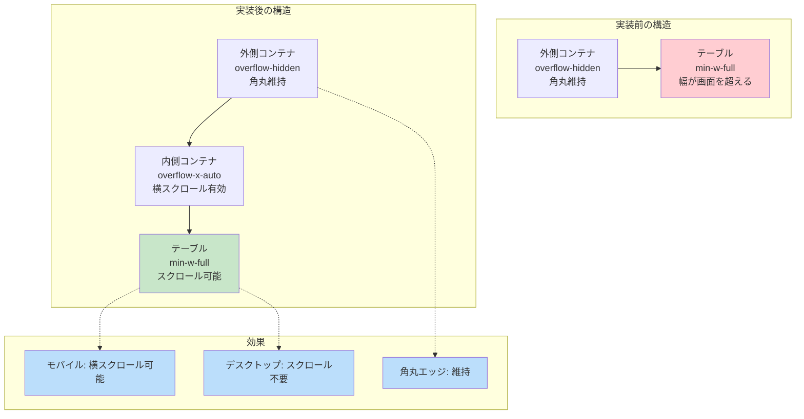
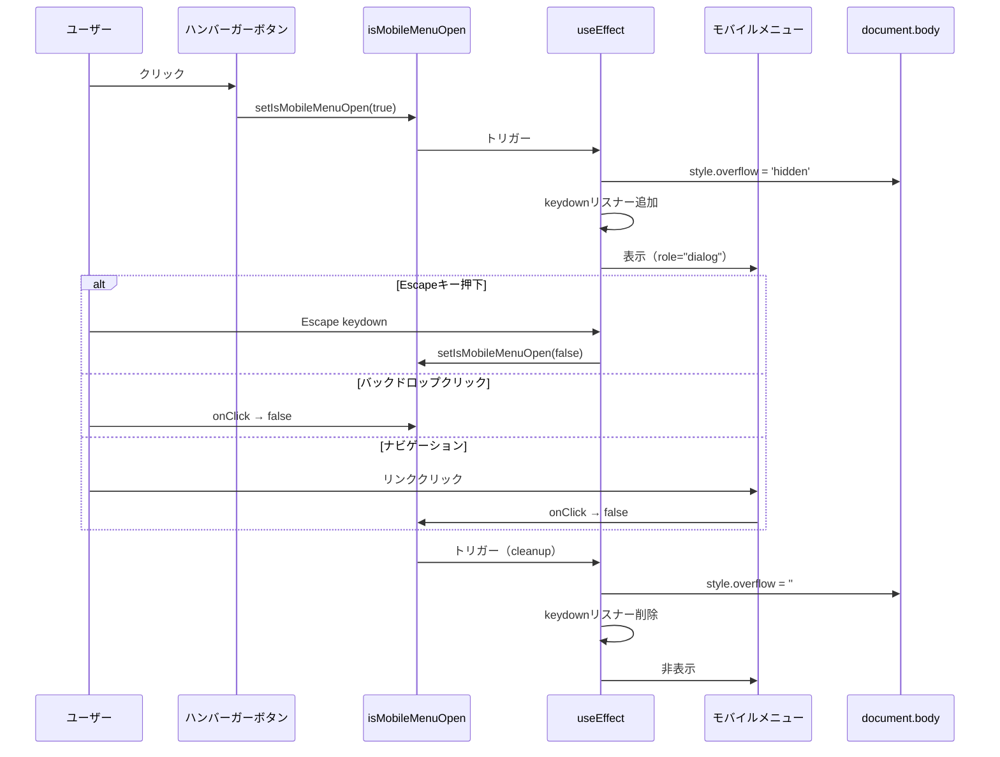
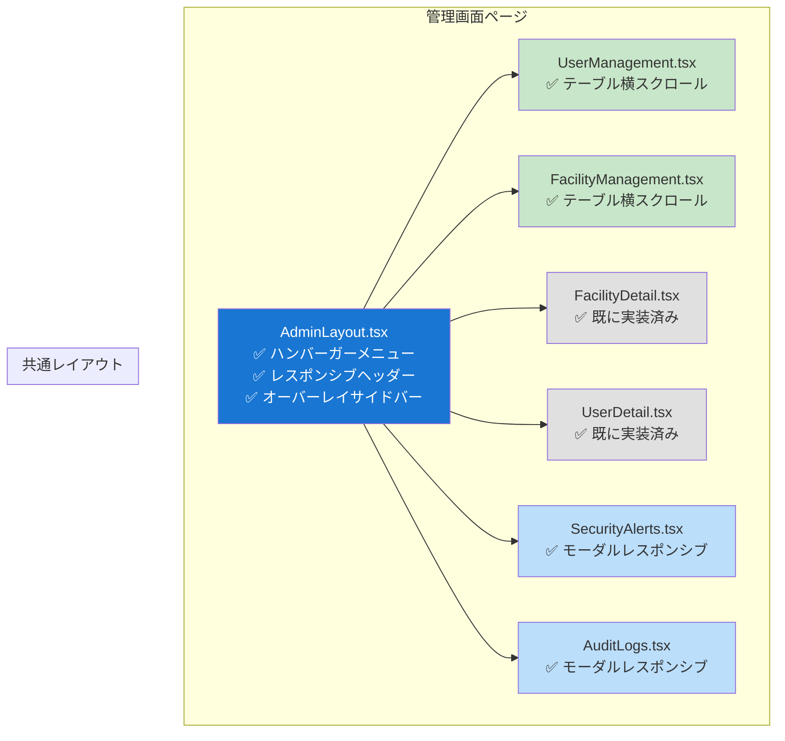
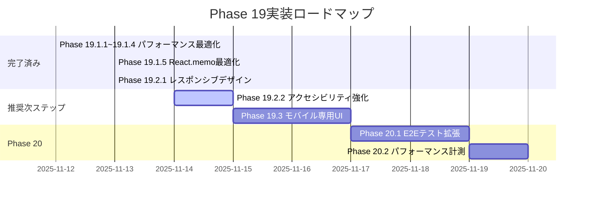
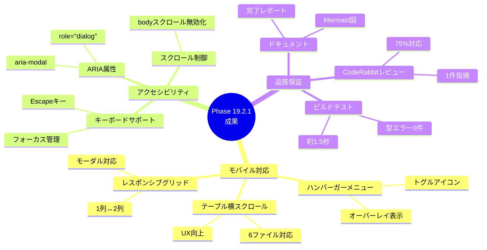
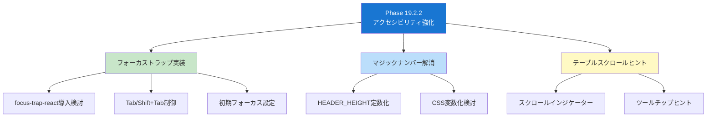

# Phase 19.2.1 実装図：レスポンシブデザイン対応

**更新日**: 2025-11-13
**仕様ID**: auth-data-persistence
**Phase**: 19.2.1

このドキュメントは [phase19.2.1-complete-2025-11-13.md](./phase19.2.1-complete-2025-11-13.md) の視覚的な補完資料です。

## 1. Phase 19.2.1 実装状況タイムライン



## 2. レスポンシブデザインアーキテクチャ



## 3. モバイルメニュー状態遷移図



## 4. Tailwind CSSブレークポイント戦略



## 5. テーブル横スクロール実装パターン



## 6. z-index階層管理

```mermaid
graph TB
    subgraph "z-index階層（高 → 低）"
        Z50[z-50<br/>モバイルメニュー<br/>スライドインサイドバー]
        Z40[z-40<br/>バックドロップ<br/>半透明黒背景]
        Z0[z-0 (デフォルト)<br/>通常コンテンツ<br/>ヘッダー・メインコンテンツ]
    end

    Z50 -.上に表示.-> Z40
    Z40 -.上に表示.-> Z0

    style Z50 fill:#1976d2,color:#fff
    style Z40 fill:#424242,color:#fff
    style Z0 fill:#e0e0e0
```

## 7. アクセシビリティ改善フロー



## 8. CodeRabbit指摘対応状況

```mermaid
graph TD
    A[CodeRabbit指摘<br/>potential_issue] --> B{対応状況}

    B -->|✅ 実装済み| C1[Escapeキーでクローズ]
    B -->|✅ 実装済み| C2[bodyスクロール無効化]
    B -->|✅ 実装済み| C3[ARIA属性追加<br/>role, aria-modal, aria-label]
    B -->|⏳ 今後対応| C4[フォーカストラップ実装]
    B -->|⏳ 今後対応| C5[マジックナンバー解消<br/>top-[73px]]

    C1 --> D[アクセシビリティ向上]
    C2 --> D
    C3 --> D
    C4 -.Phase 19.2.2.-> E[更なる改善]
    C5 -.Phase 19.2.2.-> E

    style C1 fill:#c8e6c9
    style C2 fill:#c8e6c9
    style C3 fill:#c8e6c9
    style C4 fill:#fff9c4
    style C5 fill:#fff9c4
    style D fill:#bbdefb
    style E fill:#f8bbd0
```

## 9. 対応ファイル構成マップ



## 10. 今後の実装ロードマップ



## 11. レスポンシブデザイン成果サマリー



## 12. Phase 19.2.2 推奨実装項目



---

## 参照

詳細な実装内容、テスト結果、学びと振り返りについては、以下のドキュメントを参照してください：

- **テキストドキュメント**: [phase19.2.1-complete-2025-11-13.md](./phase19.2.1-complete-2025-11-13.md)
- **実装計画**: [phase19-plan-2025-11-13.md](./phase19-plan-2025-11-13.md)
- **前フェーズ完了報告**: [phase19.1.5-complete-2025-11-13.md](./phase19.1.5-complete-2025-11-13.md)
