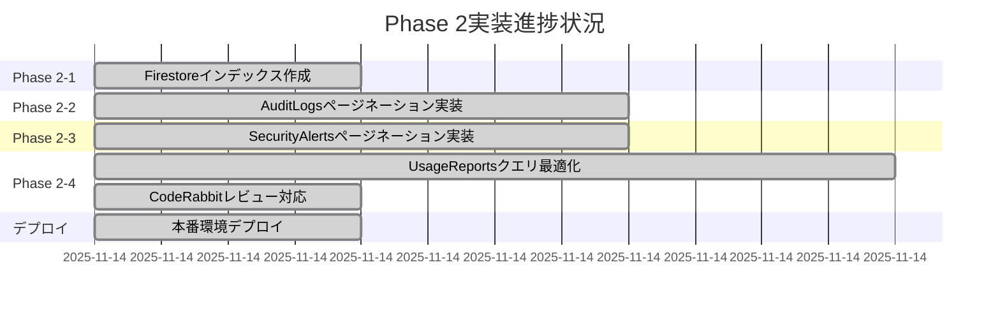
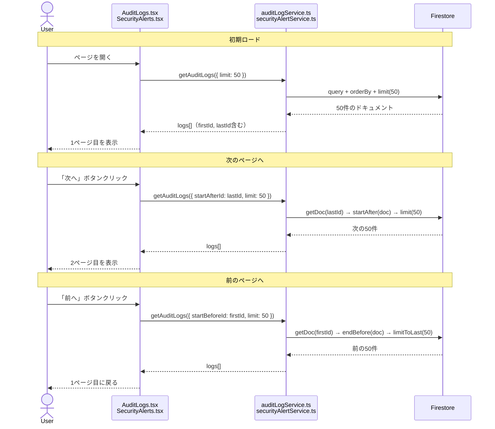
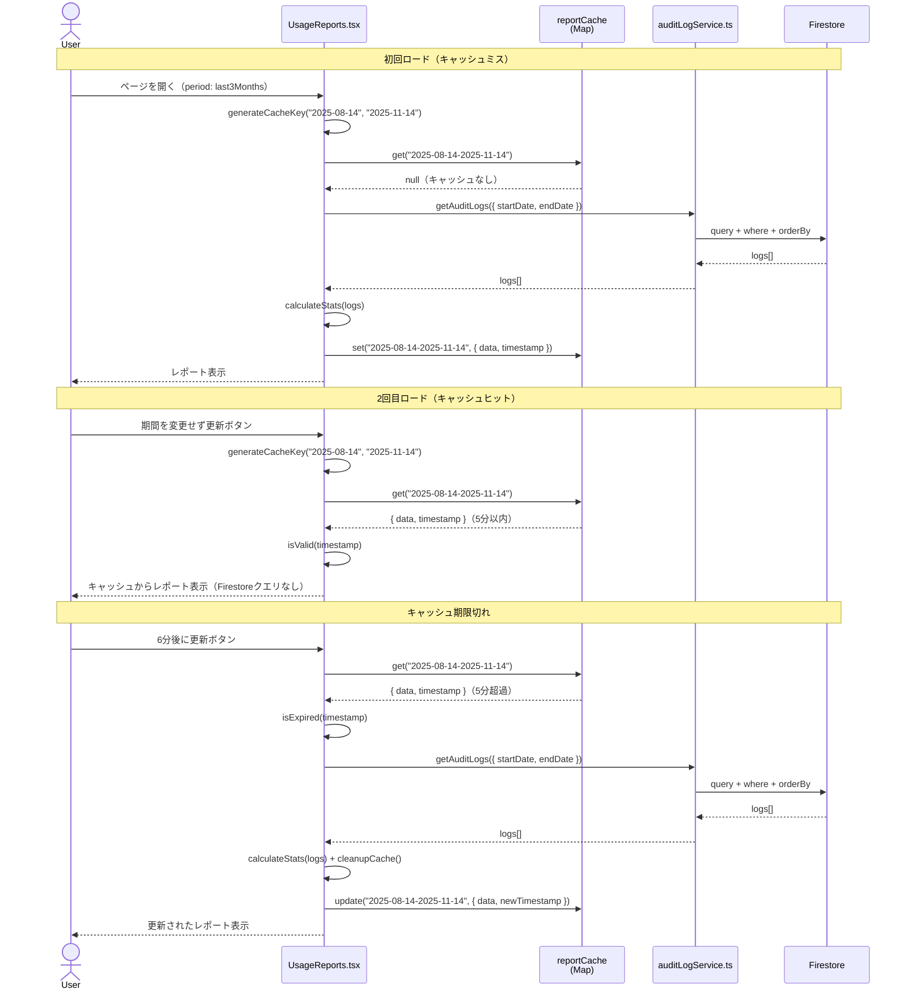
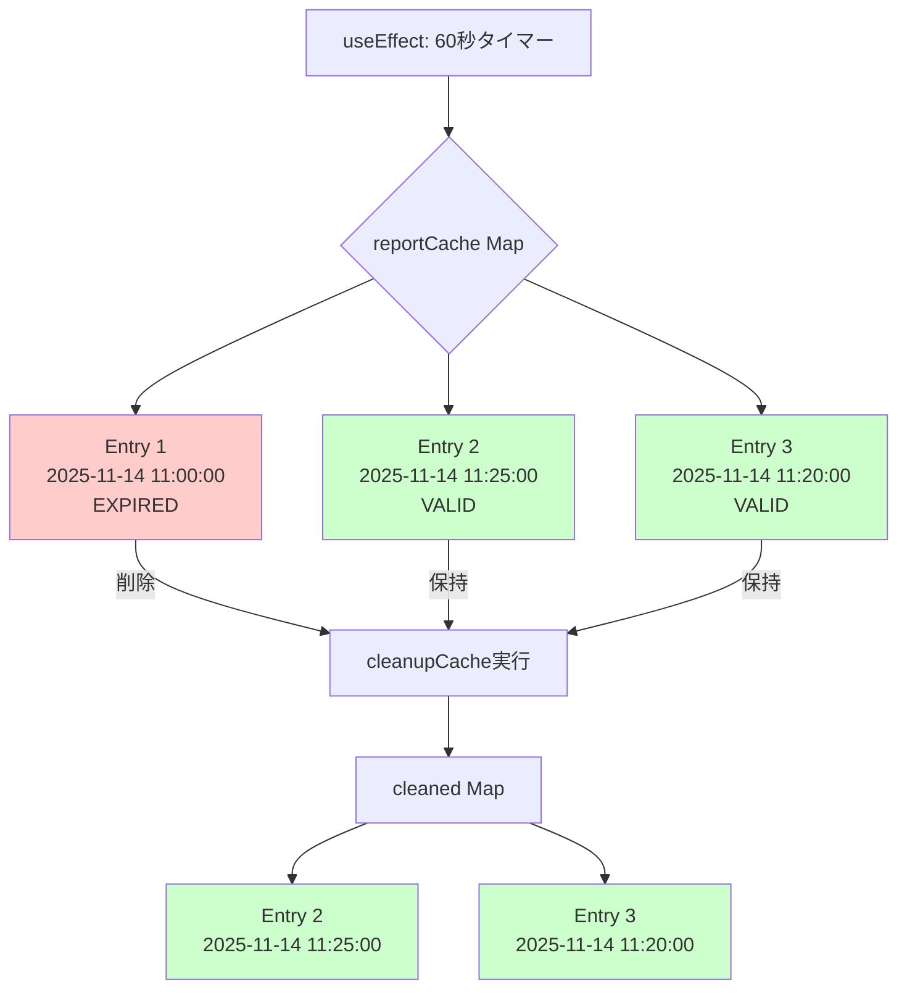
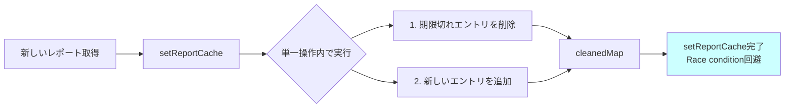
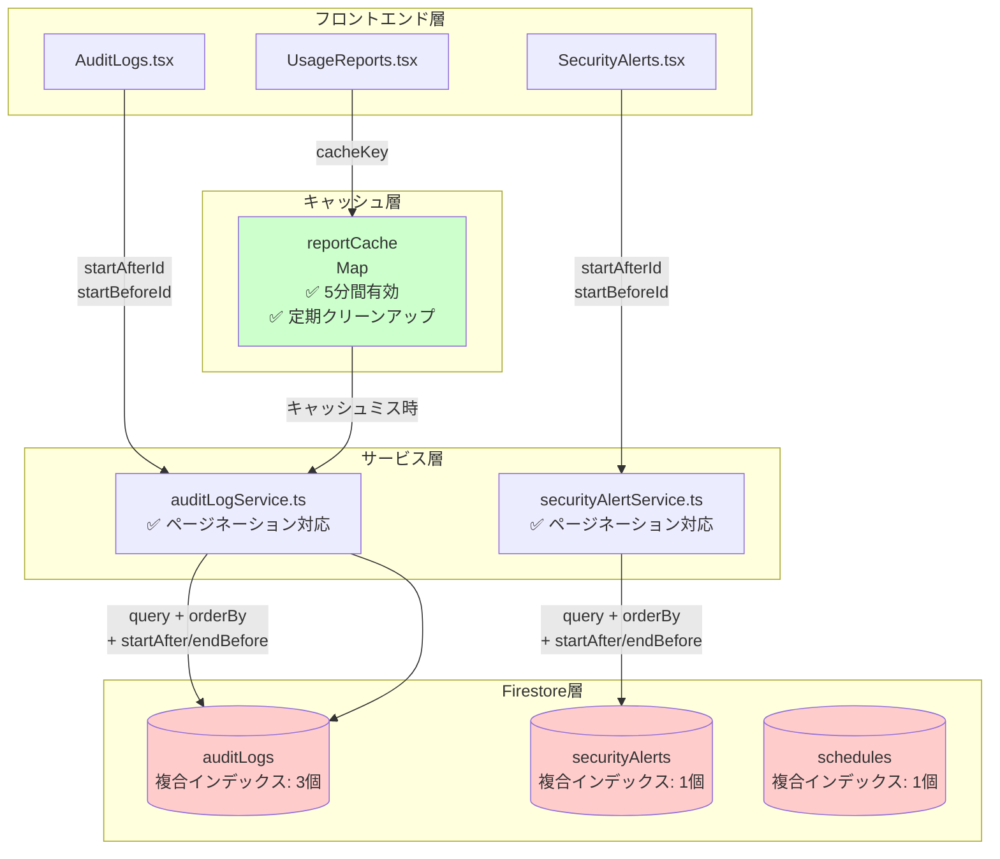
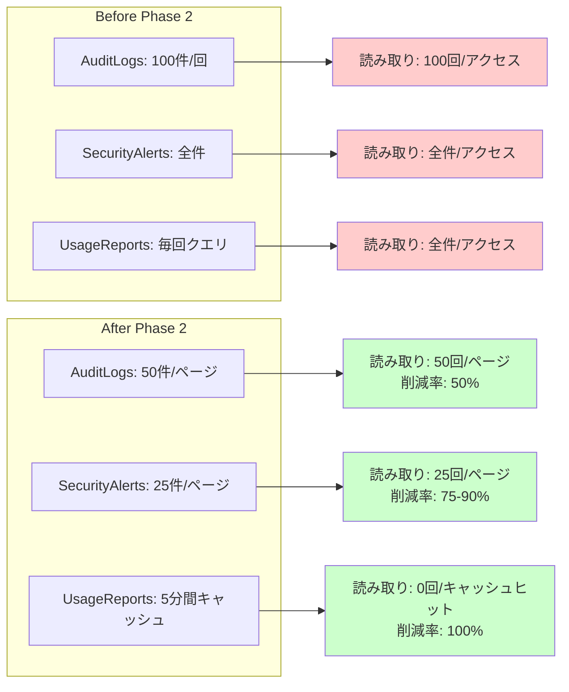
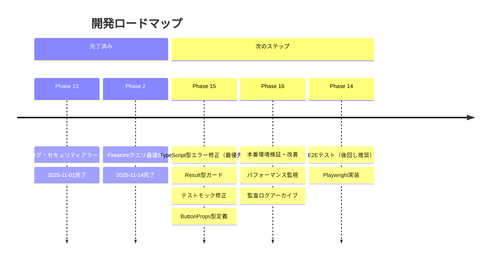
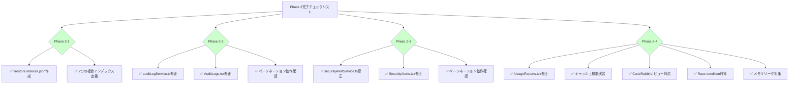

# Phase 2ダイアグラム: Firestoreクエリ最適化

**更新日**: 2025-11-14
**Phase**: 技術的負債解消 Phase 2
**関連ドキュメント**: phase2-completion-summary-2025-11-14.md

---

## 1. Phase 2実装進捗状況



---

## 2. ページネーション実装フロー

### 2.1 AuditLogs/SecurityAlertsページネーション



---

## 3. UsageReportsキャッシュ戦略

### 3.1 キャッシュフロー



---

## 4. キャッシュクリーンアップ戦略

### 4.1 定期クリーンアップ



### 4.2 新規エントリ追加時のクリーンアップ



---

## 5. Race Condition対策

### 5.1 期間変更時の競合対策（isActiveフラグ）

```mermaid
sequenceDiagram
    actor User
    participant Effect1 as useEffect 1<br/>(period: thisMonth)
    participant Effect2 as useEffect 2<br/>(period: lastMonth)
    participant Firestore
    participant UI as UsageReports.tsx

    Note over User,UI: ユーザーが期間を素早く変更
    User->>Effect1: period変更: thisMonth
    Effect1->>Effect1: isActive = true
    Effect1->>Firestore: クエリ開始（今月データ）

    Note over User,UI: すぐに別の期間に変更
    User->>Effect2: period変更: lastMonth
    Effect2->>Effect2: isActive = true
    Effect2->>Effect1: cleanup実行 → isActive = false

    Note over User,UI: Effect1のクエリが完了
    Firestore-->>Effect1: 今月データ
    Effect1->>Effect1: if (!isActive) return
    Effect1->>UI: ステート更新をスキップ

    Note over User,UI: Effect2のクエリが完了
    Effect2->>Firestore: クエリ開始（先月データ）
    Firestore-->>Effect2: 先月データ
    Effect2->>Effect2: if (isActive) {...}
    Effect2->>UI: ステート更新（先月データ表示）
    UI-->>User: 正しいデータ表示

    style Effect1 fill:#ffcccc
    style Effect2 fill:#ccffcc
```

---

## 6. システムアーキテクチャ（Phase 2後）

### 6.1 Firestore最適化レイヤー



---

## 7. パフォーマンス改善効果

### 7.1 Firestore読み取り回数の比較



---

## 8. 今後の開発ロードマップ



---

## 9. Phase 2完了チェックリスト



---

## 10. 関連ドキュメント

詳細は以下を参照:
- [phase2-implementation-plan-2025-11-14.md](./phase2-implementation-plan-2025-11-14.md)
- [phase2-completion-summary-2025-11-14.md](./phase2-completion-summary-2025-11-14.md)
- [NAVIGATION.md](../../NAVIGATION.md)

---

**作成日**: 2025-11-14
**作成者**: Claude Code AI
