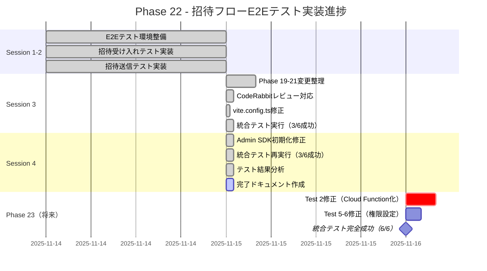
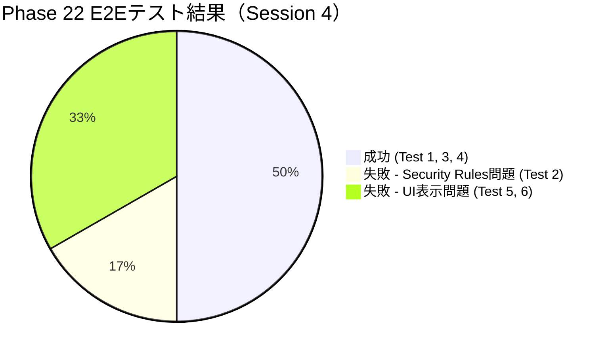
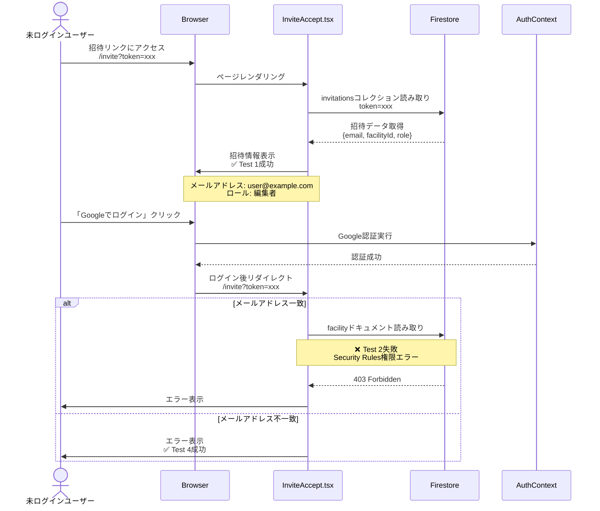
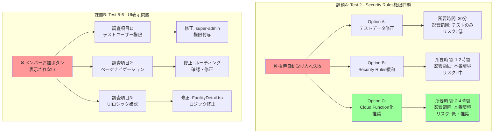
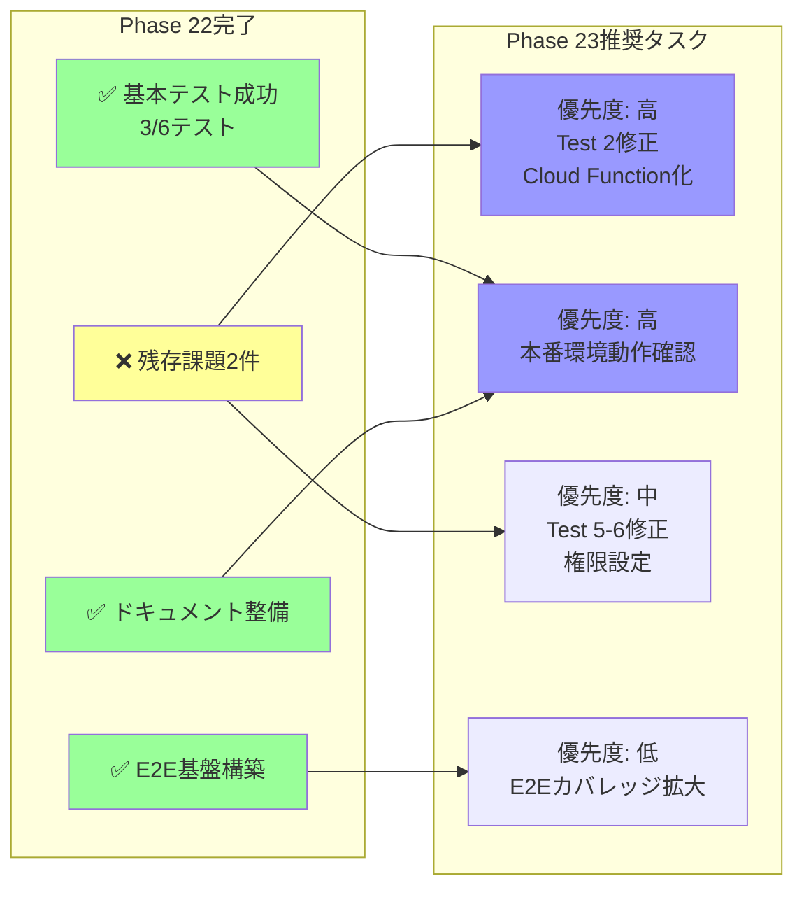
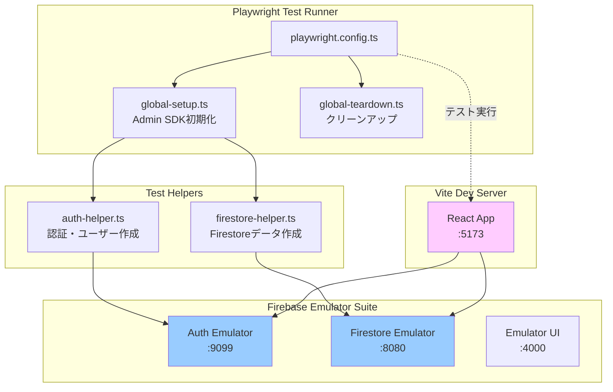
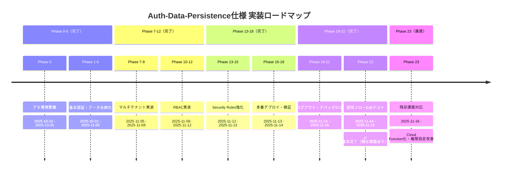
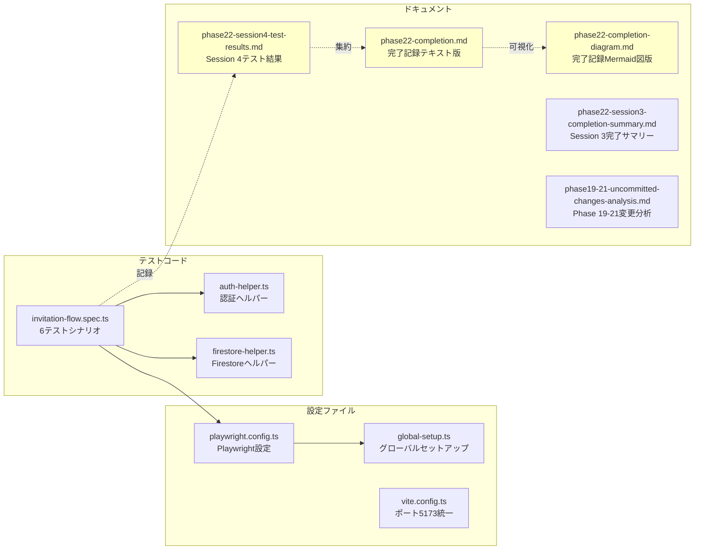
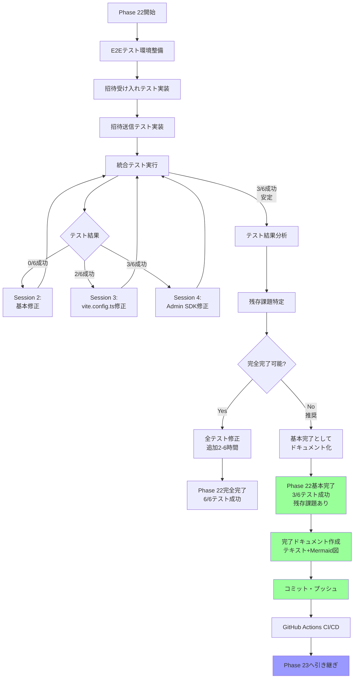

# Phase 22 完了ドキュメント - Mermaid図版

**更新日**: 2025-11-15
**仕様ID**: auth-data-persistence
**Phase**: Phase 22 - 招待フローE2Eテスト

このドキュメントは、Phase 22の全体像を視覚的に表現したMermaid図集です。

詳細なテキスト情報は [phase22-completion-2025-11-15.md](./phase22-completion-2025-11-15.md) を参照してください。

---

## 1. Phase 22実装進捗状況（ガントチャート）



---

## 2. テスト結果サマリー（円グラフ）



---

## 3. 招待受け入れフロー - 正常系（シーケンス図）



---

## 4. Test 2失敗の根本原因（フローチャート）

```mermaid
flowchart TD
    A[ユーザーログイン<br/>facilities: []] --> B{招待受け入れ処理開始}
    B --> C[Facilityドキュメント読み取り]
    C --> D{Security Rules評価}
    D --> E[hasAccessToFacility<br/>facilityId?]
    E --> F{user.facilities.hasAny<br/>facilityId?}
    F -->|facilities=[]| G[❌ false]
    G --> H[403 Forbidden]
    H --> I[エラー表示:<br/>アクセス権限の付与に失敗]
    I --> J[リトライ<br/>約20回]
    J --> K[10秒タイムアウト]
    K --> L[❌ Test 2失敗]

    style H fill:#f99
    style L fill:#f99
    style G fill:#f99
```

---

## 5. 残存課題と解決策オプション（グラフ）



---

## 6. Phase 22 → Phase 23 引き継ぎマップ



---

## 7. E2Eテスト環境アーキテクチャ



---

## 8. Phase 0-22実装状況ロードマップ



---

## 9. 成果物マトリックス



---

## 10. Phase 22開発ワークフロー



---

## 関連ドキュメント

- **テキスト版**: [phase22-completion-2025-11-15.md](./phase22-completion-2025-11-15.md)
- **テスト結果**: [phase22-session4-test-results-2025-11-15.md](./phase22-session4-test-results-2025-11-15.md)
- **Session 3サマリー**: [phase22-session3-completion-summary-2025-11-15.md](./phase22-session3-completion-summary-2025-11-15.md)

---

**記録者**: Claude Code
**作成日**: 2025-11-15
