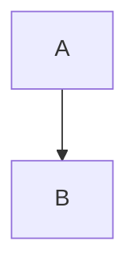

# Phase 26 引き継ぎドキュメント

**作成日**: 2025-11-24
**対象**: 次のAIセッション
**前Phase**: Phase 25 - ユーザビリティ改善（完了）
**次Phase**: Phase 26 - E2Eテスト＋モバイル最適化

## Phase 25 完了サマリー

### 達成内容
1. **改善1**: 「予定と同じ」ボタン（50%削減）- 完了
2. **改善2**: 一括コピー機能（86%削減）- 完了
3. **GitHub Pages**: クライアント・開発者・AI向けドキュメント基盤構築 - 完了

### 累積効果
- 月間実績入力作業時間: 50分 → 7分（**86%削減**）
- 年間削減: 8.6時間、17,200円相当

### 成果物URL
- 本番環境: https://ai-care-shift-scheduler.web.app
- GitHub Pages: https://yasushi-honda.github.io/ai-care-shift-scheduler/
- リポジトリ: https://github.com/yasushi-honda/ai-care-shift-scheduler

## Phase 26 推奨タスク

### 優先度: 高

#### 1. E2Eテスト追加
**推定工数**: 4時間

**対象機能**:
- 改善1: 予定と同じボタン
- 改善2: 一括コピー機能

**実装方針**:
```typescript
// tests/e2e/bulk-copy-scheduled-to-actual.spec.ts
describe('一括コピー機能', () => {
  it('複数スタッフの予定を実績にコピーできる', async ({ page }) => {
    // 1. ログイン（Manager権限）
    await loginAsManager(page);

    // 2. シフト表ページに移動
    await page.goto('/schedule');

    // 3. 「一括コピー」ボタンをクリック
    await page.click('button:has-text("一括コピー")');

    // 4. モーダルが表示されることを確認
    await expect(page.locator('.modal')).toBeVisible();

    // 5. スタッフ2名を選択
    await page.click('input[type="checkbox"][value="staff1"]');
    await page.click('input[type="checkbox"][value="staff2"]');

    // 6. 日付範囲を指定
    await page.fill('input[name="startDate"]', '2025-11-01');
    await page.fill('input[name="endDate"]', '2025-11-07');

    // 7. 「実行」ボタンをクリック
    await page.click('button:has-text("実行")');

    // 8. 成功メッセージを確認
    await expect(page.locator('.toast-success')).toBeVisible();

    // 9. Firestoreに14件（2名×7日）のactualShiftsが作成されたことを確認
    const actualShifts = await getActualShiftsFromFirestore();
    expect(actualShifts.length).toBe(14);
  });
});
```

**既存パターンの参照**:
- `tests/e2e/auth.spec.ts` - 認証フロー
- `tests/e2e/schedule.spec.ts` - シフト操作
- メモリ: `phase14_e2e_test_patterns.md`

#### 2. モバイル最適化
**推定工数**: 1週間

**対象**:
- レスポンシブデザイン改善（768px以下）
- タッチ操作最適化
- シフト表のスクロール改善

**実装方針**:
```css
/* Mobile-first approach */
@media (max-width: 768px) {
  .schedule-table {
    overflow-x: auto;
    -webkit-overflow-scrolling: touch;
  }

  .bulk-copy-modal {
    width: 95%;
    max-height: 90vh;
  }
}
```

### 優先度: 中

#### 3. 改善3: ダブルクリック機能
**推定工数**: 2-3時間

**実装方針**:
```typescript
// src/components/schedule/ScheduleCell.tsx
const handleDoubleClick = async (shift: ScheduledShift) => {
  try {
    await copyScheduledToActual(shift);
    showToast('実績にコピーしました');
  } catch (error) {
    showError('コピーに失敗しました');
  }
};

<td
  onDoubleClick={() => handleDoubleClick(shift)}
  className="schedule-cell"
>
  {shift.startTime} - {shift.endTime}
</td>
```

#### 4. パフォーマンス改善
**推定工数**: 3日間

**対象**:
- Lighthouse最適化（現状: 未測定）
- バンドルサイズ削減
- Firestoreクエリ最適化

## 重要な技術的注意事項

### 1. Gemini APIリージョン
**CRITICAL**: 必ず`us-central1`を使用すること

```typescript
// ✅ 正しい
const genAI = new GoogleGenerativeAI(apiKey);
const model = genAI.getGenerativeModel({
  model: 'gemini-2.0-flash-exp',
  region: 'us-central1'  // 必須
});

// ❌ 間違い
region: 'asia-northeast1'  // 403エラー発生
```

詳細: メモリ `gemini_region_critical_rule.md`

### 2. GitHub Pages Mermaid記法
**Pure HTML形式**を使用すること

```html
<!-- ✅ 正しい -->
<div class="mermaid">
graph TB
  A --> B
</div>

<!-- ❌ 間違い（Jekyllがエスケープ） -->

```

### 3. Firebase CLI認証エラー
認証エラー発生時は即座に**GitHub Actions CI/CD**に切り替える

詳細: `.kiro/steering/development-workflow.md`、メモリ `firebase_cli_error_handling.md`

### 4. モーダルUX設計
**マウスホイールはスクロール**、ズームは+/-ボタン

理由: ユーザーが拡大後に下を見ようとマウスホイールを回すとスクロールを期待する

詳細: `phase25_design_decisions_2025-11-24_final.md`

## 開発ワークフロー

### GitHub Flow
```bash
# 1. 新機能ブランチ作成
git checkout -b feature/phase26-e2e-tests

# 2. 実装＋コミット
git add .
git commit -m "test: Phase 26 E2Eテスト追加"

# 3. CodeRabbitレビュー（必須）
coderabbit review --plain --base-commit HEAD~1 --config CLAUDE.md

# 4. プッシュ
git push origin feature/phase26-e2e-tests

# 5. PR作成
gh pr create --title "Phase 26: E2Eテスト追加" --body "..."

# 6. マージ後自動デプロイ
```

### CI/CDパイプライン
1. `git push` → GitHub Actions トリガー
2. Lighthouse CI → 品質チェック
3. Firebase Deploy → 本番環境デプロイ
4. GitHub Pages Deploy → ドキュメント公開

## プロジェクト構造

```
ai-care-shift-scheduler/
├── src/
│   ├── components/
│   │   └── schedule/
│   │       ├── BulkCopyScheduledToActualModal.tsx  ← Phase 25で追加
│   │       └── ScheduleView.tsx  ← Phase 25で修正
│   ├── services/
│   │   └── firestore/
│   │       └── actualShifts.ts  ← 一括コピーロジック
│   └── types/
│       └── shift.ts
├── tests/
│   └── e2e/
│       ├── auth.spec.ts
│       ├── schedule.spec.ts
│       └── bulk-copy.spec.ts  ← Phase 26で追加予定
├── docs/  ← GitHub Pages
│   ├── index.html  ← クライアント向け
│   └── technical.html  ← 開発者向け
└── .kiro/
    ├── specs/care-staff-schedule-compliance/
    │   ├── phase25-2.5-completion-2025-11-24.md
    │   └── PHASE26_HANDOFF_2025-11-24.md  ← 本ファイル
    └── steering/
        └── development-workflow.md
```

## 必読ドキュメント

### 最優先
1. `project_overview.md` - プロジェクト全体概要
2. `phase25_progress_2025-11-24_final.md` - Phase 25進捗
3. `phase25_design_decisions_2025-11-24_final.md` - 設計判断記録

### Phase 26実装時
4. `phase14_e2e_test_patterns.md` - E2Eテストパターン
5. `code_style_and_conventions.md` - コーディング規約
6. `tech_stack.md` - 技術スタック

### トラブルシューティング
7. `gemini_region_critical_rule.md` - Gemini APIリージョン
8. `firebase_cli_error_handling.md` - Firebase CLI問題
9. `firestore_troubleshooting.md` - Firestore問題

## よくある質問

### Q1: Phase 25の実装コードはどこ？
**A**:
- `src/components/schedule/BulkCopyScheduledToActualModal.tsx`
- `src/components/schedule/ScheduleView.tsx`
- コミット: `e80f5d1`, `f551c3e`

### Q2: GitHub Pagesの更新方法は？
**A**:
```bash
# 1. docs/配下を編集
vim docs/index.html

# 2. コミット＋プッシュ
git add docs/
git commit -m "docs: GitHub Pages更新"
git push origin main

# 3. GitHub Actionsが自動デプロイ（約2分）
gh run list --limit 1
```

### Q3: E2Eテストの実行方法は？
**A**:
```bash
# ローカル開発サーバー起動（別ターミナル）
PORT=5173 npm run dev

# E2Eテスト実行
PLAYWRIGHT_BASE_URL=http://localhost:5173 npm run test:e2e
```

### Q4: Firestoreのデータ確認方法は？
**A**:
Firebase Console: https://console.firebase.google.com/project/ai-care-shift-scheduler/firestore

または
```bash
# gcloud CLI
gcloud firestore databases list --project=ai-care-shift-scheduler
```

## Phase 26完了の定義

以下をすべて満たすこと：

### 機能実装
- [ ] E2Eテスト追加（改善1・2）
- [ ] モバイル最適化（768px以下対応）
- [ ] 改善3実装（ダブルクリック機能）

### ドキュメント
- [ ] Phase 26完了記録作成（`.kiro/specs/`）
- [ ] GitHub Pages更新（ロードマップ反映）
- [ ] プロジェクトメモリ更新

### テスト
- [ ] E2Eテスト全パス
- [ ] モバイルブラウザで動作確認
- [ ] Lighthouse CI成功

### デプロイ
- [ ] 本番環境デプロイ完了
- [ ] GitHub Pages更新確認

## 次のAIセッションへのメッセージ

Phase 25で実績入力作業時間を**86%削減**し、GitHub Pagesでドキュメント基盤を構築しました。

Phase 26では以下を推奨します：

1. **E2Eテスト追加**で品質保証を強化
2. **モバイル最適化**でユーザー体験を向上
3. **改善3実装**でさらなる効率化

すべてのドキュメントは`.kiro/`配下とメモリに記録済みです。

**成功を祈ります！**🚀
