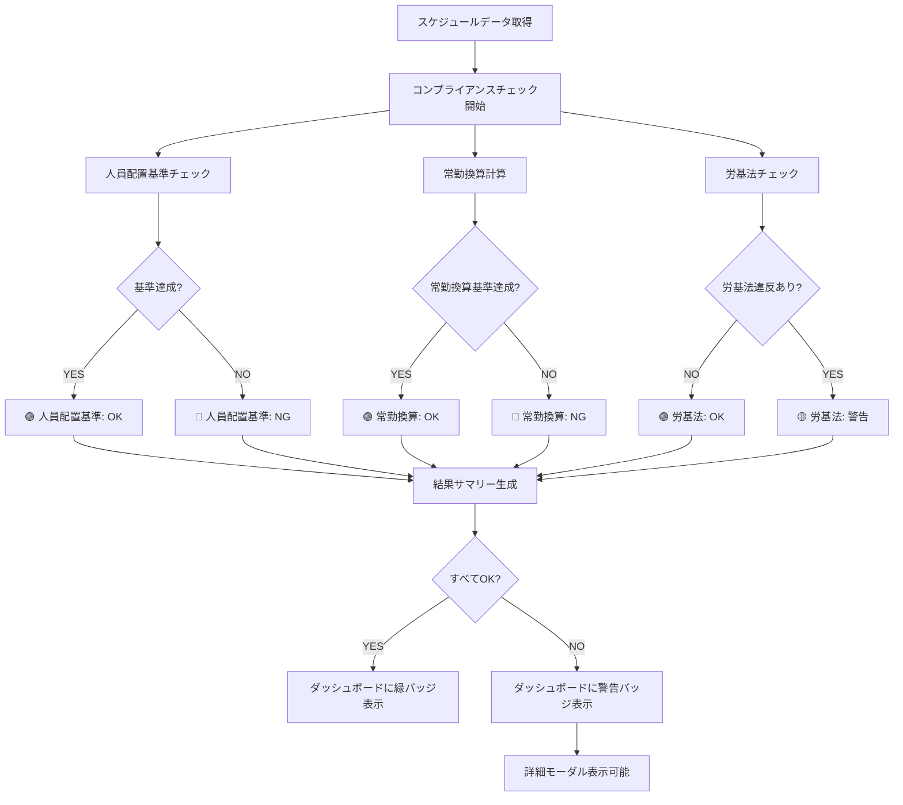
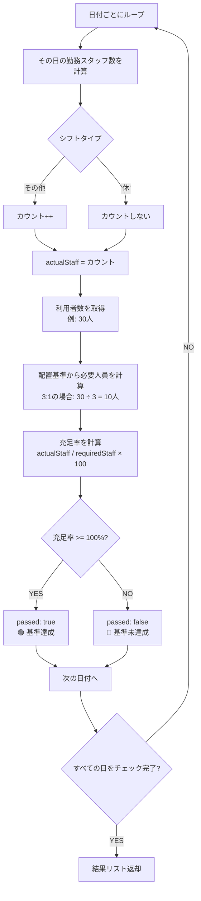
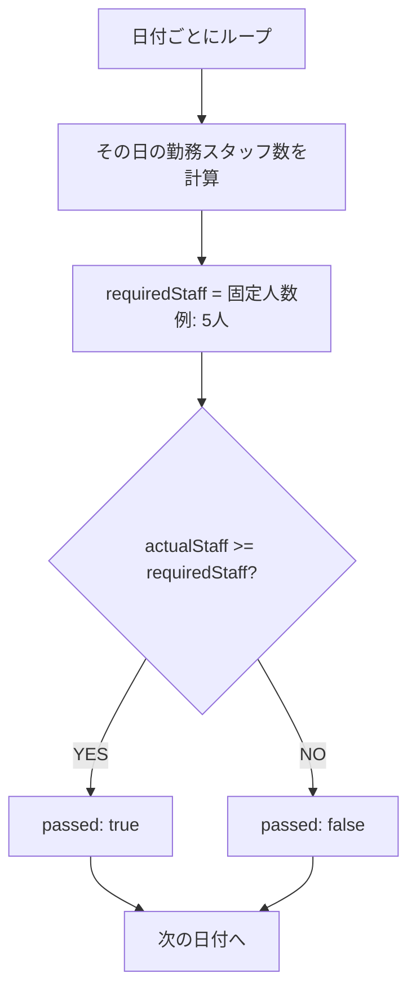
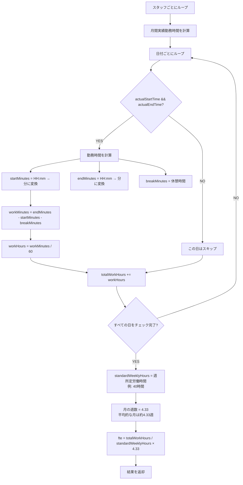
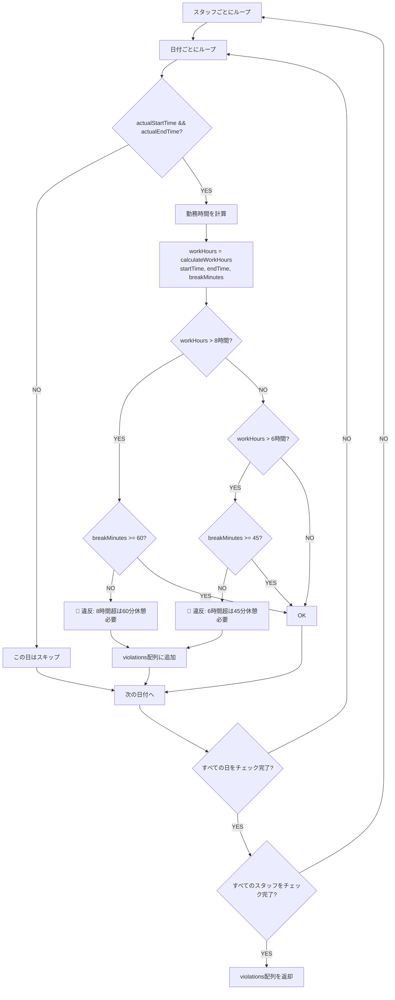
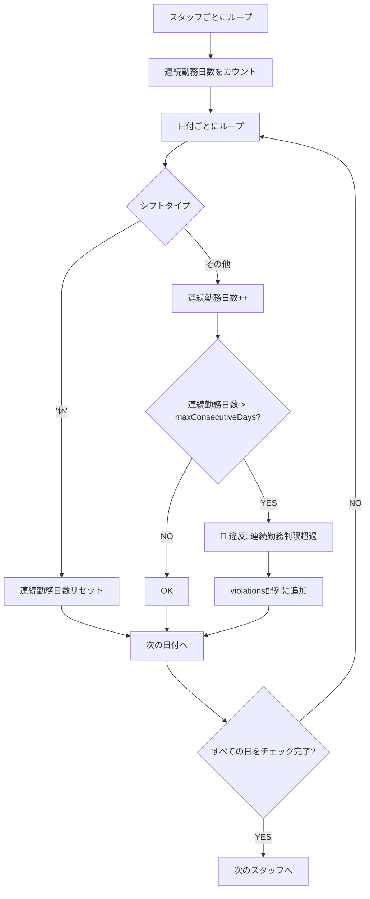
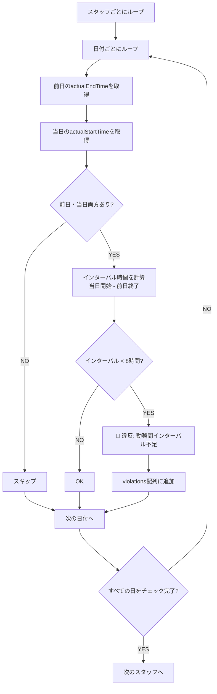
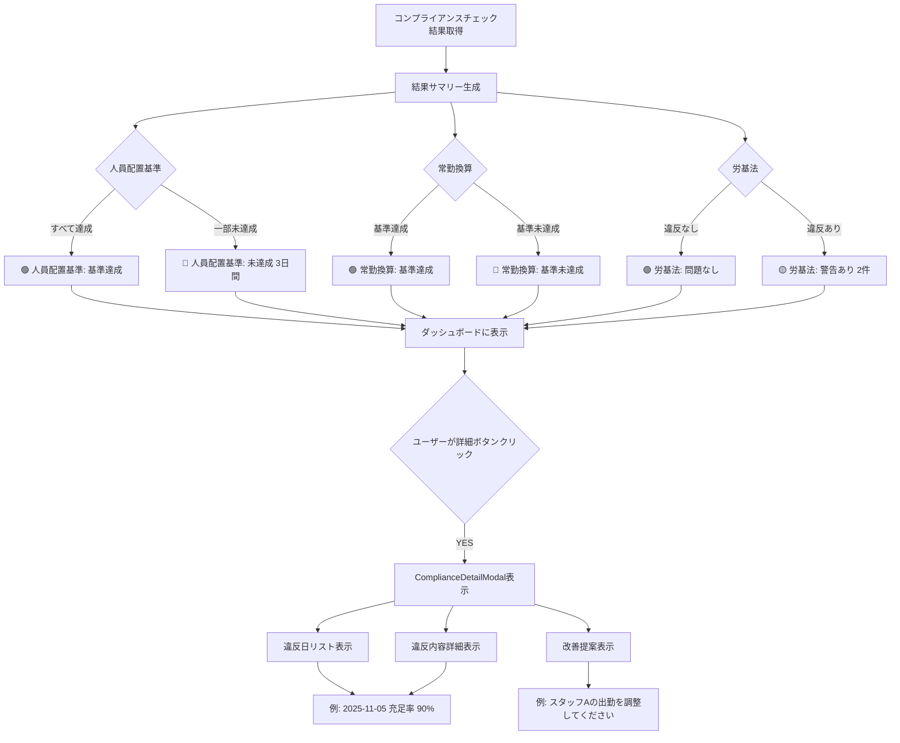
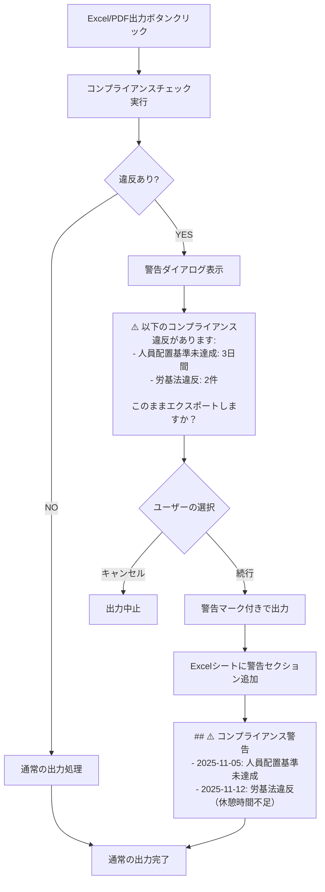
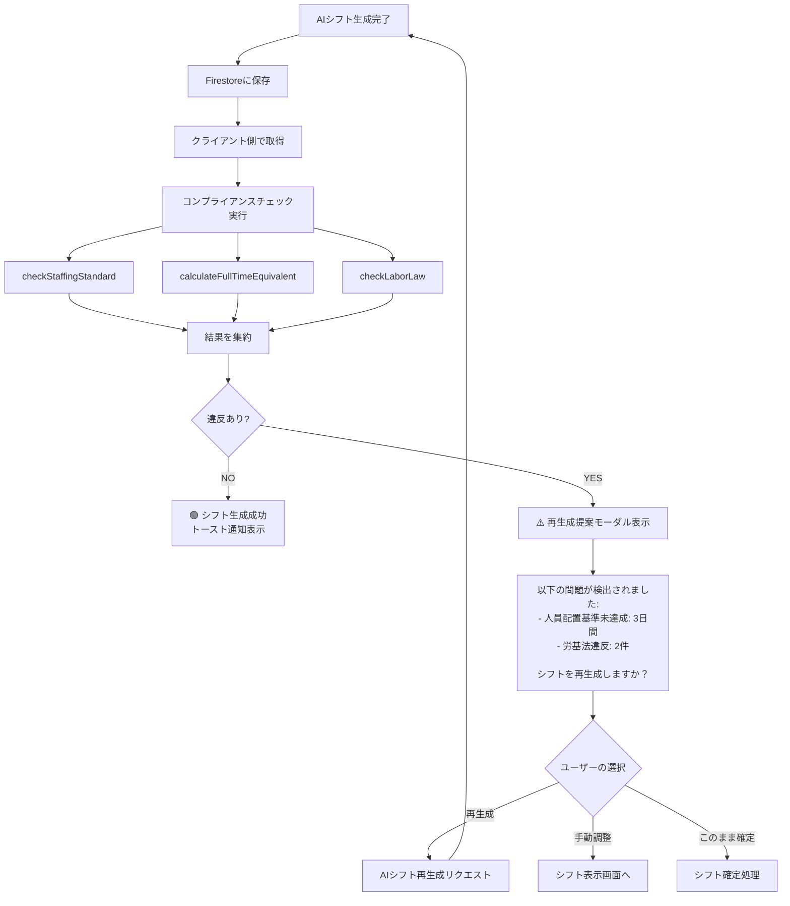

# Phase 25: コンプライアンスチェックフロー

**作成日**: 2025-11-20
**目的**: 人員配置基準、常勤換算、労基法チェックのロジックを視覚化する

---

## 全体フロー



---

## 人員配置基準チェック詳細

### 3:1配置基準の場合



### 固定人数配置基準の場合



### データ構造

```typescript
interface StaffingCheckResult {
  date: string;            // "2025-11-01"
  requiredStaff: number;   // 10（必要人員数）
  actualStaff: number;     // 8（実際の人員数）
  fulfillmentRate: number; // 80（充足率%）
  passed: boolean;         // false（基準未達成）
}
```

---

## 常勤換算計算詳細



### 計算例

**スタッフA**:
- 月間実績勤務時間: 160時間
- 週所定労働時間: 40時間
- 常勤換算値: 160 / (40 × 4.33) = **0.92**

**スタッフB**:
- 月間実績勤務時間: 80時間
- 週所定労働時間: 40時間
- 常勤換算値: 80 / (40 × 4.33) = **0.46**

**事業所全体**:
- 常勤換算値合計: 0.92 + 0.46 = **1.38**

### データ構造

```typescript
interface FullTimeEquivalentResult {
  staffId: string;           // "staff_001"
  staffName: string;         // "田中太郎"
  totalWorkHours: number;    // 160（月間実績勤務時間）
  standardWeeklyHours: number;  // 40（週所定労働時間）
  fte: number;               // 0.92（常勤換算値）
}
```

---

## 労基法チェック詳細

### 休憩時間チェック



### 連続勤務制限チェック（既存機能を活用）



### 勤務間インターバルチェック（既存機能を活用）



### データ構造

```typescript
interface LaborLawCheckResult {
  staffId: string;                    // "staff_001"
  staffName: string;                  // "田中太郎"
  date: string;                       // "2025-11-05"
  violationType: 'break' | 'consecutive' | 'interval';
  message: string;                    // "8時間超の勤務には60分以上の休憩が必要です"
}
```

---

## 結果表示フロー



---

## Excel/PDF出力時の警告表示



---

## AIシフト生成後のバリデーションフロー



---

## 関連ドキュメント

- [要件定義書](../requirements.md)
- [技術設計書](../design.md)
- [実装タスク一覧](../tasks.md)
- [データモデル図](./data-model-diagram.md)
- [UIフロー図](./ui-flow-diagram.md)
- [コンポーネント構成図](./component-architecture.md)
