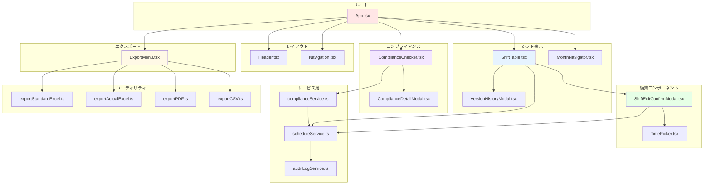
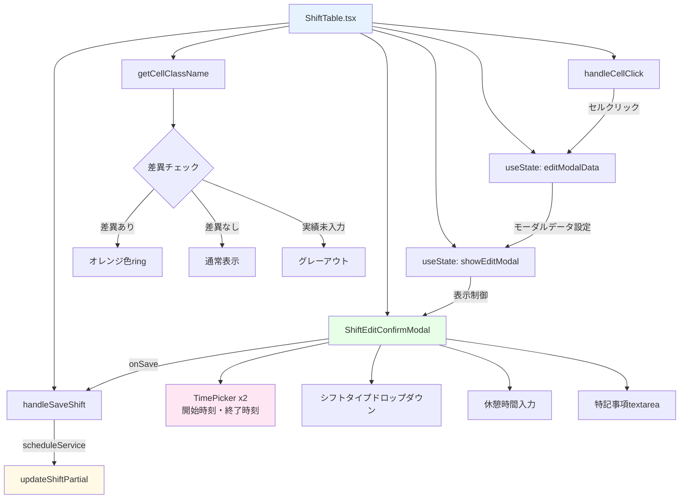
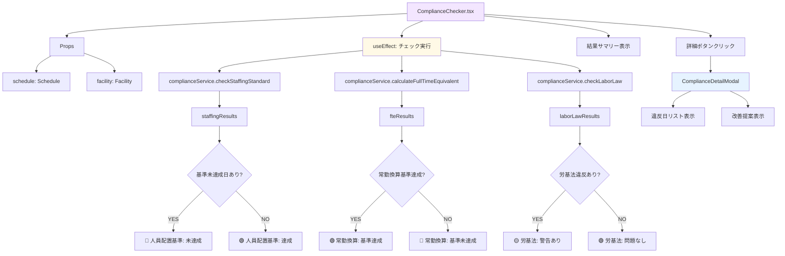
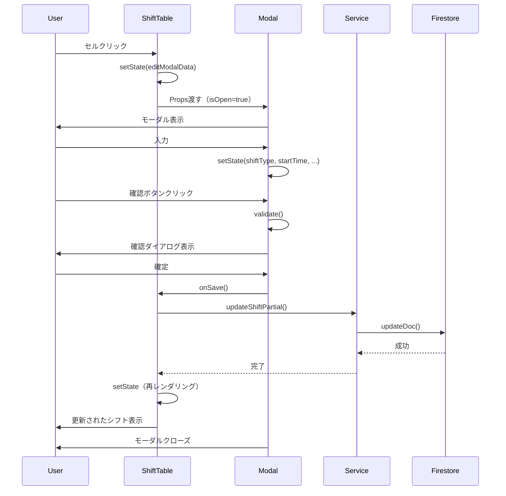

# Phase 25: コンポーネント構成図

**作成日**: 2025-11-20
**目的**: React コンポーネントの構成とデータフローを視覚化する

---

## コンポーネント階層



**凡例**:
- 🔴 赤: ルート・レイアウト
- 🔵 青: シフト表示層
- 🟢 緑: 編集層
- 🟡 黄: エクスポート層
- 🟣 紫: コンプライアンス層

---

## ShiftTable.tsx 詳細構成



---

## ShiftEditConfirmModal.tsx 詳細構成

```mermaid
graph TB
    A[ShiftEditConfirmModal.tsx] --> B[Props]
    B --> C[isOpen: boolean]
    B --> D[date: string]
    B --> E[staffId: string]
    B --> F[type: 'planned' | 'actual']
    B --> G[currentShift: GeneratedShift]

    A --> H[State]
    H --> I[shiftType: string]
    H --> J[startTime: string]
    H --> K[endTime: string]
    H --> L[breakMinutes: number]
    H --> M[notes: string]
    H --> N[errors: string[]]

    A --> O[validate関数]
    O --> P{シフトタイプ選択済み?}
    P -->|NO| Q[エラー追加]
    P -->|YES| R{時刻範囲正しい?}
    R -->|NO| Q
    R -->|YES| S{労基法チェック}
    S -->|違反| Q
    S -->|OK| T[バリデーション成功]

    A --> U[handleConfirm関数]
    U --> V[validate実行]
    V --> W{エラーあり?}
    W -->|YES| X[エラーメッセージ表示]
    W -->|NO| Y[確認ダイアログ表示]
    Y --> Z{ユーザー確定?}
    Z -->|YES| AA[onSave実行]
    Z -->|NO| AB[キャンセル]

    style A fill:#e6ffe6
    style O fill:#fff9e6
    style U fill:#ffe6f3
```

---

## ComplianceChecker.tsx 詳細構成



---

## データフロー（Props & State）

### ShiftTable.tsx のProps

```typescript
interface ShiftTableProps {
  schedule: Schedule;                    // 親から受け取る
  onUpdateShift: (                       // 親に通知
    staffId: string,
    date: string,
    updatedFields: Partial<GeneratedShift>
  ) => Promise<void>;
}
```

### ShiftEditConfirmModal.tsx のProps

```typescript
interface ShiftEditConfirmModalProps {
  isOpen: boolean;                       // ShiftTableから受け取る
  onClose: () => void;                   // ShiftTableに通知
  date: string;                          // ShiftTableから受け取る
  staffId: string;                       // ShiftTableから受け取る
  staffName: string;                     // ShiftTableから受け取る
  type: 'planned' | 'actual';            // ShiftTableから受け取る
  currentShift: GeneratedShift | null;   // ShiftTableから受け取る
  onSave: (shift: Partial<GeneratedShift>) => void;  // ShiftTableに通知
}
```

### TimePicker.tsx のProps

```typescript
interface TimePickerProps {
  value: string;                         // 親から受け取る（例: "08:30"）
  onChange: (value: string) => void;     // 親に通知
  label?: string;                        // 親から受け取る
  required?: boolean;                    // 親から受け取る
  disabled?: boolean;                    // 親から受け取る
}
```

---

## State管理戦略

### ローカルState（useState）

以下のコンポーネントはローカルStateで管理:
- `ShiftTable.tsx`: `editModalData`, `showEditModal`
- `ShiftEditConfirmModal.tsx`: `shiftType`, `startTime`, `endTime`, `breakMinutes`, `notes`, `errors`
- `ComplianceChecker.tsx`: `showDetailModal`, `selectedViolation`

### グローバルState（Context）

既存のContext（Phase 25で変更なし）:
- `AuthContext`: ユーザー認証情報
- `ToastContext`: トースト通知
- `LoadingContext`: ローディング状態

### Firestore State（リアルタイム同期）

Firestoreとの同期（`scheduleService.ts`経由）:
- `schedules` コレクション: シフトデータ（予実含む）
- `auditLogs` コレクション: 監査ログ

---

## イベントフロー



---

## ファイル構成

```
src/
├── components/
│   ├── ShiftTable.tsx                 # 予実2段書き表示
│   ├── ShiftEditConfirmModal.tsx      # シフト編集モーダル
│   ├── TimePicker.tsx                 # 時刻入力コンポーネント
│   ├── ComplianceChecker.tsx          # コンプライアンスチェック結果
│   ├── ComplianceDetailModal.tsx      # 詳細モーダル
│   ├── ExportMenu.tsx                 # エクスポートメニュー
│   ├── MonthNavigator.tsx             # 月切り替え（既存）
│   └── VersionHistoryModal.tsx        # バージョン履歴（既存）
│
├── services/
│   ├── scheduleService.ts             # スケジュールCRUD
│   ├── complianceService.ts           # コンプライアンスチェック
│   └── auditLogService.ts             # 監査ログ（既存）
│
├── utils/
│   ├── exportStandardExcel.ts         # 標準様式Excel出力
│   ├── exportActualExcel.ts           # 予実2段書きExcel出力
│   ├── exportPDF.ts                   # PDF出力（既存・予定のみ）
│   └── exportCSV.ts                   # CSV出力（既存）
│
└── types.ts                           # 型定義（GeneratedShift拡張）
```

---

## 関連ドキュメント

- [要件定義書](../requirements.md)
- [技術設計書](../design.md)
- [実装タスク一覧](../tasks.md)
- [データモデル図](./data-model-diagram.md)
- [UIフロー図](./ui-flow-diagram.md)
