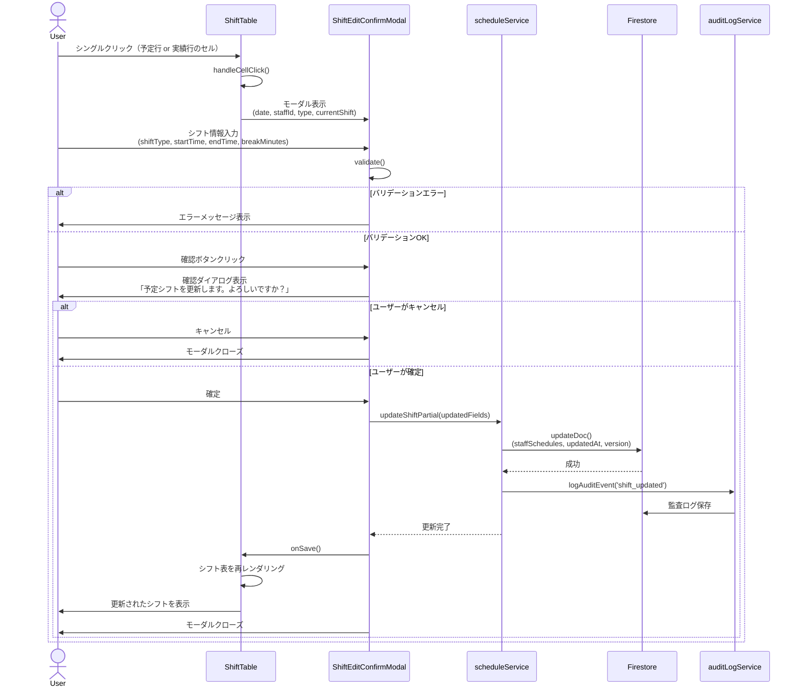
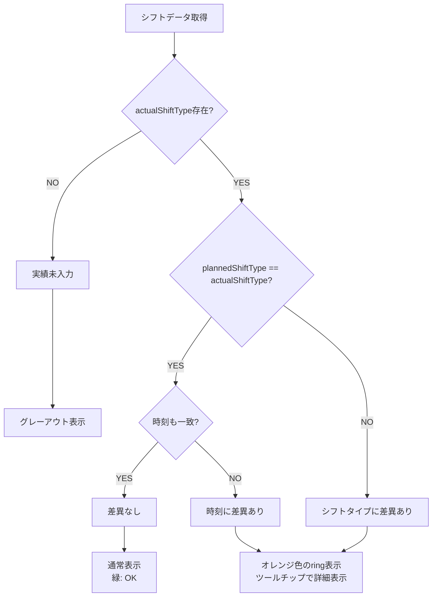
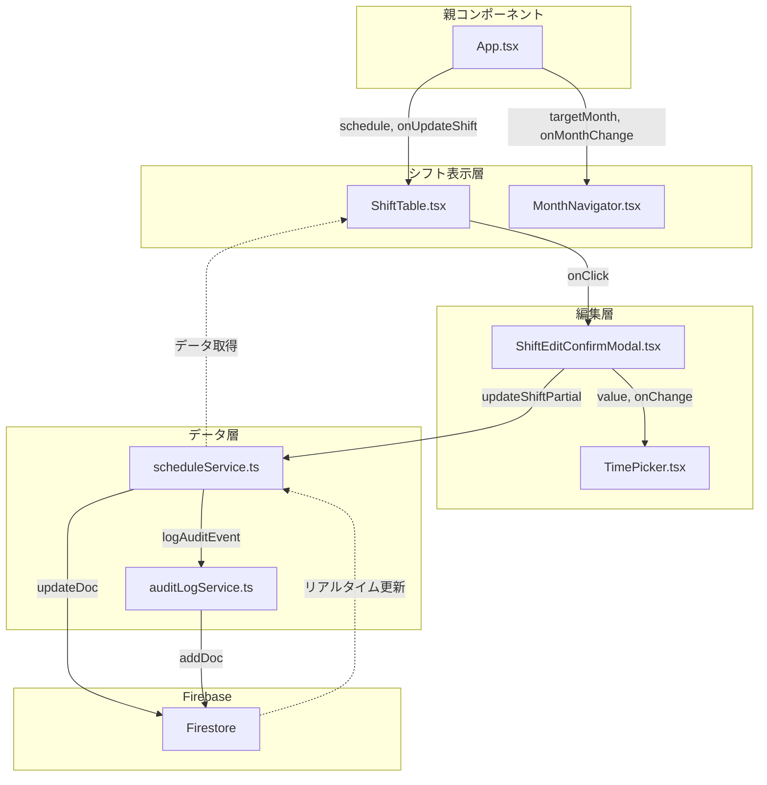
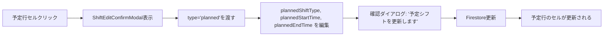
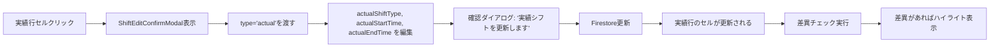
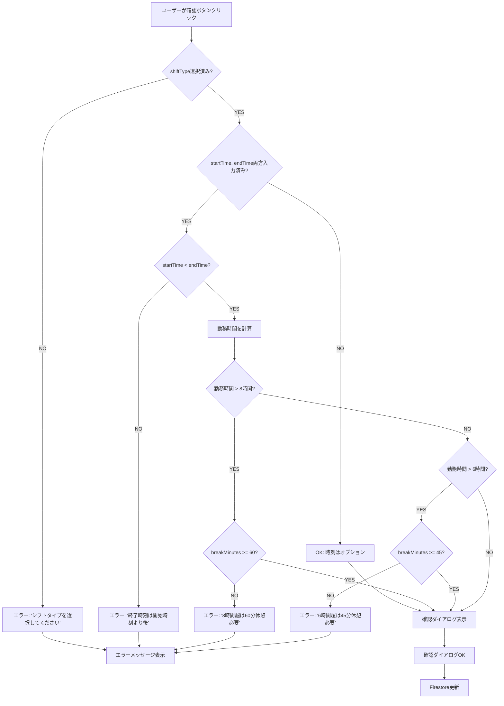
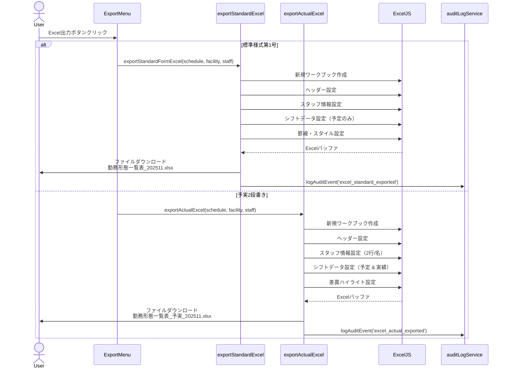

# Phase 25: UIフロー図

**作成日**: 2025-11-20
**目的**: 予実編集フローとコンポーネント間のやり取りを視覚化する

---

## シングルクリック編集フロー（シーケンス図）

---

## 差異ハイライト判定フロー

---

## コンポーネント間のデータフロー

---

## 予定編集と実績編集の違い

### 予定編集フロー

### 実績編集フロー

---

## バリデーションフロー

---

## Excel出力フロー

---

## 関連ドキュメント

- [要件定義書](../requirements.md)
- [技術設計書](../design.md)
- [実装タスク一覧](../tasks.md)
- [データモデル図](./data-model-diagram.md)
- [コンポーネント構成図](./component-architecture.md)
