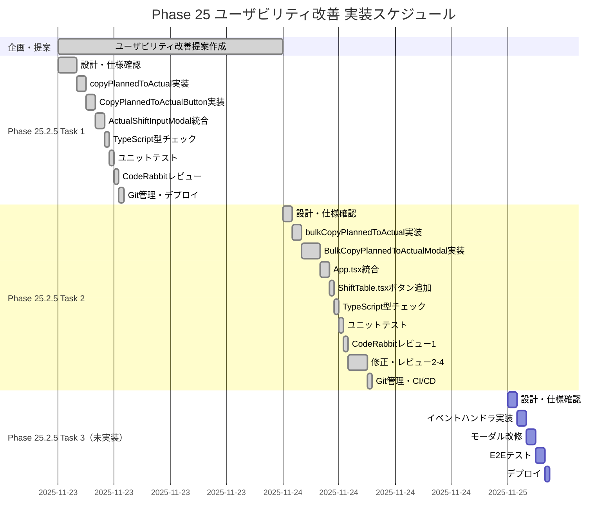
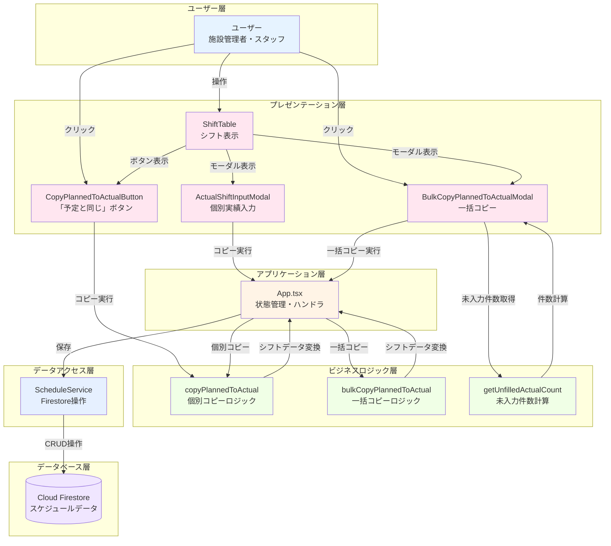
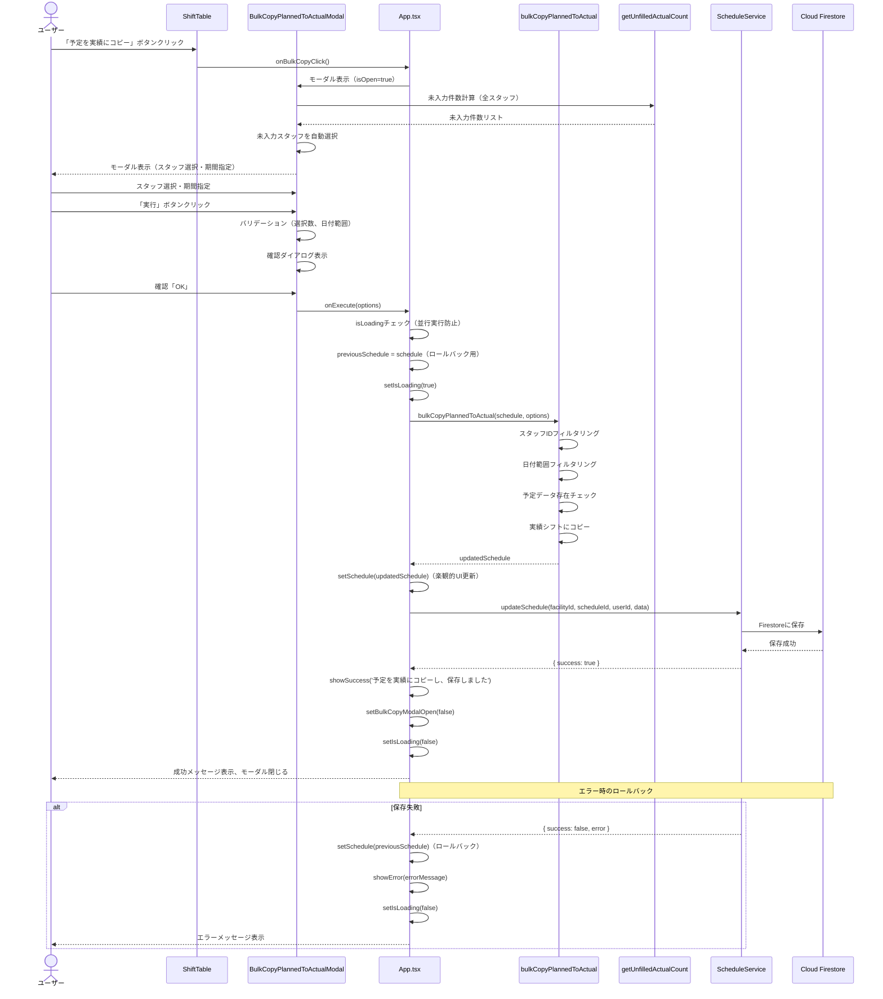
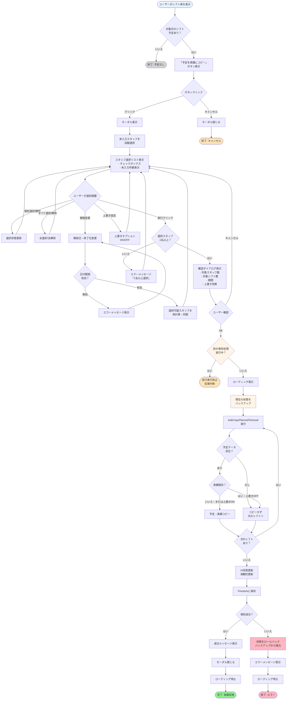

# Phase 25 成果物ダイアグラム集

**作成日**: 2025-11-24
**Phase**: 25（ユーザビリティ改善）
**形式**: Mermaid/PlantUML（静的サイト対応）

---

## 目次

1. [WBS（作業分解構造）](#1-wbs作業分解構造)
2. [ガントチャート（実装スケジュール）](#2-ガントチャート実装スケジュール)
3. [システム構成図](#3-システム構成図)
4. [データフロー図](#4-データフロー図)
5. [コンポーネント関係図](#5-コンポーネント関係図)
6. [ユーザーインタラクションフロー](#6-ユーザーインタラクションフロー)

---

## 1. WBS（作業分解構造）

### Phase 25.2.5 ユーザビリティ改善 WBS

```mermaid
graph TB
    A[Phase 25.2.5<br/>ユーザビリティ改善]

    A --> B[Task 1<br/>個別「予定と同じ」ボタン]
    A --> C[Task 2<br/>一括予定→実績コピー]
    A --> D[Task 3<br/>ダブルクリック即時コピー<br/>未実装]

    B --> B1[設計・仕様確認]
    B --> B2[copyPlannedToActual実装]
    B --> B3[CopyPlannedToActualButton実装]
    B --> B4[ActualShiftInputModal統合]
    B --> B5[TypeScript型チェック]
    B --> B6[ユニットテスト]
    B --> B7[CodeRabbitレビュー]
    B --> B8[Git管理]

    C --> C1[設計・仕様確認]
    C --> C2[bulkCopyPlannedToActual実装]
    C --> C3[BulkCopyPlannedToActualModal実装]
    C --> C4[App.tsx統合]
    C --> C5[ShiftTable.tsxボタン追加]
    C --> C6[TypeScript型チェック]
    C --> C7[ユニットテスト]
    C --> C8[CodeRabbitレビュー<br/>4回・9件対応]
    C --> C9[Git管理・CI/CD]

    D --> D1[UI設計]
    D --> D2[イベントハンドラ実装]
    D --> D3[モーダル改修]
    D --> D4[E2Eテスト]

    style B fill:#90EE90
    style C fill:#90EE90
    style D fill:#FFE4B5
```



---

## 2. ガントチャート（実装スケジュール）

### Phase 25 実装タイムライン



---

## 3. システム構成図

### Phase 25 アーキテクチャ概要



---

## 4. データフロー図

### Phase 25.2.5 Task 2: 一括コピー機能のデータフロー



---

## 5. コンポーネント関係図

### Phase 25 コンポーネント依存関係

```mermaid
graph LR
    subgraph "App.tsx（状態管理）"
        APP[App Component<br/>- schedule: StaffSchedule[]<br/>- bulkCopyModalOpen: boolean<br/>- handleBulkCopyExecute()]
    end

    subgraph "ShiftTable.tsx"
        ST[ShiftTable<br/>- schedules: StaffSchedule[]<br/>- onBulkCopyClick: function]
        STButton[一括コピーボタン]
    end

    subgraph "BulkCopyPlannedToActualModal.tsx"
        BCPAM[BulkCopyPlannedToActualModal<br/>- schedules: StaffSchedule[]<br/>- targetMonth: string<br/>- isOpen: boolean<br/>- onClose: function<br/>- onExecute: function]
        BCPAMStaffList[スタッフ選択リスト]
        BCPAMDateRange[日付範囲選択]
        BCPAMOverwrite[上書きオプション]
        BCPAMToggleAll[すべて選択/解除]
        BCPAMExecute[実行ボタン]
    end

    subgraph "ActualShiftInputModal.tsx"
        ASIM[ActualShiftInputModal<br/>- shiftData: GeneratedShift<br/>- onSave: function]
        ASIMButton[CopyPlannedToActualButton]
    end

    subgraph "Utilities"
        BCPTAUtil[bulkCopyPlannedToActual<br/>- options.staffIds<br/>- options.dateRange<br/>- options.overwrite]
        CPTAUtil[copyPlannedToActual<br/>- shift: GeneratedShift]
        GUACUtil[getUnfilledActualCount<br/>- staff: StaffSchedule<br/>- dateRange?: object]
    end

    APP -->|props| ST
    ST -->|render| STButton
    STButton -->|onClick| APP

    APP -->|props| BCPAM
    BCPAM -->|render| BCPAMStaffList
    BCPAM -->|render| BCPAMDateRange
    BCPAM -->|render| BCPAMOverwrite
    BCPAM -->|render| BCPAMToggleAll
    BCPAM -->|render| BCPAMExecute
    BCPAMExecute -->|onExecute| APP

    APP -->|props| ASIM
    ASIM -->|render| ASIMButton
    ASIMButton -->|onClick| CPTAUtil

    BCPAM -->|import| GUACUtil
    BCPAM -->|import| BCPTAUtil
    APP -->|import| BCPTAUtil
    APP -->|import| CPTAUtil
    BCPTAUtil -->|import| CPTAUtil

    style APP fill:#FFF4E6
    style ST fill:#FFE6F0
    style BCPAM fill:#FFE6F0
    style ASIM fill:#FFE6F0
    style BCPTAUtil fill:#F0FFE6
    style CPTAUtil fill:#F0FFE6
    style GUACUtil fill:#F0FFE6
```

---

## 6. ユーザーインタラクションフロー

### Phase 25.2.5 Task 2: ユーザー操作フロー



---

## 使用方法

### GitHub Pagesでの表示

これらのMermaid図は、GitHub Pagesで自動的にレンダリングされます。

1. **GitHubリポジトリで表示**: MarkdownファイルをGitHubで開くと、Mermaid図が自動的にレンダリングされます
2. **ローカルでプレビュー**: VSCodeのMarkdownプレビュー拡張機能（Markdown Preview Mermaid Support）を使用
3. **HTMLエクスポート**: Mermaid Live Editor (https://mermaid.live/) でSVG/PNG形式にエクスポート可能

---

## ダイアグラム更新履歴

| 日付 | 更新内容 | 担当 |
|------|----------|------|
| 2025-11-24 | Phase 25.2.5完了時の初版作成 | Claude Code |

---

## 関連ドキュメント

- [Phase 25.2.5 Task 1完了記録](./phase25-2.5-task1-completion-2025-11-23.md)
- [Phase 25.2.5 Task 2完了記録](./phase25-2.5-task2-completion-2025-11-24.md)
- [ユーザビリティ改善提案](./usability-improvements-proposal.md)
- [HANDOFF_PROMPT.md](./HANDOFF_PROMPT.md)

---

**作成日**: 2025-11-24 11:40 JST
**Phase 25.2.5 Task 2完了**: 100%
