# Phase 26 ダイアグラム集

**作成日**: 2025-11-24
**仕様ID**: care-staff-schedule-compliance
**Phase**: 26 - E2Eテスト追加とモバイル最適化

## 目的

Phase 26の全体像、システム構成、データフロー、テスト設計を視覚化し、GitHub Pagesで共有可能な形式で整備する。

---

## 1. Phase 26 WBS（作業分解図）

```mermaid
graph TB
    Phase26[Phase 26: E2Eテスト追加・モバイル最適化]

    Phase26 --> Task1[Task 1: E2Eテスト設計]
    Phase26 --> Task2[Task 2: E2Eテスト実装]
    Phase26 --> Task3[Task 3: モバイル最適化]
    Phase26 --> Task4[Task 4: ドキュメント更新]

    Task1 --> Task1_1[1.1 テストケース洗い出し]
    Task1 --> Task1_2[1.2 テストデータ設計]
    Task1 --> Task1_3[1.3 既存E2Eパターン調査]

    Task2 --> Task2_1[2.1 改善1テスト実装<br/>予定と同じボタン]
    Task2 --> Task2_2[2.2 改善2テスト実装<br/>一括コピー機能]
    Task2 --> Task2_3[2.3 テスト実行・検証]

    Task3 --> Task3_1[3.1 レスポンシブデザイン改善<br/>375px-767px対応]
    Task3 --> Task3_2[3.2 タッチ操作最適化<br/>スワイプ・ロングタップ]
    Task3 --> Task3_3[3.3 モバイルブラウザ検証<br/>iOS/Android]

    Task4 --> Task4_1[4.1 Phase 26完了記録作成]
    Task4 --> Task4_2[4.2 GitHub Pages更新]
    Task4 --> Task4_3[4.3 メモリファイル更新]

    style Phase26 fill:#e1f5ff
    style Task1 fill:#fff4e6
    style Task2 fill:#fff4e6
    style Task3 fill:#fff4e6
    style Task4 fill:#fff4e6
    style Task2_1 fill:#e8f5e9
    style Task2_2 fill:#e8f5e9
    style Task2_3 fill:#e8f5e9
    style Task3_1 fill:#f3e5f5
    style Task3_2 fill:#f3e5f5
    style Task3_3 fill:#f3e5f5
```

---

## 2. Phase 26 ガントチャート（実装スケジュール）

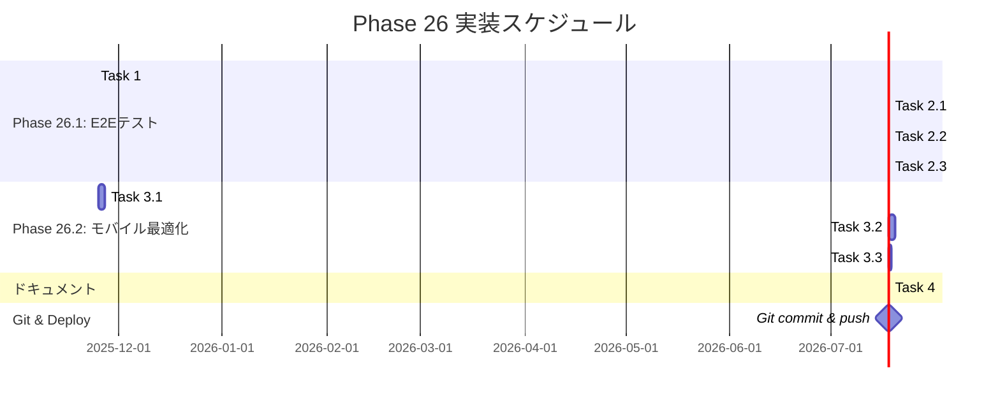

---

## 3. E2Eテストアーキテクチャ

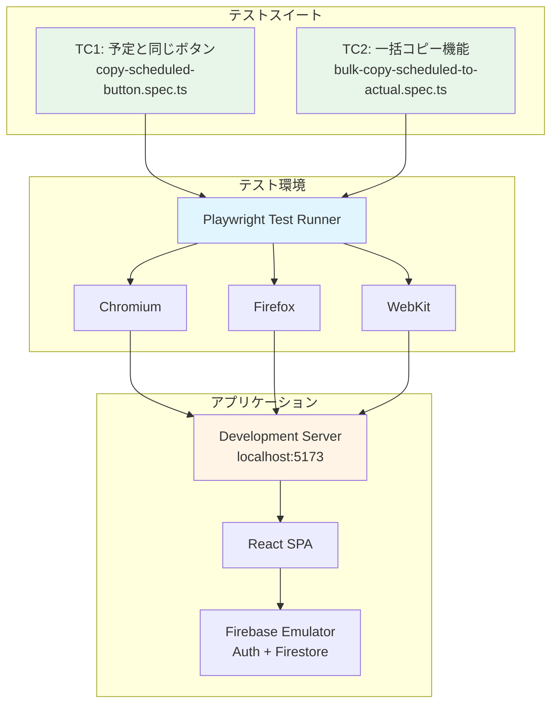

---

## 4. E2Eテストフロー（改善1: 予定と同じボタン）

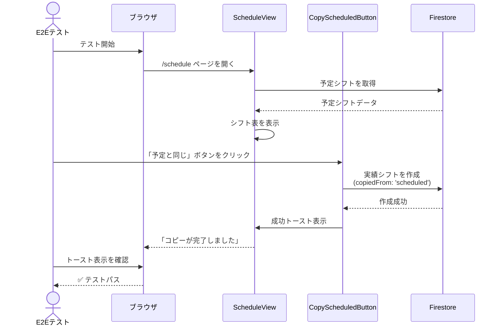

---

## 5. E2Eテストフロー（改善2: 一括コピー機能）

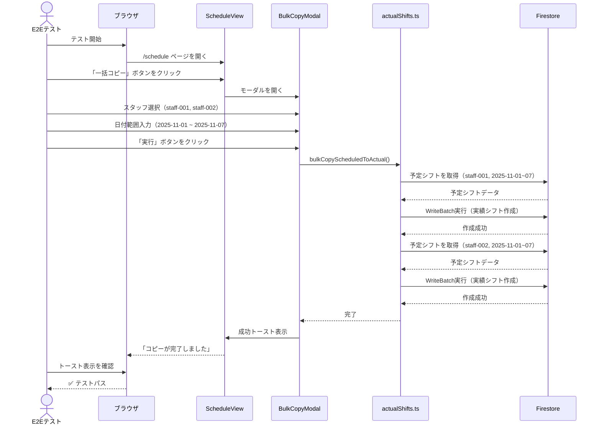

---

## 6. モバイル最適化の対象デバイス

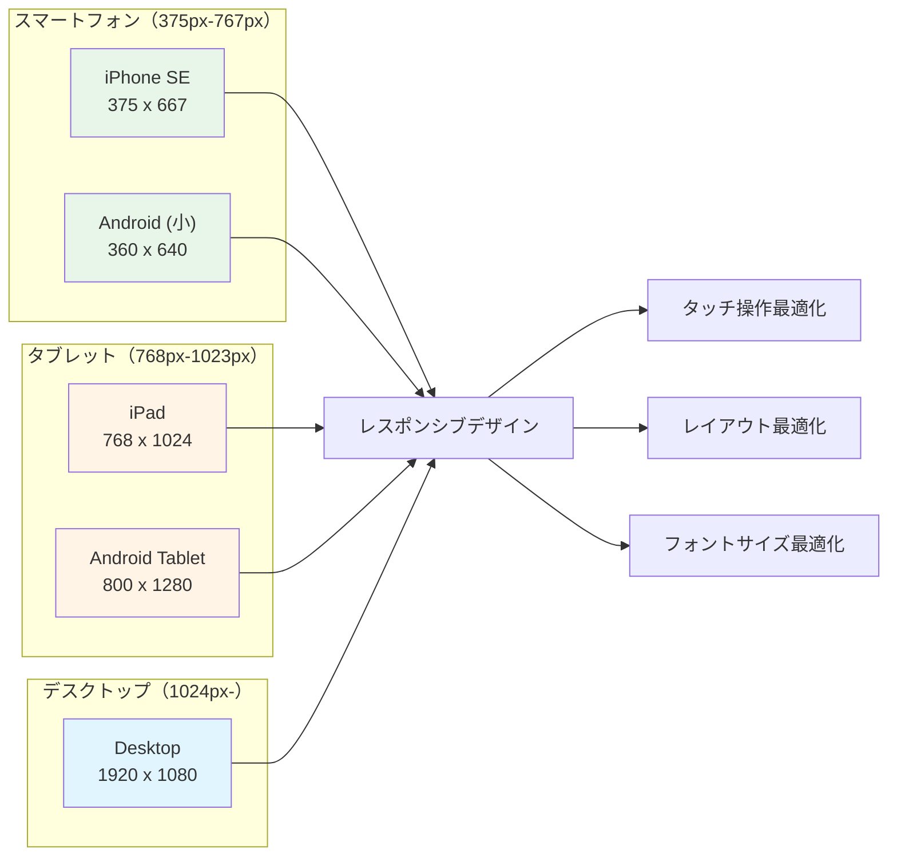

---

## 7. レスポンシブデザインのブレークポイント

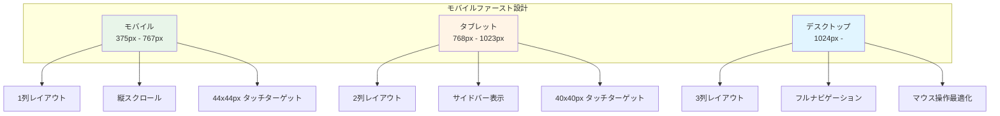

---

## 8. CI/CDパイプライン（Phase 26対応）

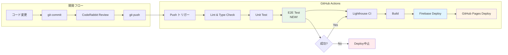

---

## 9. Phase 26完了の定義（DoD）

```mermaid
graph TB
    DoD[Phase 26 完了の定義]

    DoD --> Test[テスト]
    DoD --> Mobile[モバイル最適化]
    DoD --> Doc[ドキュメント]
    DoD --> Git[Git & Deploy]

    Test --> Test1[✅ TC1-1~TC1-5パス]
    Test --> Test2[✅ TC2-1~TC2-8パス]
    Test --> Test3[✅ CI/CD組み込み]
    Test --> Test4[✅ テスト時間 < 5分]

    Mobile --> Mobile1[✅ iPhone SE対応]
    Mobile --> Mobile2[✅ iPad対応]
    Mobile --> Mobile3[✅ Lighthouse > 90点]
    Mobile --> Mobile4[✅ 実機検証完了]

    Doc --> Doc1[✅ Phase 26完了記録]
    Doc --> Doc2[✅ GitHub Pages更新]
    Doc --> Doc3[✅ メモリファイル更新]

    Git --> Git1[✅ コミット規約準拠]
    Git --> Git2[✅ CodeRabbitレビュー]
    Git --> Git3[✅ CI/CD成功]
    Git --> Git4[✅ mainマージ]

    style DoD fill:#e1f5ff
    style Test fill:#e8f5e9
    style Mobile fill:#fff4e6
    style Doc fill:#f3e5f5
    style Git fill:#ffe0b2
```

---

## 10. プロジェクトロードマップ（Phase 25-27）

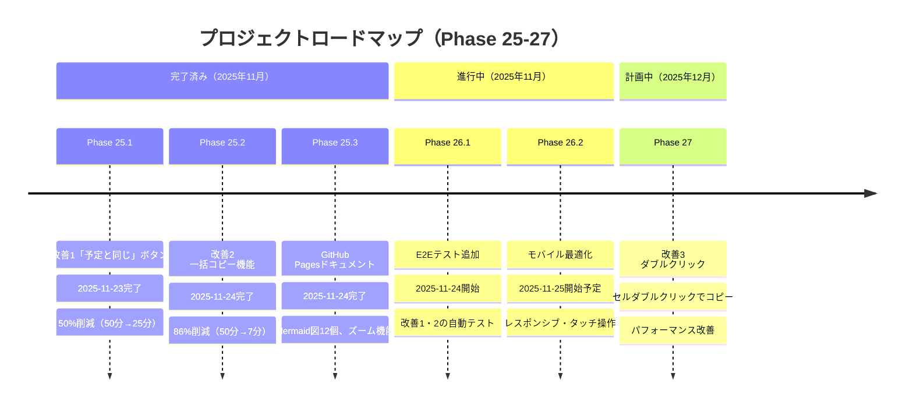

---

## 11. テストカバレッジ目標

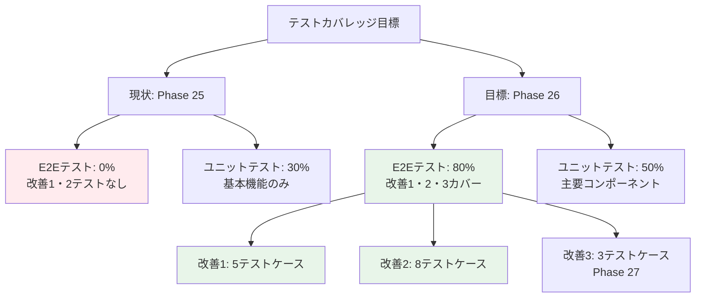

---

## 使用方法

### GitHub Pagesへの追加

1. **technical.htmlに追加**:
   ```html
   <h2>Phase 26: E2Eテスト追加・モバイル最適化</h2>
   <h3>WBS（作業分解図）</h3>
   <div class="mermaid">
   <!-- 上記のWBS図をコピー -->
   </div>
   ```

2. **index.htmlに追加**:
   ```html
   <h3>Phase 26の進捗</h3>
   <div class="mermaid">
   <!-- 上記のガントチャート図をコピー -->
   </div>
   ```

### ローカルでのプレビュー

```bash
# Mermaid CLIでプレビュー
npx @mermaid-js/mermaid-cli -i phase26-diagrams-2025-11-24.md -o phase26-diagrams.html
```

---

## 関連ドキュメント

- [Phase 26実装計画](./phase26-plan-2025-11-24.md)
- [Phase 25完了記録](./phase25-2.5-completion-2025-11-24.md)
- [GitHub Pages](https://yasushi-honda.github.io/ai-care-shift-scheduler/)
