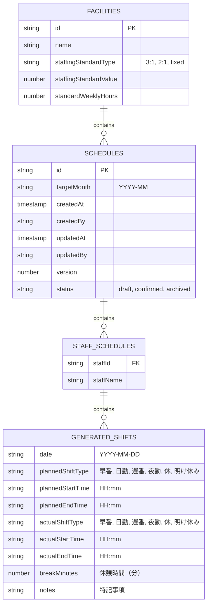
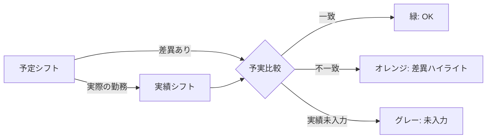
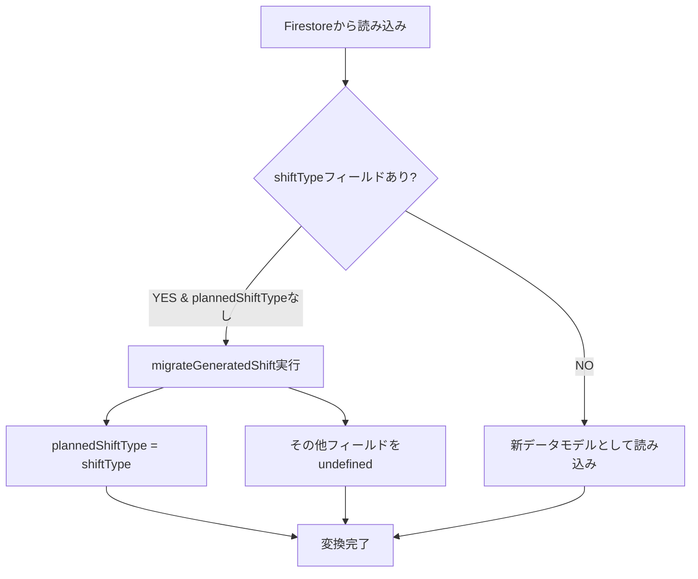

# Phase 25: データモデル図

**作成日**: 2025-11-20
**目的**: 予実管理対応のデータモデル構造を視覚化する

---

## ER図: Schedule → StaffSchedule → GeneratedShift



---

## GeneratedShift インターフェース詳細

### 旧データモデル（Phase 24以前）

```typescript
export interface GeneratedShift {
  date: string;         // YYYY-MM-DD
  shiftType: string;    // '早番', '日勤', '遅番', '夜勤', '休', '明け休み'
}
```

### 新データモデル（Phase 25以降）

```typescript
export interface GeneratedShift {
  date: string;                    // YYYY-MM-DD

  // 予定シフト（必須）
  plannedShiftType: string;        // '早番', '日勤', '遅番', '夜勤', '休', '明け休み'
  plannedStartTime?: string;       // HH:mm（例: "08:30"）
  plannedEndTime?: string;         // HH:mm（例: "17:30"）

  // 実績シフト（任意）
  actualShiftType?: string;        // 実績のシフトタイプ
  actualStartTime?: string;        // HH:mm
  actualEndTime?: string;          // HH:mm
  breakMinutes?: number;           // 休憩時間（分）

  // 備考
  notes?: string;                  // 特記事項（欠勤理由、変更理由など）
}
```

---

## 予定と実績の関係性



---

## データ移行戦略

### 後方互換性の実装

旧データ（`shiftType`のみ）を新データモデル（`plannedShiftType`等）に自動変換する。



### 実装コード例

```typescript
function migrateGeneratedShift(shift: any): GeneratedShift {
  // 旧データ（shiftTypeのみ）の場合
  if (shift.shiftType && !shift.plannedShiftType) {
    return {
      date: shift.date,
      plannedShiftType: shift.shiftType,
      plannedStartTime: undefined,
      plannedEndTime: undefined,
      actualShiftType: undefined,
      actualStartTime: undefined,
      actualEndTime: undefined,
      breakMinutes: undefined,
      notes: undefined
    };
  }

  // 新データの場合
  return shift as GeneratedShift;
}
```

---

## Firestoreドキュメント例

### 予実データを含むScheduleドキュメント

```json
{
  "id": "schedule_202511",
  "targetMonth": "2025-11",
  "staffSchedules": [
    {
      "staffId": "staff_001",
      "staffName": "田中太郎",
      "monthlyShifts": [
        {
          "date": "2025-11-01",
          "plannedShiftType": "早番",
          "plannedStartTime": "08:00",
          "plannedEndTime": "16:00",
          "actualShiftType": "早番",
          "actualStartTime": "08:05",
          "actualEndTime": "16:10",
          "breakMinutes": 60,
          "notes": "5分遅刻"
        },
        {
          "date": "2025-11-02",
          "plannedShiftType": "日勤",
          "plannedStartTime": "09:00",
          "plannedEndTime": "18:00",
          "actualShiftType": null,
          "actualStartTime": null,
          "actualEndTime": null,
          "breakMinutes": null,
          "notes": null
        }
      ]
    }
  ],
  "createdAt": "2025-11-01T00:00:00Z",
  "createdBy": "uid_xxx",
  "updatedAt": "2025-11-15T10:30:00Z",
  "updatedBy": "uid_yyy",
  "version": 3,
  "status": "confirmed"
}
```

---

## 関連ドキュメント

- [要件定義書](../requirements.md)
- [技術設計書](../design.md)
- [実装タスク一覧](../tasks.md)
- [UIフロー図](./ui-flow-diagram.md)
