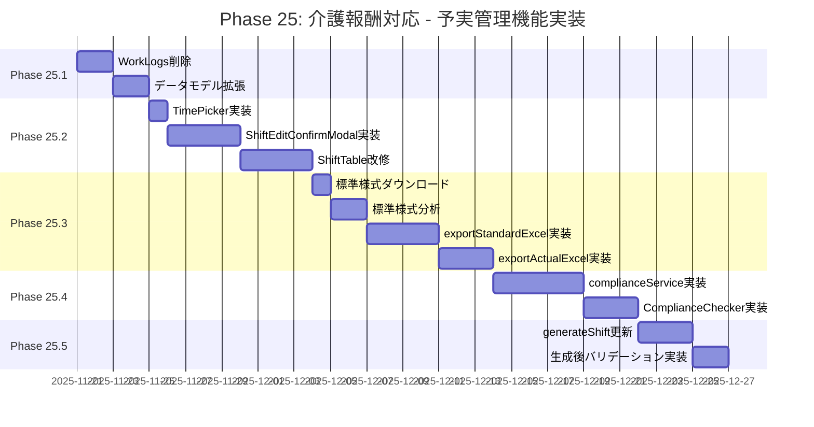
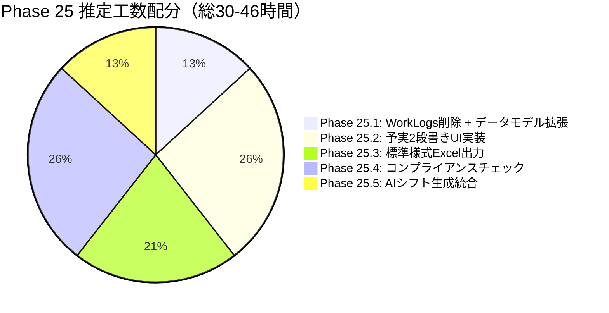
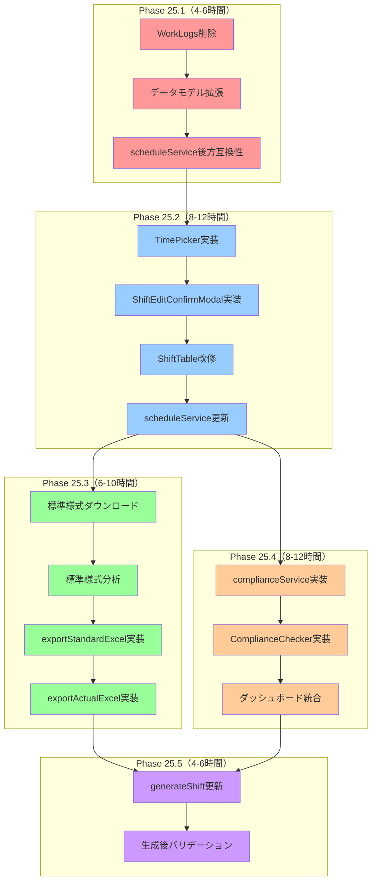
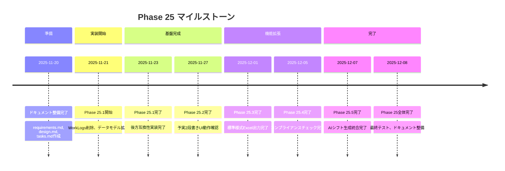
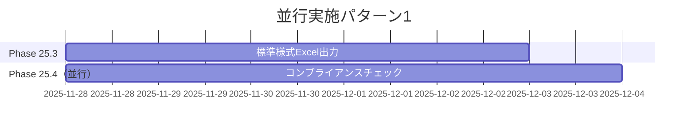
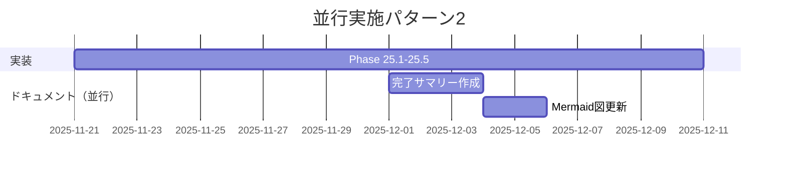
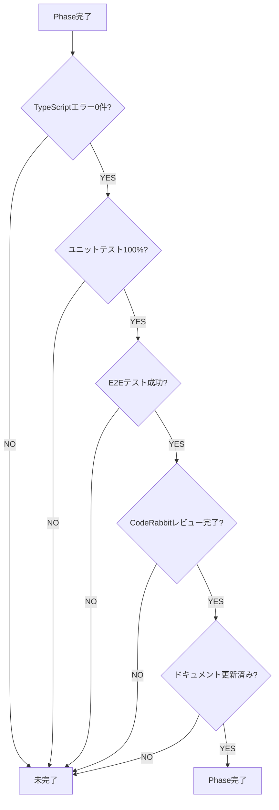

# Phase 25: 実装スケジュール（ガントチャート）

**作成日**: 2025-11-20
**総推定工数**: 30-46時間
**目的**: Phase 25の実装タイムラインと依存関係を視覚化する

---

## Phase 25実装スケジュール

---

## Phase別推定工数

---

## タスク依存関係

**凡例**:
- 🔴 赤: Phase 25.1（WorkLogs削除 + データモデル拡張）
- 🔵 青: Phase 25.2（予実2段書きUI実装）
- 🟢 緑: Phase 25.3（標準様式Excel出力）
- 🟠 橙: Phase 25.4（コンプライアンスチェック）
- 🟣 紫: Phase 25.5（AIシフト生成統合）

---

## マイルストーン

---

## 並行実施可能なタスク

以下のタスクは並行して実施可能（推奨）:

### パターン1: Phase 25.3とPhase 25.4を並行実施

**理由**: Phase 25.3とPhase 25.4は独立しており、Phase 25.2完了後に並行開始可能。

**推定工数削減**: 2-3日短縮可能

---

### パターン2: ドキュメント作成を並行実施

**理由**: 実装が進むごとに、ドキュメントを段階的に作成可能。

---

## リスクとバッファ

### リスク要因

| リスク | 影響 | 対策 | バッファ |
|--------|------|------|---------|
| 標準様式第1号の複雑性 | Phase 25.3が遅延 | 早期に様式分析を完了 | +2日 |
| ExcelJS APIの学習コスト | Phase 25.3が遅延 | 公式ドキュメント参照 | +1日 |
| コンプライアンスロジックの複雑性 | Phase 25.4が遅延 | ユニットテスト先行実装 | +2日 |
| AIプロンプト調整の試行錯誤 | Phase 25.5が遅延 | プロンプトテンプレート活用 | +1日 |

**総バッファ**: +6日（推定工数: 30-46時間 → 実際: 36-52時間）

---

## 実装完了の定義（Definition of Done）

各Phaseの完了条件:

---

## 関連ドキュメント

- [要件定義書](../requirements.md)
- [技術設計書](../design.md)
- [実装タスク一覧](../tasks.md)
- [データモデル図](./data-model-diagram.md)
- [UIフロー図](./ui-flow-diagram.md)
