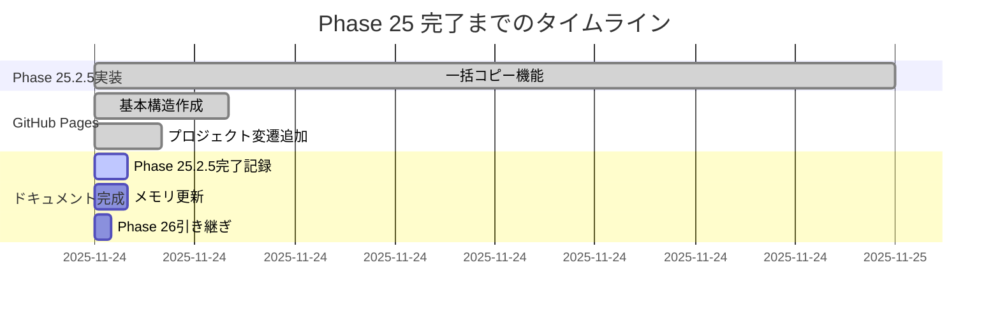

# Phase 25 完了計画

**作成日**: 2025-11-24
**仕様ID**: care-staff-schedule-compliance
**Phase**: 25.2.5 → 完了記録 → Phase 26準備

## 目的

Phase 25（ユーザビリティ改善）の完了を正式に記録し、クライアント・開発者・AIの3者にとって有用なドキュメント基盤を完成させる。

## 完了までのステップ

### Step 1: Phase 25.2.5 完了記録ドキュメント作成 ✅

**ファイル**: `.kiro/specs/care-staff-schedule-compliance/phase25-2.5-completion-2025-11-24.md`

**内容**:
- Phase 25.2.5の実装内容（一括コピー機能）
- 実装したコード・コンポーネント
- テスト実施状況
- 効果測定（50分→7分、86%削減）
- 技術的な設計判断（Why）

### Step 2: GitHub Pages最終確認 ✅

**完了条件**:
- [ ] index.htmlが正しくレンダリング（Mermaid図7個）
- [ ] technical.htmlが正しくレンダリング（Mermaid図5個）
- [ ] モーダルのズーム・スクロールが正常動作
- [ ] ダークモード対応確認
- [ ] モバイル表示確認

### Step 3: プロジェクトメモリ更新 📝

**更新するメモリ**:
- `phase25_progress_2025-11-24.md` - Phase 25全体の進捗記録
- `phase25_design_decisions_2025-11-24.md` - 設計判断の記録
- `project_overview.md` - プロジェクト概要の更新（Phase 25完了を反映）

**追加内容**:
- GitHub Pagesドキュメントの追加
- クライアント向けコミュニケーション基盤の確立
- 今後のPhase 26以降の準備状況

### Step 4: 次のAIセッションへの引き継ぎ準備 📄

**作成ファイル**: `.kiro/specs/care-staff-schedule-compliance/phase26-handoff-2025-11-24.md`

**内容**:
- Phase 25で達成したこと
- 残された課題（改善3: ダブルクリック機能）
- Phase 26推奨事項
- 技術的負債の記録
- クライアントフィードバックの待機状態

## 成果物チェックリスト

### ドキュメント
- [ ] Phase 25.2.5完了記録（.kiro/specs/）
- [ ] プロジェクトメモリ更新（3ファイル）
- [ ] Phase 26引き継ぎドキュメント

### GitHub Pages
- [ ] index.html: クライアント向け（プロジェクト変遷・規模・ロードマップ含む）
- [ ] technical.html: 開発者向け（WBS・技術詳細）
- [ ] 自動デプロイ確認

### コード
- [ ] すべてのコミットがpush済み
- [ ] GitHub Actions成功確認
- [ ] 本番環境デプロイ確認

## 完了基準

1. **クライアント基準**: プロジェクトの価値・規模・今後の計画が明確
2. **開発者基準**: 技術詳細・実装状況・次のステップが明確
3. **AI基準**: 設計判断・コンテキスト・引き継ぎ情報が完全

## 次のフェーズ

**Phase 26推奨内容**:
- 改善3: ダブルクリック機能（優先度: 中）
- モバイル最適化（優先度: 高）
- パフォーマンス改善（Lighthouse最適化）

## タイムライン

## 関連ドキュメント

- [Phase 25要件](.kiro/specs/care-staff-schedule-compliance/requirements.md)
- [Phase 25設計](.kiro/specs/care-staff-schedule-compliance/design.md)
- [Phase 25タスク](.kiro/specs/care-staff-schedule-compliance/tasks.md)
- [GitHub Pages](https://yasushi-honda.github.io/ai-care-shift-scheduler/)
