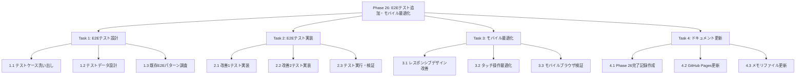
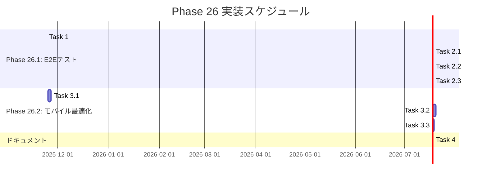

# Phase 26 実装計画

**作成日**: 2025-11-24
**仕様ID**: care-staff-schedule-compliance
**Phase**: 26 - E2Eテスト追加とモバイル最適化

## 概要

Phase 25で実装した実績入力の効率化機能（改善1・2）に対するE2Eテストを追加し、品質保証体制を強化する。また、モバイル環境での使いやすさを向上させる。

## 目的

1. **品質保証**: 改善1・2の動作を自動テストで保証
2. **リグレッション防止**: 将来の変更で既存機能が壊れないことを保証
3. **モバイル対応**: スマートフォン・タブレットでの利便性向上

## Phase 26 スコープ

### 優先度: 高（Phase 26.1）
- **E2Eテスト追加**
  - 改善1: 「予定と同じ」ボタンのテスト
  - 改善2: 一括コピー機能のテスト
  - 推定工数: 4時間

### 優先度: 中（Phase 26.2）
- **モバイル最適化**
  - レスポンシブデザイン改善（768px以下）
  - タッチ操作最適化
  - 推定工数: 1週間

### Phase 27以降に延期
- 改善3: ダブルクリック機能
- パフォーマンス改善
- レポート機能強化
- 通知機能追加

## WBS（作業分解図）



## ガントチャート（実装スケジュール）



## E2Eテスト設計

### テスト環境
- **ツール**: Playwright
- **ブラウザ**: Chromium, Firefox, WebKit
- **ベースURL**: `http://localhost:5173`（開発サーバー）

### テストケース一覧

#### 改善1: 「予定と同じ」ボタン

**ファイル**: `tests/e2e/copy-scheduled-button.spec.ts`

| ID | テストケース | 期待結果 |
|----|-------------|---------|
| TC1-1 | 予定シフトが存在する場合、「予定と同じ」ボタンをクリック | 実績シフトが予定シフトと同じ内容で作成される |
| TC1-2 | 予定シフトが存在しない場合 | ボタンが非表示またはdisabled |
| TC1-3 | すでに実績が入力済みの場合、「予定と同じ」ボタンをクリック | 実績シフトが上書きされる |
| TC1-4 | コピー後、成功メッセージが表示される | トースト通知が表示される |
| TC1-5 | 権限のないユーザー（Staff）がアクセス | ボタンが非表示またはエラー |

#### 改善2: 一括コピー機能

**ファイル**: `tests/e2e/bulk-copy-scheduled-to-actual.spec.ts`

| ID | テストケース | 期待結果 |
|----|-------------|---------|
| TC2-1 | 一括コピーモーダルを開く | モーダルが表示される |
| TC2-2 | 複数スタッフを選択して一括コピー実行 | 選択されたスタッフの予定が実績にコピーされる |
| TC2-3 | 日付範囲を指定して一括コピー実行 | 指定期間内の予定が実績にコピーされる |
| TC2-4 | スタッフ未選択でコピー実行 | エラーメッセージが表示される |
| TC2-5 | 日付範囲未入力でコピー実行 | エラーメッセージが表示される |
| TC2-6 | 開始日 > 終了日の場合 | バリデーションエラーが表示される |
| TC2-7 | コピー後、成功メッセージが表示される | トースト通知が表示される |
| TC2-8 | 権限のないユーザー（Staff）がアクセス | モーダルが開けない、またはエラー |

### テストデータ設計

**前提条件**:
- テスト用事業所: `test-facility-phase26`
- テスト用スタッフ: `staff-001`, `staff-002`, `staff-003`
- テスト用予定シフト: 2025年11月1日～11月7日（1週間分）

**予定シフトデータ**:
```typescript
const scheduledShifts = [
  {
    facilityId: 'test-facility-phase26',
    staffId: 'staff-001',
    date: Timestamp.fromDate(new Date('2025-11-01')),
    startTime: '09:00',
    endTime: '17:00',
    type: 'day',
  },
  {
    facilityId: 'test-facility-phase26',
    staffId: 'staff-001',
    date: Timestamp.fromDate(new Date('2025-11-02')),
    startTime: '09:00',
    endTime: '17:00',
    type: 'day',
  },
  // ... 以下、staff-002, staff-003のデータ
];
```

### 既存E2Eパターン参照

**参考ファイル**: `tests/e2e/auth.spec.ts`

```typescript
// ログイン処理パターン
async function loginAsManager(page: Page) {
  await page.goto('/login');
  await page.fill('input[name="email"]', 'manager@example.com');
  await page.fill('input[name="password"]', 'password123');
  await page.click('button[type="submit"]');
  await page.waitForURL('/schedule');
}

// 成功メッセージ確認パターン
await expect(page.locator('.toast-success')).toBeVisible();
await expect(page.locator('.toast-success')).toContainText('コピーが完了しました');
```

## モバイル最適化設計

### 対象デバイス
- スマートフォン: 375px ~ 767px
- タブレット: 768px ~ 1023px

### 改善項目

#### 1. レスポンシブデザイン改善
- シフト表のカラムを縦スクロールに変更
- フォントサイズの最適化
- ボタン・入力フォームのタッチターゲットサイズ（最低44x44px）

#### 2. タッチ操作最適化
- スワイプでシフト表をスクロール
- ロングタップでコンテキストメニュー表示
- ダブルタップでズーム無効化（誤操作防止）

#### 3. モバイルブラウザ検証
- Safari（iOS）
- Chrome（Android）
- Firefox（Android）

## 完了の定義（Definition of Done）

### Phase 26.1: E2Eテスト追加
- ✅ TC1-1 ~ TC1-5 すべてパス
- ✅ TC2-1 ~ TC2-8 すべてパス
- ✅ CI/CDパイプラインに組み込み（GitHub Actions）
- ✅ テスト実行時間 < 5分

### Phase 26.2: モバイル最適化
- ✅ iPhone SE (375px) で操作可能
- ✅ iPad (768px) で操作可能
- ✅ Lighthouse Mobileスコア > 90点
- ✅ 実機検証完了（iOS + Android）

### ドキュメント
- ✅ Phase 26完了記録作成（`.kiro/specs/`）
- ✅ GitHub Pages更新（ロードマップ反映）
- ✅ メモリファイル更新（`phase26_progress_2025-11-24.md`）

### Git
- ✅ コミットメッセージ規約準拠
- ✅ CodeRabbit CLIレビュー完了
- ✅ GitHub Actions CI/CD成功
- ✅ main ブランチにマージ

## リスク管理

| リスク | 影響度 | 対策 |
|--------|--------|------|
| E2Eテストが不安定（Flaky Test） | 中 | リトライ機能追加、待機時間調整 |
| モバイル実機検証環境がない | 低 | BrowserStackまたはPlaywright Device Emulation使用 |
| テスト実行時間が長い（> 10分） | 中 | 並列実行、不要なテスト削除 |
| Firebaseエミュレータ起動失敗 | 高 | 事前にエミュレータ起動確認、ポート競合チェック |

## 次のPhaseへの引き継ぎ

### Phase 27 推奨タスク
1. **改善3: ダブルクリック機能**
   - セルダブルクリックで予定→実績コピー
   - 推定工数: 2-3時間

2. **パフォーマンス改善**
   - Lighthouse最適化
   - バンドルサイズ削減
   - 推定工数: 3日間

### 技術的負債
- なし（Phase 26で新たな技術的負債は発生しない想定）

## 関連ドキュメント

- [Phase 25完了記録](.kiro/specs/care-staff-schedule-compliance/phase25-2.5-completion-2025-11-24.md)
- [Phase 25設計判断](.kiro/steering/../../../.serena/memory/phase25_design_decisions_2025-11-24_final.md)
- [E2Eテストパターン](.kiro/steering/../../../.serena/memory/phase14_e2e_test_patterns.md)
- [GitHub Pages](https://yasushi-honda.github.io/ai-care-shift-scheduler/)

## 承認

- [ ] 要件確認完了
- [ ] 設計確認完了
- [ ] 実装開始承認

---

**次のステップ**: E2Eテスト実装開始
