# Phase 27: CI/CD E2Eテスト統合 - ダイアグラム集

**作成日**: 2025-11-25
**仕様ID**: ci-cd-e2e-integration
**Phase**: 27

---

## 1. WBS（作業分解図）

---

## 2. ガントチャート

```mermaid
gantt
    title Phase 27 実装スケジュール
    dateFormat HH:mm
    axisFormat %H:%M

    section 計画・設計
    現状分析           :done, a1, 00:00, 30m
    WBS作成            :done, a2, after a1, 30m
    Mermaid図作成      :active, a3, after a2, 30m

    section GitHub Actions
    E2Eジョブ追加      :b1, after a3, 60m
    Playwright設定     :b2, after b1, 30m
    アーティファクト   :b3, after b2, 30m

    section Emulator統合
    起動スクリプト     :c1, after b3, 30m
    ヘルスチェック     :c2, after c1, 30m
    環境変数設定       :c3, after c2, 30m

    section テスト安定化
    タイムアウト調整   :d1, after c3, 30m
    リトライ戦略       :d2, after d1, 30m
    Flaky Test修正     :d3, after d2, 60m

    section 完了処理
    ドキュメント整備   :e1, after d3, 30m
    検証・Git push     :e2, after e1, 30m
```

---

## 3. CI/CDパイプライン構成図

---

## 4. Firebase Emulator構成図

---

## 5. E2Eテスト実行フロー

---

## 6. テストカバレッジマトリックス

### テストファイル一覧

| ファイル | 対象機能 | 優先度 |
|----------|----------|--------|
| auth-flow.spec.ts | 認証フロー | 高 |
| rbac-permissions.spec.ts | RBAC権限 | 高 |
| invitation-flow.spec.ts | 招待フロー | 中 |
| permission-errors.spec.ts | 権限エラー | 中 |
| shift-creation.spec.ts | シフト作成 | 高 |
| planned-actual-shift-edit.spec.ts | 予定/実績編集 | 高 |
| copy-scheduled-button.spec.ts | 予定コピー | 高 |
| bulk-copy-scheduled-to-actual.spec.ts | 一括コピー | 高 |
| data-crud.spec.ts | データCRUD | 中 |
| data-restoration.spec.ts | データ復元 | 中 |
| version-management.spec.ts | バージョン管理 | 低 |
| staff-management.spec.ts | スタッフ管理 | 中 |
| leave-request.spec.ts | 休暇希望 | 中 |
| ai-shift-generation.spec.ts | AI生成 | 低 |
| app.spec.ts | アプリ基本 | 高 |
| mobile-separate-page.spec.ts | モバイル | 低 |

---

## 7. リスク対策マトリックス

---

## 8. 実装完了基準（Definition of Done）

### チェックリスト

- [x] GitHub Actions E2Eジョブ追加
- [x] Firebase Emulator起動成功
- [x] E2Eテスト全件実行
- [x] テスト成功率 > 95% → **100%（3/3）**
- [x] 実行時間 < 10分 → **約5分**
- [x] 失敗時レポートアップロード
- [x] ドキュメント整備完了
- [x] CodeRabbitレビュー対応
- [x] Git push完了

**CI検証結果**: GitHub Actions Run #19656463104 ✅ 完全成功

---

## 関連ドキュメント

- [Phase 27計画](./phase27-plan-2025-11-25.md)
- [Phase 26.2完了記録](../github-pages-optimization/phase26.2-completion-2025-11-24.md)
- [CI/CD設定](.github/workflows/ci.yml)
