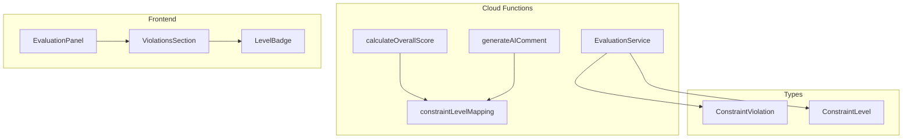
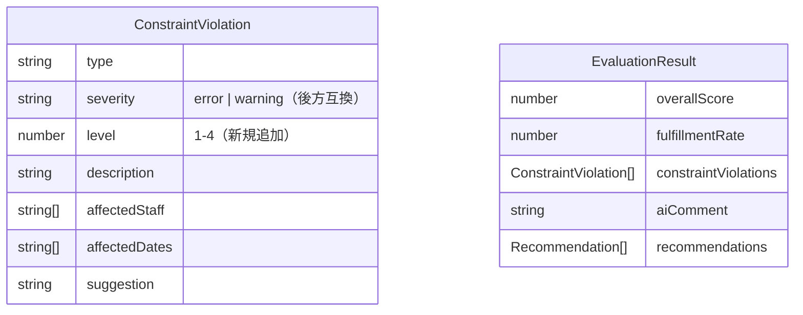

# Technical Design Document

## Introduction

Phase 53「制約レベル別評価システム」の技術設計書。本機能では、各制約条件に必須レベル（4段階）を導入し、レベル別の重み付け評価を行うことで、90%充足でも「使えるシフト」として提示できるようにする。

**対象要件**: [requirements.md](./requirements.md)

---

## Architecture Overview

### システム概要図



### 変更影響範囲

| 層 | ファイル | 変更内容 |
|----|----------|----------|
| Types | `functions/src/types.ts` | `ConstraintViolation`に`level`フィールド追加 |
| Config | `functions/src/evaluation/constraintLevelMapping.ts` | 新規：レベルマッピング設定 |
| Logic | `functions/src/evaluation/evaluationLogic.ts` | スコア計算・コメント生成ロジック変更 |
| UI | `src/components/EvaluationPanel.tsx` | 色分け表示・サマリー表示 |

---

## Design Details

### Component 1: 制約レベル型定義

#### 目的
制約違反に4段階のレベルを付与するための型定義

#### 現状の型定義

```typescript
// functions/src/types.ts (現在)
export interface ConstraintViolation {
  type: ConstraintViolationType;
  severity: 'error' | 'warning';
  description: string;
  affectedStaff?: string[];
  affectedDates?: string[];
  suggestion?: string;
}
```

#### 設計変更

```typescript
// functions/src/types.ts (変更後)

/**
 * 制約レベル（4段階）
 * - 1: 絶対必須（労基法違反 → シフト無効）
 * - 2: 運営必須（人員・資格基準 → 重大減点）
 * - 3: 努力目標（希望休・連勤 → 軽微減点）
 * - 4: 推奨（相性考慮 → 減点なし・情報）
 */
export type ConstraintLevel = 1 | 2 | 3 | 4;

export interface ConstraintViolation {
  type: ConstraintViolationType;
  severity: 'error' | 'warning';  // 後方互換性のため維持
  level: ConstraintLevel;         // 🆕 追加
  description: string;
  affectedStaff?: string[];
  affectedDates?: string[];
  suggestion?: string;
}
```

#### 設計判断
- `severity`は後方互換性のため維持（既存のUI表示ロジックが依存）
- `level`は新規追加し、新しいスコア計算で使用
- 既存データには`getDefaultLevel()`でデフォルト値を適用

---

### Component 2: レベルマッピング設定

#### 目的
制約タイプとレベルの対応関係を一元管理

#### 新規ファイル

```typescript
// functions/src/evaluation/constraintLevelMapping.ts

import { ConstraintViolationType, ConstraintLevel } from '../types';

/**
 * 制約タイプからデフォルトレベルへのマッピング
 */
export const CONSTRAINT_LEVEL_MAPPING: Record<ConstraintViolationType, ConstraintLevel> = {
  // レベル1（絶対必須）: 労基法違反
  nightRestViolation: 1,       // 夜勤後休息不足（72時間ルール等）

  // レベル2（運営必須）: 人員・資格基準
  staffShortage: 2,            // 人員不足
  qualificationMissing: 2,     // 資格要件未充足

  // レベル3（努力目標）: 希望・連勤
  consecutiveWork: 3,          // 連勤超過
  leaveRequestIgnored: 3,      // 休暇希望未反映
  // timeSlotPreference: 3,    // 時間帯希望違反（将来追加時）
};

/**
 * レベル別の減点設定
 */
export const LEVEL_DEDUCTIONS: Record<ConstraintLevel, { min: number; max: number }> = {
  1: { min: 100, max: 100 },   // レベル1: 即座に0点
  2: { min: 10, max: 15 },     // レベル2: 1件10〜15点減点
  3: { min: 3, max: 5 },       // レベル3: 1件3〜5点減点
  4: { min: 0, max: 0 },       // レベル4: 減点なし
};

/**
 * レベル別UI表示設定
 */
export const LEVEL_UI_CONFIG: Record<ConstraintLevel, {
  label: string;
  color: string;
  bgColor: string;
  borderColor: string;
}> = {
  1: { label: '絶対必須', color: '#DC2626', bgColor: 'bg-red-50', borderColor: 'border-red-500' },
  2: { label: '運営必須', color: '#EA580C', bgColor: 'bg-orange-50', borderColor: 'border-orange-500' },
  3: { label: '努力目標', color: '#CA8A04', bgColor: 'bg-yellow-50', borderColor: 'border-yellow-500' },
  4: { label: '推奨', color: '#2563EB', bgColor: 'bg-blue-50', borderColor: 'border-blue-500' },
};

/**
 * 後方互換性: severityからデフォルトレベルを推定
 */
export function getDefaultLevelFromSeverity(severity: 'error' | 'warning'): ConstraintLevel {
  return severity === 'error' ? 2 : 3;
}

/**
 * 制約タイプからレベルを取得
 */
export function getConstraintLevel(type: ConstraintViolationType): ConstraintLevel {
  return CONSTRAINT_LEVEL_MAPPING[type] ?? 3;  // 未定義タイプはレベル3
}
```

---

### Component 3: スコア計算ロジック変更

#### 目的
レベル別重み付けによるスコア計算

#### 現状のロジック

```typescript
// functions/src/evaluation/evaluationLogic.ts (現在)
calculateOverallScore(violations: ConstraintViolation[]): number {
  let score = 100;
  for (const violation of violations) {
    if (violation.severity === 'error') {
      score -= 10;
    } else if (violation.severity === 'warning') {
      score -= 5;
    }
  }
  return Math.max(0, score);
}
```

#### 設計変更

```typescript
// functions/src/evaluation/evaluationLogic.ts (変更後)
import { LEVEL_DEDUCTIONS, getConstraintLevel } from './constraintLevelMapping';

/**
 * レベル別重み付けによるスコア計算
 *
 * 計算ルール:
 * - レベル1違反が1件以上 → 即座に0点
 * - レベル2違反: 1件あたり12点減点（10〜15の中央値）
 * - レベル3違反: 1件あたり4点減点（3〜5の中央値）
 * - レベル4違反: 減点なし
 */
calculateOverallScore(violations: ConstraintViolation[]): number {
  // レベル別に分類
  const violationsByLevel = this.groupViolationsByLevel(violations);

  // レベル1違反チェック（即座に0点）
  if (violationsByLevel[1].length > 0) {
    return 0;
  }

  let score = 100;

  // レベル2: 1件12点減点
  score -= violationsByLevel[2].length * 12;

  // レベル3: 1件4点減点
  score -= violationsByLevel[3].length * 4;

  // レベル4: 減点なし（情報記録のみ）

  return Math.max(0, Math.round(score));
}

/**
 * 違反をレベル別にグループ化
 */
private groupViolationsByLevel(
  violations: ConstraintViolation[]
): Record<ConstraintLevel, ConstraintViolation[]> {
  const result: Record<ConstraintLevel, ConstraintViolation[]> = {
    1: [], 2: [], 3: [], 4: []
  };

  for (const v of violations) {
    const level = v.level ?? getConstraintLevel(v.type);
    result[level].push(v);
  }

  return result;
}
```

#### スコア計算例

| シナリオ | Lv1 | Lv2 | Lv3 | Lv4 | 計算式 | スコア |
|---------|-----|-----|-----|-----|--------|--------|
| 現状の問題ケース | 0 | 3 | 15 | 0 | 100 - 3×12 - 15×4 | 4点 |
| 軽微な違反多数 | 0 | 0 | 18 | 5 | 100 - 0 - 18×4 - 0 | 28点 |
| 労基法違反あり | 1 | 2 | 5 | 0 | → レベル1あり | 0点 |
| 運営基準のみ | 0 | 5 | 0 | 0 | 100 - 5×12 | 40点 |

---

### Component 4: AIコメント生成改善

#### 目的
レベル別のポジティブなフィードバック生成

#### 現状のロジック

```typescript
// overallScore === 0 の場合
return this.generateCriticalComment(violationCounts, fulfillmentRate, violations);
// → 「この要件では実現不可能です」
```

#### 設計変更

```typescript
// functions/src/evaluation/evaluationLogic.ts (変更後)

private generateAIComment(
  overallScore: number,
  fulfillmentRate: number,
  violations: ConstraintViolation[],
  recommendations: Recommendation[]
): string {
  const violationsByLevel = this.groupViolationsByLevel(violations);
  const hasLevel1 = violationsByLevel[1].length > 0;
  const level2Count = violationsByLevel[2].length;
  const level3Count = violationsByLevel[3].length;

  // レベル1違反がある場合のみ「実現不可能」
  if (hasLevel1) {
    return this.generateCriticalComment(violations, fulfillmentRate);
  }

  // レベル1なし + スコア60以上 → ポジティブメッセージ
  if (overallScore >= 60) {
    return this.generateUsableShiftComment(level2Count, level3Count, fulfillmentRate);
  }

  // レベル1なし + レベル2が5件以下 → 手直し可能メッセージ
  if (level2Count <= 5) {
    return this.generateAdjustableComment(level2Count, level3Count);
  }

  // その他（レベル2が多い）
  return this.generateSevereComment(level2Count, level3Count);
}

/**
 * ポジティブメッセージ: 運用可能シフト
 */
private generateUsableShiftComment(
  level2Count: number,
  level3Count: number,
  fulfillmentRate: number
): string {
  const summary = `✅ **このシフトは運用可能です** (充足率${fulfillmentRate}%)`;

  let details = '';
  if (level2Count > 0) {
    details += `\n- 運営基準の要確認: ${level2Count}件`;
  }
  if (level3Count > 0) {
    details += `\n- 改善推奨: ${level3Count}件`;
  }

  return summary + details + '\n\n手直しで対応可能な範囲です。詳細を確認してください。';
}

/**
 * 手直し可能メッセージ
 */
private generateAdjustableComment(level2Count: number, level3Count: number): string {
  return `⚠️ **必須条件を満たしています。手直しで対応可能です。**\n\n` +
    `運営必須(Lv2): ${level2Count}件\n` +
    `努力目標(Lv3): ${level3Count}件\n\n` +
    `上記の項目を確認し、必要に応じて調整してください。`;
}
```

---

### Component 5: UI表示改善

#### 目的
違反の重要度を視覚的に区別し、優先対応項目を明確化

#### 現状のUI

```typescript
// src/components/EvaluationPanel.tsx (現在)
const WARNING_MESSAGES: Record<WarningLevel, {...}> = {
  critical: { title: 'この要件では実現不可能です', ... },
  severe: { title: '重大な制約違反があります', ... },
  warning: { title: '複数の問題があります', ... },
  none: null,
};
```

#### 設計変更

```typescript
// src/components/EvaluationPanel.tsx (変更後)

/**
 * レベル別サマリー表示コンポーネント
 */
function LevelSummary({ violations }: { violations: ConstraintViolation[] }) {
  const counts = useMemo(() => {
    const result = { 1: 0, 2: 0, 3: 0, 4: 0 };
    violations.forEach(v => {
      const level = v.level ?? getDefaultLevelFromSeverity(v.severity);
      result[level]++;
    });
    return result;
  }, [violations]);

  const hasLevel1 = counts[1] > 0;

  return (
    <div className="space-y-2">
      {/* 必須条件バッジ */}
      {!hasLevel1 && (
        <div className="flex items-center gap-2 bg-green-50 border border-green-500 rounded-lg p-2">
          <span className="text-green-600">✅</span>
          <span className="text-green-800 font-medium">必須条件をすべて満たしています</span>
        </div>
      )}

      {/* レベル別カウント */}
      <div className="grid grid-cols-2 gap-2 text-sm">
        {counts[1] > 0 && (
          <div className="bg-red-50 border border-red-500 rounded-sm p-2">
            <span className="text-red-800">🚫 絶対必須(Lv1): {counts[1]}件</span>
          </div>
        )}
        {counts[2] > 0 && (
          <div className="bg-orange-50 border border-orange-500 rounded-sm p-2">
            <span className="text-orange-800">⚠️ 運営必須(Lv2): {counts[2]}件</span>
          </div>
        )}
        {counts[3] > 0 && (
          <div className="bg-yellow-50 border border-yellow-500 rounded-sm p-2">
            <span className="text-yellow-800">💡 努力目標(Lv3): {counts[3]}件</span>
          </div>
        )}
        {counts[4] > 0 && (
          <div className="bg-blue-50 border border-blue-500 rounded-sm p-2">
            <span className="text-blue-800">ℹ️ 推奨(Lv4): {counts[4]}件</span>
          </div>
        )}
      </div>
    </div>
  );
}

/**
 * 違反リスト（レベル順ソート）
 */
function ViolationsList({ violations }: { violations: ConstraintViolation[] }) {
  const sortedViolations = useMemo(() => {
    return [...violations].sort((a, b) => {
      const levelA = a.level ?? getDefaultLevelFromSeverity(a.severity);
      const levelB = b.level ?? getDefaultLevelFromSeverity(b.severity);
      return levelA - levelB;  // レベル1が最上位
    });
  }, [violations]);

  return (
    <ul className="space-y-2">
      {sortedViolations.map((v, i) => (
        <ViolationItem key={i} violation={v} />
      ))}
    </ul>
  );
}

/**
 * 違反アイテム（色分け表示）
 */
function ViolationItem({ violation }: { violation: ConstraintViolation }) {
  const level = violation.level ?? getDefaultLevelFromSeverity(violation.severity);
  const config = LEVEL_UI_CONFIG[level];

  return (
    <li className={`p-3 rounded-lg border ${config.bgColor} ${config.borderColor}`}>
      <div className="flex items-start gap-2">
        <span className={`text-xs font-bold px-2 py-0.5 rounded-sm`}
              style={{ backgroundColor: config.color, color: 'white' }}>
          Lv{level}
        </span>
        <div>
          <p className="font-medium">{violation.description}</p>
          {violation.suggestion && (
            <p className="text-sm text-slate-600 mt-1">💡 {violation.suggestion}</p>
          )}
        </div>
      </div>
    </li>
  );
}
```

---

### Component 6: 後方互換性

#### 目的
既存の評価データとの互換性維持

#### 設計

```typescript
// functions/src/evaluation/evaluationLogic.ts

/**
 * 違反にレベルを付与（既存データ対応）
 */
private assignLevels(violations: ConstraintViolation[]): ConstraintViolation[] {
  return violations.map(v => ({
    ...v,
    level: v.level ?? getConstraintLevel(v.type),
  }));
}

/**
 * Firestore保存形式
 * - 従来フィールド維持（severity）
 * - 新規フィールド追加（level）
 */
interface EvaluationResultForFirestore {
  overallScore: number;
  fulfillmentRate: number;
  constraintViolations: ConstraintViolation[];  // severityとlevel両方含む
  // ...既存フィールドはすべて維持
}
```

---

## Data Models

### 型定義変更



### Firestore保存構造

```json
{
  "evaluation": {
    "overallScore": 64,
    "fulfillmentRate": 90,
    "constraintViolations": [
      {
        "type": "staffShortage",
        "severity": "error",
        "level": 2,
        "description": "12/15（日）の早番が1名不足",
        "suggestion": "パート職員の追加配置を検討"
      },
      {
        "type": "leaveRequestIgnored",
        "severity": "warning",
        "level": 3,
        "description": "田中さんの12/20希望休が反映されていません",
        "suggestion": "シフト調整または承認確認"
      }
    ],
    "aiComment": "✅ このシフトは運用可能です...",
    "recommendations": [...]
  }
}
```

---

## Error Handling

### エラーケース

| ケース | 対処 |
|--------|------|
| `level`フィールドが欠損 | `getConstraintLevel(type)`でデフォルト値を適用 |
| 不明な`type` | レベル3（努力目標）として扱う |
| 既存評価データ読み込み | `severity`から`level`を推定 |

### バリデーション

```typescript
function validateConstraintLevel(level: unknown): ConstraintLevel {
  if (typeof level === 'number' && [1, 2, 3, 4].includes(level)) {
    return level as ConstraintLevel;
  }
  return 3;  // デフォルト
}
```

---

## Testing Strategy

### ユニットテスト

```typescript
// functions/src/evaluation/__tests__/constraintLevelMapping.test.ts

describe('constraintLevelMapping', () => {
  test('夜勤後休息不足はレベル1', () => {
    expect(getConstraintLevel('nightRestViolation')).toBe(1);
  });

  test('人員不足はレベル2', () => {
    expect(getConstraintLevel('staffShortage')).toBe(2);
  });

  test('連勤超過はレベル3', () => {
    expect(getConstraintLevel('consecutiveWork')).toBe(3);
  });
});

describe('calculateOverallScore (レベル別)', () => {
  test('レベル1違反あり → 0点', () => {
    const violations = [
      { type: 'nightRestViolation', severity: 'error', level: 1, description: 'test' }
    ];
    expect(service.calculateOverallScore(violations)).toBe(0);
  });

  test('レベル2×3件 + レベル3×15件 → 4点', () => {
    const violations = [
      ...Array(3).fill({ type: 'staffShortage', severity: 'error', level: 2, description: '' }),
      ...Array(15).fill({ type: 'consecutiveWork', severity: 'warning', level: 3, description: '' }),
    ];
    expect(service.calculateOverallScore(violations)).toBe(4);  // 100 - 36 - 60 = 4
  });

  test('レベル4のみ → 100点', () => {
    const violations = [
      { type: 'recommendation', severity: 'warning', level: 4, description: '' }
    ];
    expect(service.calculateOverallScore(violations)).toBe(100);
  });
});
```

### 統合テスト

```typescript
// functions/src/evaluation/__tests__/evaluationLogic.integration.test.ts

describe('EvaluationService統合テスト', () => {
  test('90%充足・レベル1なし → スコア0より大きい', async () => {
    const result = await service.evaluateSchedule(schedule, staffList, requirements);

    const hasLevel1 = result.constraintViolations.some(v => v.level === 1);
    if (!hasLevel1 && result.fulfillmentRate >= 90) {
      expect(result.overallScore).toBeGreaterThan(0);
    }
  });

  test('ポジティブコメント生成', async () => {
    const result = await service.evaluateSchedule(schedule, staffList, requirements);

    if (result.overallScore >= 60) {
      expect(result.aiComment).toContain('運用可能');
      expect(result.aiComment).not.toContain('実現不可能');
    }
  });
});
```

---

## Performance Considerations

### パフォーマンス目標

| 指標 | 目標値 | 計測方法 |
|------|--------|----------|
| スコア計算追加処理 | 50ms以内 | `console.time()` |
| UIレンダリング影響 | 100ms以内 | React DevTools Profiler |

### 最適化ポイント

1. **レベル分類の事前計算**: `evaluateSchedule`内で一度だけ実行
2. **メモ化**: UIコンポーネントで`useMemo`を使用
3. **ソートの遅延実行**: 表示時のみソート

---

## Migration Strategy

### Phase 1: 型追加（後方互換）

1. `ConstraintLevel`型と`level`フィールドを追加
2. 既存コードは`severity`のまま動作
3. 新しいデータには`level`も保存

### Phase 2: ロジック切り替え

1. `calculateOverallScore`をレベルベースに変更
2. `generateAIComment`をレベルベースに変更
3. テストで動作確認

### Phase 3: UI更新

1. `LevelSummary`コンポーネント追加
2. `ViolationItem`の色分け実装
3. ソート順変更

### Phase 4: 検証・調整

1. 本番環境でのテスト
2. スコア分布の確認
3. 必要に応じて減点値調整

---

## Security Considerations

### セキュリティ考慮事項

- **型安全性**: `ConstraintLevel`を`1 | 2 | 3 | 4`に制限し、不正値を防止
- **入力バリデーション**: Firestoreからの読み込み時にレベル値をバリデート
- **既存権限維持**: 評価結果の読み書き権限は既存ルールに従う

---

## Dependencies

### 新規依存関係

なし（既存の技術スタックのみ使用）

### 影響を受けるモジュール

1. `functions/src/types.ts`
2. `functions/src/evaluation/evaluationLogic.ts`
3. `src/components/EvaluationPanel.tsx`
4. `src/types.ts`（フロントエンド型定義）

---

## Timeline & Milestones

| マイルストーン | 内容 |
|---------------|------|
| M1 | 型定義・マッピング設定追加 |
| M2 | スコア計算ロジック変更 |
| M3 | AIコメント生成改善 |
| M4 | UI表示改善 |
| M5 | テスト・検証 |

---

## Open Questions

1. **レベル4の具体的な違反タイプは？**
   - 現状のタイプにはレベル4に該当するものがない
   - 将来「相性考慮」等を追加する際に使用予定

2. **減点値の調整は必要か？**
   - 本番データで検証後、必要に応じて調整
   - `LEVEL_DEDUCTIONS`で一元管理しているため変更は容易

---

## References

- [requirements.md](./requirements.md) - 要件定義書
- [本田さん提案書](../../docs/phase53-proposal-honda.md) - オリジナル提案
- [現在の評価ロジック](../../functions/src/evaluation/evaluationLogic.ts)
