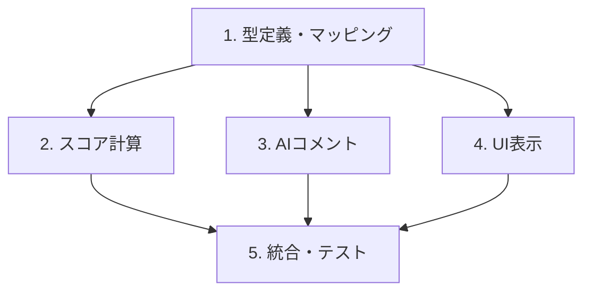

# Implementation Plan

## 概要

Phase 53「制約レベル別評価システム」の実装タスク一覧。
4段階のレベル別評価により、90%充足でも「使えるシフト」として表示できるようにする。

---

## タスク一覧

- [x] 1. 型定義とマッピング設定の追加
- [x] 1.1 制約レベル型の定義
  - 4段階の制約レベル（絶対必須・運営必須・努力目標・推奨）を表す型を定義する
  - 制約違反データに新しいレベルフィールドを追加する
  - 既存のseverityフィールドは後方互換性のため維持する
  - _Requirements: 1.1, 1.2_

- [x] 1.2 レベルマッピング設定の作成
  - 制約タイプからデフォルトレベルへのマッピングを定義する
  - 夜勤後休息不足をレベル1（絶対必須）として設定する
  - 人員不足・資格要件不足をレベル2（運営必須）として設定する
  - 連勤超過・休暇希望無視をレベル3（努力目標）として設定する
  - レベル別の減点設定を定義する（レベル1=即0点、レベル2=12点、レベル3=4点、レベル4=0点）
  - _Requirements: 1.3, 5.1, 5.2, 5.3, 5.4, 5.5, 5.6_

- [x] 1.3 後方互換性ユーティリティの実装
  - 既存データにレベル情報がない場合のデフォルト値適用ロジックを実装する
  - severityからレベルを推定する機能を実装する（error→レベル2、warning→レベル3）
  - 不明な制約タイプに対するフォールバック処理を実装する
  - _Requirements: 6.1_

- [x] 2. スコア計算ロジックの変更
- [x] 2.1 レベル別スコア計算の実装
  - 違反をレベル別にグループ化する機能を実装する
  - レベル1違反がある場合は即座に0点を返す処理を実装する
  - レベル2違反は1件あたり12点減点する計算を実装する
  - レベル3違反は1件あたり4点減点する計算を実装する
  - レベル4違反は減点せず情報記録のみとする
  - スコアを0〜100の範囲に正規化する
  - _Requirements: 2.1, 2.2, 2.3, 2.4, 2.5, 2.6_

- [x] 2.2 スコア計算のユニットテスト
  - レベル1違反がある場合に0点となることをテストする
  - レベル2×3件 + レベル3×15件で期待値4点となることをテストする
  - レベル4のみの場合に100点となることをテストする
  - 11件以上の軽微な違反でも0点にならないことをテストする
  - _Requirements: 2.5, NFR: パフォーマンス_

- [x] 3. AIコメント生成の改善
- [x] 3.1 レベル別コメント生成ロジックの実装
  - レベル1違反がある場合のみ「実現不可能」メッセージを生成する
  - レベル1なし + スコア60点以上で「運用可能です」メッセージを生成する
  - レベル1なし + レベル2が5件以下で「手直しで対応可能」メッセージを生成する
  - レベル2違反が多い場合の警告メッセージを生成する
  - _Requirements: 3.1, 3.2, 3.3_

- [x] 3.2 ポジティブフィードバックの実装
  - 充足率を含むポジティブなサマリーメッセージを生成する
  - レベル別の違反件数を建設的に表示する
  - 各違反に対する改善提案を含める
  - _Requirements: 3.4_

- [x] 4. UI表示の改善
- [x] 4.1 レベル別サマリー表示の実装
  - 違反をレベル別にカウントして表示する機能を実装する
  - レベル1違反がない場合に「必須条件をすべて満たしています」バッジを表示する
  - 「✅必須条件」「⚠️努力目標」「ℹ️推奨」形式のサマリーを表示する
  - _Requirements: 4.3, 4.4_

- [x] 4.2 違反リストの色分け表示
  - レベル1違反を赤色（#DC2626）で表示する
  - レベル2違反をオレンジ色（#EA580C）で表示する
  - レベル3違反を黄色（#CA8A04）で表示する
  - レベル4違反を青色（#2563EB）で表示する
  - _Requirements: 4.1_

- [x] 4.3 違反リストのソート機能
  - 違反をレベル順（重要度高い順）にソートして表示する
  - 各違反アイテムにレベルバッジを表示する
  - 改善提案がある場合はアイコン付きで表示する
  - _Requirements: 4.2_

- [x] 4.4 フロントエンド型定義の同期
  - バックエンドと同じ制約レベル型をフロントエンドに追加する
  - UI設定（色・ラベル）をフロントエンドで利用可能にする
  - 後方互換性ユーティリティをフロントエンドでも利用可能にする
  - _Requirements: 6.2, 6.3_

- [x] 5. 統合とテスト
- [x] 5.1 評価サービスの統合
  - 新しいスコア計算を評価フローに統合する
  - 新しいコメント生成を評価フローに統合する
  - Firestore保存時にseverityとlevel両方を含める
  - _Requirements: 6.2_

- [x] 5.2 統合テストの実装
  - 90%充足 + レベル1なしでスコアが0より大きいことをテストする
  - スコア60点以上でポジティブコメントが生成されることをテストする
  - 「実現不可能」がレベル1違反時のみ使用されることをテストする
  - _Requirements: 2.5, 3.2, 3.3_

- [x] 5.3 本番環境での検証
  - TypeScript型チェックが通ることを確認する
  - デプロイ後にAI生成が正常動作することを確認する
  - 既存の評価データとの互換性を確認する
  - _Requirements: 6.3, NFR: パフォーマンス_

---

## 要件カバレッジ確認

| 要件ID | タスク |
|--------|--------|
| 1.1 | 1.1 |
| 1.2 | 1.1 |
| 1.3 | 1.2 |
| 2.1 | 2.1 |
| 2.2 | 2.1 |
| 2.3 | 2.1 |
| 2.4 | 2.1 |
| 2.5 | 2.1, 2.2, 5.2 |
| 2.6 | 2.1 |
| 3.1 | 3.1 |
| 3.2 | 3.1, 5.2 |
| 3.3 | 3.1, 5.2 |
| 3.4 | 3.2 |
| 4.1 | 4.2 |
| 4.2 | 4.3 |
| 4.3 | 4.1 |
| 4.4 | 4.1 |
| 5.1 | 1.2 |
| 5.2 | 1.2 |
| 5.3 | 1.2 |
| 5.4 | 1.2 |
| 5.5 | 1.2 |
| 5.6 | 1.2 |
| 6.1 | 1.3 |
| 6.2 | 4.4, 5.1 |
| 6.3 | 4.4, 5.3 |

---

## 実装順序と依存関係

1. **タスク1（型定義・マッピング）** が基盤となり、他のすべてのタスクに依存される
2. **タスク2-4** は並行して実装可能（タスク1完了後）
3. **タスク5（統合・テスト）** はタスク2-4の完了を待って実行
