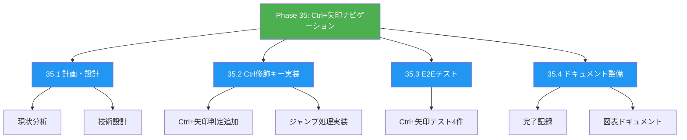
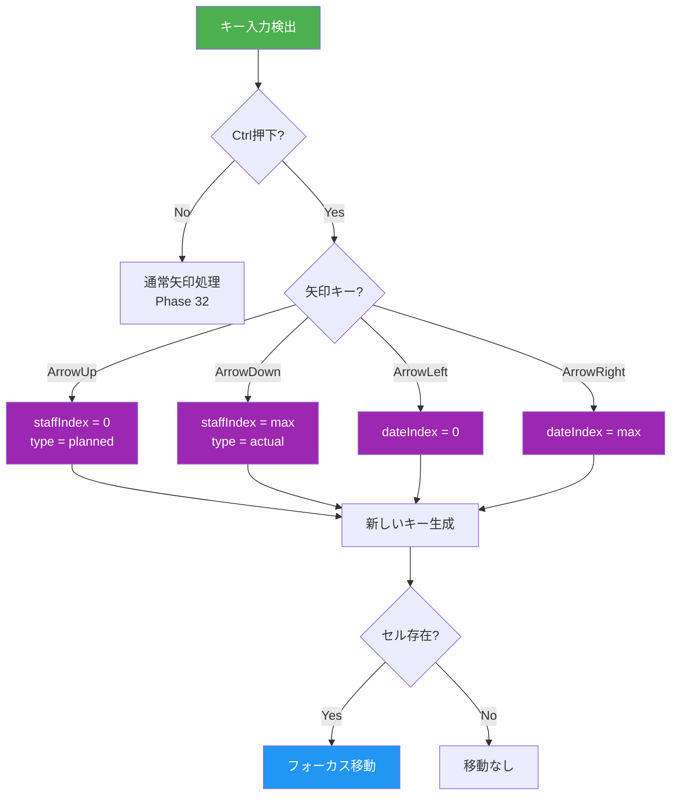
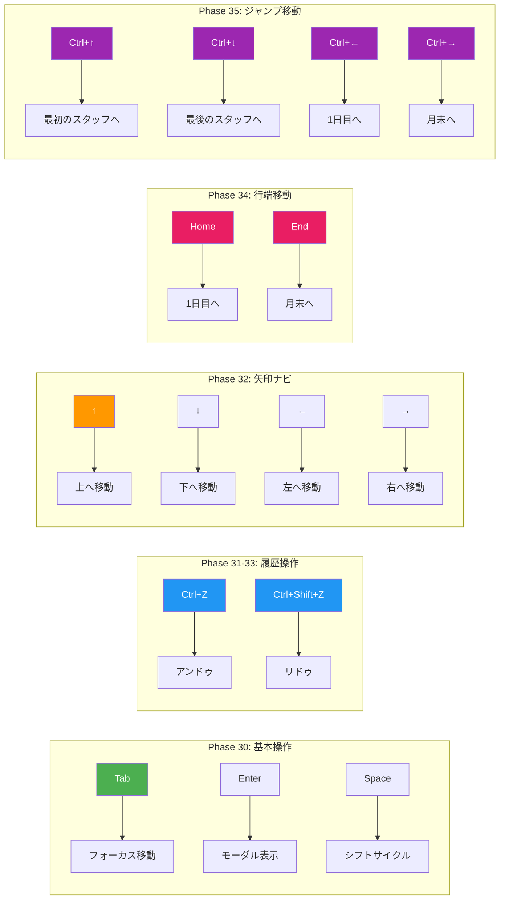
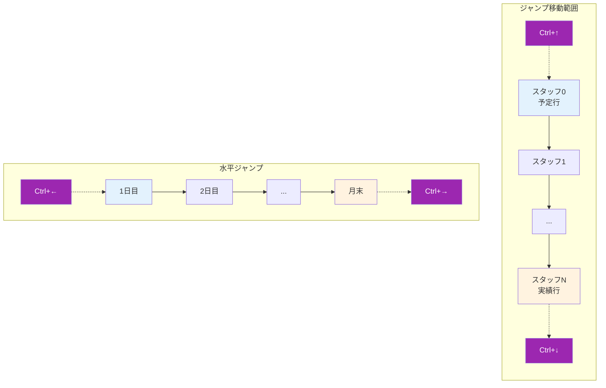
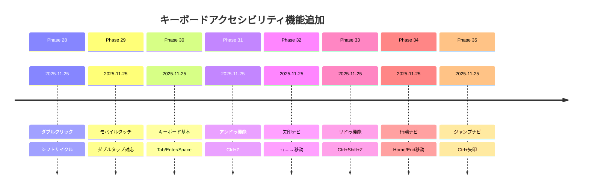
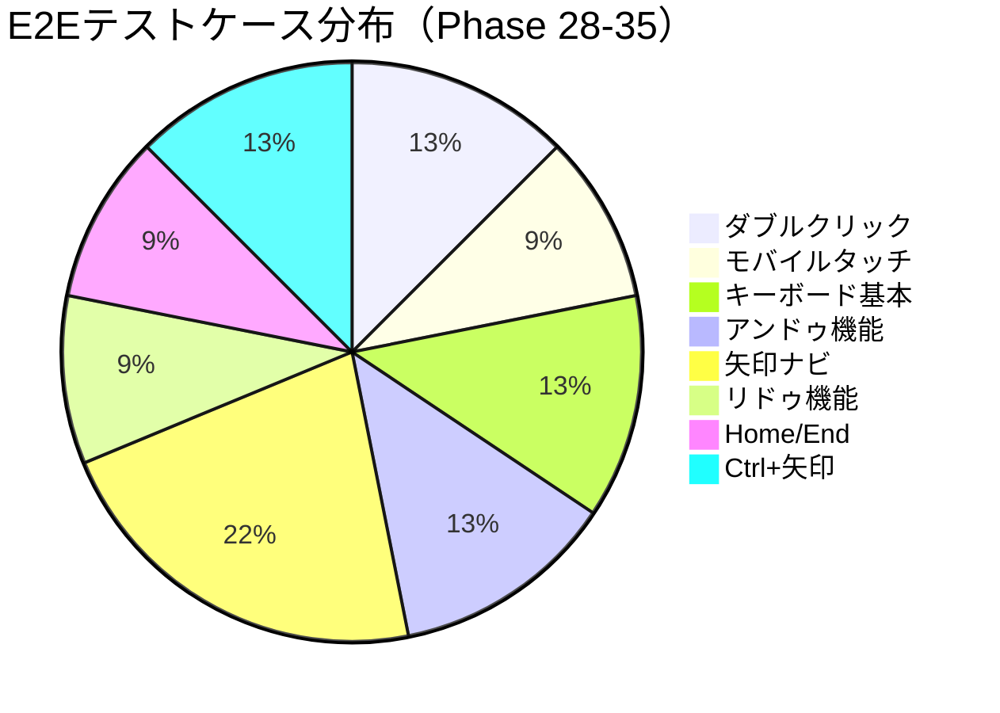
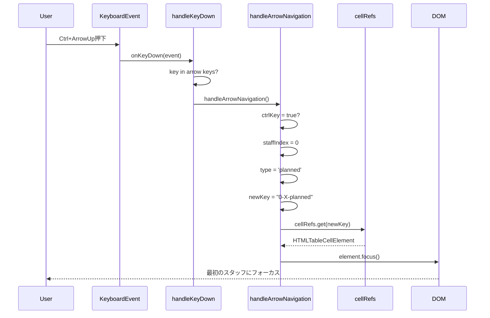

# Phase 35: Ctrl+矢印キーナビゲーション - 図表ドキュメント

**作成日**: 2025-11-25
**仕様ID**: ctrl-arrow-navigation
**Phase**: 35

---

## WBS（作業分解図）

---

## ガントチャート

```mermaid
gantt
    title Phase 35 実装スケジュール
    dateFormat HH:mm
    axisFormat %H:%M

    section 計画・設計
    現状分析           :done, a1, 00:00, 5m
    技術設計           :done, a2, after a1, 5m

    section 実装
    Ctrl修飾キー判定   :done, b1, after a2, 10m
    ジャンプ処理       :done, b2, after b1, 10m

    section E2Eテスト
    Ctrl+矢印テスト4件 :done, c1, after b2, 15m

    section 完了処理
    ドキュメント整備   :done, d1, after c1, 10m
    Git push           :active, d2, after d1, 5m
```

---

## Ctrl+矢印ナビゲーション動作フロー

---

## キーボード操作マトリックス（Phase 28-35）

---

## グリッドナビゲーション全体像

---

## Phase 28-35 キーボードアクセシビリティ進捗

---

## テストカバレッジ

---

## シーケンス図：Ctrl+矢印操作

---

## 関連ドキュメント

- [Phase 35完了記録](./phase35-completion-2025-11-25.md)
- [Phase 35計画](./phase35-plan-2025-11-25.md)
- [Phase 32図表](../arrow-key-navigation/phase32-diagrams-2025-11-25.md)
- [Phase 34図表](../home-end-navigation/phase34-diagrams-2025-11-25.md)
