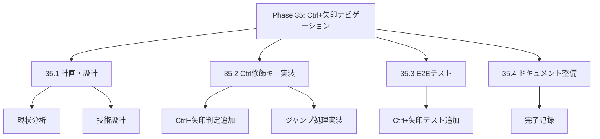

# Phase 35: Ctrl+矢印キーナビゲーション

**作成日**: 2025-11-25
**仕様ID**: ctrl-arrow-navigation
**Phase**: 35
**ステータス**: ✅ 完了

---

## エグゼクティブサマリー

Ctrl+矢印キーでスタッフ単位・日付単位のジャンプ移動ができるようにします。大規模なシフト表での効率的なナビゲーションを実現します。

### 目標

- [x] Ctrl+↑: 最初のスタッフに移動
- [x] Ctrl+↓: 最後のスタッフに移動
- [x] Ctrl+←: 1日目に移動（Homeと同等）
- [x] Ctrl+→: 月末に移動（Endと同等）
- [x] 既存のナビゲーションとの共存

---

## 技術設計

### 1. handleArrowNavigation関数の拡張

**Ctrl修飾キー対応を追加:**

```typescript
const handleArrowNavigation = useCallback((
  e: React.KeyboardEvent,
  staffIndex: number,
  dateIndex: number,
  type: 'planned' | 'actual',
  totalStaff: number,
  totalDates: number
) => {
  let newStaffIndex = staffIndex;
  let newDateIndex = dateIndex;
  let newType = type;

  // Phase 35: Ctrl+矢印でジャンプ移動
  if (e.ctrlKey || e.metaKey) {
    switch (e.key) {
      case 'ArrowUp':
        // 最初のスタッフに移動
        newStaffIndex = 0;
        newType = 'planned';
        break;
      case 'ArrowDown':
        // 最後のスタッフに移動
        newStaffIndex = totalStaff - 1;
        newType = 'actual';
        break;
      case 'ArrowLeft':
        // 1日目に移動（Homeと同等）
        newDateIndex = 0;
        break;
      case 'ArrowRight':
        // 月末に移動（Endと同等）
        newDateIndex = totalDates - 1;
        break;
      default:
        return false;
    }
  } else {
    // 既存の矢印キー処理
    switch (e.key) {
      // ... 既存コード ...
    }
  }

  const newKey = `${newStaffIndex}-${newDateIndex}-${newType}`;
  const targetCell = cellRefs.current.get(newKey);

  if (targetCell) {
    e.preventDefault();
    targetCell.focus();
    return true;
  }
  return false;
}, []);
```

---

## WBS（作業分解図）



---

## ガントチャート

```mermaid
gantt
    title Phase 35 実装スケジュール
    dateFormat HH:mm
    axisFormat %H:%M

    section 計画・設計
    現状分析           :done, a1, 00:00, 5m
    技術設計           :done, a2, after a1, 5m

    section 実装
    Ctrl修飾キー判定   :b1, after a2, 10m
    ジャンプ処理       :b2, after b1, 10m

    section E2Eテスト
    Ctrl+矢印テスト    :c1, after b2, 15m

    section 完了処理
    ドキュメント整備   :d1, after c1, 10m
    Git push           :d2, after d1, 5m
```



---

## 成功基準

- [x] Ctrl+↑で最初のスタッフに移動
- [x] Ctrl+↓で最後のスタッフに移動
- [x] Ctrl+←で1日目に移動
- [x] Ctrl+→で月末に移動
- [x] TypeScriptエラーなし
- [x] E2Eテスト通過

---

## 関連ドキュメント

- [Phase 32完了記録](../arrow-key-navigation/phase32-completion-2025-11-25.md)
- [Phase 34完了記録](../home-end-navigation/phase34-completion-2025-11-25.md)
- [ShiftTable.tsx](../../../components/ShiftTable.tsx)
