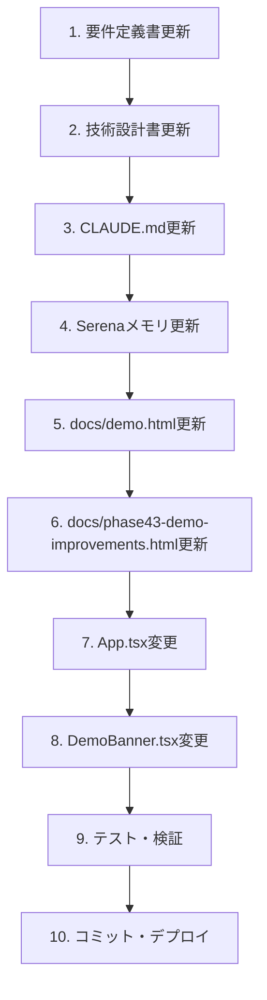

# Phase 43: デモ環境改善・排他制御 - 技術設計

**作成日**: 2025-12-07
**最終更新**: 2025-12-08
**ステータス**: Phase 43.2 設計変更中

---

## Phase 43.2 変更概要

### 変更理由

Phase 43の「デモ環境では保存しない」設計により、以下の問題が発生：

- AI生成したシフトが月次レポートに反映されない
- デモ体験の一貫性が損なわれる（プロの仕事ではない）

### 変更方針

**デモ環境でも本番環境と同様にFirestoreへ保存を許可する**

既に実装済みの排他制御（LockService）により、複数デモユーザーの同時アクセスは適切に処理される。

---

## 1. アーキテクチャ概要（Phase 43.2更新）

```
┌─────────────────────────────────────────────────────────────────────┐
│                           フロントエンド                              │
├─────────────────────────────────────────────────────────────────────┤
│                                                                     │
│  ┌─────────────────┐    ┌─────────────────┐    ┌────────────────┐  │
│  │  AuthContext    │    │  LockService    │    │  DemoBanner    │  │
│  │  + isDemoUser   │    │  + acquireLock  │    │  (表示のみ)    │  │
│  │  + isDemoFacility│   │  + releaseLock  │    └────────────────┘  │
│  └────────┬────────┘    │  + checkLock    │                        │
│           │             └────────┬────────┘                        │
│           ▼                      │                                 │
│  ┌─────────────────────────────────────────────────────────────┐   │
│  │                         App.tsx                              │   │
│  │  Phase 43.2: デモ環境でも本番同様に保存                        │   │
│  │  - AI生成時: ロック取得 → 生成 → 保存（デモ/本番共通）          │   │
│  │  - 保存時: ロック取得 → 保存（デモ/本番共通）                   │   │
│  └─────────────────────────────────────────────────────────────┘   │
│                                                                     │
└─────────────────────────────────────────────────────────────────────┘
                                    │
                                    ▼
┌─────────────────────────────────────────────────────────────────────┐
│                           Firestore                                  │
├─────────────────────────────────────────────────────────────────────┤
│                                                                     │
│  /facilities/demo-facility-001/schedules/{yearMonth}  ← 保存される  │
│  /facilities/demo-facility-001/locks/{yearMonth}      ← 排他制御    │
│                                                                     │
└─────────────────────────────────────────────────────────────────────┘
```

---

## 2. Phase 43.2での変更点

### 2.1 App.tsx の変更

#### 削除するコード

```typescript
// 削除: デモ環境での保存スキップ
if (isDemoEnvironment) {
  showSuccess('シフトを生成しました（デモ環境のため保存されません）');
  return;
}

// 削除: 保存時のデモ環境チェック
if (isDemoEnvironment) {
  showInfo('デモ環境では保存されません。本番環境でお試しください。');
  return;
}

// 削除: 確定時のデモ環境チェック
if (isDemoEnvironment) {
  showInfo('デモ環境では確定できません。本番環境でお試しください。');
  return;
}
```

#### 変更後のAI生成フロー

```typescript
const handleGenerateShift = async () => {
  if (!selectedFacilityId || !currentUser) {
    showError('施設またはユーザー情報が取得できません');
    return;
  }

  // 1. ロック取得（デモ/本番共通）
  const lockResult = await LockService.acquireLock(
    selectedFacilityId,
    requirements.targetMonth,
    currentUser.uid,
    'ai-generation'
  );

  if (!lockResult.success) {
    setCurrentLockInfo(lockResult.existingLock ?? null);
    setLockModalOpen(true);
    return;
  }

  setGeneratingSchedule(true);

  try {
    // 2. AI生成実行
    const generationResult = await generateShiftSchedule(
      staffList,
      requirements,
      leaveRequests
    );

    // 3. 結果を画面に表示
    setSchedule(generationResult.schedule);
    setEvaluation(generationResult.evaluation);

    // 4. Firestoreに保存（デモ/本番共通）
    if (currentScheduleId) {
      await ScheduleService.updateSchedule(/* ... */);
    } else {
      await ScheduleService.saveSchedule(/* ... */);
    }

    showSuccess('シフトを生成しました');
  } catch (error) {
    showError('シフト生成に失敗しました');
  } finally {
    // 5. ロック解放
    await LockService.releaseLock(
      selectedFacilityId,
      requirements.targetMonth,
      currentUser.uid
    );
    setGeneratingSchedule(false);
  }
};
```

### 2.2 DemoBanner.tsx の変更

#### 変更前

```typescript
export function DemoBanner({ className = '' }: DemoBannerProps) {
  return (
    <div className={`...`}>
      <span className="font-medium">🧪 デモ環境</span>
      <span className="ml-2 text-sm">
        操作を体験できますが、変更は保存されません
      </span>
    </div>
  );
}
```

#### 変更後

```typescript
export function DemoBanner({ className = '' }: DemoBannerProps) {
  return (
    <div className={`...`}>
      <span className="font-medium">🧪 デモ環境</span>
      <span className="ml-2 text-sm">
        サンプル施設でシステムを体験中です
      </span>
    </div>
  );
}
```

### 2.3 AuthContext.tsx の確認（変更不要）

`isDemoEnvironment`フラグは引き続きバナー表示に使用するため、削除しない。

```typescript
// 変更なし: デモ環境判定は維持
const isDemoEnvironment = isDemoUser;

// コンテキストで公開
value={{
  isDemoUser,
  isDemoFacility,
  isDemoEnvironment, // バナー表示用に維持
}}
```

---

## 3. 既存実装（変更なし）

以下のコンポーネントは既に実装済みで、変更不要：

### 3.1 LockService

排他制御は既に実装済み。デモ環境でも本番環境と同様に機能する。

### 3.2 LockStatusModal

ロック競合時のモーダル表示は既に実装済み。

### 3.3 Firestore Rules

デモユーザーによるデモ施設への書き込みは既に許可されている。

---

## 4. 実装順序（Phase 43.2）



---

## 5. テスト計画（Phase 43.2）

### 5.1 手動テスト

| # | テスト項目 | 期待結果 |
|---|-----------|----------|
| 1 | デモログイン → AI生成 | シフトが生成・保存される |
| 2 | デモログイン → 保存ボタン | シフトが保存される |
| 3 | デモログイン → 確定ボタン | シフトが確定される |
| 4 | デモログイン → レポート | 保存したシフトが集計表示される |
| 5 | 複数タブで同時AI生成 | 排他制御モーダル表示 |

### 5.2 E2Eテスト更新

既存のデモ環境テストを更新：
- 「保存されません」メッセージのアサーションを削除
- 実際に保存されることを確認するアサーションに変更

---

## 変更履歴

| 日付 | 変更者 | 内容 |
|------|--------|------|
| 2025-12-07 | Claude | 初版作成 |
| 2025-12-08 | Claude | Phase 43.2: デモ環境での保存許可に方針変更 |
