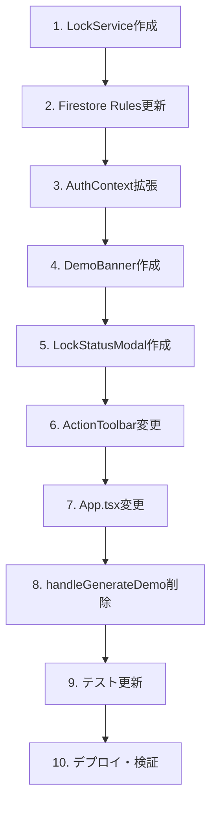

# Phase 43: デモ環境改善・排他制御 - 技術設計

**作成日**: 2025-12-07
**ステータス**: 設計中

---

## 1. アーキテクチャ概要

```
┌─────────────────────────────────────────────────────────────────────┐
│                           フロントエンド                              │
├─────────────────────────────────────────────────────────────────────┤
│                                                                     │
│  ┌─────────────────┐    ┌─────────────────┐    ┌────────────────┐  │
│  │  AuthContext    │    │  LockService    │    │  DemoBanner    │  │
│  │  + isDemoUser   │    │  + acquireLock  │    │  (新規)        │  │
│  │  + isDemoFacility│   │  + releaseLock  │    └────────────────┘  │
│  └────────┬────────┘    │  + checkLock    │                        │
│           │             └────────┬────────┘                        │
│           ▼                      │                                 │
│  ┌─────────────────────────────────────────────────────────────┐   │
│  │                         App.tsx                              │   │
│  │  - AI生成時: ロック取得 → 生成 → デモなら保存スキップ           │   │
│  │  - 保存時: デモなら警告表示、本番ならロック取得→保存           │   │
│  └─────────────────────────────────────────────────────────────┘   │
│                                                                     │
└─────────────────────────────────────────────────────────────────────┘
                                    │
                                    ▼
┌─────────────────────────────────────────────────────────────────────┐
│                           Firestore                                  │
├─────────────────────────────────────────────────────────────────────┤
│                                                                     │
│  /facilities/{facilityId}/locks/{yearMonth}                         │
│  {                                                                  │
│    lockedBy: "user-id",                                             │
│    lockedAt: Timestamp,                                             │
│    operation: "ai-generation" | "saving",                           │
│    expiresAt: Timestamp                                             │
│  }                                                                  │
│                                                                     │
└─────────────────────────────────────────────────────────────────────┘
```

---

## 2. コンポーネント設計

### 2.1 AuthContext 拡張

```typescript
// src/contexts/AuthContext.tsx

interface AuthContextType {
  // 既存
  currentUser: User | null;
  userProfile: UserProfile | null;
  // ...

  // 新規追加
  isDemoUser: boolean;      // デモユーザーかどうか
  isDemoFacility: boolean;  // デモ施設を選択中かどうか
}

// 判定ロジック
const isDemoUser = useMemo(() => {
  return userProfile?.provider === 'demo' ||
         currentUser?.uid === 'demo-user-fixed-uid';
}, [userProfile, currentUser]);

const isDemoFacility = useMemo(() => {
  return selectedFacilityId === 'demo-facility-001';
}, [selectedFacilityId]);
```

### 2.2 LockService（新規）

```typescript
// src/services/lockService.ts

import {
  doc, getDoc, setDoc, deleteDoc,
  Timestamp, runTransaction
} from 'firebase/firestore';
import { db } from '../firebase';

export type LockOperation = 'ai-generation' | 'saving';

export interface LockInfo {
  lockedBy: string;
  lockedAt: Timestamp;
  operation: LockOperation;
  expiresAt: Timestamp;
}

export interface LockResult {
  success: boolean;
  error?: string;
  existingLock?: LockInfo;
}

const LOCK_TIMEOUTS: Record<LockOperation, number> = {
  'ai-generation': 5 * 60 * 1000,  // 5分
  'saving': 30 * 1000,              // 30秒
};

export class LockService {
  /**
   * ロックを取得する
   */
  static async acquireLock(
    facilityId: string,
    yearMonth: string,
    userId: string,
    operation: LockOperation
  ): Promise<LockResult> {
    const lockRef = doc(db, 'facilities', facilityId, 'locks', yearMonth);

    try {
      return await runTransaction(db, async (transaction) => {
        const lockDoc = await transaction.get(lockRef);
        const now = Timestamp.now();

        if (lockDoc.exists()) {
          const existingLock = lockDoc.data() as LockInfo;

          // 自分のロックなら更新
          if (existingLock.lockedBy === userId) {
            const newLock: LockInfo = {
              lockedBy: userId,
              lockedAt: now,
              operation,
              expiresAt: Timestamp.fromMillis(
                now.toMillis() + LOCK_TIMEOUTS[operation]
              ),
            };
            transaction.set(lockRef, newLock);
            return { success: true };
          }

          // 期限切れなら上書き
          if (existingLock.expiresAt.toMillis() < now.toMillis()) {
            const newLock: LockInfo = {
              lockedBy: userId,
              lockedAt: now,
              operation,
              expiresAt: Timestamp.fromMillis(
                now.toMillis() + LOCK_TIMEOUTS[operation]
              ),
            };
            transaction.set(lockRef, newLock);
            return { success: true };
          }

          // 他のユーザーがロック中
          return {
            success: false,
            error: '他のユーザーが操作中です',
            existingLock,
          };
        }

        // ロックなし → 新規取得
        const newLock: LockInfo = {
          lockedBy: userId,
          lockedAt: now,
          operation,
          expiresAt: Timestamp.fromMillis(
            now.toMillis() + LOCK_TIMEOUTS[operation]
          ),
        };
        transaction.set(lockRef, newLock);
        return { success: true };
      });
    } catch (error) {
      console.error('Lock acquisition failed:', error);
      return {
        success: false,
        error: 'ロック取得に失敗しました',
      };
    }
  }

  /**
   * ロックを解放する
   */
  static async releaseLock(
    facilityId: string,
    yearMonth: string,
    userId: string
  ): Promise<boolean> {
    const lockRef = doc(db, 'facilities', facilityId, 'locks', yearMonth);

    try {
      const lockDoc = await getDoc(lockRef);
      if (!lockDoc.exists()) return true;

      const lock = lockDoc.data() as LockInfo;
      if (lock.lockedBy !== userId) {
        console.warn('Cannot release lock owned by another user');
        return false;
      }

      await deleteDoc(lockRef);
      return true;
    } catch (error) {
      console.error('Lock release failed:', error);
      return false;
    }
  }

  /**
   * ロック状態を確認する
   */
  static async checkLock(
    facilityId: string,
    yearMonth: string
  ): Promise<LockInfo | null> {
    const lockRef = doc(db, 'facilities', facilityId, 'locks', yearMonth);

    try {
      const lockDoc = await getDoc(lockRef);
      if (!lockDoc.exists()) return null;

      const lock = lockDoc.data() as LockInfo;
      const now = Timestamp.now();

      // 期限切れなら無効
      if (lock.expiresAt.toMillis() < now.toMillis()) {
        return null;
      }

      return lock;
    } catch (error) {
      console.error('Lock check failed:', error);
      return null;
    }
  }
}
```

### 2.3 DemoBanner（新規）

```typescript
// src/components/DemoBanner.tsx

import React from 'react';

interface DemoBannerProps {
  className?: string;
}

export function DemoBanner({ className = '' }: DemoBannerProps) {
  return (
    <div
      className={`
        bg-amber-100 border-b border-amber-300
        px-4 py-2 text-center text-amber-800
        ${className}
      `}
    >
      <span className="font-medium">🎭 デモ環境</span>
      <span className="ml-2 text-sm">
        操作を体験できますが、変更は保存されません
      </span>
    </div>
  );
}
```

### 2.4 LockStatusModal（新規）

```typescript
// src/components/LockStatusModal.tsx

import React from 'react';
import { LockInfo } from '../services/lockService';

interface LockStatusModalProps {
  isOpen: boolean;
  lockInfo: LockInfo | null;
  onClose: () => void;
  onWait?: () => void;
}

export function LockStatusModal({
  isOpen,
  lockInfo,
  onClose,
  onWait
}: LockStatusModalProps) {
  if (!isOpen || !lockInfo) return null;

  const remainingSeconds = Math.max(
    0,
    Math.ceil((lockInfo.expiresAt.toMillis() - Date.now()) / 1000)
  );

  const remainingMinutes = Math.ceil(remainingSeconds / 60);

  const operationLabel =
    lockInfo.operation === 'ai-generation'
      ? 'AI生成'
      : '保存処理';

  return (
    <div className="fixed inset-0 bg-black bg-opacity-50 flex items-center justify-center z-50">
      <div className="bg-white rounded-lg p-6 max-w-md w-full mx-4">
        <h3 className="text-lg font-bold text-slate-900 mb-4">
          🔒 他のユーザーが操作中です
        </h3>
        <p className="text-slate-600 mb-4">
          現在、別のユーザーが{operationLabel}を実行中です。
          <br />
          約{remainingMinutes}分後に操作可能になります。
        </p>
        <div className="flex gap-3 justify-end">
          <button
            onClick={onClose}
            className="px-4 py-2 text-slate-600 hover:bg-slate-100 rounded"
          >
            キャンセル
          </button>
          {onWait && (
            <button
              onClick={onWait}
              className="px-4 py-2 bg-indigo-600 text-white rounded hover:bg-indigo-700"
            >
              待機する
            </button>
          )}
        </div>
      </div>
    </div>
  );
}
```

### 2.5 ActionToolbar 変更

```typescript
// src/components/ActionToolbar.tsx

// 変更前
interface ActionToolbarProps {
  onDemoClick: () => void;  // 削除
  onSaveClick: () => void;
  // ...
}

// 変更後
interface ActionToolbarProps {
  // onDemoClick 削除
  onSaveClick: () => void;
  onConfirmClick: () => void;
  onHistoryClick: () => void;
  onExportClick: () => void;
  isLoading: boolean;
  canSave: boolean;
  canConfirm: boolean;
  canShowHistory: boolean;
  className?: string;
}

export function ActionToolbar({
  onSaveClick,
  onConfirmClick,
  onHistoryClick,
  onExportClick,
  isLoading,
  canSave,
  canConfirm,
  canShowHistory,
  className = '',
}: ActionToolbarProps) {
  return (
    <div className={`flex items-center gap-4 ${className}`}>
      {/* 編集グループ - デモボタン削除 */}
      <ButtonGroup>
        <Button
          variant="secondary"
          size="md"
          icon={<SaveIcon />}
          onClick={onSaveClick}
          disabled={isLoading || !canSave}
          data-testid="save-draft-button"
        >
          保存
        </Button>
        <Button
          variant="success"
          size="md"
          icon={<CheckIcon />}
          onClick={onConfirmClick}
          disabled={isLoading || !canConfirm}
          data-testid="confirm-button"
        >
          確定
        </Button>
      </ButtonGroup>

      {/* ユーティリティグループ */}
      <ButtonGroup separated>
        <Button
          variant="ghost"
          size="md"
          icon={<ClockIcon />}
          onClick={onHistoryClick}
          disabled={!canShowHistory}
          data-testid="version-history-button"
        >
          履歴
        </Button>
        <Button
          variant="outline"
          size="md"
          icon={<DownloadIcon />}
          onClick={onExportClick}
          data-testid="csv-export-button"
        >
          CSV
        </Button>
      </ButtonGroup>
    </div>
  );
}
```

---

## 3. App.tsx 変更

### 3.1 デモ環境判定とUI

```typescript
// App.tsx

import { DemoBanner } from './src/components/DemoBanner';
import { LockStatusModal } from './src/components/LockStatusModal';
import { LockService, LockInfo } from './src/services/lockService';

function App() {
  const { isDemoUser, isDemoFacility } = useAuth();

  // デモ環境かどうか
  const isDemoEnvironment = isDemoUser || isDemoFacility;

  // ロック状態
  const [lockModalOpen, setLockModalOpen] = useState(false);
  const [currentLockInfo, setCurrentLockInfo] = useState<LockInfo | null>(null);

  // ...

  return (
    <div className="min-h-screen">
      {/* デモ環境バナー */}
      {isDemoEnvironment && <DemoBanner />}

      {/* ロック状態モーダル */}
      <LockStatusModal
        isOpen={lockModalOpen}
        lockInfo={currentLockInfo}
        onClose={() => setLockModalOpen(false)}
      />

      {/* 既存のUI */}
      {/* ... */}
    </div>
  );
}
```

### 3.2 AI生成フローの変更

```typescript
// App.tsx - AI生成ハンドラー（既存のhandleGenerateClick相当）

const handleGenerateShift = async () => {
  if (!selectedFacilityId || !currentUser) {
    showError('施設またはユーザー情報が取得できません');
    return;
  }

  // 1. ロック取得（デモ環境でも取得 - 他のデモユーザーとの競合防止）
  const lockResult = await LockService.acquireLock(
    selectedFacilityId,
    requirements.targetMonth,
    currentUser.uid,
    'ai-generation'
  );

  if (!lockResult.success) {
    setCurrentLockInfo(lockResult.existingLock ?? null);
    setLockModalOpen(true);
    return;
  }

  setGeneratingSchedule(true);

  try {
    // 2. AI生成実行
    const generationResult = await generateShiftSchedule(
      staffList,
      requirements,
      leaveRequests
    );

    // 3. 結果を画面に表示
    setSchedule(generationResult.schedule);
    setEvaluation(generationResult.evaluation);

    // 4. デモ環境では保存スキップ
    if (isDemoEnvironment) {
      showSuccess('シフトを生成しました（デモ環境のため保存されません）');
      return;
    }

    // 5. 本番環境では保存
    if (currentScheduleId) {
      await ScheduleService.updateSchedule(
        selectedFacilityId,
        currentScheduleId,
        currentUser.uid,
        {
          staffSchedules: generationResult.schedule,
          status: 'draft',
        }
      );
    } else {
      await ScheduleService.saveSchedule(
        selectedFacilityId,
        currentUser.uid,
        {
          targetMonth: requirements.targetMonth,
          staffSchedules: generationResult.schedule,
          version: 1,
          status: 'draft',
        }
      );
    }

    showSuccess('シフトを生成し、保存しました');
  } catch (error) {
    showError('シフト生成に失敗しました');
  } finally {
    // 6. ロック解放
    await LockService.releaseLock(
      selectedFacilityId,
      requirements.targetMonth,
      currentUser.uid
    );
    setGeneratingSchedule(false);
  }
};
```

### 3.3 保存フローの変更

```typescript
// App.tsx - 保存ハンドラー

const handleSaveDraft = async () => {
  // デモ環境では保存しない
  if (isDemoEnvironment) {
    showInfo('デモ環境では保存されません。本番環境でお試しください。');
    return;
  }

  // 以下、既存の保存ロジック（ロック取得を追加）
  const lockResult = await LockService.acquireLock(
    selectedFacilityId,
    requirements.targetMonth,
    currentUser.uid,
    'saving'
  );

  if (!lockResult.success) {
    setCurrentLockInfo(lockResult.existingLock ?? null);
    setLockModalOpen(true);
    return;
  }

  try {
    // 保存処理
    await ScheduleService.updateSchedule(/* ... */);
    showSuccess('下書きを保存しました');
  } finally {
    await LockService.releaseLock(/* ... */);
  }
};

const handleConfirmSchedule = async () => {
  // デモ環境では確定しない
  if (isDemoEnvironment) {
    showInfo('デモ環境では確定できません。本番環境でお試しください。');
    return;
  }

  // 以下、既存の確定ロジック
  // ...
};
```

---

## 4. Firestore Rules 変更

```javascript
// firestore.rules

// locks subcollection
match /facilities/{facilityId}/locks/{lockId} {
  // 認証済みユーザーが読み取り可能
  allow read: if isAuthenticated();

  // 認証済みユーザーが作成・更新可能（自分のロックのみ）
  allow create: if isAuthenticated()
    && request.resource.data.lockedBy == request.auth.uid;

  allow update: if isAuthenticated()
    && (
      // 自分のロックを更新
      resource.data.lockedBy == request.auth.uid
      // または期限切れのロックを上書き
      || resource.data.expiresAt < request.time
    )
    && request.resource.data.lockedBy == request.auth.uid;

  // 自分のロックのみ削除可能
  allow delete: if isAuthenticated()
    && resource.data.lockedBy == request.auth.uid;
}
```

---

## 5. 削除対象

### 5.1 削除するコード

| ファイル | 削除対象 |
|----------|----------|
| `App.tsx` | `handleGenerateDemo`関数（約80行） |
| `src/components/ActionToolbar.tsx` | `onDemoClick` prop、デモボタン |

### 5.2 削除するテスト

| ファイル | 削除対象 |
|----------|----------|
| `e2e/tests/*.spec.ts` | `demo-shift-button`関連のテスト |

---

## 6. 実装順序



---

## 7. テスト計画

### 7.1 ユニットテスト

```typescript
// src/services/lockService.test.ts

describe('LockService', () => {
  describe('acquireLock', () => {
    it('should acquire lock when no lock exists', async () => {});
    it('should fail when another user holds the lock', async () => {});
    it('should succeed when lock is expired', async () => {});
    it('should update lock when same user re-acquires', async () => {});
  });

  describe('releaseLock', () => {
    it('should release own lock', async () => {});
    it('should fail to release another user lock', async () => {});
  });
});
```

### 7.2 E2Eテスト

```typescript
// e2e/tests/demo-environment.spec.ts

describe('Demo Environment', () => {
  it('should show demo banner when logged in as demo user', async () => {});
  it('should allow AI generation in demo environment', async () => {});
  it('should show message when trying to save in demo', async () => {});
  it('should not persist changes to Firestore', async () => {});
});
```

---

## 変更履歴

| 日付 | 変更者 | 内容 |
|------|--------|------|
| 2025-12-07 | Claude | 初版作成 |
