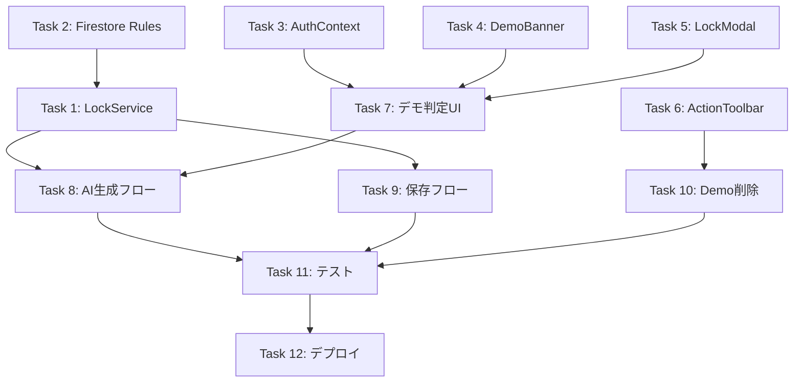

# Phase 43: デモ環境改善・排他制御 - タスク一覧

**作成日**: 2025-12-07
**ステータス**: 未着手

---

## タスク概要

| Task | 内容 | 工数目安 | 状態 |
|------|------|----------|------|
| Task 1 | LockService作成 | 1.5h | 未着手 |
| Task 2 | Firestore Rules更新 | 0.5h | 未着手 |
| Task 3 | AuthContext拡張 | 0.5h | 未着手 |
| Task 4 | DemoBanner作成 | 0.5h | 未着手 |
| Task 5 | LockStatusModal作成 | 1h | 未着手 |
| Task 6 | ActionToolbar変更 | 0.5h | 未着手 |
| Task 7 | App.tsx変更（デモ判定・UI） | 1h | 未着手 |
| Task 8 | App.tsx変更（AI生成フロー） | 1.5h | 未着手 |
| Task 9 | App.tsx変更（保存フロー） | 1h | 未着手 |
| Task 10 | handleGenerateDemo削除 | 0.5h | 未着手 |
| Task 11 | テスト更新 | 2h | 未着手 |
| Task 12 | デプロイ・検証 | 1h | 未着手 |

**合計工数**: 約11.5h（約1.5日）

---

## Task 1: LockService作成

**目的**: 排他制御のためのロック管理サービスを実装

### 作業内容

1. `src/services/lockService.ts` を新規作成
2. 以下の機能を実装:
   - `acquireLock()`: ロック取得（トランザクション使用）
   - `releaseLock()`: ロック解放
   - `checkLock()`: ロック状態確認
3. タイムアウト設定:
   - AI生成: 5分
   - 保存: 30秒

### 完了条件

- [ ] ロック取得・解放が正常に動作
- [ ] 他ユーザーのロック中は取得失敗
- [ ] 期限切れロックは上書き可能
- [ ] ユニットテスト作成

---

## Task 2: Firestore Rules更新

**目的**: locksサブコレクションのセキュリティルールを追加

### 作業内容

1. `firestore.rules` を更新
2. `/facilities/{facilityId}/locks/{lockId}` のルールを追加

### 完了条件

- [ ] 認証済みユーザーが読み取り可能
- [ ] 自分のロックのみ作成・更新・削除可能
- [ ] 期限切れロックは上書き可能
- [ ] `npm run deploy:rules` でデプロイ成功

---

## Task 3: AuthContext拡張

**目的**: デモユーザー・デモ施設の判定機能を追加

### 作業内容

1. `src/contexts/AuthContext.tsx` を更新
2. 以下を追加:
   - `isDemoUser`: デモユーザーかどうか
   - `isDemoFacility`: デモ施設を選択中かどうか

### 完了条件

- [ ] `provider === 'demo'` で判定
- [ ] `uid === 'demo-user-fixed-uid'` で判定
- [ ] `facilityId === 'demo-facility-001'` で判定
- [ ] 型定義が正しい

---

## Task 4: DemoBanner作成

**目的**: デモ環境であることを明示するバナーコンポーネント

### 作業内容

1. `src/components/DemoBanner.tsx` を新規作成
2. 画面上部に表示するバナー
3. 「🎭 デモ環境 - 操作を体験できますが、変更は保存されません」

### 完了条件

- [ ] 視認性の高いデザイン（amber系の背景色）
- [ ] レスポンシブ対応
- [ ] アクセシビリティ考慮

---

## Task 5: LockStatusModal作成

**目的**: ロック競合時に表示するモーダルコンポーネント

### 作業内容

1. `src/components/LockStatusModal.tsx` を新規作成
2. 以下を表示:
   - 「他のユーザーが操作中です」メッセージ
   - 残り時間の目安
   - キャンセル/待機ボタン

### 完了条件

- [ ] モーダルが正しく表示される
- [ ] 残り時間が正しく計算される
- [ ] キャンセルでモーダルが閉じる
- [ ] アクセシビリティ考慮（フォーカストラップ等）

---

## Task 6: ActionToolbar変更

**目的**: 「デモ」ボタンを削除

### 作業内容

1. `src/components/ActionToolbar.tsx` を更新
2. 以下を削除:
   - `onDemoClick` prop
   - 「デモ」ボタン
   - `SparklesIcon`（他で使用していなければ）

### 完了条件

- [ ] デモボタンが表示されない
- [ ] 他のボタンは正常に動作
- [ ] TypeScriptエラーなし

---

## Task 7: App.tsx変更（デモ判定・UI）

**目的**: デモ環境のUI表示を実装

### 作業内容

1. `App.tsx` を更新
2. 以下を追加:
   - `DemoBanner` のインポートと表示
   - `LockStatusModal` のインポートと表示
   - `isDemoEnvironment` 判定ロジック

### 完了条件

- [ ] デモ環境でバナーが表示される
- [ ] 本番環境ではバナー非表示
- [ ] ロック競合時にモーダルが表示される

---

## Task 8: App.tsx変更（AI生成フロー）

**目的**: AI生成時の排他制御とデモ環境対応

### 作業内容

1. AI生成ハンドラーを更新
2. 以下のフローを実装:
   - ロック取得
   - AI生成実行
   - デモ環境なら保存スキップ
   - ロック解放

### 完了条件

- [ ] ロック取得失敗時にモーダル表示
- [ ] デモ環境で「保存されません」メッセージ表示
- [ ] 本番環境で正常に保存
- [ ] 必ずロック解放される（finally）

---

## Task 9: App.tsx変更（保存フロー）

**目的**: 保存・確定時のデモ環境対応

### 作業内容

1. `handleSaveDraft` を更新
2. `handleConfirmSchedule` を更新
3. デモ環境では処理をスキップしメッセージ表示

### 完了条件

- [ ] デモ環境で保存ボタン押下時にメッセージ表示
- [ ] デモ環境で確定ボタン押下時にメッセージ表示
- [ ] 本番環境では正常に動作

---

## Task 10: handleGenerateDemo削除

**目的**: 不要なデモシフト生成機能を削除

### 作業内容

1. `App.tsx` から `handleGenerateDemo` 関数を削除
2. 関連する state/変数があれば削除
3. ActionToolbar の `onDemoClick` props 削除

### 完了条件

- [ ] `handleGenerateDemo` が存在しない
- [ ] TypeScriptエラーなし
- [ ] ビルド成功

---

## Task 11: テスト更新

**目的**: テストコードを新しい仕様に合わせて更新

### 作業内容

1. `demo-shift-button` 関連のE2Eテストを削除/更新
2. デモ環境のテストを追加
3. ロック機能のユニットテストを追加

### 完了条件

- [ ] 全テストがパス
- [ ] デモ環境のテストカバレッジ
- [ ] ロック機能のテストカバレッジ

---

## Task 12: デプロイ・検証

**目的**: 本番環境にデプロイし動作確認

### 作業内容

1. CodeRabbitレビュー
2. GitHub Actionsでデプロイ
3. 本番環境で動作確認:
   - デモログイン→バナー表示
   - AI生成→保存されないことを確認
   - 本番ログイン→正常に動作

### 完了条件

- [ ] デプロイ成功
- [ ] デモ環境で期待通りの動作
- [ ] 本番環境で回帰なし
- [ ] ドキュメント更新

---

## 依存関係

---

## 変更履歴

| 日付 | 変更者 | 内容 |
|------|--------|------|
| 2025-12-07 | Claude | 初版作成 |
