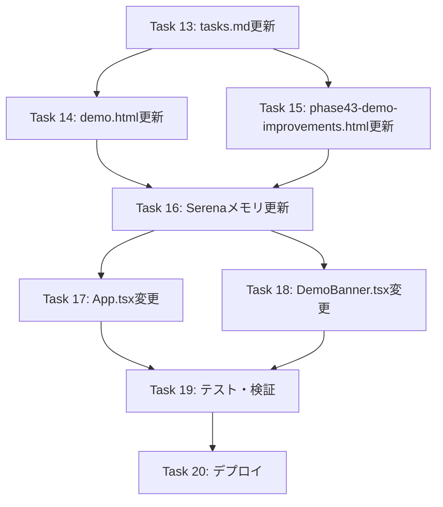

# Phase 43: デモ環境改善・排他制御 - タスク一覧

**作成日**: 2025-12-07
**最終更新**: 2025-12-08
**ステータス**: Phase 43.2 タスク追加

---

## Phase 43 タスク概要（完了済み）

| Task | 内容 | 状態 |
|------|------|------|
| Task 1 | LockService作成 | ✅ 完了 |
| Task 2 | Firestore Rules更新 | ✅ 完了 |
| Task 3 | AuthContext拡張 | ✅ 完了 |
| Task 4 | DemoBanner作成 | ✅ 完了 |
| Task 5 | LockStatusModal作成 | ✅ 完了 |
| Task 6 | ActionToolbar変更（デモボタン削除） | ✅ 完了 |
| Task 7 | App.tsx変更（デモ判定・UI） | ✅ 完了 |
| Task 8 | App.tsx変更（AI生成フロー・保存スキップ） | ✅ 完了 |
| Task 9 | App.tsx変更（保存フロー・保存スキップ） | ✅ 完了 |
| Task 10 | handleGenerateDemo削除 | ✅ 完了 |
| Task 11 | テスト更新 | ✅ 完了 |
| Task 12 | デプロイ・検証 | ✅ 完了 |

---

## Phase 43.2 タスク概要（設計変更）

**背景**: Phase 43実装後、以下の問題が発覚

- AI生成したシフトが月次レポートに反映されない
- デモ体験の一貫性が損なわれる

**方針変更**: デモ環境でも本番環境と同様にFirestoreへ保存を許可する

| Task | 内容 | 工数目安 | 状態 |
|------|------|----------|------|
| Task 13 | ドキュメント更新（tasks.md） | 0.5h | 🔄 進行中 |
| Task 14 | ドキュメント更新（docs/demo.html） | 0.5h | 未着手 |
| Task 15 | ドキュメント更新（docs/phase43-demo-improvements.html） | 0.5h | 未着手 |
| Task 16 | Serenaメモリ更新 | 0.25h | 未着手 |
| Task 17 | App.tsx変更（保存スキップ削除） | 0.5h | 未着手 |
| Task 18 | DemoBanner.tsx変更（メッセージ変更） | 0.25h | 未着手 |
| Task 19 | テスト・検証 | 0.5h | 未着手 |
| Task 20 | デプロイ・最終確認 | 0.5h | 未着手 |

**合計工数**: 約3.5h

---

## Task 13: ドキュメント更新（tasks.md）

**目的**: Phase 43.2のタスク一覧を明確化

### 作業内容

1. Phase 43タスクを「完了済み」としてマーク
2. Phase 43.2タスクを追加
3. 承認フローを更新

### 完了条件

- [x] Phase 43タスクが完了済みとしてマーク
- [x] Phase 43.2タスクが追加
- [ ] ユーザー承認

---

## Task 14: ドキュメント更新（docs/demo.html）

**目的**: デモ説明ページをPhase 43.2仕様に更新

### 作業内容

1. 「変更は保存されません」→「排他制御で複数ユーザー対応」に変更
2. 月次レポート連動の説明を更新

### 変更箇所

```html
<!-- 変更前（451行目付近） -->
<p><strong>ご注意:</strong> デモ環境では操作を体験できますが、変更は保存されません。</p>

<!-- 変更後 -->
<p><strong>ご注意:</strong> デモ環境は複数ユーザーが同時にアクセスする可能性があります。排他制御により同時操作時は待機が必要です。</p>
```

```html
<!-- 変更前（435行目付近） -->
<span>勤務時間集計・シフト種別統計・スタッフ別稼働状況を確認（※サンプルシフトデータに基づく表示）</span>

<!-- 変更後 -->
<span>勤務時間集計・シフト種別統計・スタッフ別稼働状況を確認（AI生成したシフトが集計に反映）</span>
```

### 完了条件

- [ ] 「保存されません」の文言を削除
- [ ] 排他制御の説明を追加
- [ ] 月次レポートの説明を更新

---

## Task 15: ドキュメント更新（docs/phase43-demo-improvements.html）

**目的**: Phase 43技術ドキュメントにPhase 43.2変更点を追記

### 作業内容

1. 概要セクションにPhase 43.2の変更を追記
2. 「保存スキップ」→「保存許可（排他制御で競合防止）」に変更
3. 月次レポート連動の説明を追加

### 変更箇所

1. 概要リスト（137行目付近）
2. 主要機能「保存スキップ」（205行目付近）
3. Phase 43.2セクションを新規追加

### 完了条件

- [ ] Phase 43.2セクションを追加
- [ ] 「保存スキップ」を「保存許可」に変更
- [ ] 月次レポート連動の説明を追加

---

## Task 16: Serenaメモリ更新

**目的**: phase43_demo_improvements_2025-12-07メモリをPhase 43.2仕様に更新

### 作業内容

1. Phase 43.2の設計変更を反映
2. 「保存スキップ」→「保存許可」に変更
3. 月次レポート連動の説明を追加

### 完了条件

- [ ] メモリ内容がPhase 43.2仕様と一致

---

## Task 17: App.tsx変更（保存スキップ削除）

**目的**: デモ環境での保存スキップロジックを削除

### 作業内容

1. `handleGenerateClick`内のisDemoEnvironment保存スキップを削除（1035-1042行目付近）
2. `handleSaveDraft`内のisDemoEnvironmentチェックを削除（1116-1126行目付近）
3. `handleConfirmSchedule`内のisDemoEnvironmentチェックを削除（1194-1204行目付近）
4. 要件設定の自動保存のisDemoEnvironmentチェックは維持（バナー表示用）

### 削除するコード

```typescript
// handleGenerateClick内（削除）
if (isDemoEnvironment) {
  setSchedule(generationResult.schedule);
  showSuccess('シフトを生成しました（デモ環境のため保存されません）');
  setViewMode('shift');
  return;
}

// handleSaveDraft内（削除）
if (isDemoEnvironment) {
  showWithAction({
    message: 'デモ環境では保存されません。本番環境でお試しください。',
    // ...
  });
  return;
}

// handleConfirmSchedule内（削除）
if (isDemoEnvironment) {
  showWithAction({
    message: 'デモ環境では確定できません。本番環境でお試しください。',
    // ...
  });
  return;
}
```

### 完了条件

- [ ] AI生成後に保存される
- [ ] 保存ボタンで保存される
- [ ] 確定ボタンで確定される
- [ ] 排他制御は引き続き機能する

---

## Task 18: DemoBanner.tsx変更（メッセージ変更）

**目的**: バナーメッセージをPhase 43.2仕様に変更

### 作業内容

1. メッセージを変更

### 変更内容

```typescript
// 変更前
<span className="ml-2 text-sm">
  操作を体験できますが、変更は保存されません
</span>

// 変更後
<span className="ml-2 text-sm">
  サンプル施設でシステムを体験中です
</span>
```

### 完了条件

- [ ] メッセージが変更されている
- [ ] コメントも更新（「保存されない」の記述を削除）

---

## Task 19: テスト・検証

**目的**: Phase 43.2の変更が正しく動作することを検証

### テスト項目

| # | テスト項目 | 期待結果 |
|---|-----------|----------|
| 1 | デモログイン → AI生成 | シフトが生成・保存される |
| 2 | デモログイン → 保存ボタン | シフトが保存される |
| 3 | デモログイン → 確定ボタン | シフトが確定される |
| 4 | デモログイン → レポート | 保存したシフトが集計表示される |
| 5 | 複数タブで同時AI生成 | 排他制御モーダル表示 |
| 6 | バナー表示 | 「サンプル施設でシステムを体験中です」と表示 |

### 完了条件

- [ ] 全テスト項目がパス

---

## Task 20: デプロイ・最終確認

**目的**: 本番環境にデプロイし動作確認

### 作業内容

1. CodeRabbitレビュー
2. GitHub Actionsでデプロイ
3. 本番環境で動作確認

### 完了条件

- [ ] デプロイ成功
- [ ] デモ環境で期待通りの動作
- [ ] 本番環境で回帰なし

---

## 依存関係（Phase 43.2）



---

## 承認フロー

### Phase 43（完了）

- [x] 要件レビュー完了
- [x] 設計レビュー完了
- [x] 実装完了
- [x] テスト完了
- [x] デプロイ完了

### Phase 43.2

- [x] 要件定義書（requirements.md）更新済み
- [x] 技術設計書（design.md）更新済み
- [x] タスク一覧（tasks.md）更新済み ← 本ドキュメント
- [ ] **ユーザー承認待ち**
- [ ] ドキュメント更新（Task 14-16）
- [ ] 実装変更（Task 17-18）
- [ ] テスト・デプロイ（Task 19-20）

---

## 変更履歴

| 日付 | 変更者 | 内容 |
|------|--------|------|
| 2025-12-07 | Claude | 初版作成（Phase 43） |
| 2025-12-08 | Claude | Phase 43.2タスク追加、Phase 43タスクを完了済みに更新 |
