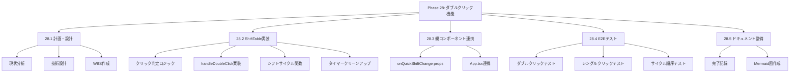
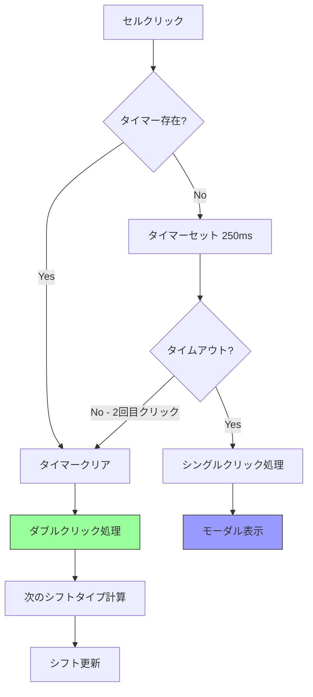
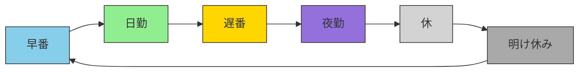
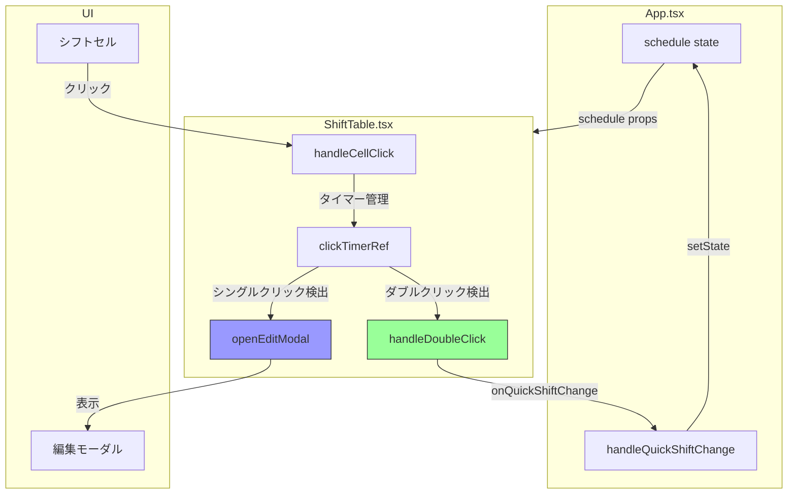
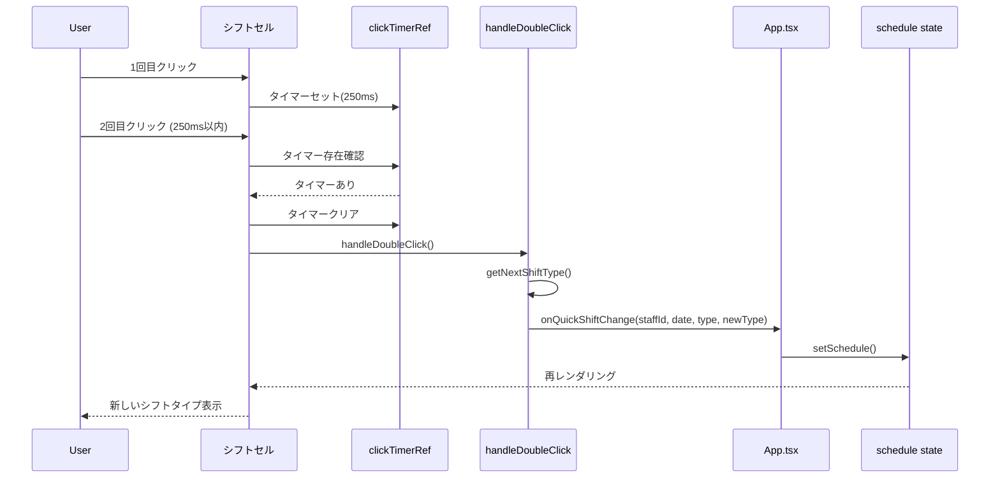
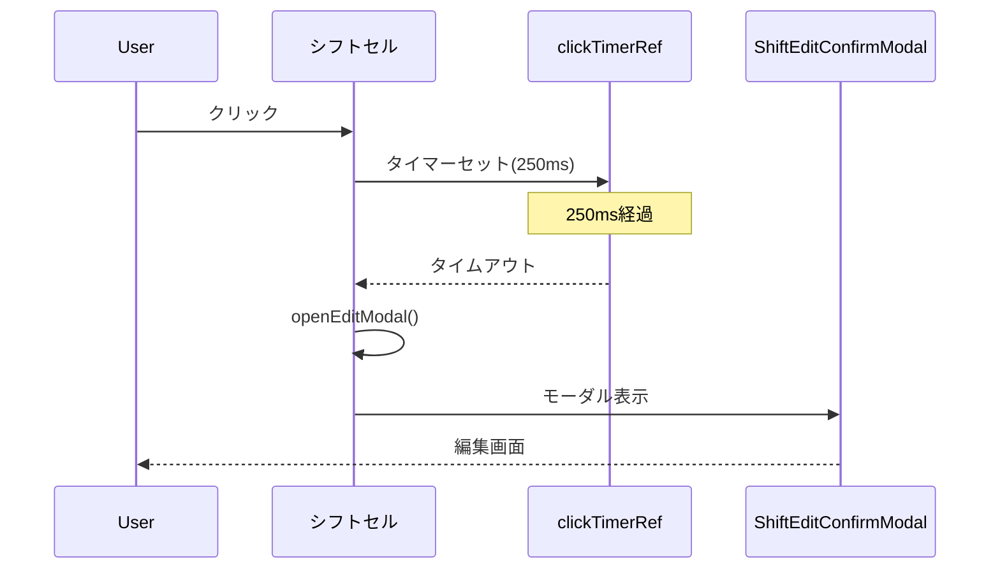
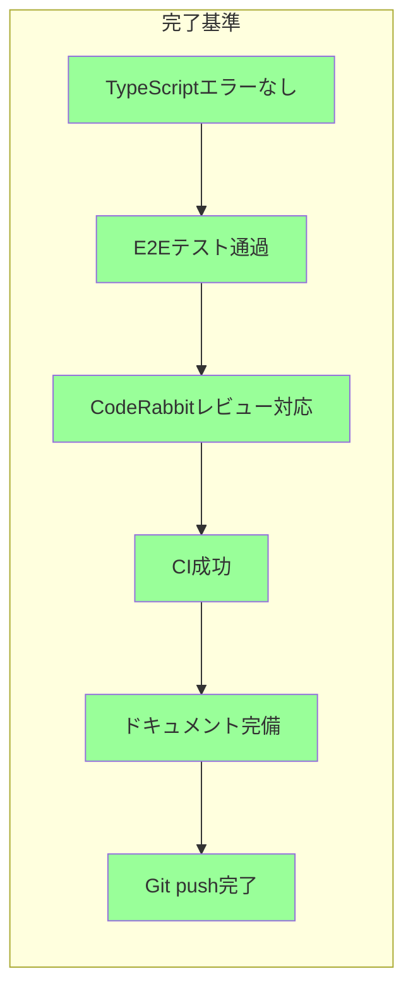

# Phase 28: ダブルクリックシフト編集 - ダイアグラム集

**作成日**: 2025-11-25
**仕様ID**: double-click-shift-edit
**Phase**: 28

---

## 1. WBS（作業分解図）

---

## 2. ガントチャート

```mermaid
gantt
    title Phase 28 実装スケジュール
    dateFormat HH:mm
    axisFormat %H:%M

    section 計画・設計
    現状分析           :done, a1, 00:00, 15m
    技術設計           :done, a2, after a1, 15m
    WBS作成            :done, a3, after a2, 15m

    section ShiftTable実装
    クリック判定ロジック :done, b1, after a3, 30m
    handleDoubleClick   :done, b2, after b1, 20m
    シフトサイクル関数  :done, b3, after b2, 10m
    タイマークリーンアップ :done, b4, after b3, 10m

    section 親コンポーネント連携
    props追加           :done, c1, after b4, 15m
    App.tsx連携         :done, c2, after c1, 20m

    section E2Eテスト
    テスト作成          :done, d1, after c2, 30m
    CodeRabbitレビュー対応 :done, d2, after d1, 20m

    section 完了処理
    ドキュメント整備    :done, e1, after d2, 15m
    Git push            :done, e2, after e1, 5m
```

---

## 3. クリック判定フロー

---

## 4. シフトサイクル図

---

## 5. コンポーネント連携図

---

## 6. シーケンス図（ダブルクリック）

---

## 7. シーケンス図（シングルクリック）

---

## 8. 実装完了基準（Definition of Done）

### チェックリスト

- [x] TypeScriptコンパイルエラーなし
- [x] E2Eテスト4件作成
- [x] CI Run #19663689079 成功
- [x] タイマークリーンアップ実装
- [x] CodeRabbitレビュー指摘対応
- [x] 完了ドキュメント作成
- [x] Git push完了

---

## 関連ドキュメント

- [Phase 28計画](./phase28-plan-2025-11-25.md)
- [Phase 28完了記録](./phase28-completion-2025-11-25.md)
- [Phase 27完了記録](../ci-cd-e2e-integration/phase27-completion-2025-11-25.md)
