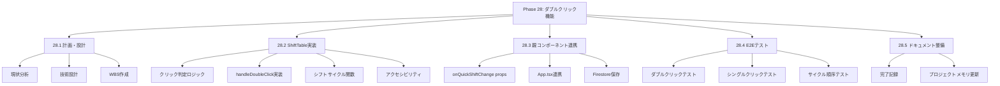

# Phase 28: ダブルクリックシフト編集機能

**作成日**: 2025-11-25
**仕様ID**: double-click-shift-edit
**Phase**: 28
**ステータス**: 🔄 実装中

---

## エグゼクティブサマリー

シフトテーブルのセルをダブルクリックすることで、シフトタイプを素早くサイクル切り替えできる機能を実装します。これにより、モーダルを開かずに効率的にシフトを編集できます。

### 目標
- ✅ ダブルクリックでシフトタイプをサイクル切り替え
- ✅ シングルクリックは既存動作（モーダル表示）を維持
- ✅ 予定・実績両方に対応
- ✅ アクセシビリティ対応（キーボード操作）

### 推定工数

- **計画・設計**: 0.5時間
- **実装**: 1-2時間
- **E2Eテスト**: 1時間
- **検証・調整**: 0.5時間
- **ドキュメント**: 0.5時間
- **合計**: 3-5時間

---

## 現状分析

### 現在の実装（ShiftTable.tsx）
- **シングルクリック**: `handleCellClick` → モーダル表示
- **モーダル**: `ShiftEditConfirmModal` でシフトタイプ・時間・備考を編集
- **シフトタイプ**: `['早番', '日勤', '遅番', '夜勤', '休', '明け休み']`

### 問題点
- シフトタイプを変更するだけでもモーダルを開く必要がある
- 複数セルを連続編集する際の効率が悪い

### 解決策
- ダブルクリックでシフトタイプをサイクル切り替え
- 詳細編集が必要な場合はシングルクリックでモーダル

---

## 技術設計

### 1. イベントハンドリング戦略

**クリック判定ロジック:**
```typescript
// シングルクリック: 250ms後にモーダル表示
// ダブルクリック: 即座にシフトサイクル

const [clickTimer, setClickTimer] = useState<NodeJS.Timeout | null>(null);

const handleCellClick = (e: React.MouseEvent, ...) => {
  if (clickTimer) {
    // ダブルクリック検出
    clearTimeout(clickTimer);
    setClickTimer(null);
    handleDoubleClick(...);
  } else {
    // シングルクリック（遅延実行）
    const timer = setTimeout(() => {
      setClickTimer(null);
      openModal(...);
    }, 250);
    setClickTimer(timer);
  }
};
```

### 2. シフトサイクル切り替え

**サイクル順序:**
```
早番 → 日勤 → 遅番 → 夜勤 → 休 → 明け休み → 早番...
```

**実装:**
```typescript
const SHIFT_CYCLE = ['早番', '日勤', '遅番', '夜勤', '休', '明け休み'];

const getNextShiftType = (current: string): string => {
  const index = SHIFT_CYCLE.indexOf(current);
  if (index === -1) return SHIFT_CYCLE[0];
  return SHIFT_CYCLE[(index + 1) % SHIFT_CYCLE.length];
};
```

### 3. コンポーネント変更

**ShiftTable.tsx:**
- `handleCellClick` → シングル/ダブルクリック判定追加
- `handleDoubleClick` → シフトサイクル切り替え
- 新規props: `onQuickShiftChange` （ダブルクリック用）

### 4. アクセシビリティ

- **Tab**: セル間移動
- **Enter**: モーダル表示（シングルクリック相当）
- **Space**: シフトサイクル（ダブルクリック相当）
- **aria-label**: 現在のシフトタイプを読み上げ

---

## 実装計画

### Phase 28.1: ShiftTable ダブルクリック実装

1. クリック判定ロジック追加
2. `handleDoubleClick` 実装
3. シフトサイクル関数実装
4. 既存シングルクリック動作維持

### Phase 28.2: 親コンポーネント連携

1. `onQuickShiftChange` props追加
2. App.tsx連携
3. Firestoreへの保存

### Phase 28.3: E2Eテスト

1. ダブルクリック動作テスト
2. シングルクリック動作維持テスト
3. サイクル順序テスト

---

## WBS



---

## ガントチャート

```mermaid
gantt
    title Phase 28 実装スケジュール
    dateFormat HH:mm
    axisFormat %H:%M

    section 計画・設計
    現状分析           :done, a1, 00:00, 15m
    技術設計           :active, a2, after a1, 15m
    WBS作成            :a3, after a2, 15m

    section ShiftTable実装
    クリック判定ロジック :b1, after a3, 30m
    handleDoubleClick   :b2, after b1, 20m
    シフトサイクル関数  :b3, after b2, 10m
    アクセシビリティ    :b4, after b3, 20m

    section 親コンポーネント連携
    props追加           :c1, after b4, 15m
    App.tsx連携         :c2, after c1, 20m
    Firestore保存       :c3, after c2, 15m

    section E2Eテスト
    テスト作成          :d1, after c3, 30m
    テスト実行・修正    :d2, after d1, 30m

    section 完了処理
    ドキュメント整備    :e1, after d2, 15m
    CodeRabbit・push    :e2, after e1, 15m
```



---

## 成功基準

### 機能要件
- [ ] ダブルクリックでシフトタイプがサイクル切り替え
- [ ] シングルクリックで既存モーダル表示
- [ ] 予定・実績両方に対応
- [ ] Firestoreに変更が保存される

### 非機能要件
- [ ] クリック判定遅延 < 300ms
- [ ] レスポンス（UI更新）即時
- [ ] 既存機能への影響なし

---

## リスク管理

| リスク | 影響度 | 発生確率 | 対策 |
|--------|--------|----------|------|
| シングル/ダブル判定ミス | 高 | 中 | タイマー値調整、E2Eテスト |
| 既存機能破壊 | 高 | 低 | 既存テスト維持、段階的実装 |
| モバイル非対応 | 中 | 高 | タッチイベント対応（次フェーズ） |

---

## 関連ドキュメント

- [Phase 27完了記録](../ci-cd-e2e-integration/phase27-completion-2025-11-25.md)
- [ShiftTable.tsx](../../../components/ShiftTable.tsx)
- [ShiftEditConfirmModal.tsx](../../../src/components/ShiftEditConfirmModal.tsx)
