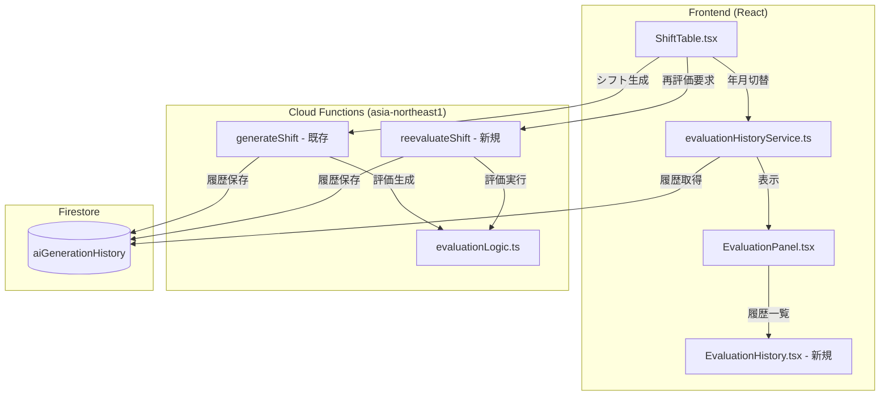
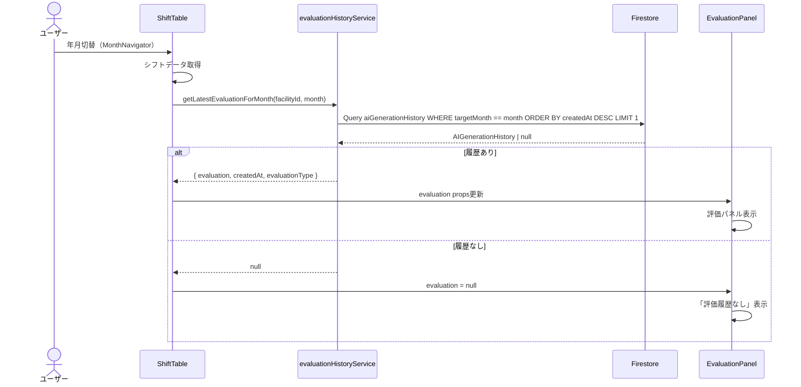
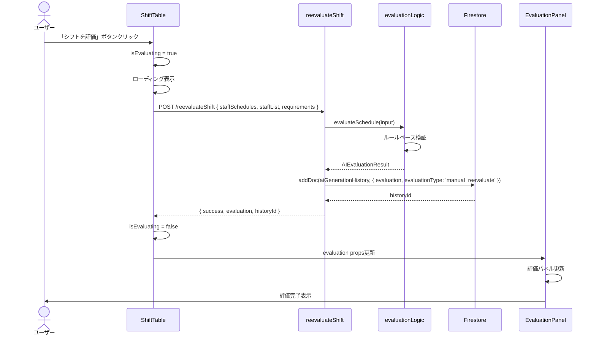
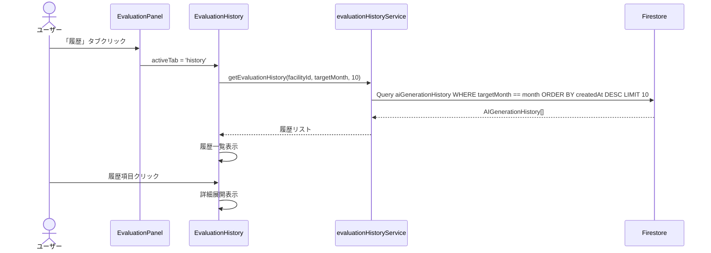

# Phase 54: AI評価履歴・再評価機能 - 技術設計書

**作成日**: 2025-12-09
**仕様ID**: evaluation-history-reevaluate
**Phase**: 54
**ステータス**: 設計中

---

## Overview

### Purpose
本機能は、AIシフト生成の評価履歴を永続的に参照可能にし、手動編集後のシフトをAIで再評価できる機能を提供する。Phase 40で実装された評価機能の完成形として、ユーザーがシフト品質を継続的に確認・改善できる環境を構築する。

### Users
- **施設管理者**: 評価履歴の確認、手動編集後の品質チェック
- **スタッフ**: 生成結果の公平性確認

### Impact
- 既存の`EvaluationPanel`コンポーネントを拡張
- 新規Cloud Function `reevaluateShift` を追加
- `ShiftTable`コンポーネントに評価ボタンを追加

### Goals
- 年月切替時に過去の評価履歴を自動復元
- 手動編集後のシフトをボタン一つで再評価
- 過去の評価履歴を一覧表示・比較

### Non-Goals
- リアルタイム評価（編集ごとの自動評価）
- 複数施設間の評価比較
- 評価スコアの推移グラフ表示（将来Phase）

---

## Architecture

### Existing Architecture Analysis

**現行パターン**:
- `EvaluationPanel`: 評価結果表示（アコーディオン式）
- `evaluationHistoryService`: Firestore履歴保存・取得
- `generateShift` Cloud Function: シフト生成時に評価も生成
- 評価ロジック: `functions/src/evaluation/evaluationLogic.ts`

**維持すべき設計原則**:
- Cloud Functions経由のVertex AI呼び出し
- 評価ロジックのハイブリッド方式（ルールベース + AI）
- Result型によるエラーハンドリング

### High-Level Architecture



### Technology Alignment

| 技術 | 用途 | 既存/新規 |
|------|------|-----------|
| React 19 | 評価UI拡張 | 既存拡張 |
| Cloud Functions (Gen 2) | 再評価エンドポイント | 新規追加 |
| Firestore | 評価履歴保存 | 既存 |
| evaluationLogic.ts | 評価計算 | 既存流用 |

---

## Key Design Decisions

### Decision 1: 再評価のトリガー方式

**Context**: 手動編集後の再評価をどのようにトリガーするか

**Alternatives**:
1. **リアルタイム評価**: 編集ごとに自動評価（デバウンス付き）
2. **確認ボタン方式**: ユーザーがボタンをクリックして評価
3. **保存時自動評価**: シフト保存時に自動的に再評価

**Selected Approach**: **確認ボタン方式**

**Rationale**:
- ユーザーが意図的に評価を実行（予期しないAPI呼び出しを防止）
- API負荷を制御可能
- 評価結果を確認してから保存するかを判断できる

**Trade-offs**:
- ✅ 予測可能なAPI使用量
- ✅ ユーザーコントロール
- ⚠️ ワンアクション必要
- ⚠️ リアルタイムフィードバックなし

### Decision 2: 評価履歴の表示方式

**Context**: 過去の評価履歴をどのように表示するか

**Alternatives**:
1. **インライン表示**: 評価パネル内に履歴リストを展開
2. **モーダル表示**: 履歴ボタンでモーダルを開く
3. **別ページ**: 履歴専用ページを作成

**Selected Approach**: **インライン表示（評価パネル内タブ）**

**Rationale**:
- シフト表を見ながら履歴を確認できる
- 画面遷移なしで比較可能
- 既存UIの自然な拡張

**Trade-offs**:
- ✅ コンテキスト維持
- ✅ 実装がシンプル
- ⚠️ 画面スペース制約
- ⚠️ 詳細比較は難しい

### Decision 3: 再評価Cloud Functionの実装方式

**Context**: 再評価専用のエンドポイントを作るか、既存を拡張するか

**Alternatives**:
1. **新規Function**: `reevaluateShift` を新規作成
2. **既存拡張**: `generateShift` にモードパラメータ追加
3. **フロントエンド評価**: 評価ロジックをフロントエンドに移植

**Selected Approach**: **新規Function `reevaluateShift`**

**Rationale**:
- 責務の分離（生成と評価は別の関心事）
- 既存の`generateShift`への影響を最小化
- 評価のみのためトークン使用量が少ない

**Trade-offs**:
- ✅ 単一責任の原則
- ✅ 既存機能への影響なし
- ⚠️ コードの一部重複
- ⚠️ デプロイ対象が増加

---

## System Flows

### 年月切替時の評価復元フロー



### 手動再評価フロー



### 評価履歴一覧表示フロー



---

## Components and Interfaces

### Backend Layer

#### reevaluateShift Cloud Function（新規）

**Responsibility & Boundaries**
- **Primary Responsibility**: 既存シフトデータの評価実行と履歴保存
- **Domain Boundary**: AI評価ドメイン
- **Data Ownership**: 評価結果、履歴データ

**Dependencies**
- **Inbound**: フロントエンド（ShiftTable）
- **Outbound**: evaluationLogic, Firestore
- **External**: なし

**API Contract**

| Method | Endpoint | Request | Response | Errors |
|--------|----------|---------|----------|--------|
| POST | /reevaluateShift | `ReevaluateShiftRequest` | `ReevaluateShiftResponse` | 400, 500 |

**Request Schema**

```typescript
interface ReevaluateShiftRequest {
  facilityId: string;
  targetMonth: string;           // YYYY-MM
  staffSchedules: StaffSchedule[];
  staffList: Staff[];
  requirements?: ShiftRequirement;
  userId: string;
}
```

**Response Schema**

```typescript
interface ReevaluateShiftResponse {
  success: boolean;
  evaluation: AIEvaluationResult;
  historyId: string;
  evaluatedAt: string;           // ISO 8601
}
```

**Error Response**

```typescript
interface ReevaluateShiftError {
  success: false;
  error: {
    code: 'INVALID_INPUT' | 'EVALUATION_FAILED' | 'SAVE_FAILED';
    message: string;
  };
}
```

**Implementation Location**: `functions/src/reevaluate-shift.ts`

---

### Frontend Layer

#### EvaluationPanel（拡張）

**Responsibility & Boundaries**
- **Primary Responsibility**: 評価結果表示 + 履歴タブ管理
- **Domain Boundary**: UI表示

**Contract Definition（拡張）**

```typescript
interface EvaluationPanelProps {
  evaluation: AIEvaluationResult | null;
  isExpanded?: boolean;
  onToggle?: () => void;
  // Phase 54 追加
  facilityId?: string;
  targetMonth?: string;
  onReevaluate?: () => void;        // 再評価コールバック
  isReevaluating?: boolean;         // 再評価中フラグ
  showHistoryTab?: boolean;         // 履歴タブ表示フラグ
}
```

**State Management**

```typescript
// 内部状態
interface EvaluationPanelState {
  activeTab: 'current' | 'history';
  historyList: AIGenerationHistory[];
  isLoadingHistory: boolean;
  selectedHistoryId: string | null;
}
```

---

#### EvaluationHistory（新規）

**Responsibility & Boundaries**
- **Primary Responsibility**: 評価履歴一覧の表示
- **Domain Boundary**: UI表示

**Contract Definition**

```typescript
// src/components/EvaluationHistory.tsx

interface EvaluationHistoryProps {
  facilityId: string;
  targetMonth: string;
  onSelectHistory: (history: AIGenerationHistory) => void;
}
```

**UI Structure**

```tsx
<EvaluationHistory>
  {/* 履歴リスト */}
  <div className="space-y-2">
    {historyList.map(history => (
      <HistoryItem
        key={history.id}
        score={history.evaluation.overallScore}
        createdAt={history.createdAt}
        evaluationType={history.evaluationType}
        violationCount={history.evaluation.constraintViolations.length}
        onClick={() => onSelectHistory(history)}
      />
    ))}
  </div>
</EvaluationHistory>
```

---

#### ShiftTable（拡張）

**変更点**

```typescript
// ShiftTable.tsx への追加

// State追加
const [isReevaluating, setIsReevaluating] = useState(false);
const [currentEvaluation, setCurrentEvaluation] = useState<AIEvaluationResult | null>(null);

// 再評価ハンドラ
const handleReevaluate = async () => {
  setIsReevaluating(true);
  try {
    const result = await reevaluateShift({
      facilityId,
      targetMonth,
      staffSchedules: currentSchedules,
      staffList,
      userId: currentUser.uid,
    });
    if (result.success) {
      setCurrentEvaluation(result.evaluation);
      showSuccess('シフトの評価が完了しました');
    }
  } catch (error) {
    showError('評価に失敗しました');
  } finally {
    setIsReevaluating(false);
  }
};

// 年月切替時の履歴取得
useEffect(() => {
  const loadEvaluationHistory = async () => {
    const history = await getLatestEvaluationForMonth(facilityId, targetMonth);
    if (history) {
      setCurrentEvaluation(history.evaluation);
    } else {
      setCurrentEvaluation(null);
    }
  };
  loadEvaluationHistory();
}, [facilityId, targetMonth]);
```

**UI追加（評価ボタン）**

```tsx
{/* シフト表ヘッダー部分 */}
<div className="flex justify-between items-center">
  <h2>シフト表</h2>
  <button
    onClick={handleReevaluate}
    disabled={isReevaluating || !hasScheduleData}
    className="px-4 py-2 bg-blue-600 text-white rounded-lg hover:bg-blue-700 disabled:opacity-50"
  >
    {isReevaluating ? (
      <>
        <Spinner className="w-4 h-4 mr-2" />
        評価中...
      </>
    ) : (
      <>
        <CheckIcon className="w-4 h-4 mr-2" />
        シフトを評価
      </>
    )}
  </button>
</div>
```

---

### Service Layer

#### evaluationHistoryService（拡張）

**追加メソッド**

```typescript
// src/services/evaluationHistoryService.ts

/**
 * 再評価を実行（Cloud Function呼び出し）
 */
export async function reevaluateShift(
  request: ReevaluateShiftRequest
): Promise<ReevaluateShiftResponse> {
  const response = await fetch(
    `${CLOUD_FUNCTIONS_URL}/reevaluateShift`,
    {
      method: 'POST',
      headers: { 'Content-Type': 'application/json' },
      body: JSON.stringify(request),
    }
  );

  if (!response.ok) {
    throw new Error('Reevaluation failed');
  }

  return response.json();
}
```

---

## Data Models

### AIGenerationHistory（拡張）

```typescript
interface AIGenerationHistory {
  id?: string;
  facilityId: string;
  targetMonth: string;
  schedule: StaffSchedule[];
  evaluation: AIEvaluationResult;
  createdBy: string;
  createdAt: Timestamp;

  // Phase 54 追加フィールド
  evaluationType: EvaluationType;
  metadata?: {
    model?: string;
    tokensUsed?: number;
    generationDuration?: number;
    reevaluatedFrom?: string;     // 再評価元の履歴ID
    triggerSource?: 'ai_generation' | 'manual_button' | 'auto_save';
  };
}

type EvaluationType = 'ai_generated' | 'manual_reevaluate';
```

### Firestore Security Rules

```javascript
// firestore.rules に追加

match /facilities/{facilityId}/aiGenerationHistory/{historyId} {
  // 施設メンバーは読み取り可能
  allow read: if hasRole(facilityId, 'viewer');

  // editor以上は書き込み可能
  allow write: if hasRole(facilityId, 'editor');
}
```

---

## Error Handling

### Error Categories

| カテゴリ | エラー | 対応 |
|---------|--------|------|
| **User Errors (4xx)** | 不正なシフトデータ | バリデーションエラー表示 |
| **System Errors (5xx)** | 評価ロジックエラー | リトライボタン表示 |
| **Network Errors** | 通信エラー | リトライ + オフライン通知 |

### Fallback Strategy

```typescript
// 評価失敗時のフォールバック
const handleReevaluateError = (error: Error) => {
  console.error('Reevaluation failed:', error);
  showError('評価に失敗しました。しばらくしてからお試しください。');

  // 前回の評価を維持（消さない）
  // setCurrentEvaluation(null); ← これはしない
};
```

---

## Testing Strategy

### Unit Tests

| テスト対象 | 内容 |
|-----------|------|
| `reevaluateShift` | 評価実行と履歴保存 |
| `getLatestEvaluationForMonth` | 月別最新履歴取得 |
| `EvaluationHistory` | 履歴リスト表示 |

### Integration Tests

| テスト対象 | 内容 |
|-----------|------|
| 年月切替 → 評価復元 | 履歴が正しく表示される |
| 再評価ボタン → 評価更新 | 評価結果が更新される |
| 履歴タブ → 一覧表示 | 過去履歴が表示される |

### E2E Tests

| テスト対象 | 内容 |
|-----------|------|
| 評価ボタンクリック | ローディング → 完了 の流れ |
| 年月切替 | 評価パネルが更新される |
| 履歴選択 | 詳細が展開される |

---

## Performance & Scalability

### Target Metrics

| 指標 | 目標値 |
|------|--------|
| 履歴取得 | < 500ms |
| 再評価API | < 10秒 |
| UI更新 | < 100ms |

### Optimization

- 履歴取得はFirestoreインデックス使用
- 再評価はルールベースのみ（AI呼び出しなし）で高速化
- 履歴リストは10件固定（ページネーションなし）

---

## Implementation Files

```
src/
├── components/
│   ├── EvaluationPanel.tsx          # 拡張（履歴タブ追加）
│   └── EvaluationHistory.tsx        # 新規
├── services/
│   └── evaluationHistoryService.ts  # 拡張（reevaluateShift追加）

functions/
├── src/
│   ├── reevaluate-shift.ts          # 新規
│   └── index.ts                     # エクスポート追加
```

---

## Migration Strategy

### Phase 1: バックエンド
1. `reevaluateShift` Cloud Function実装
2. 既存履歴に`evaluationType`フィールドをバックフィル（デフォルト: `ai_generated`）

### Phase 2: フロントエンド
1. `EvaluationHistory`コンポーネント新規作成
2. `EvaluationPanel`に履歴タブ追加
3. `ShiftTable`に評価ボタン追加
4. 年月切替時の履歴復元ロジック追加

### Rollback Triggers
- 再評価APIのエラー率が10%を超える場合
- 履歴取得が1秒以上かかる場合

---

## Related Documents

- [要件定義書](./requirements.md)
- [Phase 40 技術設計書](../ai-evaluation-feedback/design.md)
- [評価ロジック実装](../../../functions/src/evaluation/evaluationLogic.ts)

---

## Approval

- [ ] 設計レビュー完了
- [ ] ステークホルダー承認
