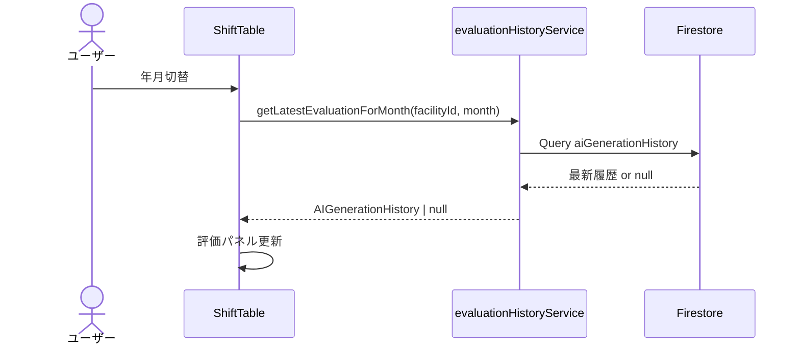
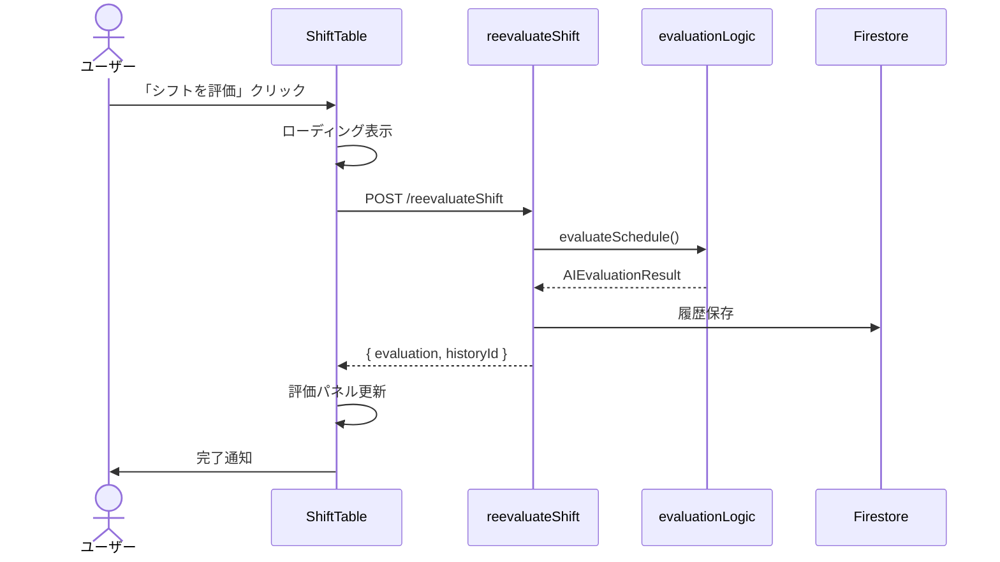

# Phase 54: AI評価履歴・再評価機能 - 要件定義書

**作成日**: 2025-12-09
**仕様ID**: evaluation-history-reevaluate
**Phase**: 54
**ステータス**: 計画中
**優先度**: 高
**提案者**: 本田

---

## 1. 背景と目的

### 1.1 現状の課題

Phase 40「AI評価・フィードバック機能」で評価履歴のFirestore保存は実装済みだが、以下の機能が未実装：

| 課題 | 影響 |
|------|------|
| **評価履歴の再表示なし** | 年月切替・ページリロードで評価が消える |
| **手動編集後の評価なし** | 編集後のシフト品質が不明 |
| **履歴比較ができない** | 改善傾向の把握が困難 |

### 1.2 プロジェクトの目的

本機能（Phase 54）では、以下を実現します：

1. **評価履歴の自動復元**: 年月切替時に該当月の最新評価を自動表示
2. **手動編集後の再評価**: 確認ボタン押下でAIが現在のシフトを評価
3. **評価履歴一覧**: 過去の評価履歴をリスト表示・比較

### 1.3 Phase 40との関係

本Phaseは**Phase 40の残タスク完了 + 新機能追加**です：

| 要件 | Phase 40仕様 | Phase 40実装状況 | Phase 54対応 |
|------|-------------|-----------------|--------------|
| FR-40.5: 評価履歴保存 | ✅ 定義済み | ✅ 実装済み | - |
| FR-40.5: 履歴参照UI | ✅ 定義済み | ❌ 未実装 | ✅ 本Phaseで実装 |
| 手動編集後の再評価 | ❌ 未定義 | - | ✅ 新規追加 |

---

## 2. ステークホルダー

| 役割 | 説明 | 関心事 |
|------|------|--------|
| **施設管理者** | シフト作成責任者 | 編集後の品質確認、過去評価との比較 |
| **スタッフ** | シフト勤務者 | 公平性の担保確認 |

---

## 3. 機能要件

### FR-54.1: 評価履歴の自動復元

**説明**: 年月切替時・ページリロード時に、該当月の最新AI評価を自動的に表示する。

**詳細要件**:
- 対象月のシフトデータが存在する場合、最新の評価履歴を取得
- 評価パネルに自動表示（アコーディオン折りたたみ状態）
- 評価が存在しない場合は「評価履歴なし」を表示

**受け入れ基準**:
- [ ] 年月切替時に該当月の評価が自動表示される
- [ ] ページリロード後も評価が表示される
- [ ] 評価がない月では「評価履歴なし」と表示される
- [ ] ローディング中はスケルトン表示

---

### FR-54.2: 手動編集後のAI再評価

**説明**: 手動でシフトを編集した後、確認ボタンを押すことでAIが現在のシフトを評価する。

**詳細要件**:
- シフト表の上部または評価パネル内に「シフトを評価」ボタンを配置
- ボタン押下でCloud Functionを呼び出し、現在のシフトデータを評価
- 評価結果を評価パネルに表示
- 評価結果をFirestoreに履歴として保存

**受け入れ基準**:
- [ ] 「シフトを評価」ボタンが表示される
- [ ] ボタン押下で現在のシフトが評価される
- [ ] 評価中はローディング表示
- [ ] 評価完了後、パネルが更新される
- [ ] 評価結果がFirestoreに保存される

**UI配置案**:
```
┌─────────────────────────────────────────┐
│ シフト表                    [シフトを評価] │
├─────────────────────────────────────────┤
│ [AI評価] 85点  エラー0  警告3    ▼      │
│ 💬 AIコメント: ...                       │
└─────────────────────────────────────────┘
```

---

### FR-54.3: 評価履歴一覧表示

**説明**: 過去の評価履歴をリスト表示し、比較できるようにする。

**詳細要件**:
- 評価パネル内に「履歴」タブまたはボタンを追加
- 直近10件の評価履歴を時系列で表示
- 各履歴にはスコア、生成日時、違反件数を表示
- 履歴クリックで詳細を展開表示

**受け入れ基準**:
- [ ] 「履歴」ボタンまたはタブが表示される
- [ ] 過去の評価履歴がリスト表示される
- [ ] 各履歴のサマリー（スコア、日時、違反件数）が確認できる
- [ ] 履歴クリックで詳細が展開される

---

### FR-54.4: 評価パネルのアコーディオン改善

**説明**: 評価パネルの開閉状態をユーザーフレンドリーに改善する。

**詳細要件**:
- デフォルトは折りたたみ状態（AIコメントのみ表示）
- 低スコア（60点未満）の場合は自動展開
- 開閉状態をローカルストレージに保存（オプション）

**受け入れ基準**:
- [ ] AIコメントは常に表示される（現状維持）
- [ ] 詳細は折りたたみ可能
- [ ] 低スコア時は自動展開

**備考**: 現在の実装で一部対応済み。確認・微調整のみ。

---

## 4. 非機能要件

### NFR-54.1: パフォーマンス
- 履歴取得: 500ms以内
- 再評価API呼び出し: 10秒以内（AI生成と同等）
- UI更新: 100ms以内

### NFR-54.2: ユーザビリティ
- 評価ボタンは目立つが邪魔にならない位置
- 履歴は最大10件表示（ページネーションなし）
- モバイル対応

### NFR-54.3: データ整合性
- 再評価時は新規履歴として保存（上書きしない）
- 履歴には「手動評価」「AI生成時評価」のタイプを区別

---

## 5. データモデル

### 5.1 AIGenerationHistory（拡張）

```typescript
interface AIGenerationHistory {
  id?: string;
  facilityId: string;
  targetMonth: string;
  schedule: StaffSchedule[];
  evaluation: AIEvaluationResult;
  createdBy: string;
  createdAt: Timestamp;
  // Phase 54 追加
  evaluationType: 'ai_generated' | 'manual_reevaluate';  // 新規
  metadata?: {
    model?: string;
    tokensUsed?: number;
    generationDuration?: number;
    reevaluatedFrom?: string;  // 再評価元の履歴ID（新規）
  };
}
```

### 5.2 Firestoreインデックス

```
Collection: facilities/{facilityId}/aiGenerationHistory
Index: targetMonth ASC, createdAt DESC
```

---

## 6. API設計

### 6.1 再評価用Cloud Function（新規）

**エンドポイント**: `POST /reevaluateShift`

**リクエスト**:
```typescript
interface ReevaluateShiftRequest {
  facilityId: string;
  targetMonth: string;
  staffSchedules: StaffSchedule[];
  staffList: Staff[];
}
```

**レスポンス**:
```typescript
interface ReevaluateShiftResponse {
  success: boolean;
  evaluation: AIEvaluationResult;
  historyId: string;  // 保存された履歴ID
}
```

---

## 7. UI/UXフロー

### 7.1 年月切替時のフロー



### 7.2 手動再評価のフロー



---

## 8. 実装フェーズ

| サブフェーズ | 内容 | 工数目安 |
|-------------|------|----------|
| 54.1 | データモデル拡張（evaluationType追加） | 0.5日 |
| 54.2 | reevaluateShift Cloud Function実装 | 1日 |
| 54.3 | 評価履歴自動復元（フロントエンド） | 1日 |
| 54.4 | 「シフトを評価」ボタン実装 | 0.5日 |
| 54.5 | 評価履歴一覧UI実装 | 1日 |
| 54.6 | テスト・デバッグ | 0.5日 |

**合計**: 4.5日

---

## 9. 制約事項

1. **API負荷**: 再評価は手動トリガーのみ（リアルタイム評価は将来検討）
2. **履歴保持**: 履歴は無期限保持（将来的に古い履歴の削除ポリシー検討）
3. **後方互換性**: 既存の`aiGenerationHistory`に`evaluationType`フィールドを追加（デフォルト: `ai_generated`）

---

## 10. 将来拡張

| 機能 | 説明 | Phase |
|------|------|-------|
| リアルタイム評価 | 編集ごとに自動評価（デバウンス付き） | 将来 |
| 評価スコア推移グラフ | 過去の評価スコアをグラフ表示 | 将来 |
| 評価結果のエクスポート | PDF/CSV形式で評価レポート出力 | 将来 |

---

## 11. 関連ドキュメント

- [Phase 40 要件定義書](../ai-evaluation-feedback/requirements.md)
- [Phase 40 技術設計書](../ai-evaluation-feedback/design.md)
- [評価履歴サービス実装](../../../src/services/evaluationHistoryService.ts)

---

## 12. 承認

- [ ] 要件レビュー完了
- [ ] ステークホルダー承認
