# Phase 26.2: モバイル専用ページ実装 - システム構成図・フロー図

**作成日**: 2025-11-24
**仕様ID**: github-pages-optimization
**Phase**: 26.2（別ページ方式）

---

## システム構成図

### 全体アーキテクチャ

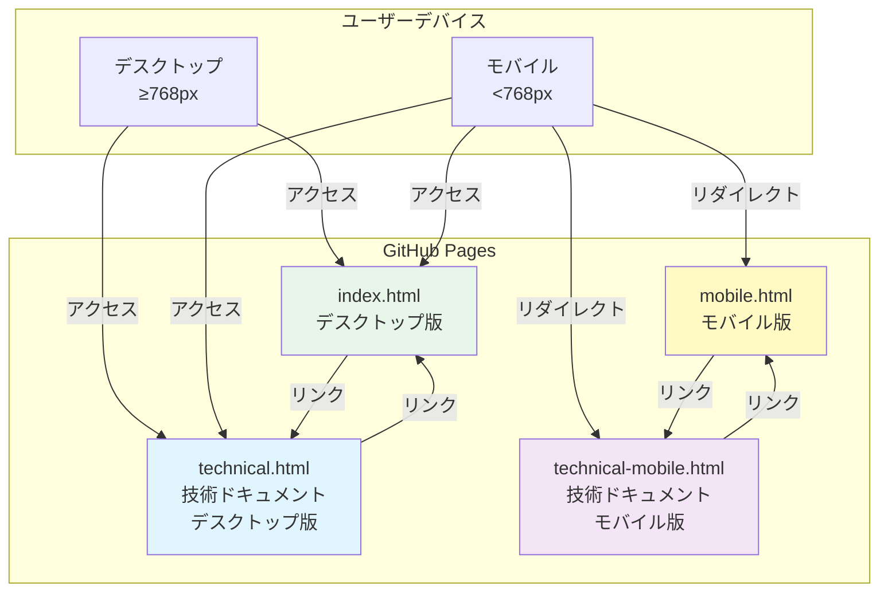

### ページ構成詳細

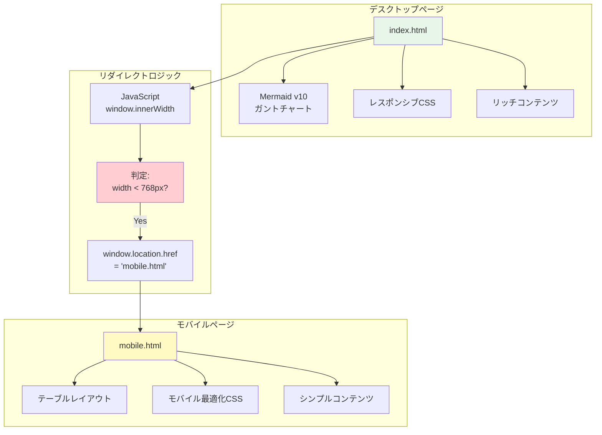

---

## デバイス判定フロー

### index.html アクセスフロー

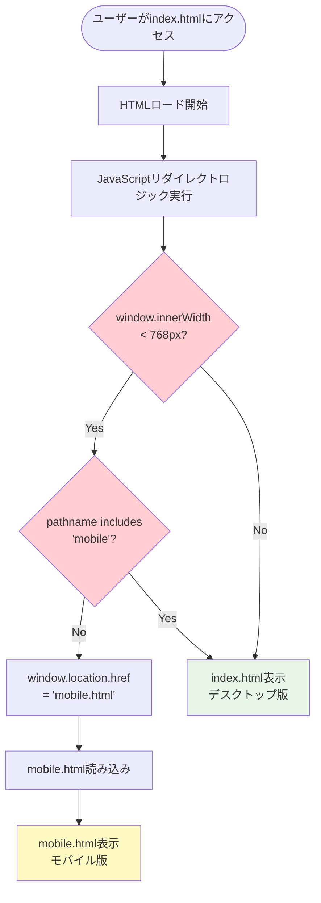

### technical.html アクセスフロー

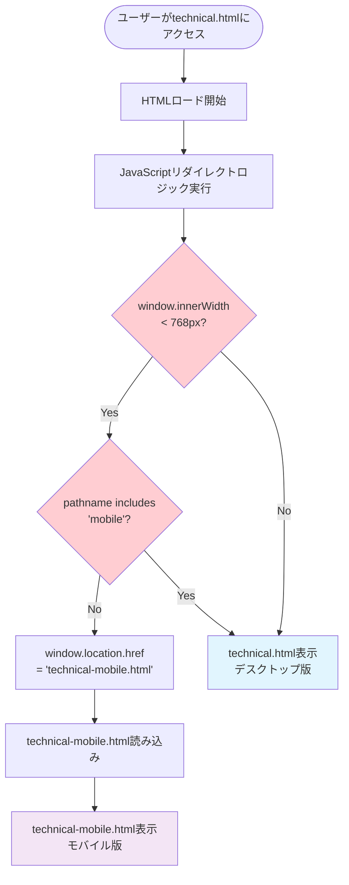

---

## ページ間ナビゲーションフロー

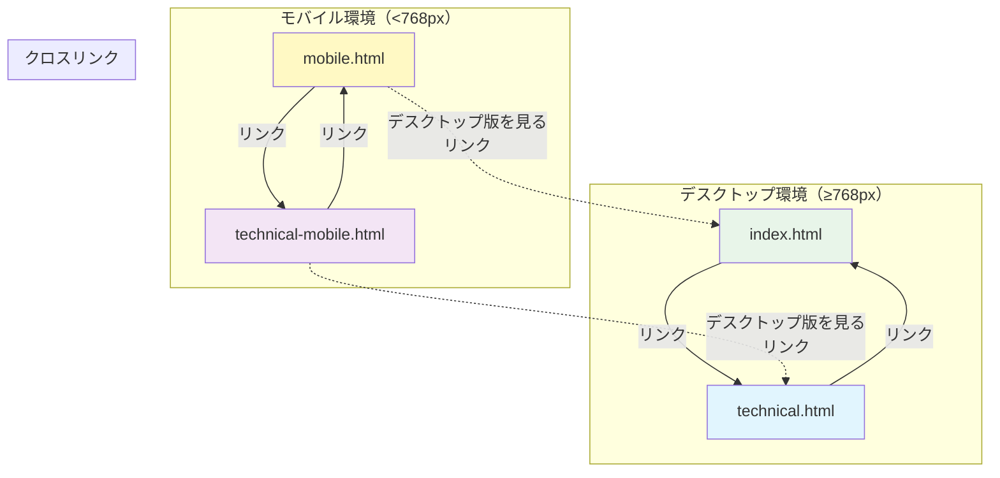

---

## データ構造

### mobile.html コンテンツ構造

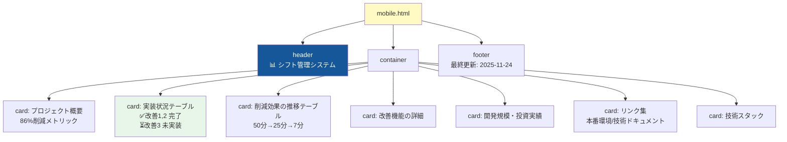

### technical-mobile.html コンテンツ構造

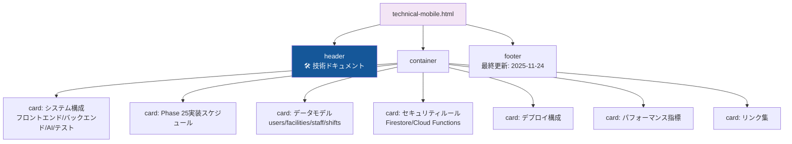

---

## CSS設計方針

### モバイルページCSS原則

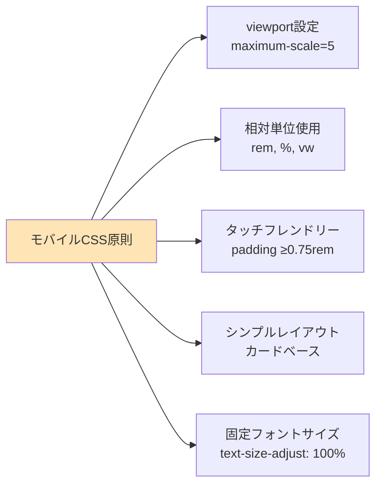

---

## デプロイメントフロー

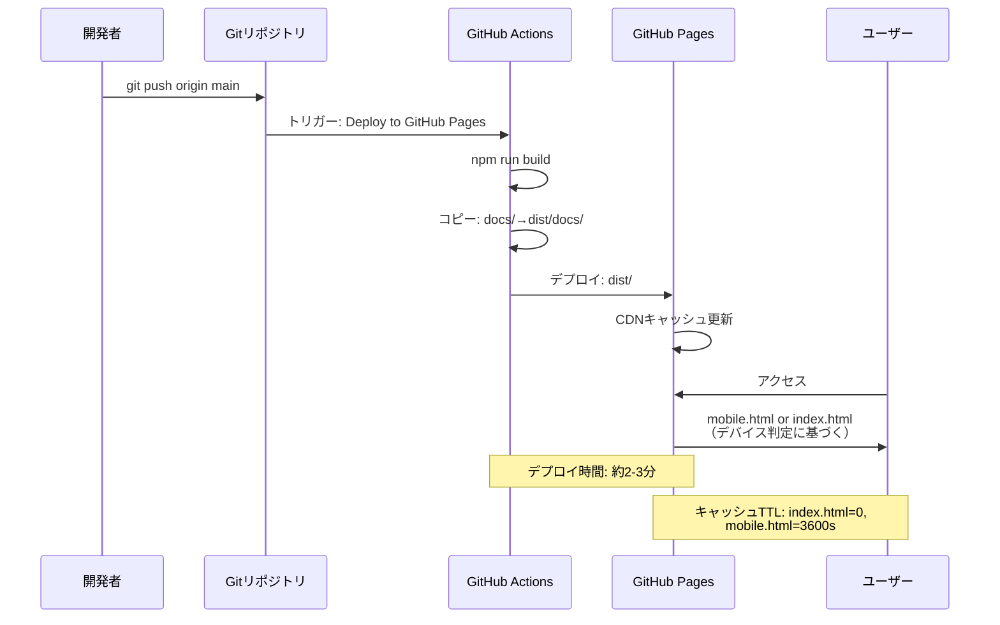

---

## リスク対策マトリックス

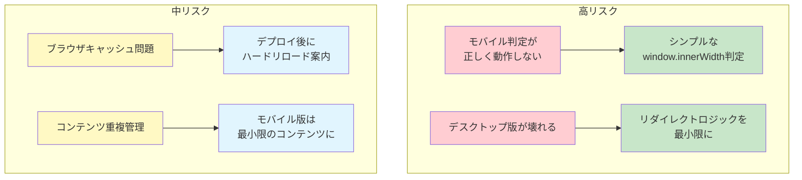

---

## 検証計画

### E2Eテスト構成

```mermaid
graph TB
    Tests[E2Eテスト: mobile-separate-page.spec.ts]

    subgraph "モバイルデバイステスト（375x667）"
        T1[index.html→mobile.html<br/>リダイレクト検証]
        T2[mobile.html<br/>表示検証]
        T3[technical.html→technical-mobile.html<br/>リダイレクト検証]
        T4[technical-mobile.html<br/>表示検証]
        T5[本番環境リンク<br/>機能検証]
    end

    subgraph "デスクトップデバイステスト（1280x720）"
        T6[index.html<br/>リダイレクトされないこと]
        T7[index.html<br/>正常表示]
        T8[technical.html<br/>リダイレクトされないこと]
        T9[technical.html<br/>正常表示]
    end

    subgraph "境界値テスト"
        T10[767px:<br/>リダイレクトされる]
        T11[768px:<br/>リダイレクトされない]
    end

    subgraph "ナビゲーションテスト"
        T12[mobile.html→technical-mobile.html]
        T13[technical-mobile.html→mobile.html]
        T14[モバイル版→デスクトップ版リンク]
    end

    Tests --> T1
    Tests --> T2
    Tests --> T3
    Tests --> T4
    Tests --> T5
    Tests --> T6
    Tests --> T7
    Tests --> T8
    Tests --> T9
    Tests --> T10
    Tests --> T11
    Tests --> T12
    Tests --> T13
    Tests --> T14

    style Tests fill:#FFE4B5
    style T1 fill:#E8F5E9
    style T6 fill:#E1F5FE
    style T10 fill:#FFF9C4
    style T12 fill:#F3E5F5
```

---

## 実装完了基準

### Definition of Done

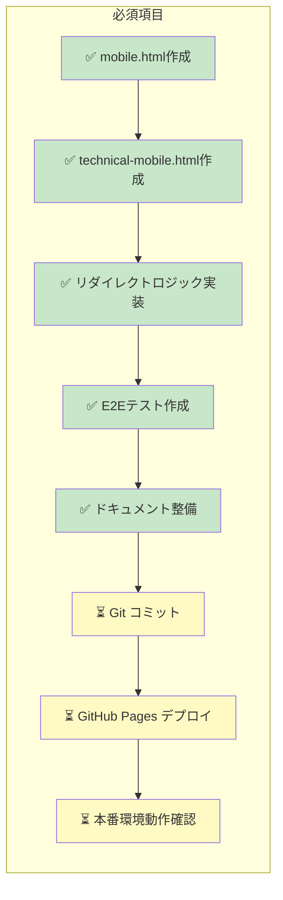

---

## 次フェーズ候補

- **Phase 26.3**: モバイルページのコンテンツ充実化
  - より詳細な実装状況
  - インタラクティブな要素（アコーディオンなど）
  - スクリーンショット追加

- **Phase 27**: デスクトップ版の機能強化
  - より高度なMermaid図の追加
  - アニメーション効果
  - フィルタリング機能

---

関連ドキュメント:
- [WBS・ガントチャート](./phase26.2-mobile-separate-wbs-2025-11-24.md)
- [完了ドキュメント](./phase26.2-completion-2025-11-24.md)（実装後作成）
